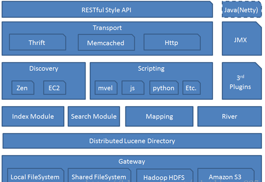
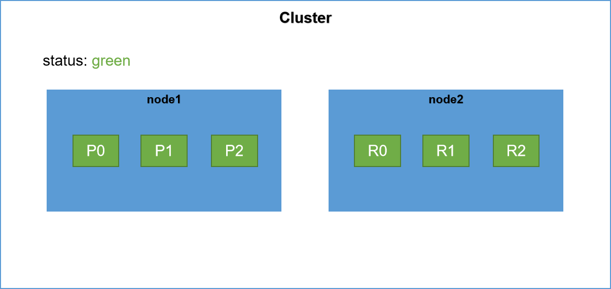
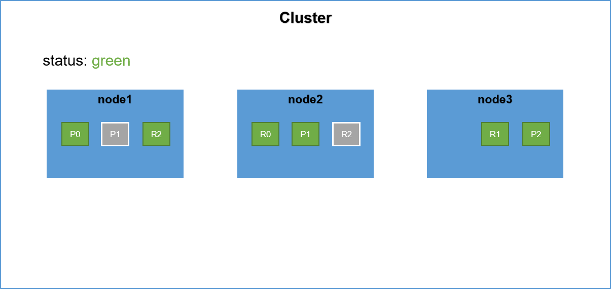
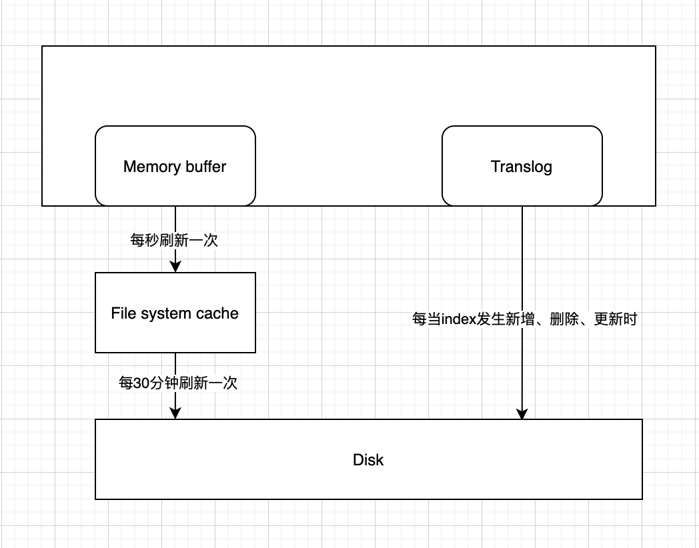
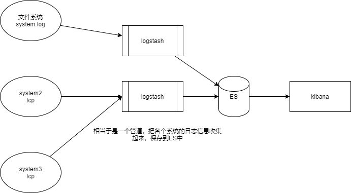

## 0 

### 前置

1. ES用于全文检索
2. ES封装了lucene
3. 获取数据；解析数据：单词拆分、大小写替换、停用词管理、去重；构造索引；查询数据
4. 倒排索引？


### 总结

#### ES

1. 分布式的全文检索工具，集成了lucene，提供RESTFul http接口
2. 倒排索引：根据属性确认位置
3. index、type、document、field、mapping
4. get、put、post、delete
5. 查询方式：查询全部、term关键字查询、query_string短语查询、multi_match多字段查询、bool查询
6. 标准分词器、IK分词器

### 集群

1. 集群、节点、索引、分片（主分片、副本分片）、副本
2. 主节点、数据节点、协调节点
3. 集群选举
4. 脑裂及解决方案
5. 集群扩展及故障转移
6. 路由
7. 如何设置集群规模、如何设置分片数量、副本数

## 一、全文检索

数据分为两种，结构化数据和非结构化数据

- 结构化数据：固定的格式和长度，如mysql数据库
- 非结构化数据：指不定长或无格式的数据，如文件、邮件、互联网数据

对于结构化数据的检索比较简单如使用sql检索，而非结构化数据检索较为困难，数据量很大。所以可以通过对非结构化数据建立索引，将数据提炼出来保存到索引中去检索。非结构化数据也称为全文数据

对非结构化数据的搜索主要由两种方法，顺序扫描法和反向索引法

- 顺序扫描法：对文件进行遍历，查找文件中是否存在对应的关键字，实现文档查找
- 反向索引法：对文件的内容进行提交创建索引，后续通过关键字检索数据，找到对应文档，称为反向索引法

全文检索场景：搜索引擎；站内搜索；系统文件搜索

全文检索实现先关技术

1. lucene：基于java实现的工具，若直接使用，需要对lucene的底层非常熟悉，书写很多的代码
2. solr：使用java实现的一个web应用，提供rest的http接口
3. ElasticSearch：提供rest的http接口调用

## 二、全文检索流程

### 1. 流程概览

主要分为量大流程：索引建立、搜索索引

索引建立：将所有的结构化和非结构化数据提炼，建立索引

搜索索引：根据客户端的请求，依赖索引进行搜索

### 2 创建索引

#### 2.1 获得原始文档

原始文档就是带搜索的文档

- 搜索引擎：整个互联网的文档。通过爬虫获取
- 站内搜索：微博数据。数据库的数据
- 电商搜索：数据库中的商品数据。数据库中的数据

#### 2.2 针对每个原始文档创建一个Document

Document是对原始文档的封装，通过field来保存文档的属性。如title、content、size等

#### 2.3 文档分析

对field进行分析，分词处理

- 字符串拆分，通过空格、标点拆分
- 大小写转换，大小写通用
- 去除标点符号
- 停用词剔除，删除指定的停用词，如 的，了等
- 去重

最后得到关键词列表，每个关键词封装成一个term对象

#### 2.4 创建索引

根据上述获得的内容创建索引，索引库中包含的内容

1. 索引
2. 文档
3. 索引和文档的对应关系

### 3 查询索引

1. 提供查询接口
2. 将查询内容封装成query对象，指定查询的field
3. 根据索引迅速定位关键词，找到文档列表，返回给客户端

> 正向索引：根据文件遍历，查询指定关键词
>
> 倒排索引：根据目标的属性查询关键字，再定位目标地址获取目标内容，根据这种反向查询索引去查询文档，成为倒排索引

## 三、ElasticSerach介绍

ElasticSearch是一个高扩展的分布式全文搜索引擎，内部封装了lucene，提供了简单的restful类型的http接口，使用简单。

es能处理PB（1PB=1024TB=1024*1024GB）级数据

**es和solr的比较**

1. 对已存在数据，solr检索更快
2. 当实时建立索引时，solr会发生io阻塞，这方面es的检索更快
3. solr基于zookeeper进行分部署管理，而es自带的分布式管理
4. solr支持更多格式的数据，es仅支持json格式
5. solr在传统的搜索应用中性能更优（传统应用添加实时数据不多），es在新兴的实时搜索应用这方面性能更优（如微博热搜）

### 1. 架构



#### 1.1 gateway

底层文件系统，es用来存储文件的一个文件系统，并且支持多种类型。如本地文件系统、共享文件系统（用在做snapshot）、hadoop的hdfs系统、amazon s3

主要职责是对数据进行持久化，以及集群重启后进行数据恢复。es默认是先把数据保存在内存中，等内存满了再持久化到磁盘中

#### 1.2 Distributed Lucene Directory

集成lucene的分布式搜索引擎，lucene是单机搜索引擎，DLD集成了lucene对索引进行新增、修改、删除

#### 1.3 四大模块

- index module：索引模块，对数据创建索引，通常创建倒排索引
- search module：搜索模块，对数据进行检索
- mapping：数据映射和解析模块。根据数据和建立表结构进行映射，若没有创建表结构es会自动创建mapping，进行数据解析
- River：第三方插件，在es2.0之后应该取消了

#### 1.4 Discovery & Scripting

es是一个集群包括多个节点，节点之间都是discovery来发现其他节点的，组成一个集群，Discovery模块默认使用zen。

es查询还支持多种脚本：mvel、python、js等

#### 1.5 Transport

- 默认使用tcp协议通信，还支持http、servlet、mmecached、zeroMQ等
- 节点通信端口号默认：9300-9400

#### 1.6 RESTFul接口层

es暴露的接口层，官方推荐使用RESTFul类型的http接口，方便做负载均衡、权限控制

### 2. 概念

es是面向文档的，可以存在对象和文档，下面是各概念的划分

```
es -> index -> (types) -> document -> fileds
```

#### 2.1 Index

拥有某些共性特征的文档集合

#### 2.2 type

一个索引多种类型。后续因type影响查询性能，在es6中只能创建一种type，在es7中es概念被隐藏或排期，type固定为_doc，不能自定义type

#### 2.3 document

文档，类似于数据库表

#### 2.4 field

域，类似于数据库字段

#### 2.5 mapping

对数据的格式和规则的限制，例如字段的默认值、数据类型、分析器

### 3 软件安装

#### 3.1 ElasticSearch安装

1. 官网下载，解压缩

2. 配置文件config/elasticsearch.yml修改

   ```properties
   # 指定本地回文地址，外部可访问
   # network.host: 0.0.0.0
   # 端口号
   http.port: 9200
   # 开启跨域访问
   http.cors.enabled: true
   http.cors.allow-origin: "*"
   ```

3. 通过 bin/elasticsearch 启动，不能使用root用户启动

4. 启动无报错，访问localhost:9200 如下正常返回即可

```json
{
  "name" : "O5VH7Uk",
  "cluster_name" : "elasticsearch",
  "cluster_uuid" : "iOJ8v0-XRbu4IVln4zorKQ",
  "version" : {
    "number" : "6.2.4",
    "build_hash" : "ccec39f",
    "build_date" : "2018-04-12T20:37:28.497551Z",
    "build_snapshot" : false,
    "lucene_version" : "7.2.1",
    "minimum_wire_compatibility_version" : "5.6.0",
    "minimum_index_compatibility_version" : "5.0.0"
  },
  "tagline" : "You Know, for Search"
}
```

#### 3.2 Head插件安装

ES web界面工具，查询索引基本信息，显示簇的拓扑并支持对索引和节点层面的操作。

linux安装

```sh
#下载nodejs,head插件运行依赖node
wget https://nodejs.org/dist/v9.9.0/node-v9.9.0-linux-x64.tar.xz
#解压
tar -xf node-v9.9.0-linux-x64.tar.xz
#重命名
mv node-v9.9.0-linux-x64 /usr/local/node
#配置文件
vim /etc/profile
#将node的路径添加到path中
export PATH=$PATH:$JAVA_HOME/bin:/usr/local/node/bin
#刷新配置
source /etc/profile
#查询node版本，同时查看是否安装成功
node -v
#下载head插件
wget https://github.com/mobz/elasticsearch-head/archive/master.zip
#解压
unzip master.zip
#使用淘宝的镜像库进行下载，速度很快
npm install -g cnpm --registry=https://registry.npm.taobao.org
#进入head插件解压目录，执行安装命令
npm install
```

**启动**：进入head插件主目录运行，npm start

访问localhost:9100 即可

#### 3.3 Kibana插件安装

快速访问ES的http接口，并且有关键词提示

```sh
#kibana版本必须和es版本一致，否则监控不到es
wget https://artifacts.elastic.co/downloads/kibana/kibana-6.2.4-linuxx86_64.tar.gz
#将shasum生产的SHA与已发布的SHA进行比较。
shasum -a 512 kibana-6.4.2-linux-x86_64.tar.gz
tar -xzf kibana-6.4.2-linux-x86_64.tar.gz
# 归档包解压的目录为$KIBANA_HOME
cd kibana-6.4.2-linux-x86_64/
```

修改配置文件

```properties
# 将默认配置改成如下：
server.port: 5601
server.host: "192.168.66.66"
#修改成自己集群的端口号及IP
elasticsearch.url: "http://192.168.66.66:9200"
kibana.index: ".kibana"
```

## 三、RESTFul接口访问

- put：创建资源，当资源存在时报错
- post：更新资源
- delete：删除资源
- get：获取资源

### 1 创建index和mapping

```json
put hello
{
  "settings":{
    "index":{
      "number_of_shards": "4",
      "number_of_replicas":"1"
    }
  },
  "mappings":{
    "_doc":{
        "properties":{
          "id":{
            "type":"long",
            "store":true
          },
          "title":{
            "type":"text",
            "store":true,
            "index":true
          },
          "content":{
            "type":"text",
            "store":true,
            "index":true,
            "analyzer":"standard"
          }
        }
      }
  }
}
```

### 2 创建index后设置mapping

index只能新增，不允许修改现有field的属性。如id，title。

> 大概是因为修改成本巨大，想改属性相当于重建索引，才不允许修改基本属性

```json
post hello/_doc/_mapping
{
  "_doc":{
    "properties":{
      "id":{
        "type":"long",
        "store":true
      },
      "title":{
        "type":"text",
        "store":true,
        "index":true
      },
      "content":{
        "type":"text",
        "store":true,
        "index":true,
        "analyzer":"standard"
      }
    }
  }
}
```

### 3 创建/更新/ 删除文档

路径上的id和属性中的id不强制要求一致，但建议一致

```json
// 创建或更新文档
post hello/_doc/1
{
  "id":3,
  "title":"测试数据3",
  "content":"这是测试数据3的内容"
}
// 删除文档
delete hello/_doc/1
// 查询单个文档
get hello/_doc/1
```

## 四、查询表达式（Query DSL）

### 1 查询全部

match_all

```json
// 查询索引的的全部
GET _search
{
  "query": {
    "match_all": {}
  }
}
// 查询索引全部 GET hello/_search
// 查询分区全部 GET hello/_doc/_search
```

### 2 term查询

关键词查询，查询是索引中是否存在指定关键词

```json
GET hello/_search
{
  "query": {
    "term": {
      "title":"测试"
    }
  }
}
```

### 3 queryString查询

查询是否存在对应内容，短语按照分词器划分为多个关键词，再按照关键词在索引中匹配，score表示匹配程度

```json
GET hello/_search
{
  "query": {
    "query_string": {
      "default_field": "title",
      "query":"这是测试1"
    }
  }
}
```

### 4 multi_match查询

在多个字段上查询。其中query是短语，需要分词器拆分关键词

```json
// 查询在title或content中存在1的数据
GET hello/_search
{
  "query": {
    "multi_match": {
      "fields":["title", "content"],
      "query":"1"
    }
  }
}
```

### 5 bool查询

接收多种组合

- must：都要满足的条件，相当于and
- should：满足一个即可，相当于or。当must出现时should失效
- must_not：非。可以和must和should公用
- Filter: 过滤。在上面的逻辑操作后，对结果进行最后的过滤

```json
get hello/_search
{
  "query":{
    "bool":{
      "must":[
        {
          "term":{
            "content":1
          }
        },
        {
          "term":{
            "title":1
          }
        }
        ],
      "should":[],
      "must_not": [], 
      "filter":[]
    }
  }
}
```

## 五、IK分词器

默认情况下，使用分词器都是standard标准分词器，analyzer:"standard"。分词器对短语拆分，按照空格或标点拆分、大小写转换、去除停用词、去重，最终得到关键词列表

这个分词器对中文支持的不好，会对每个中文字都单个识别放入索引中，无法识别词语，比如上述term关键查询时无法识别”测试“的

使用分词器单独分析语句

```
post _analyze
{
  "analyzer":"standard",
  "text":"分词器hello，2"
}
```

### 1 IK分词器

IK分词器是基于java语言开发的轻量级的中文分词工具，特性如下

- 60万字/每条的处理速度
- 支持英文字符、数字、中文词汇（姓名、地理）等分词处理
- 对中英联合支持的不是很好
- 支持用户字典扩展定义

下载地址：https://github.com/medcl/elasticsearch-analysis-ik/releases

下载完成后解压缩，放入es的plugin中

### 2 用法

IK分词支持两种模式

- ik_smart：智能分词法，最少切分，可切分中文词汇。
- ik_max_word：最细粒度切分，切分的更细。例如"一个"会被切分为`一`,  `个`,  `一个`。而ik_smart只切分为`一个`

集成到es后，指定analyzer为ik_smard或ik_max_word即可

> 索引创建后，不能再修改分词器，因为已经建立好了，修改的成本太大。只能通过删除原索引再新建来更新分词器

## 六、集群

### 1 概念

- 集群cluster：多个服务器组织在一起成为一个集群，为了存储海量数据，保证高可用
- 节点：一个节点即指一套服务器
- 分片：索引级别，索引可能包含海量数据，单机无法全部存储，需要多台机器存储。此时对数据进行分片，将数据分摊到各个服务器上
- 副本：为防止节点异常，保证高可用，每个分片都会有多个副本。最少1个副本，主+副本共两个

### 2 核心原理

#### 2.1 节点类型

##### 2.1.1 master节点

整个集群只有一个master节点，负责对索引进行新增、 删除、修改。不负责存储具体数据，如对文档的新增、查询等

mater节点作用

- 负责集群节点的上下线，sharding的重新分配
- 创建、删除索引
- 负责接收集群状态`cluster status`的变化，并推送给所有节点。每个节点都有一份完整cluster status，但master node负责维护
- 协调创建索引和查询请求，将请求分发到个其他节点

master节点的配置（elasticSearch.yml）：

```properties
node.master: true
node.data: false
```

> 当设置为master节点时表示该节点时候选master节点，后续选举master节点是从候选节点中选举的

##### 2.1.2 数据节点

负责存储数据，提供建立索引和查询索引的服务

数据节点的配置（elasticSearch.yml）：

```properties
node.master: false
node.data: true
```

> 节点默认是数据节点

##### 2.1.3 协调节点

不会选为master节点和存储数据，主要用来查询负载均衡，将查询请求分发到多个node服务器，并对结果进行汇总

协调节点没办法通过配置项来限定，起始每个节点都有协调的作用，当节点接到查询请求后，将查询分发到其他的节点并对结果进行汇总。每个节点默认都是一个协调节点。协调节点对CPU、内存和磁盘I/O要求比较高

单纯协调节点的配置（elasticSearch.yml）

```properties
node.master: false
node.data: false
```

> 一个节点可以充当多种角色

#### 2.2 索引分片

es对索引进行分片，每个分片分为主分片和副本分片

- 主分片：分片主节点
- 副本分片：主分片的副本

#### 2.3 集群状态

集群状态有三种

- 绿色：100%健康，所有的主分片和副本分片都可以正常工作
- 黄色：预警。所有主分片都可以正常工作，但至少存在一个副本分片不能正常工作
- 红色：集群下线。至少存在一个主分片和副本分片都不能正常工作

### 3 集群选举

#### 3.1 选举的时机

由master-eligible(候选主节点)节点发起，当发现以下情况时发起选举

1. 本身不是master节点，且通过ZenDiscovery模块的ping操作发现集群内没有master节点，则发起选举
2. 集群内候选节点数大于等于`minimum_master_nodes`

#### 3.2 选举过程

选举master按照优先级来，clusterStateVersion表示集群的状态版本，可以表示集群状态的版本号（也可以理解为复制偏移量）

1. clusterStateVersion越大，优先级越高。
2. clusterStateVersion相同时，节点id越小优先级越高

### 4 脑裂

脑裂现象：集群中节点间通信出现故障，集群分为两部分，且这两部分都拥有选举权，这个可能导致集群中两部分重新选举出现两个master节点，产生数据不一致

**解决办法**

```properties
# 最小候选节点数。
# 该值应由quorum算法得出 value=master候选节点数量/2 (向下取整) + 1。表示至少存在超过半数master节点才允许选举
discovery.zen.minimum_master_nodes:2
# ping的超时时间
discovery.zen.ping.timeout:10s
# 当集群中没有master节点时，应该拒绝哪些操作（read, write）。有两种值: all和write
discovery.zen.no_master_block : write
```

**场景分析**

假设一个集群存在3个master候选节点，发生脑裂现象，此时设置`minimum_master_nodes`为2，分析如下

1. 当master节点是单独的节点，另外2个master候选节点是另一部分时。master单独节点会因为候选节点不足2而取消master节点资格；第二部分会通过选举选出一个master节点，最终集群中只有一个master节点
2. 当master节点和一个候选节点是第一部分，另一候选节点是第二部分。同理第一部分选出master节点，第二部分失效，保证最终仅一个master节点

集群动态新增节点时，需要调整`minimum_master_nodes`，通过一下接口更新

```json
PUT /_cluster/settings { "persistent" : {
"discovery.zen.minimum_master_nodes" : 2 } }
```

### 5 集群扩展

#### 5.1 扩展

index中可以设置副本数量，表示每个分片的副本数，以下可以更新

更新副本数量

```json
# 更新副本数量
PUT /blogs/_settings
{
"number_of_replicas" : 2
}
```

如下，分片副本数为2，当节点从2个扩展到三个时变化





#### 5.2 故障转移

当节点发生故障时，首先通过ping查看master节点是否存活，若不存活需要进行重新选举。然后对数据进行重新分片

> 带五角星图案表示master节点
>
> 加粗的分片框表示主分片


参数配置

- ping_interval： 每隔多长时间进行一次ping，默认1s
- ping_timeout: ping超时时间，默认30s
- ping_retries: ping最大重试次数，超过该次数表示连接失败。默认3次

### 6 数据存储

#### 6.1 存储流程

1. 当写请求发送到es时，数据线保存到memory buffer和translog中。
2. memory buffer默认每秒将数据刷新到file system cache中
3. file system cache默认每30分钟刷新到磁盘中，同时清空translog
4. translog默认每个index新增、删除、更新都刷新到磁盘中。每5s刷新到磁盘，当translog超过500MB时刷新磁盘

放着file system cache异常断电丢失大量数据，通过translog来减少数据的丢失，每秒一次的fsync写入磁盘可能产生性能问题，可通过设置`index.translog.durability`和`index.translog.sync_interval`参数让translog每个一定时间进行一次fsync



#### 6.2 动态索引更新

lucene对新收到的数据放入到新的索引文件中。lucene吧每次生成的倒排索引，称为一个端(segment)，然后使用commit文件记录索引段，生成段的数据来源就是内存中的buffer

**准实时搜索**：生成新的段文件，等待刷新到磁盘中可能需要30分钟。此处查询可以直接通过file system cache去查询，延迟时间1s

**段的合并**：每秒产生的一个新的段文件，导致产生的文件很多，es后台会对段文件进行合并，提交新的commit文件

当进行insert时，创建新segment；当进行删除时，在文档上添加删除标记，在合并段时若发现有删除标记则删除文档

### 7 集群路由

#### 7.1 文档路由

document路由到shard分片上，路由公式，shard=hash(routing，传入的分片键) % index分片数

**自定义路由**

- PUT /index/item/id?routing = _id （默认）
- PUT /index/item/id?routing = user_id（自定义路由）--自定义分片key

索引的分片数量不可修改

### 8 集群问题

#### 8.1 设置多大规模的集群网络

- 数据量级？
- 数据增量？
- 服务器配置？cpu、内存、磁盘

#### 8.2 索引设置分片

单机分片一般以50GB作为分片上限，分片数建议不超过20

分片推荐

- jvm堆内存配置：32GB
- 分片推荐容量：30GB

#### 8.3 分片设置多少个副本

1-2个即可。过多浪费资源、影响性能

## 七、ELK

ElasticStack(ELK)=elasticSearch+Logstash+kibana

ELK架构由Logstash收集相关日志、数据，经过分析、过滤后发送给ElasticSearch存储。ES对数据进行分片存储，建立索引，提供各种API供用户查询，操作。也可以结合配置kibana web更方便的查询日志，生成报表



### 1. LogStash安装

logstash是一个实时管道的开源数据收集引擎，可以动态地将不同来源是数据归并到目的地

> 版本要求和ES、kibana一致

```sh
#注意版本和elasticsearch,kibana 必须保持一致，es,kibana都是6.2.4版本
wget https://artifacts.elastic.co/downloads/logstash/logstash-6.2.4.tar.gz
#解压
tar -zxvf logstash-6.2.4.tar.gz
#启动 基本的 intput output
#stdin stdout 输入输出插件
./logstash -e 'input{ stdin{} } output{ stdout{} }'
# codec
./logstash -e 'input{ stdin{} } output{ stdout{ codec => json } }'
#日志内容写入elasticsearch
./logstash -e 'input{ stdin{} } output{ elasticsearch{hosts => ["192.168.66.66:9200"]} }'
#日志内容写入elasticsearch，同时输出
#注意elasticsearch插件的语法格式：hosts 对应数组
./logstash -e 'input{ stdin{} } output{ elasticsearch{hosts => ["192.168.66.66:9200"]} stdout{} }'
```

**codec插件**

负责数据格式转换

- plain：读取原始内容
- json：处理json格式内容
- rubydebug：按照ruby格式输出，方便调试
- line：处理带有换行符的内容
- multiline：处理多行数据内容
- dots：将内容化为点输出

#### 1.1 创建配置文件

1. 创建配置文件，config/logstash.conf

   ```
   input{ stdin{} }
   output{ stdout{ codec => json } }
   ```

2. 启动时指定配置文件启动： bin/logstash -f config/logstash.conf

#### 1.2 file日志收集

动态收集指定文件日志

```json
input {
  file{
    path => "/Users/ysc/IdeaProjects/logs/yscdeMacBook-Pro.local.log" #收集messages文件日志
    type => "system"
    start_position => "beginning" #记录上次收集的位置，第二次启动时从上次记录点开始收集
  }
}
output {
  elasticsearch {
    hosts => ["localhost:9200"] #写入elasticsearch的地址
    index => "system-%{+YYYY.MM.dd}" #定义索引的名称
	}
	stdout { codec => rubydebug }
}
```

#### 1.3 项目日志收集

专门开启一个tcp/udp端口号，收集日志，常用于补充丢失

1. 新增logstash-port.conf

```json
#通过tcp协议输入
input {
  tcp {
    port => 9601
    codec => json
  }
}
output {
  elasticsearch {
    hosts => ["localhost:9200"]
    index => "kkb-log-%{+YYYY.MM.dd}"
  }
  stdout {codec => rubydebug }
}
```

2. 指定配置文件启动logstash
3. 查看端口占用情况。lsof -i:9601
4. 在其他服务器通过nc命令向该机器测试，查看是否收到日志

```sh
# 1. 直接发送。打印日志 nc test
echo "nc test" | nc localhost 9601
# 2.发送文件
nc localhost 9601 < /etc/passwd 
```

## 八、ES性能调优

### 1 ES部署

#### 1.1 优先选择SSD

ES对磁盘IO性能要求较高

#### 1.2 给JVM配置机器一般的内存，不超过32G

jvm的堆内存不超过32G，建议-Xms和-Xmx都设置为30G，机器内存64G。使用ZGC或G1垃圾收集器

#### 1.3 规模较大的集群设置专有主节点，不存储数据，避免脑裂问题

设置专有主节点

设置`discovery.zen.minimum_master_nodes`选举时最小候选主节点数

#### 1.4 Linux操作系统调优

关闭交换分区，防止内存置换降低性能

```shell
# 将/etc/fstab 文件中包含swap的行注释掉
sed -i '/swap/s/^/#/' /etc/fstab
swapoff -a
# 单用户可以打开的最大文件数量，可以设置为官方推荐的65536或更大些
echo "* - nofile 655360" >> /etc/security/limits.conf
# 单用户线程数调大
echo "* - nproc 131072" >> /etc/security/limits.conf
# 单进程可以使用的最大map内存区域数量
echo "vm.max_map_count = 655360" >> /etc/sysctl.conf
# 参数修改立即生效
sysctl -p
```

### 2 索引性能调优

#### 2.1 设置合理的索引分片数和副本数

不同分片数对写入性能的影响（测试环境：7节点Elasticsearch6.3集群，写入30G新闻数据，单节点56核CPU、380G内存、3TB SSD卡，**0副本**，20线程写入，每批次提交10M左右数据）。

| 集群索引分片数 | 单节点索引分片数 | 写入耗时 |
| -------------- | ---------------- | -------- |
| 2              | 0/1              | 600s     |
| 7              | 1                | 327s     |
| 14             | 2                | 258s     |
| 21             | 3                | 211s     |
| 28             | 4                | 211s     |
| 56             | 7                | 214s     |

ES6及之前默认分片数5，副本数1。ES7默认分片数1，副本数1

#### 2.2 使用批量请求

使用批量提交接口

```
# 批量请求接口API
curl -XPOST "http://localhost:9200/_bulk" -H 'Content-Type: application/json'
-d'
{ "index" : { "_index" : "test", "_type" : "_doc", "_id" : "1" } }{ "field1"
: "value1" }
{ "delete" : { "_index" : "test", "_type" : "_doc", "_id" : "2" } }
{ "create" : { "_index" : "test", "_type" : "_doc", "_id" : "3" } }{ "field1"
: "value3" }
{ "update" : {"_id" : "1", "_type" : "_doc", "_index" : "test"} }{ "doc" :
{"field2" : "value2"} }'
```

#### 2.3 多线程发送数据

#### 2.4 调大refresh interval

1. 在es中，写入和打开一个新的段文件称为refresh，默认每秒一次。可以设置降低频率

```sh
# 设置 refresh interval API
curl -XPUT "http://localhost:9200/index" -H 'Content-Type: application/json'
-d'{
"settings": {
"refresh_interval": "30s"
}
}'
```

当正在建立一个比较大的索引时，可以先关闭refresh，设置-1。待建立完成再恢复

#### 2.5 配置事务日志参数

其中translog用于防止file system cache意外故障导致数据丢失的备份措施。触发条件如下

- 当index更新、删除、新建时触发刷新到磁盘
- 每5s一次刷新到磁盘中
- 当translog超过512M时，刷新到磁盘中。

```json
# 动态设置 translog API
curl -XPUT "http://localhost:9200/index" -H 'Content-Type: application/json'
-d'{
"settings": {
  // async异步同步
"index.translog.durability": "async",
"translog.flush_threshold_size": "2gb",
  "index.translog.sync_interval": "60s"
}
}'
```

#### 2.6 设置mapping合适的字段类型

在写入一个文档时，若索引不存在则自动创建默认索引，次数索引的数据类型可能是默认的，并不一定是最优的结构

> 对所有的数字类型都默认类型为long，貌似只有long类型没有int
>
> 对字符串类型识别为text，有些可能只是keyword类型。
>
> 分词器默认使用standard

手动创建mapping字段类型，分词器等

### 3 查询性能调优

#### 3.1 选择合适的分词器

- standard：默认分词器，中文按照单个汉字切分
- IK：比较热门的中文分词器，可自定义字典
- pinyin：可以让用户通过输入拼音查询
- aliws：阿里巴巴自研分词器，支持多种模型和分词算法，分词结果准确，适合要求较高精度的查询

#### 3.2 查询时设置读取条数和字段

通过from和size控制条数

#### 3.3 设置teminate_after查询快速返回

通过设置terminate_after来限定每个shard最多查询N条记录，设置超时时间，超过超时时间就会返回，超时结果会带有terminate_early表示提前结束

#### 3.4 尽量避免模糊查询

es支持通过*?正则表达式进行模糊匹配，但在一个数据量较大的索引进行模糊查询，特别时前缀模糊查询，通常会比较慢，甚至可能发生栈溢出

可以通过提前拆分固定的部分，后续进行精确查询。

比如查询"车牌号:\*A8848\*"，直接查询比较慢，可以通过预处理，增加冗余字段"车牌号:keyword"，将所有的数据拆分保存，字段存储内容示例：沪,A,8,4,沪A,A8,88,84,48,沪A8...沪A88488，后续通过精确查询

#### 3.5 避免稀疏索引

在一个索引下创建多个字段不一致的type，或将几百个不同字段的索引合并到一个索引，容易产生稀疏索引

建议只创建一个type

#### 3.6 集群扩容，升级节点规格

```json
input {
  file{
    path => "/Users/ysc/IdeaProjects/logs/yscdeMacBook-Pro.local.log" #收集messages文件日志
    type => "system"
    start_position => "beginning" #记录上次收集的位置
  }
}
output {
  elasticsearch {
    hosts => ["localhost:9200"] #写入elasticsearch的地址
    index => "system-%{+YYYY.MM.dd}" #定义索引的名称
	}
	stdout { codec => rubydebug }
}
```

