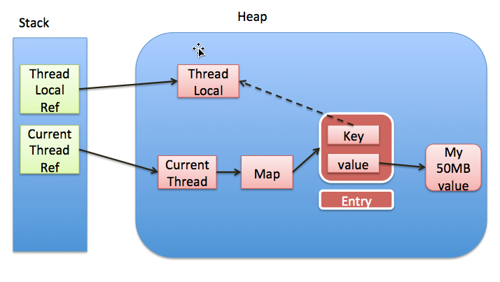

## 概念

### B+树

叶子节点是双向链表，可支持顺序查询可倒序查询

叶子节点是一条顺序链表，链表最长长度为16KB/数据节点大小。链表与叶子节点链表之间存在双向链表指针

### 红黑树

https://blog.csdn.net/v_JULY_v/article/details/6105630?spm=1001.2014.3001.5506

红黑树特性

1. 二叉树
2. 节点只存在两种颜色，红色或黑色
3. 根节点是黑色的，叶节点（指NIL节点或NULL节点）是黑色的
4. 红色节点的子节点都是黑色
5. 所有从根节点的到的NIL节点路径上的黑色节点数均相同
6. 红黑色的查询、插入、删除的时间复杂度均为logN（插入分三种情况讨论，删除分四种情况讨论）

## util

### ArrayList

- 数组实现
- 扩容时容量为原来的1.5倍
- 遍历时不能remove

### HashMap

存储键值对的数据结构，采用数组+链表+红黑树实现

实现关注点

- size表示实际大小，threshold表示容量，cap表示哈希表大小。当未设置容量时，则哈希表大小cap默认16，容量threshold默认16\*负载因子（默认0.75）；当设置了threshold，cap大小等于threshold，实际容量threshold为哈希表容量\*负载因子；当hashMap扩容时，容量和表大小都变为原来的两倍
- new HashMap<>(int) // 传入的为map容量。实际大小为实际容量*负载因子取整
- 默认遇到重复键值，value更新
- 初始化时哈希表为空表，在第一次添加元素时初始化哈希表
- 允许键值为null，对于null键，存入table[0]中
- 链表长度大于8，且桶长度大于64，链表转成红黑树，否则之间简单扩容。删除数据时，红黑树节点过少时转成链表（在[2,6]范围内，具体要看红黑树结构），或者在扩容rehash时新树节点小于等于6转成链表
- 仅当新增和删除数据modCount自增，扩容和更新时不变
- hash算法，h ^ (h >>> 16)：为了减少哈希冲突，引入高位的对哈希结果的影响，加大低位的随机性，减少哈希冲突

jdk8相对于jdk7变化

- 引入了红黑树，对于长链表查询效率更高
- 在resize时，链表依然按照顺序分配，不再逆序分配（jdk7链表逆序分配，实现简单，但在并发使用时可能产生死循环）
- 添加元素，jdk8采用尾插法，jdk7采用头插法
  - 头插法优点
    - 头插法插入快实现简单，O(1)直接插入到表头，而尾插法需要遍历到链表尾节点再插入。
    - 缓存设计优化，默认新插入节点被访问的频率高
  - 头插法缺点
    - 并发扩容时可能发生链表成环
    - 扩容时，颠倒了链表元素的顺序

### LinkedHashMap

继承自HashMap，同样也复用hashmap的数组+链表结构，只是新增了一条链表，来表示顺序。新增的节点都放到链表末尾，遍历时从链表头开始遍历，扫描至链表尾部

accessOrder: true表示访问列表为访问数据，false表示列表为插入顺序。LinkedHashMap默认false，表示插入节点都迁移到链表末尾；当为true时，访问过或更新过的元素会迁移到链表末尾

Foreach: 迭代遍历时按照从表头至表尾的顺序遍历节点

put() 使用hashMap put方法

```java
// 16-容器容量；0.75f-负载因子；true-访问顺序accessOrder
new LinkedHashMap<>(16, 0.75f, true);
```

### TreeMap

排序map，key构成一棵红黑树

- key必须实现Comparable接口，实现compareTo方法

- key不能为null

#### put

```java
public V put(K key, V value) {
        Entry<K,V> t = root;
        if (t == null) {
            // 树为空，进行初始化
            // key不能为空，否则抛出NPE
            compare(key, key); // type (and possibly null) check

            root = new Entry<>(key, value, null);
            size = 1;
            modCount++;
            return null;
        }
        int cmp;
        Entry<K,V> parent;
        // split comparator and comparable paths
        Comparator<? super K> cpr = comparator;
    	// 判断有无指定比较器，用插入key和树结构节点对比，相同则更新value，表示树中不存在两个相同key
        if (cpr != null) {
            do {
                parent = t;
                cmp = cpr.compare(key, t.key);
                if (cmp < 0)
                    t = t.left;
                else if (cmp > 0)
                    t = t.right;
                else
                    return t.setValue(value);
            } while (t != null);
        }
        else {
            if (key == null)
                throw new NullPointerException();
            @SuppressWarnings("unchecked")
                Comparable<? super K> k = (Comparable<? super K>) key;
            do {
                parent = t;
                cmp = k.compareTo(t.key);
                if (cmp < 0)
                    t = t.left;
                else if (cmp > 0)
                    t = t.right;
                else
                    return t.setValue(value);
            } while (t != null);
        }
        Entry<K,V> e = new Entry<>(key, value, parent);
        if (cmp < 0)
            parent.left = e;
        else
            parent.right = e;
    	// 红黑树旋转调整以达到平衡
        fixAfterInsertion(e);
        size++;
        modCount++;
        return null;
    }
```

### ThreadLocal

java.lang.ThreadLocal

ThreadLocal提供的线程的局部变量，其他线程不可访问。可能方便存取变量

实际上，ThreadLocal不保存任何属性，而是通过Thread中threadLocals保存线程的变量，threadLocal是ThreadLocalMap类

```java
static class ThreadLocalMap {
  static class Entry extends WeakReference<ThreadLocal<?>> {
    Object value;
    Entry(ThreadLocal<?> k, Object v) {
      super(k);
      value = v;
    }
  }
  // 变量表
  private Entry[] table;
  // map实际保存变量个数
  private int size = 0;
 	// map容量，当实际大小超过该容量时需要扩容
  private int threshold;
}
```

ThreadLocalMap包含实体组数，key为ThreadLocal变量，value为需要存储的对象，结构图如下



**内存泄露**

当ThreadLocal的直接引用被回收后，仍存在Entry的key引用，Entry的生命周期和Thread生命周期一样，若key为强引用，Thread为回收key则ThreadLocal就无法回收，造成内存泄露

所以key设计为弱引用，当ThreadLocal的直接引用被回收，仅存在key的弱引用，在下次gc的时候，ThreadLocal就会被回收。当引用key被回收后，ThreadLocal可以通过remove， get，set来回收key=null的Entry。

> jvm是按照对象来回收的，当对象不存在强引用后，就会进行回收

当线程退出后，线程ThreadLocalMap会被回收

注意使用ThreadLocal变量时，如果使用后未remove，可能产生很多问题

1. 当使用线程池时，线程循环使用，ThreadLocal不remove就不会丢
2. 内存泄露，Entry不能及时被清理

**在使用完ThreadLocal后及时remove**

#### set

```java
public void set(T value) {
        Thread t = Thread.currentThread();
        ThreadLocalMap map = getMap(t);
        if (map != null)
            map.set(this, value);
        else
            createMap(t, value);
    }
// 线程threadLocalmap初始化
void createMap(Thread t, T firstValue) {
        t.threadLocals = new ThreadLocalMap(this, firstValue);
    }
// map初始化
ThreadLocalMap(ThreadLocal<?> firstKey, Object firstValue) {
            table = new Entry[INITIAL_CAPACITY];
  					// INITIAL_CAPACITY=16
            int i = firstKey.threadLocalHashCode & (INITIAL_CAPACITY - 1);
  					// map节点创建，key=threadLcoal，value=value
            table[i] = new Entry(firstKey, firstValue);
            size = 1;
            setThreshold(INITIAL_CAPACITY);
        }
// 容量上限为数组打标的2/3
private void setThreshold(int len) {
            threshold = len * 2 / 3;
        }
// 保存key-value
private void set(ThreadLocal<?> key, Object value) {

            // We don't use a fast path as with get() because it is at
            // least as common to use set() to create new entries as
            // it is to replace existing ones, in which case, a fast
            // path would fail more often than not.

            Entry[] tab = table;
            int len = tab.length;
            int i = key.threadLocalHashCode & (len-1);

  					// 找到当前ThreadLocal对应的桶位置，若发生冲突，则寻找下一个非空的Entry
            for (Entry e = tab[i];
                 e != null;
                 e = tab[i = nextIndex(i, len)]) {
                ThreadLocal<?> k = e.get();
              	// threadLocal存在，值更新操作
                if (k == key) {
                    e.value = value;
                    return;
                }
              	// 当key=null时，用新键值对替换，同时清理key=null的历史数据
                if (k == null) {
                    replaceStaleEntry(key, value, i);
                    return;
                }
            }

            tab[i] = new Entry(key, value);
            int sz = ++size;
            if (!cleanSomeSlots(i, sz) && sz >= threshold)
                rehash();
        }
// 清理部分废弃节点
private boolean cleanSomeSlots(int i, int n) {
            boolean removed = false;
            Entry[] tab = table;
            int len = tab.length;
            do {
                i = nextIndex(i, len);
                Entry e = tab[i];
                if (e != null && e.get() == null) {
                    n = len;
                    removed = true;
                    i = expungeStaleEntry(i);
                }
            } while ( (n >>>= 1) != 0);
            return removed;
        }
private void rehash() {
            expungeStaleEntries();

            // Use lower threshold for doubling to avoid hysteresis
            if (size >= threshold - threshold / 4)
                resize();
        }
// 清理过期节点
private void expungeStaleEntries() {
            Entry[] tab = table;
            int len = tab.length;
            for (int j = 0; j < len; j++) {
                Entry e = tab[j];
                if (e != null && e.get() == null)
                    expungeStaleEntry(j);
            }
        }
private int expungeStaleEntry(int staleSlot) {
            Entry[] tab = table;
            int len = tab.length;

            // expunge entry at staleSlot
            tab[staleSlot].value = null;
            tab[staleSlot] = null;
            size--;

            // Rehash until we encounter null
            Entry e;
            int i;
            for (i = nextIndex(staleSlot, len);
                 (e = tab[i]) != null;
                 i = nextIndex(i, len)) {
                ThreadLocal<?> k = e.get();
              	// key为空直接清理该节点
                if (k == null) {
                    e.value = null;
                    tab[i] = null;
                    size--;
                } else {
                  	// 当key不为空时，则进行数据迁移，将后续发送冲突的节点往前挪，因为前面的节点被删除了，位置空出来了，方便后面的查询
                    int h = k.threadLocalHashCode & (len - 1);
                  	// h为哈希键定位的桶，i为实际保存的桶，当二者不等时则表明是发生了哈希冲突所致，此时进行迁移。从hash定位的桶位置开始，寻找第一个为空的节点保存
                    if (h != i) {
                        tab[i] = null;

                        // Unlike Knuth 6.4 Algorithm R, we must scan until
                        // null because multiple entries could have been stale.
                      	// 找到下一个为空的节点，保存
                        while (tab[h] != null)
                            h = nextIndex(h, len);
                        tab[h] = e;
                    }
                }
            }
            return i;
        }
// 扩容，容量变为原来的两倍，将老数据重新散列到新表中
private void resize() {
            Entry[] oldTab = table;
            int oldLen = oldTab.length;
            int newLen = oldLen * 2;
            Entry[] newTab = new Entry[newLen];
            int count = 0;

            for (int j = 0; j < oldLen; ++j) {
                Entry e = oldTab[j];
                if (e != null) {
                    ThreadLocal<?> k = e.get();
                  	// 清空废弃节点
                    if (k == null) {
                        e.value = null; // Help the GC
                    } else {
                        int h = k.threadLocalHashCode & (newLen - 1);
                        while (newTab[h] != null)
                            h = nextIndex(h, newLen);
                        newTab[h] = e;
                        count++;
                    }
                }
            }

            setThreshold(newLen);
            size = count;
            table = newTab;
        }
```

#### get

```java
public T get() {
        Thread t = Thread.currentThread();
        ThreadLocalMap map = getMap(t);
        if (map != null) {
            ThreadLocalMap.Entry e = map.getEntry(this);
            if (e != null) {
                @SuppressWarnings("unchecked")
                T result = (T)e.value;
                return result;
            }
        }
  			// 当线程中不存在当前ThreadLocal对应的值，设置初始化值
        return setInitialValue();
    }
private T setInitialValue() {
  			// 获取初始化值，可通过重写该方法来设置初始值
        T value = initialValue();
        Thread t = Thread.currentThread();
        ThreadLocalMap map = getMap(t);
        if (map != null)
            map.set(this, value);
        else
            createMap(t, value);
        return value;
    }
private Entry getEntry(ThreadLocal<?> key) {
            int i = key.threadLocalHashCode & (table.length - 1);
            Entry e = table[i];
            if (e != null && e.get() == key)
                return e;
            else
              	// 若当前节点为空或当前hash桶key不等于当前key
                return getEntryAfterMiss(key, i, e);
        }
// 若e为空直接返回空。若不为空则表示可能产生了哈希冲突，寻找下一个桶键值为key的桶
private Entry getEntryAfterMiss(ThreadLocal<?> key, int i, Entry e) {
            Entry[] tab = table;
            int len = tab.length;

            while (e != null) {
                ThreadLocal<?> k = e.get();
                if (k == key)
                    return e;
                if (k == null)
                    expungeStaleEntry(i);
                else
                    i = nextIndex(i, len);
                e = tab[i];
            }
            return null;
        }
```

#### remove

```java
public void remove() {
         ThreadLocalMap m = getMap(Thread.currentThread());
         if (m != null)
             m.remove(this);
     }
private void remove(ThreadLocal<?> key) {
            Entry[] tab = table;
            int len = tab.length;
            int i = key.threadLocalHashCode & (len-1);
            for (Entry e = tab[i];
                 e != null;
                 e = tab[i = nextIndex(i, len)]) {
                if (e.get() == key) {
                  	// 清理ThreadLocal引用
                    e.clear();
                  	// 清理Entry节点
                    expungeStaleEntry(i);
                    return;
                }
            }
        }
```

#### 问题

1. 发生的哈希冲突怎么办？
   1. 开放地址法，找到下一个不为空的节点保存，步长为1。
   2. 那么当hash键到冲突后的新键中间的键删除怎么办，怎么查询？当发生键删除时，会将删除节点后面发生冲突的节点往前挪，同时清理废弃节点
2. 内存溢出
   1. 垃圾回收针对对象来回收，但threadLocal无强引用时，经历一次gc可回收ThreadLoca对象和线程map里的弱引用，次数Entry节点仍未被清除
   2. 节点清理实际
      1. remove：直接清除ThreadLocal对应节点，以及后续废弃节点
      2. get：当设置初始化值时或产生hash冲突往后遍历发现空key时，可清理
      3. set：当发生hash重入往后寻找空节点时，若发现空key节点，可清理并替换。若找到新空节点，新增节点再清理部分废弃节点
3. 完美散列：ThreadLocal类中存在一个静态变量nextHashCode，每次增长0x61c88647（黄金分割数，(根号5-1)*2^32，有符号位，再取正），每生成一个ThreadLocal增长一次，产生完美散列不会冲突（即使是一边扩容一边计算），以此减少hash冲突

#### 使用场景

**1.参数隐式传递**

通过ThreadLocal保存一些参数传递，比如事务提交后是否删除缓存

**2. 存储登录信息**

用户信息一般会保存在session或token中，而session的获取需要在接口入参中加入HttpServletRequest对象才能获取，而对于业务方法获取登录信息很频繁，但并不是所有方法都能传递HttpServletRequest对象，此时登录信息可保存在ThreadLocal中

**3.解决线程安全问题**

ThreadLocal线程安全，可以存在一些非线程安全的常用类，比如Random、SimpleDateFormat

## JUC

### LongAdder

参考：https://segmentfault.com/a/1190000015865714

AtomicLong为线程安全的类，用于支持Long型数据操作，底层通过CAS实现，但是当并发量很高时，CAS效率低下，此时引入LongAdder。LongAdder采用baseCount+cells[]思想，无并发时（cells为null）直接CAS操作baseCount，当存在并发时再更新cells。最后获取结果时，为baseCount+cells[]思想，但统计结果时可能存在其他计算逻辑，所以该值仅仅是估计值。

LongAdder相比AtomicLong，高并发情况下采用热点数据分治的思想以提高性能，高并发下性能优于AtomicLong，但LongAdder只能获得某时刻的近视值，可能获取时部分操作正在进行中，并不能完全代替AtomicLong

**其他兄弟**

- LongAccumulator：为LongAdder的增强版，解决了其只支持加减运算局限。通过LongBinaryOperator可以自定义对参数的任何操作
- DoubleAdder和DoubleAccumulator：和LongAdder、LongAccumulator类似，其内部通过一定方法将double转换成long类型，其余操作与LongAdder一样

#### 1. 结构

```java
public class LongAdder extends Striped64 implements Serializable {
  public LongAdder() {
    }
}

abstract class Striped64 extends Number {
    // 并发时热点分组数据，可扩容，最大为CPU数量
    transient volatile Cell[] cells;
  	// 非并发情况下操作数据
    transient volatile long base;
  	// cells[]加锁标识。当cells初始化或扩容设置为1，否则为0
    transient volatile int cellsBusy;
  
  private static final sun.misc.Unsafe UNSAFE;
    private static final long BASE;
    private static final long CELLSBUSY;
    private static final long PROBE;
    static {
        try {
            UNSAFE = sun.misc.Unsafe.getUnsafe();
            Class<?> sk = Striped64.class;
            BASE = UNSAFE.objectFieldOffset
                (sk.getDeclaredField("base"));
            CELLSBUSY = UNSAFE.objectFieldOffset
                (sk.getDeclaredField("cellsBusy"));
            Class<?> tk = Thread.class;
            PROBE = UNSAFE.objectFieldOffset
                (tk.getDeclaredField("threadLocalRandomProbe"));
        } catch (Exception e) {
            throw new Error(e);
        }
    }
}
```

#### 2. add

```java
public void add(long x) {
        Cell[] as; long b, v; int m; Cell a;
  			// cells为空时，cas更新base; 若cells非空或cas更新失败时，进入更新cells操作
        if ((as = cells) != null || !casBase(b = base, b + x)) {
            boolean uncontended = true;
          	// cells未初始化 | cas尝试更新cell[i]的value失败，则进入longAccumulate方法
            if (as == null || (m = as.length - 1) < 0 ||
                (a = as[getProbe() & m]) == null ||
                !(uncontended = a.cas(v = a.value, v + x)))
                longAccumulate(x, null, uncontended);
        }
    }

final void longAccumulate(long x, LongBinaryOperator fn,
                              boolean wasUncontended) {
        int h;
        if ((h = getProbe()) == 0) {
          	// 计算当前线程更新的hash值，从而得到对应的cells桶
            ThreadLocalRandom.current(); // force initialization
            h = getProbe();
            wasUncontended = true;
        }
        boolean collide = false;                // True if last slot nonempty
        for (;;) {
            Cell[] as; Cell a; int n; long v;
          	// case3：cells已经初始化完成
            if ((as = cells) != null && (n = as.length) > 0) {
              	// 判断cells[i]是否为空，为空则初始化cells单元格，初始值为x
                if ((a = as[(n - 1) & h]) == null) {
                    if (cellsBusy == 0) {       // Try to attach new Cell
                        Cell r = new Cell(x);   // Optimistically create
                        if (cellsBusy == 0 && casCellsBusy()) {
                            boolean created = false;
                            try {               // Recheck under lock
                                Cell[] rs; int m, j;
                                if ((rs = cells) != null &&
                                    (m = rs.length) > 0 &&
                                    rs[j = (m - 1) & h] == null) {
                                    rs[j] = r;
                                    created = true;
                                }
                            } finally {
                                cellsBusy = 0;
                            }
                            if (created)
                                break;
                            continue;           // Slot is now non-empty
                        }
                    }
                    collide = false;
                }
                else if (!wasUncontended)       // CAS already known to fail
                    wasUncontended = true;      // Continue after rehash
              	// 尝试更新cells[i]的值
                else if (a.cas(v = a.value, ((fn == null) ? v + x :
                                             fn.applyAsLong(v, x))))
                    break;
              	// 当cells[]大小超过cpu核数后，不再进行扩容
                else if (n >= NCPU || cells != as)
                    collide = false;            // At max size or stale
                else if (!collide)
                    collide = true;
                else if (cellsBusy == 0 && casCellsBusy()) {
                  	// 加锁进行扩容
                    try {
                        if (cells == as) {      // Expand table unless stale
                          	// cells[]扩容为原来的两倍
                            Cell[] rs = new Cell[n << 1];
                            for (int i = 0; i < n; ++i)
                                rs[i] = as[i];
                            cells = rs;
                        }
                    } finally {
                        cellsBusy = 0;
                    }
                    collide = false;
                    continue;                   // Retry with expanded table
                }
                h = advanceProbe(h);
            }
          	// case1：cells没有加锁且没有初始化，尝试加锁并初始化
            else if (cellsBusy == 0 && cells == as && casCellsBusy()) {
                boolean init = false;
                try {                           // Initialize table
                    if (cells == as) {
                      	// 初始化表，初始大小为2
                        Cell[] rs = new Cell[2];
                        rs[h & 1] = new Cell(x);
                        cells = rs;
                        init = true;
                    }
                } finally {
                    cellsBusy = 0;
                }
                if (init)
                    break;
            }
          	// case2：cells正在初始化，尝试直接在base上进行累加操作
            else if (casBase(v = base, ((fn == null) ? v + x :
                                        fn.applyAsLong(v, x))))
                break;                          // Fall back on using base
        }
    }
```

#### 3. 结果统计

得到的结果为某一时刻的近视值，可能存在部分操作正在进行中（初始化、扩容、计算等）

```java
public long longValue() {
        return sum();
    }

public long sum() {
        Cell[] as = cells; Cell a;
        long sum = base;
        if (as != null) {
            for (int i = 0; i < as.length; ++i) {
                if ((a = as[i]) != null)
                    sum += a.value;
            }
        }
        return sum;
    }
```

### ConcurrentHashMap(chm)

Jdk1.7和jdk1.8实现不同

#### jdk1.7


ConcurrentHashMap结构，分为多个segment段，每个段类都一个HashEntry[]数组，类似于一个hashMap，各个段之间互不干扰

- key和value不能为null

核心成员变量

```java
/**
 * Segment 数组，存放数据时首先需要定位到具体的 Segment 中。
 */
final Segment<K,V>[] segments;

transient Set<K> keySet;
transient Set<Map.Entry<K,V>> entrySet;
```

```java
// 段是ConcurrentHashMap内部类
static final class Segment<K,V> extends ReentrantLock implements Serializable {
       private static final long serialVersionUID = 2249069246763182397L;
       
       // 和 HashMap 中的 HashEntry 作用一样，真正存放数据的桶
       transient volatile HashEntry<K,V>[] table;
       transient int count;
       transient int modCount;
       transient int threshold;
       final float loadFactor;      
}

static final class HashEntry<K,V> {
        final int hash;
        final K key;
        volatile V value;
        volatile HashEntry<K,V> next;
}
```

put方法

1. 通过key定位到Segment
2. 获取Segment的锁。第一步先尝试通过tryLock非公平锁方式CAS获取锁，若失败超过一定次数则lock阻塞获取锁

get方法不加锁:hashEntry中的value用volatile修饰，保证变量的可见性

size方法：先通过两次不加锁计算各段大小总和，若两次的modCount相等则计算完成；否则对所有分段加锁，计算总大小

#### jdk1.8


结构类似于HashMap

- 无modCount
- 采用Node替换HashEntry，后续Node为加锁对象

put方法如下。键或值为空时抛出NPE


1. 遍历表
2. 表为空则进行初始化
3. 若当前桶未初始化，则通过cas进行初始化
4. 当hash=MOVED=-1时，表示当前map正在扩容，需要协助扩容
5. 获取表头锁
6. 当链表数量大于8则转成红黑树

get方法，无需加锁。可以通过hash<0来识别map正在扩容，需要到nextTable查询结果

Jdk1.8相对于jdk1.7改动

- 引入了红黑树，提高查询效率
- 摒弃了段的概念，结构更像hashMap，直接锁定单个hash桶，锁粒度更小
- 加锁时直接使用synchronized（可能适用于并发度较高的场景）
- 扩容时将任务拆分，使用多线程并发执行加快扩容
- 获取map大小，引入计数器概念（CounterCell数组）直接无锁获取。而jdk1.7需要对所有段加锁。无modCount，1.7还有

> 以下针对jdk1.8开始讨论

#### 1. ConcurrentHashMap简介


#### 2. 基本结构


chm中维护了一个Node类型的数组，也就是table。数组的每个位置table[i]代表了一个桶，table[i]共有四种不同类型：Node、TreeBin、ForwardingNode、ReservationNode

> TreeBin锁连接的是一个红黑色，树节点用TreeNode表示，因红黑树的操作比较复杂，因此采用TreeBin封装TreeNode

##### 2.1 Node

桶上的节点一般用Node表示，当链表过程才会转化成红黑树。

```java
/**
 * 普通的Entry结点, 以链表形式保存时才会使用, 存储实际的数据.
 */
static class Node<K, V> implements Map.Entry<K, V> {
    final int hash;
    final K key;
    volatile V val;
    volatile Node<K, V> next;   // 链表指针
}
```

##### 2.2 TreeNode

表示红黑树的节点，不会直接链接到桶上，而是由红黑树节点TreeBin链接

```java
/**
 * 红黑树结点, 存储实际的数据.
 */
static final class TreeNode<K, V> extends Node<K, V> {
    boolean red;

    TreeNode<K, V> parent;
    TreeNode<K, V> left;
    TreeNode<K, V> right;

    /**
     * prev指针是为了方便删除.
     * 删除链表的非头结点时，需要知道它的前驱结点才能删除，所以直接提供一个prev指针
     */
    TreeNode<K, V> prev;
}
```

##### 2.3 TreeBin

相当于TreeNode的代理节点，提供了一些类红黑树的操作，比如加锁、解锁

```java
/**
 * TreeNode的代理结点（相当于封装了TreeNode的容器，提供针对红黑树的转换操作和锁控制）
 * hash值固定为-3
 */
static final class TreeBin<K, V> extends Node<K, V> {
    TreeNode<K, V> root;                // 红黑树结构的根结点
    volatile TreeNode<K, V> first;      // 链表结构的头结点
    volatile Thread waiter;             // 最近的一个设置WAITER标识位的线程

    volatile int lockState;             // 整体的锁状态标识位

    static final int WRITER = 1;        // 二进制001，红黑树的写锁状态
    static final int WAITER = 2;        // 二进制010，红黑树的等待获取写锁状态
    static final int READER = 4;        // 二进制100，红黑树的读锁状态，读可以并发，每多一个读线程，lockState都加上一个READER值
  	// hash值固定-2
}
```

##### 2.4 ForwardingNode

ForwardingNode在扩容时才用到

```java
/**
 * ForwardingNode是一种临时结点，在扩容进行中才会出现，hash值固定为-1，且不存储实际数据。
 * 如果旧table数组的一个hash桶中全部的结点都迁移到了新table中，则在这个桶中放置一个ForwardingNode。
 * 读操作碰到ForwardingNode时，将操作转发到扩容后的新table数组上去执行；写操作碰见它时，则尝试帮助扩容。
 */
static final class ForwardingNode<K, V> extends Node<K, V> {
    final Node<K, V>[] nextTable;

    ForwardingNode(Node<K, V>[] tab) {
        super(MOVED, null, null, null);
        this.nextTable = tab;
    }
}
```

##### 2.5 ReservationNode

保留节点，chm的特殊方法会用到这个

```java
/**
 * 保留结点.
 * hash值固定为-3， 不保存实际数据
 * 只在computeIfAbsent和compute这两个函数式API中充当占位符加锁使用
 */
static final class ReservationNode<K, V> extends Node<K, V> {
    ReservationNode() {
        super(RESERVED, null, null, null);
    }

    Node<K, V> find(int h, Object k) {
        return null;
    }
}
```

#### 3. ConcurrentHashMap的构造

提供五种构造器，采用懒加载的方式，在第一次插入键值对时才初始化table数组

> 指定initialCapacity，cap=initialCapacity*1.5后续初始化时表示表容量。实际容量为0. 75cap

```java
public ConcurrentHashMap(int initialCapacity) {
        if (initialCapacity < 0)
            throw new IllegalArgumentException();
        int cap = ((initialCapacity >= (MAXIMUM_CAPACITY >>> 1)) ?
                   MAXIMUM_CAPACITY :
                   tableSizeFor(initialCapacity + (initialCapacity >>> 1) + 1));
        this.sizeCtl = cap;
    }
```

##### 3.1 常量

```java
/**
 * 最大容量.
 */
private static final int MAXIMUM_CAPACITY = 1 << 30;

/**
 * 默认初始容量
 */
private static final int DEFAULT_CAPACITY = 16;

/**
 * The largest possible (non-power of two) array size.
 * Needed by toArray and related methods.
 */
static final int MAX_ARRAY_SIZE = Integer.MAX_VALUE - 8;

/**
 * 负载因子，为了兼容JDK1.8以前的版本而保留。
 * JDK1.8中的ConcurrentHashMap的负载因子恒定为0.75
 */
private static final float LOAD_FACTOR = 0.75f;

/**
 * 链表转树的阈值，即链接结点数大于8时， 链表转换为树.
 */
static final int TREEIFY_THRESHOLD = 8;

/**
 * 树转链表的阈值，即树结点树小于6时，树转换为链表.
 */
static final int UNTREEIFY_THRESHOLD = 6;

/**
 * 在链表转变成树之前，还会有一次判断：
 * 即只有键值对数量大于MIN_TREEIFY_CAPACITY，才会发生转换。
 * 这是为了避免在Table建立初期，多个键值对恰好被放入了同一个链表中而导致不必要的转化。
 */
static final int MIN_TREEIFY_CAPACITY = 64;

/**
 * 在树转变成链表之前，还会有一次判断：
 * 即只有键值对数量小于MIN_TRANSFER_STRIDE，才会发生转换.hashMap没有该判断
 */
private static final int MIN_TRANSFER_STRIDE = 16;

/**
 * 用于在扩容时生成唯一的随机数.
 */
private static int RESIZE_STAMP_BITS = 16;

/**
 * 可同时进行扩容操作的最大线程数.
 */
private static final int MAX_RESIZERS = (1 << (32 - RESIZE_STAMP_BITS)) - 1;

/**
 * The bit shift for recording size stamp in sizeCtl.
 */
private static final int RESIZE_STAMP_SHIFT = 32 - RESIZE_STAMP_BITS;

static final int MOVED = -1;                // 标识ForwardingNode结点（在扩容时才会出现，不存储实际数据）
static final int TREEBIN = -2;              // 标识红黑树的根结点
static final int RESERVED = -3;             // 标识ReservationNode结点（）
static final int HASH_BITS = 0x7fffffff;    // usable bits of normal node hash

/**
 * CPU核心数，扩容时使用
 */
static final int NCPU = Runtime.getRuntime().availableProcessors();
```

##### 3.2 变量

```java
/**
 * Node数组，标识整个Map，首次插入元素时创建，大小总是2的幂次.
 */
transient volatile Node<K, V>[] table;

/**
 * 扩容后的新Node数组，只有在扩容时才非空.
 */
private transient volatile Node<K, V>[] nextTable;

/**
 * 控制table的初始化和扩容.
 * 0  : 初始默认值
 * -1 : 有线程正在进行table的初始化
 * >0 : table初始化时使用的容量，或初始化/扩容完成后的threshold
 * <0: 较小的负数，用于记录正在执行扩容任务的线程数
 */
private transient volatile int sizeCtl;

/**
 * 扩容时需要用到的一个下标变量.
 */
private transient volatile int transferIndex;

/**
 * 计数基值,当没有线程竞争时，计数将加到该变量上。类似于LongAdder的base变量
 */
private transient volatile long baseCount;

/**
 * 计数数组，出现并发冲突时使用。类似于LongAdder的cells数组
 */
private transient volatile CounterCell[] counterCells;

/**
 * 自旋标识位，用于CounterCell[]扩容时使用。类似于LongAdder的cellsBusy变量
 */
private transient volatile int cellsBusy;


// 视图相关字段
private transient KeySetView<K, V> keySet;
private transient ValuesView<K, V> values;
private transient EntrySetView<K, V> entrySet;
```

#### 4. put方法

put方法实现。当key不存在时插入，且插入时使用synchronized锁

```java
/**
 * 实际的插入操作
 *
 * @param onlyIfAbsent true:仅当key不存在时,才插入
 */
final V putVal(K key, V value, boolean onlyIfAbsent) {
    if (key == null || value == null) throw new NullPointerException();
    int hash = spread(key.hashCode());  // 再次计算hash值

    /**
     * 使用链表保存时，binCount记录table[i]这个桶中所保存的结点数；
     * 使用红黑树保存时，binCount==2，保证put后更改计数值时能够进行扩容检查，同时不触发红黑树化操作
     */
    int binCount = 0;

    for (Node<K, V>[] tab = table; ; ) {            // 自旋插入结点，直到成功
        Node<K, V> f;
        int n, i, fh;
        if (tab == null || (n = tab.length) == 0)                   // CASE1: 首次初始化table —— 懒加载
            tab = initTable();
        else if ((f = tabAt(tab, i = (n - 1) & hash)) == null) {    // CASE2: table[i]对应的桶为null
            // 注意下上面table[i]的索引i的计算方式：[ key的hash值 & (table.length-1) ]
            // 这也是table容量必须为2的幂次的原因，读者可以自己看下当table.length为2的幂次时，(table.length-1)的二进制形式的特点 —— 全是1
            // 配合这种索引计算方式可以实现key的均匀分布，减少hash冲突
            if (casTabAt(tab, i, null, new Node<K, V>(hash, key, value, null))) // 插入一个链表结点
                break;
        } else if ((fh = f.hash) == MOVED)                          // CASE3: 发现ForwardingNode结点，说明此时table正在扩容，则尝试协助数据迁移
            tab = helpTransfer(tab, f);
        else {                                                      // CASE4: 出现hash冲突,也就是table[i]桶中已经有了结点
            V oldVal = null;
            synchronized (f) {              // 锁住table[i]结点
                if (tabAt(tab, i) == f) {   // 再判断一下table[i]是不是第一个结点, 防止其它线程的写修改
                    if (fh >= 0) {          // CASE4.1: table[i]是链表结点
                        binCount = 1;
                        for (Node<K, V> e = f; ; ++binCount) {
                            K ek;
                            // 找到“相等”的结点，判断是否需要更新value值
                            if (e.hash == hash && ((ek = e.key) == key || (ek != null && key.equals(ek)))) {
                                oldVal = e.val;
                                if (!onlyIfAbsent)
                                    e.val = value;
                                break;
                            }
                            Node<K, V> pred = e;
                            if ((e = e.next) == null) {     // “尾插法”插入新结点
                                pred.next = new Node<K, V>(hash, key,
                                    value, null);
                                break;
                            }
                        }
                    } else if (f instanceof TreeBin) {  // CASE4.2: table[i]是红黑树结点
                        Node<K, V> p;
                        binCount = 2;
                        if ((p = ((TreeBin<K, V>) f).putTreeVal(hash, key, value)) != null) {
                            oldVal = p.val;
                            if (!onlyIfAbsent)
                                p.val = value;
                        }
                    }
                }
            }
            if (binCount != 0) {
                if (binCount >= TREEIFY_THRESHOLD)
                    treeifyBin(tab, i);     // 链表 -> 红黑树 转换
                if (oldVal != null)         // 表明本次put操作只是替换了旧值，不用更改计数值
                    return oldVal;
                break;
            }
        }
    }
    addCount(1L, binCount);             // 计数值加1
    return null;
}   
```

##### 4.1 initTable() 懒加载

采用懒加载的方式，当添加键值对时，table为空则进行初始化

```java
/**
 * 初始化table, 使用sizeCtl作为初始化容量.
 */
private final Node<K, V>[] initTable() {
    Node<K, V>[] tab;
    int sc;
    while ((tab = table) == null || tab.length == 0) {  //自旋直到初始化成功
        if ((sc = sizeCtl) < 0)         // sizeCtl<0 说明table已经正在初始化/扩容
            Thread.yield();
        else if (U.compareAndSwapInt(this, SIZECTL, sc, -1)) {  // 将sizeCtl更新成-1,表示正在初始化中
            try {
                if ((tab = table) == null || tab.length == 0) {
                    int n = (sc > 0) ? sc : DEFAULT_CAPACITY;
                    Node<K, V>[] nt = (Node<K, V>[]) new Node<?, ?>[n];
                    table = tab = nt;
                    sc = n - (n >>> 2);     // n - (n >>> 2) = n - n/4 = 0.75n, 前面说了loadFactor已在JDK1.8废弃
                }
            } finally {
                sizeCtl = sc;               // 设置threshold = 0.75 * table.length
            }
            break;
        }
    }
    return tab;
}
```

##### 4.2 table[i]对应的数据为空

采用CAS的方式设置Node节点

##### 4.3 当发现ForwardingNode节点时，说明table正在扩容，需协助扩容

扩容很复杂，下面讲解

疑问：本次put操作丢失？不会，扩容完成后继续在循环内重新计算哈希桶，添加元素

##### 4.4 出现hash冲突

若Node节点的为Node时，采用尾插入添加Node到链表末尾

若Node节点为TreeBin，才将新节点添加到红黑树中

```java
/**
 * 尝试进行 链表 -> 红黑树 的转换.
 */
private final void treeifyBin(Node<K, V>[] tab, int index) {
    Node<K, V> b;
    int n, sc;
    if (tab != null) {

        // CASE 1: table的容量 < MIN_TREEIFY_CAPACITY(64)时，直接进行table扩容，不进行红黑树转换
        if ((n = tab.length) < MIN_TREEIFY_CAPACITY)
            tryPresize(n << 1);

            // CASE 2: table的容量 ≥ MIN_TREEIFY_CAPACITY(64)时，进行链表 -> 红黑树的转换
        else if ((b = tabAt(tab, index)) != null && b.hash >= 0) {
            synchronized (b) {
                if (tabAt(tab, index) == b) {
                    TreeNode<K, V> hd = null, tl = null;

                    // 遍历链表，建立红黑树
                    for (Node<K, V> e = b; e != null; e = e.next) {
                        TreeNode<K, V> p = new TreeNode<K, V>(e.hash, e.key, e.val, null, null);
                        if ((p.prev = tl) == null)
                            hd = p;
                        else
                            tl.next = p;
                        tl = p;
                    }
                    // 以TreeBin类型包装，并链接到table[index]中
                    setTabAt(tab, index, new TreeBin<K, V>(hd));
                }
            }
        }
    }
}
```

#### 5. get方法

不加锁读，table变量为volatile类型

```java
/**
 * 根据key查找对应的value值
 *
 * @return 查找不到则返回null
 * @throws NullPointerException if the specified key is null
 */
public V get(Object key) {
    Node<K, V>[] tab;
    Node<K, V> e, p;
    int n, eh;
    K ek;
    int h = spread(key.hashCode());     // 重新计算key的hash值
    if ((tab = table) != null && (n = tab.length) > 0 &&
            (e = tabAt(tab, (n - 1) & h)) != null) {
        if ((eh = e.hash) == h) {       // table[i]就是待查找的项，直接返回
            if ((ek = e.key) == key || (ek != null && key.equals(ek)))
                return e.val;
        } else if (eh < 0)              // hash值<0, 说明遇到特殊结点(非链表结点), 调用find方法查找
            return (p = e.find(h, key)) != null ? p.val : null;
        while ((e = e.next) != null) {  // 按链表方式查找
            if (e.hash == h &&
                    ((ek = e.key) == key || (ek != null && key.equals(ek))))
                return e.val;
        }
    }
    return null;
}
```

- 当table[i]表头节点key与目标key相等，直接返回
- 当table[i]表头节点为Node类型，遍历链表查找
- 当table[i]表头节点为特殊节点，通过find方法查找

```java
/**
 * 链表查找.
 */
Node<K, V> find(int h, Object k) {
    Node<K, V> e = this;
    if (k != null) {
        do {
            K ek;
            if (e.hash == h && ((ek = e.key) == k || (ek != null && k.equals(ek))))
                return e;
        } while ((e = e.next) != null);
    }
    return null;
}
```

##### 5.1 TreeBin节点的查找

```java
/**
 * 从根结点开始遍历查找，找到“相等”的结点就返回它，没找到就返回null
 * 当存在写锁时，以链表方式进行查找
 */
final Node<K, V> find(int h, Object k) {
    if (k != null) {
        for (Node<K, V> e = first; e != null; ) {
            int s;
            K ek;
            /**
             * 两种特殊情况下以链表的方式进行查找:
             * 1. 有线程正持有写锁，这样做能够不阻塞读线程
             * 2. 有线程等待获取写锁，不再继续加读锁，相当于“写优先”模式
             */
            if (((s = lockState) & (WAITER | WRITER)) != 0) {
                if (e.hash == h &&
                    ((ek = e.key) == k || (ek != null && k.equals(ek))))
                    return e;
                e = e.next;     // 链表形式
            }

            // 读线程数量加1，读状态进行累加
            else if (U.compareAndSwapInt(this, LOCKSTATE, s, s + READER)) {
                TreeNode<K, V> r, p;
                try {
                    p = ((r = root) == null ? null :
                        r.findTreeNode(h, k, null));
                } finally {
                    Thread w;
                    // 如果当前线程是最后一个读线程，且有写线程因为读锁而阻塞，则写线程，告诉它可以尝试获取写锁了
                    if (U.getAndAddInt(this, LOCKSTATE, -READER) == (READER | WAITER) && (w = waiter) != null)
                        LockSupport.unpark(w);
                }
                return p;
            }
        }
    }
    return null;
}

```

##### 5.2 ForwardingNode节点的查找

扩容时存在

```java
/**
 * 在新的扩容table——nextTable上进行查找
 */
Node<K, V> find(int h, Object k) {
    // loop to avoid arbitrarily deep recursion on forwarding nodes
    outer:
    for (Node<K, V>[] tab = nextTable; ; ) {
        Node<K, V> e;
        int n;
        if (k == null || tab == null || (n = tab.length) == 0 ||
            (e = tabAt(tab, (n - 1) & h)) == null)
            return null;
        for (; ; ) {
            int eh;
            K ek;
            if ((eh = e.hash) == h &&
                ((ek = e.key) == k || (ek != null && k.equals(ek))))
                return e;
            if (eh < 0) {
                if (e instanceof ForwardingNode) {
                  	// 更换新表查找
                    tab = ((ForwardingNode<K, V>) e).nextTable;
                    continue outer;
                } else
                    return e.find(h, k);
            }
            if ((e = e.next) == null)
                return null;
        }
    }
}
```

##### 5.3 ReversionNode节点的查找

保留节点，不保存实际数据。用于comput()和computIfAbsent()方法，插入临时节点

```java
Node<K, V> find(int h, Object k) {
    return null;
}
```

#### 6. ConcurrentHashMap里的计数

采用类似LongAddr的方式，保存基数值（无竞争时增加）和计数数组（并发时计算）

##### 6.1 计数原理

基数+计数数组和

```java
public int size() {
    long n = sumCount();
    return ((n < 0L) ? 0 :
            (n > (long) Integer.MAX_VALUE) ? Integer.MAX_VALUE :
                    (int) n);
}

final long sumCount() {
    CounterCell[] as = counterCells;
    CounterCell a;
    long sum = baseCount;
    if (as != null) {
        for (int i = 0; i < as.length; ++i) {
            if ((a = as[i]) != null)
                sum += a.value;
        }
    }
    return sum;
}
```

##### 6.2 基本字段

```java
/**
 * 计数基值,当没有线程竞争时，计数将加到该变量上。类似于LongAdder的base变量
 */
private transient volatile long baseCount;

/**
 * 计数数组，出现并发冲突时使用。类似于LongAdder的cells数组
 */
private transient volatile CounterCell[] counterCells;

/**
 * 自旋标识位，用于CounterCell[]扩容或初始化时使用。类似于LongAdder的cellsBusy变量
 */
private transient volatile int cellsBusy;
```

##### 6.3 addCount实现

当插入一对键值对时，通过addCount加一

```java
/**
 * 实际的插入操作
 *
 * @param onlyIfAbsent true:仅当key不存在时,才插入
 */
final V putVal(K key, V value, boolean onlyIfAbsent) {
    // …
    addCount(1L, binCount);             // 计数值加1
    return null;
}
```

addCount具体实现如下

- 首先，若counterCells为null，则表示无竞争，直接baseCount加一
- 否则，先尝试更新countCells[i]，更新成功则退出，更新失败则涉及到countCells的扩容，调用fullAddCount()
- 流程和LongAddr类似

```java
/**
 * 更改计数值
 */
private final void addCount(long x, int check) {
    CounterCell[] as;
    long b, s;
    if ((as = counterCells) != null ||
            !U.compareAndSwapLong(this, BASECOUNT, b = baseCount, s = b + x)) { // 首先尝试更新baseCount
 
        // 更新失败,说明出现并发冲突,则将计数值累加到Cell槽
        CounterCell a;
        long v;
        int m;
        boolean uncontended = true;
        if (as == null || (m = as.length - 1) < 0 ||
                (a = as[ThreadLocalRandom.getProbe() & m]) == null ||   // 根据线程hash值计算槽索引
                !(uncontended = U.compareAndSwapLong(a, CELLVALUE, v = a.value, v + x))) {
            fullAddCount(x, uncontended);       // 槽更新也失败, 则会执行fullAddCount
            return;
        }
        if (check <= 1)
            return;
        s = sumCount();
    }
    if (check >= 0) {       // 检测是否扩容
        Node<K, V>[] tab, nt;
        int n, sc;
        while (s >= (long) (sc = sizeCtl) && (tab = table) != null && (n = tab.length) < MAXIMUM_CAPACITY) {
            int rs = resizeStamp(n);
            if (sc < 0) {
                if ((sc >>> RESIZE_STAMP_SHIFT) != rs || sc == rs + 1 ||
                        sc == rs + MAX_RESIZERS || (nt = nextTable) == null ||
                        transferIndex <= 0)
                    break;
                if (U.compareAndSwapInt(this, SIZECTL, sc, sc + 1))
                    transfer(tab, nt);
            } else if (U.compareAndSwapInt(this, SIZECTL, sc, (rs << RESIZE_STAMP_SHIFT) + 2))
                transfer(tab, null);
            s = sumCount();
        }
    }
}
```

#### 7. 扩容

1. 扩容时，利用另一表nextTable进行数据迁移，每次扩容hash表增大为原来的两倍，容量阙值为0.75倍的哈希桶大小
2. 扩容时，若当前未在扩容，则设置sizeCtl为一个较小的负数；若当前map正在扩容，sizeCtl加一，协助扩容
3. 单线程实际扩容时，以stride长度为一个周期，每个周期迁移原哈希桶[transferIndex-stride, transferIndex-1]上的数据，一个周期迁移完成进行下一周期的迁移。每迁移一个哈希桶位置，都需要添加同步锁，将原表数据同步到新表高位低位两个桶中（先同步，再链接高位低位新链表），迁移完成后在原表哈希桶上放置迁移节点（迁移节点key哈希值为-1）
4. 等到最后一个线程（通过迁移线程数sizeCtl计算得出）迁移完成，表示本次扩容结束

##### 7.1 扩容时机

当链表过长，尝试转换成红黑树时

```java
/**
 * 尝试进行 链表 -> 红黑树 的转换.
 */
private final void treeifyBin(Node<K, V>[] tab, int index) {
    Node<K, V> b;
    int n, sc;
    if (tab != null) {

        // CASE 1: table的容量 < MIN_TREEIFY_CAPACITY(64)时，直接进行table扩容，不进行红黑树转换
        if ((n = tab.length) < MIN_TREEIFY_CAPACITY)
            tryPresize(n << 1);

            // CASE 2: table的容量 ≥ MIN_TREEIFY_CAPACITY(64)时，进行链表 -> 红黑树的转换
        else if ((b = tabAt(tab, index)) != null && b.hash >= 0) {
            synchronized (b) {
                if (tabAt(tab, index) == b) {
                    TreeNode<K, V> hd = null, tl = null;

                    // 遍历链表，建立红黑树
                    for (Node<K, V> e = b; e != null; e = e.next) {
                        TreeNode<K, V> p = new TreeNode<K, V>(e.hash, e.key, e.val, null, null);
                        if ((p.prev = tl) == null)
                            hd = p;
                        else
                            tl.next = p;
                        tl = p;
                    }
                    // 以TreeBin类型包装，并链接到table[index]中
                    setTabAt(tab, index, new TreeBin<K, V>(hd));
                }
            }
        }
    }
}
```

尝试扩容

```java
/**
 * 尝试对table数组进行扩容.
 *
 * @param 待扩容的大小
 */
private final void tryPresize(int size) {
    // 视情况将size调整为2的幂次
    int c = (size >= (MAXIMUM_CAPACITY >>> 1)) ? MAXIMUM_CAPACITY : tableSizeFor(size + (size >>> 1) + 1);
    int sc;
    while ((sc = sizeCtl) >= 0) {
        Node<K, V>[] tab = table;
        int n;

        //CASE 1: table还未初始化，则先进行初始化
        if (tab == null || (n = tab.length) == 0) {
            n = (sc > c) ? sc : c;
          	// 从sc转换成-1
            if (U.compareAndSwapInt(this, SIZECTL, sc, -1)) {
                try {
                  	// 校验
                    if (table == tab) {
                        Node<K, V>[] nt = (Node<K, V>[]) new Node<?, ?>[n];
                        table = nt;
                        sc = n - (n >>> 2);
                    }
                } finally {
                    sizeCtl = sc;
                }
            }
        }
        // CASE2: c <= sc说明已经被扩容过了；n >= MAXIMUM_CAPACITY说明table数组已达到最大容量
        else if (c <= sc || n >= MAXIMUM_CAPACITY)
            break;
            // CASE3: 进行table扩容
        else if (tab == table) {
            int rs = resizeStamp(n);    // 根据容量n生成一个随机数，唯一标识本次扩容操作
            if (sc < 0) {               // sc < 0 表明此时有别的线程正在进行扩容
                Node<K, V>[] nt;

                // 如果当前线程无法协助进行数据转移, 则退出
              	// ???什么原理
                if ((sc >>> RESIZE_STAMP_SHIFT) != rs || sc == rs + 1 ||
                    sc == rs + MAX_RESIZERS || (nt = nextTable) == null ||
                    transferIndex <= 0)
                    break;

                // 协助数据转移, 把正在执行transfer任务的线程数加1
                if (U.compareAndSwapInt(this, SIZECTL, sc, sc + 1))
                    transfer(tab, nt);
            }
            // sc置为负数, 当前线程自身成为第一个执行transfer(数据转移)的线程
            // 这个CAS操作可以保证，仅有一个线程会执行扩容
            else if (U.compareAndSwapInt(this, SIZECTL, sc, (rs << RESIZE_STAMP_SHIFT) + 2))
                transfer(tab, null);
        }
    }
}
```

##### 7.2 扩容原理

```java
/**
 * 数据转移和扩容.
 * 每个调用tranfer的线程会对当前旧table中[transferIndex-stride, transferIndex-1]位置的结点进行迁移
 *
 * @param tab     旧table数组
 * @param nextTab 新table数组
 */
private final void transfer(Node<K, V>[] tab, Node<K, V>[] nextTab) {
    int n = tab.length, stride;

    // stride可理解成“步长”，即数据迁移时，每个线程要负责旧table中的多少个桶
    if ((stride = (NCPU > 1) ? (n >>> 3) / NCPU : n) < MIN_TRANSFER_STRIDE)
        stride = MIN_TRANSFER_STRIDE;

    if (nextTab == null) {           // 首次扩容
        try {
            // 创建新table数组
            Node<K, V>[] nt = (Node<K, V>[]) new Node<?, ?>[n << 1];
            nextTab = nt;
        } catch (Throwable ex) {      // 处理内存溢出（OOME）的情况
            sizeCtl = Integer.MAX_VALUE;
            return;
        }
        nextTable = nextTab;
        transferIndex = n;          // [transferIndex-stride, transferIndex-1]表示当前线程要进行数据迁移的桶区间
    }

    int nextn = nextTab.length;

    // ForwardingNode结点，当旧table的某个桶中的所有结点都迁移完后，用该结点占据这个桶
    ForwardingNode<K, V> fwd = new ForwardingNode<K, V>(nextTab);

    // 标识一个桶的迁移工作是否完成，advance == true 表示可以进行下一个位置的迁移
    boolean advance = true;

    // 最后一个数据迁移的线程将该值置为true，并进行本轮扩容的收尾工作
    boolean finishing = false;

    // i标识桶索引, bound标识边界
  	// 初始情况，i=0，经过while，i=transferIndex-1，bound=transferIndex-stride
    // 后续遍历，--i>=bound，遍历[transferIndex-stride, transferIndex-1]的桶，转移。每个桶拆分成高位低位两个桶，迁移完成后老桶设置为ForwardingNode节点。当--i<bound时，再经历一个周期（步长为stride），i=transferIndex-1，bound=transferIndex-stride
    for (int i = 0, bound = 0; ; ) {
        Node<K, V> f;
        int fh;

        // 每一次自旋前的预处理，主要是定位本轮处理的桶区间
        // 正常情况下，预处理完成后：i == transferIndex-1，bound == transferIndex-stride
        while (advance) {
            int nextIndex, nextBound;
          	// i递减关键
            if (--i >= bound || finishing)
                advance = false;
            else if ((nextIndex = transferIndex) <= 0) {
                i = -1;
                advance = false;
            } else if (U.compareAndSwapInt(this, TRANSFERINDEX, nextIndex,
                nextBound = (nextIndex > stride ? nextIndex - stride : 0))) {
              	// 更换下一周期
                bound = nextBound;
                i = nextIndex - 1;
                advance = false;
            }
        }

        if (i < 0 || i >= n || i + n >= nextn) {    // CASE1：当前是处理最后一个tranfer任务的线程或出现扩容冲突
            int sc;
            if (finishing) {    // 所有桶迁移均已完成
                nextTable = null;
                table = nextTab;
              	// map阙值为1.5*n，n为原表长度
                sizeCtl = (n << 1) - (n >>> 1);
                return;
            }

            // 扩容线程数减1,表示当前线程已完成自己的transfer任务
            if (U.compareAndSwapInt(this, SIZECTL, sc = sizeCtl, sc - 1)) {
                // 判断当前线程是否是本轮扩容中的最后一个线程，如果不是，则直接退出
                if ((sc - 2) != resizeStamp(n) << RESIZE_STAMP_SHIFT)
                    return;
                finishing = advance = true;

                /**
                 * 最后一个数据迁移线程要重新检查一次旧table中的所有桶，看是否都被正确迁移到新table了：
                 * ①正常情况下，重新检查时，旧table的所有桶都应该是ForwardingNode;
                 * ②特殊情况下，比如扩容冲突(多个线程申请到了同一个transfer任务)，此时当前线程领取的任务会作废，那么最后检查时，
                 * 还要处理因为作废而没有被迁移的桶，把它们正确迁移到新table中
                 */
                i = n; // recheck before commit
            }
        } else if ((f = tabAt(tab, i)) == null)     // CASE2：旧桶本身为null，不用迁移，直接尝试放一个ForwardingNode
            advance = casTabAt(tab, i, null, fwd);
        else if ((fh = f.hash) == MOVED)            // CASE3：该旧桶已经迁移完成，直接跳过
            advance = true;
        else {                                      // CASE4：该旧桶未迁移完成，进行数据迁移
          	// 加锁，防止桶新增元素
            synchronized (f) {
                if (tabAt(tab, i) == f) {
                    Node<K, V> ln, hn;
                    if (fh >= 0) {                  // CASE4.1：桶的hash>0，说明是链表迁移

                        /**
                         * 下面的过程会将旧桶中的链表分成两部分：ln链和hn链
                         * ln链会插入到新table的槽i中，hn链会插入到新table的槽i+n中
                         */
                        int runBit = fh & n;    // 由于n是2的幂次，所以runBit要么是0，要么高位是1
                        Node<K, V> lastRun = f; // lastRun指向最后一个相邻runBit不同的结点
                        for (Node<K, V> p = f.next; p != null; p = p.next) {
                            int b = p.hash & n;
                            if (b != runBit) {
                                runBit = b;
                                lastRun = p;
                            }
                        }
                        if (runBit == 0) {
                            ln = lastRun;
                            hn = null;
                        } else {
                            hn = lastRun;
                            ln = null;
                        }

                        // 以lastRun所指向的结点为分界，将链表拆成2个子链表ln、hn
                        for (Node<K, V> p = f; p != lastRun; p = p.next) {
                            int ph = p.hash;
                            K pk = p.key;
                            V pv = p.val;
                            if ((ph & n) == 0)
                                ln = new Node<K, V>(ph, pk, pv, ln);
                            else
                                hn = new Node<K, V>(ph, pk, pv, hn);
                        }
                        setTabAt(nextTab, i, ln);               // ln链表存入新桶的索引i位置
                        setTabAt(nextTab, i + n, hn);        // hn链表存入新桶的索引i+n位置
                        setTabAt(tab, i, fwd);                  // 设置ForwardingNode占位
                        advance = true;                         // 表示当前旧桶的结点已迁移完毕
                    }
                    else if (f instanceof TreeBin) {    // CASE4.2：红黑树迁移

                        /**
                         * 下面的过程会先以链表方式遍历，复制所有结点，然后根据高低位组装成两个链表；
                         * 然后看下是否需要进行红黑树转换，最后放到新table对应的桶中
                         */
                        TreeBin<K, V> t = (TreeBin<K, V>) f;
                        TreeNode<K, V> lo = null, loTail = null;
                        TreeNode<K, V> hi = null, hiTail = null;
                        int lc = 0, hc = 0;
                        for (Node<K, V> e = t.first; e != null; e = e.next) {
                            int h = e.hash;
                            TreeNode<K, V> p = new TreeNode<K, V>
                                (h, e.key, e.val, null, null);
                            if ((h & n) == 0) {
                                if ((p.prev = loTail) == null)
                                    lo = p;
                                else
                                    loTail.next = p;
                                loTail = p;
                                ++lc;
                            } else {
                                if ((p.prev = hiTail) == null)
                                    hi = p;
                                else
                                    hiTail.next = p;
                                hiTail = p;
                                ++hc;
                            }
                        }

                        // 判断是否需要进行 红黑树 <-> 链表 的转换
                        ln = (lc <= UNTREEIFY_THRESHOLD) ? untreeify(lo) :
                            (hc != 0) ? new TreeBin<K, V>(lo) : t;
                        hn = (hc <= UNTREEIFY_THRESHOLD) ? untreeify(hi) :
                            (lc != 0) ? new TreeBin<K, V>(hi) : t;
                        setTabAt(nextTab, i, ln);
                        setTabAt(nextTab, i + n, hn);
                        setTabAt(tab, i, fwd);  // 设置ForwardingNode占位
                        advance = true;         // 表示当前旧桶的结点已迁移完毕
                    }
                }
            }
        }
    }
}

// 前导零个数 | 1<<15
static final int resizeStamp(int n) {
        return Integer.numberOfLeadingZeros(n) | (1 << (RESIZE_STAMP_BITS - 1));
    }

// Integer
// 求数字的补码前导零个数
// 负数返回0
public static int numberOfLeadingZeros(int i) {
        // HD, Figure 5-6
        if (i == 0)
            return 32;
        int n = 1;
        if (i >>> 16 == 0) { n += 16; i <<= 16; }
        if (i >>> 24 == 0) { n +=  8; i <<=  8; }
        if (i >>> 28 == 0) { n +=  4; i <<=  4; }
        if (i >>> 30 == 0) { n +=  2; i <<=  2; }
  			// 减去符号位
        n -= i >>> 31;
        return n;
    }
```

### CopyOnWriteArrayList/CopyOnWriteArraySet

线程安全list，读取迭代期间不需要对容器进行加锁或复制。

对list修改时，先加锁，复制一个全新的不可变数组，加入新元素，list底层数组引用不变，因此该集合类适用于遍历远多于修改场景

### ConcurrentLinkedQueue

线程安全list，采用非阻塞的方法实现（CAS）。基于链接节点实现的一个无界安全队列，采用先进先出的方式

高并发下性能最好的队列

### AbstractQueuedSynchronizer

并发编程实现同步器的一个框架，基于FIFO实现（Reentrant中的lock继承自它），AQS（简称）中存在一个FIFO队列，存放阻塞的节点

AQS提供了一套通用的机制来管理同步状态，阻塞和唤醒线程，管理等待队列

#### 1. 原理简述

AQS作用为：管理同步状态、阻塞和唤醒线程、管理等待队列

##### 1.1 同步状态

AQS采用int类型的state来保存同步状态，并暴露getState、setState和compareAndSetState来读取和更新状态

ReentrantLock-state：等于0表示无锁状态；大于0表示锁重入数量

CountDownLatch-state：大于0表示资源数，调用countDown减一；等于0时表示无锁状态，唤醒await阻塞的线程

ReentrantReadWriteLock-state：前16位表示读锁重入数，后16位表示写锁重入数

##### 1.2 线程的唤醒/阻塞

通过LockSupport来完成线程的唤醒和阻塞

##### 1.3 等待队列

保存两个首尾节点

```java
static final class Node {
    
    // 共享模式结点
    static final Node SHARED = new Node();
    
    // 独占模式结点
    static final Node EXCLUSIVE = null;

    static final int CANCELLED =  1;

    static final int SIGNAL    = -1;

    static final int CONDITION = -2;

    static final int PROPAGATE = -3;

    /**
    * INITAL：      0 - 默认，新结点会处于这种状态。
    * CANCELLED：   1 - 取消，表示后续结点被中断或超时，需要移出队列；
    * SIGNAL：      -1- 发信号，表示后续结点被阻塞了；（当前结点在入队后、阻塞前，应确保将其prev结点类型改为SIGNAL，以便prev结点取消或释放时将当前结点唤醒。）
    * CONDITION：   -2- Condition专用，表示当前结点在Condition队列中，因为等待某个条件而被阻塞了；
    * PROPAGATE：   -3- 传播，适用于共享模式。（比如连续的读操作结点可以依次进入临界区，设为PROPAGATE有助于实现这种迭代操作。）
    * 
    * waitStatus表示的是后续结点状态，这是因为AQS中使用CLH队列实现线程的结构管理，而CLH结构正是用前一结点某一属性表示当前结点的状态，这样更容易实现取消和超时功能。
    */
    volatile int waitStatus;

    // 前驱指针
    volatile Node prev;

    // 后驱指针
    volatile Node next;

    // 结点所包装的线程
    volatile Thread thread;

    // Condition队列使用，存储condition队列中的后继节点
    Node nextWaiter;

    Node() {
    }

    Node(Thread thread, Node mode) { 
        this.nextWaiter = mode;
        this.thread = thread;
    }
}
```

#### 2. ReentrantLock分析

https://segmentfault.com/a/1190000015804888

**非公平锁加锁**

1. 先尝试使用CAS方式加锁，状态置为1，成功直接结束
2. 否则调用tryAcquire尝试获取锁，成功结束
3. 否则新建节点，添加到等待队列末尾
4. 获取节点的先驱节点（前置），若其前置节点为head节点则尝试获取锁，成功则将当前节点置为head节点，结束
5. 若非head节点或获取锁失败，判断当前任务是否需要挂起，判断先驱节点状态更新：-1=等待；大于0=跳过被取消的节点；其他=将前置节点状态改为-1
6. 若上述方式返回等待则挂起当前线程
7. 当head节点释放锁时，会唤醒任务队列表头节点线程

#### 3. Condition分析

Condition类属于AQS内部类，其中包含表头和表尾（一条链表），新元素放入表尾

全流程分析：

1. 线程A获取锁，调用await方法，将该任务放入Condition队列中（都是Node节点，只是多了等待队列头结点和为节点）
2. 线程B获取锁，调用signal方法，从Condition队列中表头中取出一个Condition任务，将其状态改为0，并将其插入等待队列；
3. 线程B释放锁，唤醒等待队列中一个任务，线程A；
4. 线程A被唤醒，跳出循环，重新阻塞获取锁执行。若存在竞争还会再次进入等待队列
5. 清理已取消的任务

```java
// 类
public class ConditionObject implements Condition, java.io.Serializable {
        private static final long serialVersionUID = 1173984872572414699L;
        /** First node of condition queue. */
        private transient Node firstWaiter;
        /** Last node of condition queue. */
        private transient Node lastWaiter;
}

// AQS
public final void await() throws InterruptedException {
            if (Thread.interrupted())
                throw new InterruptedException();
            // 新建Condition节点，节点放入Condition链表表尾
            Node node = addConditionWaiter();
  					// 释放锁
            int savedState = fullyRelease(node);
            int interruptMode = 0;
  					// 判断节点是否在等待队列中
            while (!isOnSyncQueue(node)) {
                // 阻塞
                LockSupport.park(this);
              	// 判断是否中断
                if ((interruptMode = checkInterruptWhileWaiting(node)) != 0)
                    break;
            }
            // 重新获取原资源个数
            if (acquireQueued(node, savedState) && interruptMode != THROW_IE)
                interruptMode = REINTERRUPT;
            if (node.nextWaiter != null) // clean up if cancelled
                unlinkCancelledWaiters();
            if (interruptMode != 0)
                reportInterruptAfterWait(interruptMode);
        }
// 条件队列新增节点
private Node addConditionWaiter() {
            Node t = lastWaiter;
            // If lastWaiter is cancelled, clean out.
            if (t != null && t.waitStatus != Node.CONDITION) {
                unlinkCancelledWaiters();
                t = lastWaiter;
            }
            Node node = new Node(Thread.currentThread(), Node.CONDITION);
            if (t == null)
                firstWaiter = node;
            else
                t.nextWaiter = node;
            // 新节点放至链表尾部
            lastWaiter = node;
            return node;
        }
// 释放锁
final int fullyRelease(Node node) {
        boolean failed = true;
        try {
            int savedState = getState();
          	// 当并发高时，获取state后有增加重入资源，则不能释放锁，抛出异常。
            if (release(savedState)) {
                failed = false;
                return savedState;
            } else {
                // 释放锁失败排除异常。一般不会触发，一个线程不可能同时调用await又进入重入锁
                throw new IllegalMonitorStateException();
            }
        } finally {
            // 释放失败则将当前节点置为CANCELLED，后续从队列中移除
            if (failed)
                node.waitStatus = Node.CANCELLED;
        }
    }
// AQS 释放arg个资源
public final boolean release(int arg) {
        if (tryRelease(arg)) {
            Node h = head;
            if (h != null && h.waitStatus != 0)
                unparkSuccessor(h);
            return true;
        }
        return false;
    }
// ReentrantLock 释放n个资源，若锁被完全释放则放回true
protected final boolean tryRelease(int releases) {
            int c = getState() - releases;
            if (Thread.currentThread() != getExclusiveOwnerThread())
                throw new IllegalMonitorStateException();
            boolean free = false;
            if (c == 0) {
                free = true;
                setExclusiveOwnerThread(null);
            }
            setState(c);
            return free;
        }
//// signal 取出条件队列中的首节点，加入等待队列。状态由阻塞态变为就绪态
public final void signal() {
  					// 判断是否持有锁
            if (!isHeldExclusively())
                throw new IllegalMonitorStateException();
            Node first = firstWaiter;
            if (first != null)
                doSignal(first);
        }
// AQS 唤醒节点
private void doSignal(Node first) {
            do {
                if ( (firstWaiter = first.nextWaiter) == null)
                    lastWaiter = null;
                first.nextWaiter = null;
              // 若唤醒失败且当前首节点不为空，则循环重试
            } while (!transferForSignal(first) &&
                     (first = firstWaiter) != null);
        }
// AQS 将节点加入等待队列
final boolean transferForSignal(Node node) {
        /*
         * If cannot change waitStatus, the node has been cancelled.
         */
        if (!compareAndSetWaitStatus(node, Node.CONDITION, 0))
            return false;

        /*
         * Splice onto queue and try to set waitStatus of predecessor to
         * indicate that thread is (probably) waiting. If cancelled or
         * attempt to set waitStatus fails, wake up to resync (in which
         * case the waitStatus can be transiently and harmlessly wrong).
         */
  			// 将节点放入等待队列，返回原尾节点，或者时新插入节点的前置节点
        Node p = enq(node);
        int ws = p.waitStatus;
  			// 若前置节点取消或设置等待失败，则唤醒当前节点
        if (ws > 0 || !compareAndSetWaitStatus(p, ws, Node.SIGNAL))
            LockSupport.unpark(node.thread);
        return true;
    }
```

### Lock

Lock()：添加互斥锁，类似synchronized。在获得锁之前，线程间阻塞，处于等待态

lockInterruptibly()：当线程中断，则抛出中断异常。其他类似lock

### ReentrantLock

可重入锁，每次只能一个线程能获取锁。可重入性，获取锁的线程可多次获取，通过计数标记，完全释放锁时也必须要释放与加锁同样的次数

当且仅当内置锁（synchronized）不能满足当前需求时，可以使用ReentrantLock

默认新建非公平性锁，若传入参数true可选择公平性锁。

**tryLock()**:  非公平性方式直接CAS获取锁，返回成功或失败，不阻塞。首先获取锁状态，若未加锁则通过CAS尝试加锁，返回成功或失败；若已加锁，判断加锁线程为当前线程，则加锁标志加一

**lock()-非公平锁 **：直接CAS获取锁（若无锁状态直接获取锁），失败再非公平性尝试获取锁（CAS获取锁），再失败将自己加入到等待队列中（队列末尾），并将当前线程中断等待，返回

**lock()-公平锁 **：若当前锁处于未被获取状态且等待队列内无等待中的任务，CAS获取锁；否则将任务添加到等待队列中，并将当前线程中断等待，返回

公平锁为了保证获取锁的顺序，阻塞几率高，唤醒的消耗的性能高。而非公平锁可能不阻塞就可获取锁，阻塞几率较低，唤醒消耗的性能就低。非公平锁虽然降低了性能开销，但可能有线程处于一直等待获取锁的状态，造成“饥饿”现象

当释放锁时，会唤醒等待队列中的第一个等待者，通知其获取锁

#### 公平锁

获取锁流程

```java
// FairSync
final void lock() {
            acquire(1);
        }
}
// AbstractQueueSynchrnoizer.class
public final void acquire(int arg) {
  			// 1.尝试获取锁；2.若获取失败则将加入等待队里
        if (!tryAcquire(arg) &&
            acquireQueued(addWaiter(Node.EXCLUSIVE), arg))
            selfInterrupt();
    }
// FairSync 当对象锁未被占用且等待队里为空才尝试获取锁。可重入
protected final boolean tryAcquire(int acquires) {
            final Thread current = Thread.currentThread();
            int c = getState();
            if (c == 0) {
                if (!hasQueuedPredecessors() &&
                    compareAndSetState(0, acquires)) {
                    setExclusiveOwnerThread(current);
                    return true;
                }
            }
            else if (current == getExclusiveOwnerThread()) {
                int nextc = c + acquires;
                if (nextc < 0)
                    throw new Error("Maximum lock count exceeded");
                setState(nextc);
                return true;
            }
            return false;
        }
// AQS
private Node addWaiter(Node mode) {
        Node node = new Node(Thread.currentThread(), mode);
        // Try the fast path of enq; backup to full enq on failure
        Node pred = tail;
  			// 将任务添加到等待队列末尾，若成功则返回，若失败则通过enq入队列
        if (pred != null) {
            node.prev = pred;
            if (compareAndSetTail(pred, node)) {
                pred.next = node;
                return node;
            }
        }
        enq(node);
        return node;
    }
// AQS，循环入队列，直到成功
private Node enq(final Node node) {
        for (;;) {
            Node t = tail;
            if (t == null) { // Must initialize
              	// 头节点为null时需要初始化，头结点为空节点，不存储数据。
                if (compareAndSetHead(new Node()))
                    tail = head;
            } else {
                node.prev = t;
                if (compareAndSetTail(t, node)) {
                    t.next = node;
                    return t;
                }
            }
        }
    }
// AQS，将任务放入队列中等待处理
final boolean acquireQueued(final Node node, int arg) {
        boolean failed = true;
        try {
            boolean interrupted = false;
            for (;;) {
                final Node p = node.predecessor();
              	// 若p为头节点，尝试获取获取锁
                if (p == head && tryAcquire(arg)) {
                  	// 情况头结点信息，作为一个空节点充当对头。因为头节点已经被唤醒，不再存在于等待队列上了
                    setHead(node);
                    p.next = null; // help GC
                    failed = false;
                    return interrupted;
                }
              	// 判断是否应该挂起线程
                if (shouldParkAfterFailedAcquire(p, node) &&
                    parkAndCheckInterrupt())
                    interrupted = true;
            }
        } finally {
            if (failed)
                cancelAcquire(node);
        }
    }
// AQS 头结点和前指针置空
private void setHead(Node node) {
        head = node;
        node.thread = null;
        node.prev = null;
    }
//AQS 在获取锁失败后判断是否应该挂起当前任务
private static boolean shouldParkAfterFailedAcquire(Node pred, Node node) {
        int ws = pred.waitStatus;
        if (ws == Node.SIGNAL)
            /*
             * This node has already set status asking a release
             * to signal it, so it can safely park.
             */
            return true;
        if (ws > 0) {
            /*
             * Predecessor was cancelled. Skip over predecessors and
             * indicate retry.
             */
          	// ws大于零的节点表示取消节点，直接跳过
            do {
                node.prev = pred = pred.prev;
            } while (pred.waitStatus > 0);
            pred.next = node;
        } else {
            /*
             * waitStatus must be 0 or PROPAGATE.  Indicate that we
             * need a signal, but don't park yet.  Caller will need to
             * retry to make sure it cannot acquire before parking.
             */
          	// 将前置节点设置为-1
            compareAndSetWaitStatus(pred, ws, Node.SIGNAL);
        }
        return false;
    }
//AQS 当当前线程中断则返回true
private final boolean parkAndCheckInterrupt() {
        LockSupport.park(this);
        return Thread.interrupted();
    }
//LockSupport
public static void park(Object blocker) {
        Thread t = Thread.currentThread();
  			//设置线程阻塞实例
        setBlocker(t, blocker);
  			// 挂起线程
        UNSAFE.park(false, 0L);
        setBlocker(t, null);
    }
// AQS 取消获取锁
private void cancelAcquire(Node node) {
        // Ignore if node doesn't exist
        if (node == null)
            return;

        node.thread = null;

        // Skip cancelled predecessors
        Node pred = node.prev;
        while (pred.waitStatus > 0)
            node.prev = pred = pred.prev;

        // predNext is the apparent node to unsplice. CASes below will
        // fail if not, in which case, we lost race vs another cancel
        // or signal, so no further action is necessary.
        Node predNext = pred.next;

        // Can use unconditional write instead of CAS here.
        // After this atomic step, other Nodes can skip past us.
        // Before, we are free of interference from other threads.
        node.waitStatus = Node.CANCELLED;

        // If we are the tail, remove ourselves.
        if (node == tail && compareAndSetTail(node, pred)) {
            compareAndSetNext(pred, predNext, null);
        } else {
            // If successor needs signal, try to set pred's next-link
            // so it will get one. Otherwise wake it up to propagate.
            int ws;
            if (pred != head &&
                ((ws = pred.waitStatus) == Node.SIGNAL ||
                 (ws <= 0 && compareAndSetWaitStatus(pred, ws, Node.SIGNAL))) &&
                pred.thread != null) {
                Node next = node.next;
                if (next != null && next.waitStatus <= 0)
                    compareAndSetNext(pred, predNext, next);
            } else {
              	// 若head为null或前置节点为空节点，表示等待队列只有这一个节点则直接唤醒当前节点
                unparkSuccessor(node);
            }

            node.next = node; // help GC
        }
    }
// AQS
private void unparkSuccessor(Node node) {
        /*
         * If status is negative (i.e., possibly needing signal) try
         * to clear in anticipation of signalling.  It is OK if this
         * fails or if status is changed by waiting thread.
         */
        int ws = node.waitStatus;
        if (ws < 0)
            compareAndSetWaitStatus(node, ws, 0);

        /*
         * Thread to unpark is held in successor, which is normally
         * just the next node.  But if cancelled or apparently null,
         * traverse backwards from tail to find the actual
         * non-cancelled successor.
         */
        Node s = node.next;
        if (s == null || s.waitStatus > 0) {
            s = null;
            for (Node t = tail; t != null && t != node; t = t.prev)
                if (t.waitStatus <= 0)
                    s = t;
        }
        if (s != null)
            LockSupport.unpark(s.thread);
    }
```

释放锁流程

```java
// ReentrantLock 
public void unlock() {
        sync.release(1);
    }
// AQS
public final boolean release(int arg) {
        if (tryRelease(arg)) {
            Node h = head;
            if (h != null && h.waitStatus != 0)
                unparkSuccessor(h);
            return true;
        }
        return false;
    }
// FairLock
protected final boolean tryRelease(int releases) {
            int c = getState() - releases;
  					// 若当线程不持有锁，抛出异常
            if (Thread.currentThread() != getExclusiveOwnerThread())
                throw new IllegalMonitorStateException();
            boolean free = false;
            if (c == 0) {
                free = true;
                setExclusiveOwnerThread(null);
            }
            setState(c);
            return free;
        }
//AQS 唤醒节点
private void unparkSuccessor(Node node) {
        /*
         * If status is negative (i.e., possibly needing signal) try
         * to clear in anticipation of signalling.  It is OK if this
         * fails or if status is changed by waiting thread.
         */
        int ws = node.waitStatus;
        if (ws < 0)
            compareAndSetWaitStatus(node, ws, 0);

        /*
         * Thread to unpark is held in successor, which is normally
         * just the next node.  But if cancelled or apparently null,
         * traverse backwards from tail to find the actual
         * non-cancelled successor.
         */
        Node s = node.next;
  			// 大于0表示节点被取消了，向前寻找第一个小于0的节点
        if (s == null || s.waitStatus > 0) {
            s = null;
          	// 从后往前遍历，考虑到并发入队enq的情况，先设置tail节点，再设置next指针，从前往后遍历可能中断
            for (Node t = tail; t != null && t != node; t = t.prev)
                if (t.waitStatus <= 0)
                    s = t;
        }
        if (s != null)
            LockSupport.unpark(s.thread);
    }
```

#### 非公平锁

```java
// NonFairSync
final void lock() {
  // 设置尝试获取锁
  if (compareAndSetState(0, 1))
    setExclusiveOwnerThread(Thread.currentThread());
  else
    acquire(1);
}
// NonFairSync
protected final boolean tryAcquire(int acquires) {
  return nonfairTryAcquire(acquires);
}
// 尝试获取锁
 final boolean nonfairTryAcquire(int acquires) {
            final Thread current = Thread.currentThread();
            int c = getState();
            if (c == 0) {
                if (compareAndSetState(0, acquires)) {
                    setExclusiveOwnerThread(current);
                    return true;
                }
            }
            else if (current == getExclusiveOwnerThread()) {
                int nextc = c + acquires;
                if (nextc < 0) // overflow
                    throw new Error("Maximum lock count exceeded");
                setState(nextc);
                return true;
            }
            return false;
        }
```

#### tryLock(timeout, timeunit)

超时获取锁，成功返回true，失败返回false。可能抛出中断异常

```java
// ReentrantLock
public boolean tryLock(long timeout, TimeUnit unit)
            throws InterruptedException {
        return sync.tryAcquireNanos(1, unit.toNanos(timeout));
    }
// AQS
public final boolean tryAcquireNanos(int arg, long nanosTimeout)
            throws InterruptedException {
        if (Thread.interrupted())
            throw new InterruptedException();
        return tryAcquire(arg) ||
            doAcquireNanos(arg, nanosTimeout);
    }
// 超时尝试获取锁，成功返回true，失败返回false
private boolean doAcquireNanos(int arg, long nanosTimeout)
            throws InterruptedException {
        if (nanosTimeout <= 0L)
            return false;
        final long deadline = System.nanoTime() + nanosTimeout;
        final Node node = addWaiter(Node.EXCLUSIVE);
        boolean failed = true;
        try {
            for (;;) {
                final Node p = node.predecessor();
                if (p == head && tryAcquire(arg)) {
                    setHead(node);
                    p.next = null; // help GC
                    failed = false;
                    return true;
                }
                nanosTimeout = deadline - System.nanoTime();
                if (nanosTimeout <= 0L)
                    return false;
              	// 当线程应该停止且获取锁剩余时间超过1000纳秒=1微秒时，才挂起线程
                if (shouldParkAfterFailedAcquire(p, node) &&
                    nanosTimeout > spinForTimeoutThreshold)
                    LockSupport.parkNanos(this, nanosTimeout);
                if (Thread.interrupted())
                    throw new InterruptedException();
            }
        } finally {
            if (failed)
                cancelAcquire(node);
        }
    }
```

### ReadWriteLock

读写锁，分为读写和写锁。适合多读少写的场景，常见实现ReentrantReadWriteLock

**Condition条件支持**：读锁调用newCondition()会抛出UnsupportedOperationException()，写锁可以获取condition。因为线程对读锁的访问不受限制，无法锁住对象，所以不支持condition

- state字段，高16位表示读锁数量，低16位表示写锁数量
- 当等待队列表头为互斥节点时，表示当前读锁被占用；当等待表头为共享节点时，表示当前写锁被占用，当写锁释放时，会以传播形式唤醒共享节点
- 当等待队列中表头为互斥节点，则添加读锁，只有已获取锁的线程可重入，新线程的必须排队等待

**读锁加锁**

```java
static final class FairSync extends Sync {
        private static final long serialVersionUID = -2274990926593161451L;
        final boolean writerShouldBlock() {
            return hasQueuedPredecessors();
        }
        final boolean readerShouldBlock() {
            return hasQueuedPredecessors();
        }
    }
//判断等待队列中是否存在节点
// 1、首节点是标记节点，不保存业务数据
// 2、当首尾节点不相等时，且首节点next为null，目前只有在初始化时先设置tail节点，再设置nex指针次数为空，所以此时队列中存在数据
// 3、当业务首节点（第二节点）不被当前线程持有时，则返回存在数据
public final boolean hasQueuedPredecessors() {
        // The correctness of this depends on head being initialized
        // before tail and on head.next being accurate if the current
        // thread is first in queue.
        Node t = tail; // Read fields in reverse initialization order
        Node h = head;
        Node s;
        return h != t &&
            ((s = h.next) == null || s.thread != Thread.currentThread());
    }

static final class NonfairSync extends Sync {
        private static final long serialVersionUID = -8159625535654395037L;
        final boolean writerShouldBlock() {
            return false; // writers can always barge
        }
        final boolean readerShouldBlock() final boolean apparentlyFirstQueuedIsExclusive() {
        Node h, s;
        return (h = head) != null &&
            (s = h.next)  != null &&
            !s.isShared()         &&
            s.thread != null;
    }{
            /* As a heuristic to avoid indefinite writer starvation,
             * block if the thread that momentarily appears to be head
             * of queue, if one exists, is a waiting writer.  This is
             * only a probabilistic effect since a new reader will not
             * block if there is a waiting writer behind other enabled
             * readers that have not yet drained from the queue.
             */
            return apparentlyFirstQueuedIsExclusive();
        }
    }
```

- 若当前被写锁占用且不属于当前线程，则返回加锁失败

- 写锁占用时可添加重入读锁。若当前被写锁占用，可以继续添加的该线程的读锁
  - 添加读锁时，判断是否应该读阻塞，若应该阻塞则返回只能添加已经重入线程的锁，新线程锁不可添加
- 非公平锁-读：若等待队列中首节点为互斥节点则阻塞；公平锁-读：若等待队列中存在节点则阻塞

**写锁加锁**

- 读锁占据时不可添加写锁（包括可重入写锁）。若当前仅被读锁占用，或被写锁占用但不属于当前线程，则加锁失败，则作为互斥节点添加到等待队列
- 非公平锁：写不阻塞，非公平锁：若等待队列中存在节点则阻塞

```java
// 共享读模式下第一个读线程。当第一个读线程释放锁之后，该字段一直为空，直至整个进入下一轮读锁获取
private transient Thread firstReader = null;
// 共享读模式下第一个读线程的锁重入数
private transient int firstReaderHoldCount;
// threadLocal变量，保存每个线程的读锁重入量，不包括第一个读线程的数量
private transient ThreadLocalHoldCounter readHolds;
// 缓存HoldCounter，表示当前活跃的重入线程
private transient HoldCounter cachedHoldCounter; 
static final class HoldCounter {
            int count = 0;
            // Use id, not reference, to avoid garbage retention
            final long tid = getThreadId(Thread.currentThread());
        }
 static final class ThreadLocalHoldCounter
            extends ThreadLocal<HoldCounter> {
            public HoldCounter initialValue() {
                return new HoldCounter();
            }
        }
```

#### ReadLock

若当前不存在写锁，修改state状态，记录重入次数，加锁成功；若存在写锁，将当前线程封装为共享节点添加条件队列中，等待后续缓存

```java
// AQS
public final void acquireShared(int arg) {
  			// 当获取共享资源返回负数（存在写锁），则阻塞当前节点
        if (tryAcquireShared(arg) < 0)
            doAcquireShared(arg);
    }
// RRW
protected final int tryAcquireShared(int unused) {
            Thread current = Thread.currentThread();
            int c = getState();
  					// 检验写锁是否被占用
            if (exclusiveCount(c) != 0 &&
                getExclusiveOwnerThread() != current)
                return -1;
  					// 获取读锁当前重入数
            int r = sharedCount(c);
  					// 判断阶段是否需要阻塞：非公平锁-队首节点为互斥节点需要阻塞；公平锁-等待队列中存在节点，且非当前线程，则需要阻塞
            if (!readerShouldBlock() &&
                r < MAX_COUNT &&
                // 读操作次数加一
                compareAndSetState(c, c + SHARED_UNIT)) {
                if (r == 0) {
                    firstReader = current;
                    firstReaderHoldCount = 1;
                } else if (firstReader == current) {
                    firstReaderHoldCount++;
                } else {
                  	// 设置缓存线程，保存重入数量
                    HoldCounter rh = cachedHoldCounter;
                    if (rh == null || rh.tid != getThreadId(current))
                      	// 新线程保存到threadLocal中
                        cachedHoldCounter = rh = readHolds.get();
                    else if (rh.count == 0)
                        readHolds.set(rh);
                    rh.count++;
                }
                return 1;
            }
            return fullTryAcquireShared(current);
        }
static final class NonfairSync extends Sync {
        private static final long serialVersionUID = -8159625535654395037L;
  			// 非公平锁写锁不阻塞
        final boolean writerShouldBlock() {
            return false; // writers can always barge
        }
  			// 非公平锁读锁，仅当等待队列不为空且首节点不为共享节点，且节点对应线程非空。即存在写请求等待时，读请求应该阻塞
        final boolean readerShouldBlock() {
            /* As a heuristic to avoid indefinite writer starvation,
             * block if the thread that momentarily appears to be head
             * of queue, if one exists, is a waiting writer.  This is
             * only a probabilistic effect since a new reader will not
             * block if there is a waiting writer behind other enabled
             * readers that have not yet drained from the queue.
             */
            return apparentlyFirstQueuedIsExclusive();
        }
    }
final boolean apparentlyFirstQueuedIsExclusive() {
        Node h, s;
        return (h = head) != null &&
            (s = h.next)  != null &&
            !s.isShared()         &&
            s.thread != null;
    }
// 自旋修改State值
final int fullTryAcquireShared(Thread current) {
            /*
             * This code is in part redundant with that in
             * tryAcquireShared but is simpler overall by not
             * complicating tryAcquireShared with interactions between
             * retries and lazily reading hold counts.
             */
            HoldCounter rh = null;
            for (;;) {
                int c = getState();
                if (exclusiveCount(c) != 0) {
                    if (getExclusiveOwnerThread() != current)
                        return -1;
                    // else we hold the exclusive lock; blocking here
                    // would cause deadlock.
                } else if (readerShouldBlock()) {
                  	// 当等待队列存在写锁获取请求时，仅接受获取了读锁的线程重入。对于新线程或重入数量为0的线程读请求，直接返回-1，加锁失败
                    // Make sure we're not acquiring read lock reentrantly
                    if (firstReader == current) {
                        // assert firstReaderHoldCount > 0;
                    } else {
                        if (rh == null) {
                            rh = cachedHoldCounter;
                            if (rh == null || rh.tid != getThreadId(current)) {
                                rh = readHolds.get();
                                if (rh.count == 0)
                                    readHolds.remove();
                            }
                        }
                        if (rh.count == 0)
                            return -1;
                    }
                }
                if (sharedCount(c) == MAX_COUNT)
                    throw new Error("Maximum lock count exceeded");
                if (compareAndSetState(c, c + SHARED_UNIT)) {
                    if (sharedCount(c) == 0) {
                        firstReader = current;
                        firstReaderHoldCount = 1;
                    } else if (firstReader == current) {
                        firstReaderHoldCount++;
                    } else {
                        if (rh == null)
                            rh = cachedHoldCounter;
                        if (rh == null || rh.tid != getThreadId(current))
                            rh = readHolds.get();
                        else if (rh.count == 0)
                            readHolds.set(rh);
                        rh.count++;
                        cachedHoldCounter = rh; // cache for release
                    }
                    return 1;
                }
            }
        }

// 释放共享资源
protected final boolean tryReleaseShared(int unused) {
            Thread current = Thread.currentThread();
            if (firstReader == current) {
                // assert firstReaderHoldCount > 0;
                if (firstReaderHoldCount == 1)
                  	// 第一读线程释放锁之后，该字段一直为空。除非本轮读锁全部释放，进入下一轮读锁获取
                    firstReader = null;
                else
                    firstReaderHoldCount--;
            } else {
                HoldCounter rh = cachedHoldCounter;
                if (rh == null || rh.tid != getThreadId(current))
                    rh = readHolds.get();
                int count = rh.count;
                if (count <= 1) {
                    readHolds.remove();
                    if (count <= 0)
                        throw unmatchedUnlockException();
                }
                --rh.count;
            }
            for (;;) {
                int c = getState();
                int nextc = c - SHARED_UNIT;
                if (compareAndSetState(c, nextc))
                    // Releasing the read lock has no effect on readers,
                    // but it may allow waiting writers to proceed if
                    // both read and write locks are now free.
                    return nextc == 0;
            }
        }
```

#### WriteLock

```java
// AQS
public final void acquire(int arg) {
        if (!tryAcquire(arg) &&
            acquireQueued(addWaiter(Node.EXCLUSIVE), arg))
            selfInterrupt();
    }
// RRW.writeLock
protected final boolean tryAcquire(int acquires) {
            Thread current = Thread.currentThread();
            int c = getState();
  					// w为写锁数量
            int w = exclusiveCount(c);
            if (c != 0) {
                // (Note: if c != 0 and w == 0 then shared count != 0)
              	// 当无写锁或写锁占有线程不为当前线程
                if (w == 0 || current != getExclusiveOwnerThread())
                    return false;
                if (w + exclusiveCount(acquires) > MAX_COUNT)
                    throw new Error("Maximum lock count exceeded");
                // Reentrant acquire
              	// 直接获取，此时肯定已经获得锁
                setState(c + acquires);
                return true;
            }
  					// 以下流程c=0，无任何读写锁
  					// 非公平模式下不阻塞，公平模式下需要观察排队情况
            if (writerShouldBlock() ||
                // 直接CAS替换，失败返回false
                !compareAndSetState(c, c + acquires))
                return false;
            setExclusiveOwnerThread(current);
            return true;
        }
```

#### 读写锁降级

当数据需要进行更新时，则添加写锁，再添加读锁，待数据更新完成写锁释放，降级为读锁

```java
static class ReadWriteDegrade implements Runnable {
        // 决定数据是否需要更新
        static volatile boolean toUpdate = true;
        // 数据更新次数
        static int index = 0;
        ReentrantReadWriteLock readWriteLock = new ReentrantReadWriteLock();

        @SneakyThrows
        public void process() {
            readWriteLock.readLock().lock();
            if (toUpdate) {
                readWriteLock.readLock().unlock();
                readWriteLock.writeLock().lock();
                try {
                    if (toUpdate) {
                        System.out.println("【数据更新开始...】" + index);
                      	// 数据更新 ...
                        Thread.sleep(1000);
                        ++index;
                        System.out.println("【数据更新完成...】" + index);
                        toUpdate = false;
                    }
                    readWriteLock.readLock().lock();
                } finally {
                    readWriteLock.writeLock().unlock();
                }
            }

            try {
                // 业务流程
                System.out.println(Thread.currentThread().getName() + ":" + index);
            } finally {
                if (readWriteLock.getReadHoldCount() > 0) {
                    readWriteLock.readLock().unlock();
                }
            }
        }

        @SneakyThrows
        @Override
        public void run() {
            while (true) {
                process();
                Thread.sleep(100);
            }
        }
    }

static void readWriteLockDegrade() {
        ReadWriteDegrade readWriteDegrade = new ReadWriteDegrade();
        Thread thread1 = new Thread(readWriteDegrade);
        Thread thread2 = new Thread(readWriteDegrade);
        Thread thread3 = new Thread(readWriteDegrade);
        thread1.start();
        thread2.start();
        thread3.start();

        try {
            Thread.sleep(1000);
            ReadWriteDegrade.toUpdate = true;

            Thread.sleep(1000);
            ReadWriteDegrade.toUpdate = true;
        } catch (InterruptedException e) {
            e.printStackTrace();
        }
    }
```

### LockSupport

提供两个方法

- park()：阻塞当前调用线程。调用该方法时，permit置为0。park方法会响应中断，当遇到中断时直接返回，不抛出异常
- unpark()：用于唤醒指定线程。调用该方法时，permit加一

```java
public class FIFOMutex {
    private final AtomicBoolean locked = new AtomicBoolean(false);
    private final Queue<Thread> waiters = new ConcurrentLinkedQueue<Thread>();
 
    public void lock() {
        Thread current = Thread.currentThread();
        waiters.add(current);
 
        // 如果当前线程不在队首，或锁已被占用，则当前线程阻塞
        // NOTE：这个判断的意图其实就是：锁必须由队首元素拿到
        while (waiters.peek() != current || !locked.compareAndSet(false, true)) {
            LockSupport.park(this);
        }
        waiters.remove(); // 删除队首元素
    }
 
    public void unlock() {
        locked.set(false);
        LockSupport.unpark(waiters.peek());
    }
}
```

### StampedLock

读写锁存在一个潜在问题：当存在读锁的时候无法写入。java8引入了stampedLock，增加乐观读锁，允许读的过程中写入，但可能产生数据不一致，需要额外增加代码判断版本。stampedLock提供并发性能，但在读时发现数据变更需要再重新读，利用CAS机制

- 当使用读锁时，可以通过乐观模式获取，先记录版本号，获取完成再对比版本号，若相同直接返回无需加锁；若失败则添加读锁。在读锁操作时性能上有提升
- 读锁可以升级为写锁

```java
public class StampedLockTest {
    private static StampedLock stampedLock = new StampedLock();
    private int x;
    private int y;

    public void move(int x, int y) {
        long stamp = stampedLock.writeLock();
        try {
            this.x = x;
            this.y = y;
        } finally {
            stampedLock.unlockWrite(stamp);
        }
    }

    public int get() {
        // 记录版本号
        long stamp = stampedLock.tryOptimisticRead();
        int currentX = x;
        int currentY = y;
        if (!stampedLock.validate(stamp)) {
            // 校验不通过尝试获取读锁
            long tmp = stampedLock.readLock();
            try {
                currentX = x;
                currentY = y;
            } finally {
                stampedLock.unlockRead(tmp);
            }
        }
        return currentX * currentY;
    }

    // 读锁升级为写锁
    public void moveIfAtOrigin(int newX, int newY) {
        long stamp = stampedLock.readLock();
        try {
            while (x == 0 && y == 0) {
                long stamp2 = stampedLock.tryConvertToWriteLock(stamp);
                if (stamp2 != 0) {
                    // 转换成功
                    x = newX;
                    y = newY;
                    break;
                } else {
                    stampedLock.unlockRead(stamp);
                    stamp = stampedLock.writeLock();
                }
            }
        } finally {
            stampedLock.unlock(stamp);
        }
    }
}
```

特点

- 所有获取锁的方法，都返回一个邮戳（stamp），为0表示获取失败，否则获取成功
- 所有释放锁的方法，都需要一个邮戳，且必须和获取锁时得到的stamp一致
- 不可重入，写锁不可重复获取
- 支持读写锁之间的互相转换
- 当入队一个线程时，如果队尾是读节点，不会连接到对尾，而是链接到该节点的cowait的指针，cowait本质上是一个栈，先进后出，后续先唤醒栈顶元素
- 当入队一个线程时，如果对尾是写节点，链接到对尾
- 唤醒规则和AQS类似，先唤醒等待队列头部节点，不同的是会把cowait链上的所有节点唤醒

#### 内部变量

- state：(位数从右往左开始算)写锁状态处于第8位（为1表示写锁锁定中）；读取使用前1-7位，为0-127
- readerOverflow：由于state只有7位表示读锁重入数，所有超过128之后的重入数记录在readerOverflow中

#### writeLock

```java
// 判断是否存在读写锁，若不存在即可直接更新写锁表示。若不存在或更新失败则进入等待队列获取锁
public long writeLock() {
        long s, next;  // bypass acquireWrite in fully unlocked case only
        return ((((s = state) & ABITS) == 0L &&
                 U.compareAndSwapLong(this, STATE, s, next = s + WBIT)) ?
                next : acquireWrite(false, 0L));
    }
```

#### readLock

```java
// 判断是否存在写锁，若不存在直接读锁重入数加一，否则进入等待队列
// 在加入等待队列前，进行了多次CAS替换，方法比较复杂
public long readLock() {
        long s = state, next;  // bypass acquireRead on common uncontended case
        return ((whead == wtail && (s & ABITS) < RFULL &&
                 U.compareAndSwapLong(this, STATE, s, next = s + RUNIT)) ?
                next : acquireRead(false, 0L));
    }
```

### wait和notify

二者都是Object类的方法，都是针对对象调用的。wait使线程释放对象锁资源，进入等待态，等他其他线程唤醒。热点如下

- 必须持有对象锁的情况下才能调用wait
- 必须持有对象锁的情况下才能调用notify和notifyAll
- 唤醒处于wait的线程后，仍需要获取锁才能继续执行

### Condition

condition提供了类似于Object的监听器接口，与Lock接口配合实现等待、通知模式。等待之后需要被唤醒。

> 与wait和notify相比，Condition就是一个锁对象，不过是lock的，使用时先获取锁，然后直接wait或notify，避免synchronized

await()等待：调用时线程处于阻塞状态，等待唤醒

signal()：唤醒一个线程，将条件队列（Condition类中）头节点移动到同步队列中（AQS类中），状态设置为signal；若设置失败，直接调用唤醒的线程

```java
class TaskQueue {
    private final Lock lock = new ReentrantLock();
    private final Condition condition = lock.newCondition();
    private Queue<String> queue = new LinkedList<>();

    public void addTask(String s) {
        lock.lock();
        try {
            queue.add(s);
            condition.signalAll();
        } finally {
            lock.unlock();
        }
    }

    public String getTask() {
        lock.lock();
        try {
            while (queue.isEmpty()) {
                condition.await();
            }
            return queue.remove();
        } finally {
            lock.unlock();
        }
    }
}
```

### Semaphore

信号量，一个控制多个共享资源的计数器。state表示剩余可获取的许可数

```java
public Semaphore(int permits) {
    sync = new NonfairSync(permits);
}

public Semaphore(int permits, boolean fair) {
    sync = fair ? new FairSync(permits) : new NonfairSync(permits);
}
```

当信号量为1时，可被当作互斥锁使用。

当信号量为0时，仍然可以release变成1，然后再获取

acquire(): 获取锁，若获取不到则阻塞，直到取得锁为止

release(): 释放锁，信号量加1。释放成功后唤醒等待队列中的线程，使得线程继续运行，尝试获得锁

### CountDownLatch

可拦截一组线程，判断该组线程是否执行完毕。只能使用一次

state：设置状态，每次countDown则减一，减少一个阻塞。当阻塞为0时，可唤醒等待队列线程

#### countDown()

不阻塞，state减一，当state变成0时唤醒等待队列中线程

```java
public void countDown() {
        sync.releaseShared(1);
    }
// AQS 释放资源，当释放最终释放共享锁时返回true，否则返回false
public final boolean releaseShared(int arg) {
				// 尝试释放共享资源，当资源为零时表示触发释放锁的动作，唤醒等待队列线程
        if (tryReleaseShared(arg)) {
          	// 释放锁
            doReleaseShared();
            return true;
        }
        return false;
    }
// CountDownLatch.Sync 
// 释放release个资源，当释放资源后state为0则返回true，否则返回false
protected boolean tryReleaseShared(int releases) {
            // Decrement count; signal when transition to zero
            for (;;) {
                int c = getState();
                if (c == 0)
                    return false;
                int nextc = c-1;
                if (compareAndSetState(c, nextc))
                    return nextc == 0;
            }
        }
// AQS 释放锁
private void doReleaseShared() {
        /*
         * Ensure that a release propagates, even if there are other
         * in-progress acquires/releases.  This proceeds in the usual
         * way of trying to unparkSuccessor of head if it needs
         * signal. But if it does not, status is set to PROPAGATE to
         * ensure that upon release, propagation continues.
         * Additionally, we must loop in case a new node is added
         * while we are doing this. Also, unlike other uses of
         * unparkSuccessor, we need to know if CAS to reset status
         * fails, if so rechecking.
         */
        for (;;) {
            Node h = head;
            if (h != null && h != tail) {
                int ws = h.waitStatus;
                if (ws == Node.SIGNAL) {
                    if (!compareAndSetWaitStatus(h, Node.SIGNAL, 0))
                        continue;            // loop to recheck cases
                  	// 唤醒等待队列中对首节点
                    unparkSuccessor(h);
                }
              	// ???设置传播属性
                else if (ws == 0 &&
                         !compareAndSetWaitStatus(h, 0, Node.PROPAGATE))
                    continue;                // loop on failed CAS
            }
            if (h == head)                   // loop if head changed
                break;
        }
    }
```

#### await()

等待获取锁，当state为0时获取成功，唤醒所有处于等待CountDownLatch的线程

```java
// 获取锁信息
public void await() throws InterruptedException {
        sync.acquireSharedInterruptibly(1);
    }
//
public final void acquireSharedInterruptibly(int arg)
            throws InterruptedException {
        if (Thread.interrupted())
            throw new InterruptedException();
  			// 尝试获取锁，小于零添加到阻塞队列
        if (tryAcquireShared(arg) < 0)
            doAcquireSharedInterruptibly(arg);
    }
// CountDownLatch.Sync
protected int tryAcquireShared(int acquires) {
            return (getState() == 0) ? 1 : -1;
        }
// AQS
private void doAcquireSharedInterruptibly(int arg)
        throws InterruptedException {
        final Node node = addWaiter(Node.SHARED);
        boolean failed = true;
        try {
            for (;;) {
                final Node p = node.predecessor();
                if (p == head) {
                  	// 获取锁，并唤醒后续共享节点
                    int r = tryAcquireShared(arg);
                    if (r >= 0) {
                        setHeadAndPropagate(node, r);
                        p.next = null; // help GC
                        failed = false;
                        return;
                    }
                }
                if (shouldParkAfterFailedAcquire(p, node) &&
                    parkAndCheckInterrupt())
                    throw new InterruptedException();
            }
        } finally {
            if (failed)
                cancelAcquire(node);
        }
    }
// AQS 将node设置头结点，并唤醒node后续的共享节点
private void setHeadAndPropagate(Node node, int propagate) {
        Node h = head; // Record old head for check below
        setHead(node);
        /*
         * Try to signal next queued node if:
         *   Propagation was indicated by caller,
         *     or was recorded (as h.waitStatus either before
         *     or after setHead) by a previous operation
         *     (note: this uses sign-check of waitStatus because
         *      PROPAGATE status may transition to SIGNAL.)
         * and
         *   The next node is waiting in shared mode,
         *     or we don't know, because it appears null
         *
         * The conservatism in both of these checks may cause
         * unnecessary wake-ups, but only when there are multiple
         * racing acquires/releases, so most need signals now or soon
         * anyway.
         */
        if (propagate > 0 || h == null || h.waitStatus < 0 ||
            (h = head) == null || h.waitStatus < 0) {
            Node s = node.next;
          	// 唤醒共享节点
            if (s == null || s.isShared())
                doReleaseShared();
        }
    }
```

### CyclicBarrier

可循环使用的屏障，主要功能是拦截一组线程，当所有线程都到达屏障（计数器为0），唤醒所有等待线程

await(): 一个线程到达屏障，屏障计数器减一。当屏障计数器不为0时，线程自旋调用wait；当屏障计数器为0时，唤醒所有等待的线程，并重置屏障

await(long timeout, TimeUnit unit): 超时等待，超过指定时间便放行

reset: 重置屏障状态。具体实现为先破坏屏障，使得唤醒所有线程并抛出异常，再重新初始化屏障

```java
static void cyclicBarrier() throws InterruptedException {
        int count = 10;
        CyclicBarrier barrier = new CyclicBarrier(count);

        for (int i = 0; i < count; ++i) {
            new Thread() {
                @SneakyThrows
                @Override
                public void run() {
                    Thread.sleep(ThreadLocalRandom.current().nextInt(1000));
                    System.out.println(Thread.currentThread().getName() + " 正在写入数据");
                    barrier.await();
                    System.out.println(Thread.currentThread().getName() + " finish");
                }
            }.start();
        }
    }
```

和countDownLatch对比

- 侧重点不同。CountDownLatch一般用于一个线程等待其他线程执行完毕再执行。而cyclicBarrier一般用于等待所有线程到达某个状态，再同时执行
- 可以循环使用，countDownLatch只能使用一次

### Exchanger

用于两个线程之间交换数据，当一个线程提前执行exchanger后会等待第二个线程执行到exchanger，之后交换数据

```java
// thread-1
int data = 1;
data = exchanger.exchange(data);
// thread-2
int data2 = 2;
data2 = exchanger.exchange(data2);
// 交换后，数据对调
```

### DelayQueue

```java
public class DelayQueue<E extends Delayed> extends AbstractQueue<E>
    implements BlockingQueue<E> {
  // 互斥锁
  private final transient ReentrantLock lock = new ReentrantLock();
  // 优先队列，最小堆
    private final PriorityQueue<E> q = new PriorityQueue<E>();
  // leader线程，表示对首元素获取线程，若不为空则表示leader线程正在等待获取对首元素，此时其他线程不可获取；若为空则表示无线程等待
   private Thread leader = null;
  // 条件队列
  private final Condition available = lock.newCondition();
}
```

#### put

往队列中添加元素，若添加的元素为对首元素，即最早出队元素，则唤醒条件队列中一个等待线程

```java
public void put(E e) {
        offer(e);
    }
public boolean offer(E e) {
        final ReentrantLock lock = this.lock;
        lock.lock();
        try {
          	// 添加元素至队列中
            q.offer(e);
          // 若堆首元素为该元素，则唤醒条件队列中一个元素
            if (q.peek() == e) {
                leader = null;
                available.signal();
            }
            return true;
        } finally {
            lock.unlock();
        }
    }
```

#### take

从队列中阻塞获取元素，若当前队列为空，则无限等待；

若当前队列对首元素已过期，直接返回该元素；

若leader非空，则表示有线程正在等待对首元素出队，当前线程进入无限等地啊

若leader为空则占据leader线程，直接替换，此时已经获取到锁不存在并发替换问题。占领后等待对首元素剩余有效时间

finally：若leader为空且队列非空，则唤醒一个处于等待的线程

```java
public E take() throws InterruptedException {
        final ReentrantLock lock = this.lock;
        lock.lockInterruptibly();
        try {
          	// 循环获取
            for (;;) {
                E first = q.peek();
              	// 队列为空直接无限等待
                if (first == null)
                    available.await();
                else {
                    long delay = first.getDelay(NANOSECONDS);
                  	// 队首不为空且已过期，直接返回该元素
                    if (delay <= 0)
                        return q.poll();
                  	// 置空帮助回收
                    first = null; // don't retain ref while waiting
                  	// leader非空表示有任务正在等待中，进入无限等待
                    if (leader != null)
                        available.await();
                    else {
                      	// leader为空则占据leader线程，等待剩余有效时间
                        Thread thisThread = Thread.currentThread();
                        leader = thisThread;
                        try {
                            available.awaitNanos(delay);
                        } finally {
                            if (leader == thisThread)
                                leader = null;
                        }
                    }
                }
            }
        } finally {
          	// 返回元素后，唤醒一个任务以获取对首元素
            if (leader == null && q.peek() != null)
                available.signal();
            lock.unlock();
        }
    }
```


## 线程池

### ThreadPoolExecutor

参考：https://www.jianshu.com/p/ade771d2c9c0

```
ctl是一个原子变量，前3位表示线程池状态runState（简称rs），后29位表示当前有效的线程数workerCount（简称wc），即worker的数量
runState状态
1. RUNNING，可以新增线程，同时处理queue的任务。值前三位为111，其他为0
2. SHUTDOWN，不可以新增线程，但能处理queue的任务。值0
3. STOP，不可以新增线程，同时不处理queue的任务。前三位为001，其他为0
4. TIDYING，所有线程的终止了，同时workerCount为0，中间态，最后会转化为TERIMINATED，目前该状态和TERIMINATED之间无实现流程。前三位为010，其他为0
5. terminated()方法结束，状态变为TERIMINATED。前三位为011，其他为0
```

- corePoolSize：核心线程数量
- maximumPoolSize：最大线程数量
- keepAliveTime：worker最长闲置时间，超过改时间worker过期被清理。核心线程默认永不过期，allowCoreThreadTimeOut控制，默认false
- workQueue：任务队列，阻塞队列，BlockingQueue
- threadFactory：线程工厂
- RejectedExecutionHandler：拒绝策略。默认拒绝任务，抛出异常
- Worker：线程池任务类，可持有一个任务运行

#### LinkedBlockingQueue

```java
/** Lock held by take, poll, etc */
    private final ReentrantLock takeLock = new ReentrantLock();

    /** Wait queue for waiting takes */
		// 当队列为空时，获取该condition并阻塞当前线程，不能获取元素
    private final Condition notEmpty = takeLock.newCondition();

    /** Lock held by put, offer, etc */
    private final ReentrantLock putLock = new ReentrantLock();

    /** Wait queue for waiting puts */
		// 当队列满时，获取该condition并阻塞当前线程，不能添加元素
    private final Condition notFull = putLock.newCondition();
```


```java
// 往阻塞队列中添加元素，满了直接返回false
public boolean offer(E e) {
  			// 不能添加空任务
        if (e == null) throw new NullPointerException();
        final AtomicInteger count = this.count;
  			// 容量满了不能添加
        if (count.get() == capacity)
            return false;
        int c = -1;
        Node<E> node = new Node<E>(e);
        final ReentrantLock putLock = this.putLock;
        putLock.lock();
        try {
            if (count.get() < capacity) {
                enqueue(node);
                c = count.getAndIncrement();
                if (c + 1 < capacity)
                    notFull.signal();
            }
        } finally {
            putLock.unlock();
        }
        if (c == 0)
          	// 唤醒因队列没有元素时阻塞的线程
            signalNotEmpty();
        return c >= 0;
    }

// 阻塞获取元素
public E take() throws InterruptedException {
        E x;
        int c = -1;
        final AtomicInteger count = this.count;
        final ReentrantLock takeLock = this.takeLock;
  			// 添加元素获取锁
        takeLock.lockInterruptibly();
        try {
          	// 队列为空则阻塞，等待添加元素后唤醒
            while (count.get() == 0) {
                notEmpty.await();
            }
            x = dequeue();
          	// 返回减法前的值，即原队列元素数量
            c = count.getAndDecrement();
            if (c > 1)
                notEmpty.signal();
        } finally {
            takeLock.unlock();
        }
  			// 当队列数满时，获取一个元素，需唤醒notFull阻塞的线程
        if (c == capacity)
            signalNotFull();
        return x;
    }
private void signalNotFull() {
        final ReentrantLock putLock = this.putLock;
        putLock.lock();
        try {
            notFull.signal();
        } finally {
            putLock.unlock();
        }
    }
```

#### addWorker

```java
private boolean addWorker(Runnable firstTask, boolean core) {
  			// CAS循环新增有效线程
        retry:
        for (;;) {
            int c = ctl.get();
            int rs = runStateOf(c);

            // Check if queue empty only if necessary.
            // 当状态大于shutdown时，拒绝新增任务
            // 当状态等于shutdown时，只接受当任务队列非空时的null任务。其他任务拒绝
            if (rs >= SHUTDOWN &&
                ! (rs == SHUTDOWN &&
                   firstTask == null &&
                   ! workQueue.isEmpty()))
                return false;

          	// CAS增加wc
            for (;;) {
                int wc = workerCountOf(c);
              	// CAPACITY=2^29-1表示线程池最大容量
                if (wc >= CAPACITY ||
                    wc >= (core ? corePoolSize : maximumPoolSize))
                    return false;
              	// CAS新增有效线程数，若成功则跳出循环
                if (compareAndIncrementWorkerCount(c))
                    break retry;
                c = ctl.get();  // Re-read ctl
              	// 判断状态是否改变，不改变继续循环增加wc
                if (runStateOf(c) != rs)
                    continue retry;
                // else CAS failed due to workerCount change; retry inner loop
            }
        }

        boolean workerStarted = false;
        boolean workerAdded = false;
        Worker w = null;
        try {
            w = new Worker(firstTask);
            final Thread t = w.thread;
            if (t != null) {
                final ReentrantLock mainLock = this.mainLock;
              	// 获取锁，往workers中添加worker
                mainLock.lock();
                try {
                    // Recheck while holding lock.
                    // Back out on ThreadFactory failure or if
                    // shut down before lock acquired.
                    int rs = runStateOf(ctl.get());

                    if (rs < SHUTDOWN ||
                        (rs == SHUTDOWN && firstTask == null)) {
                        if (t.isAlive()) // precheck that t is startable
                            throw new IllegalThreadStateException();
                        workers.add(w);
                        int s = workers.size();
                        if (s > largestPoolSize)
                            largestPoolSize = s;
                        workerAdded = true;
                    }
                } finally {
                    mainLock.unlock();
                }
                if (workerAdded) {
                    t.start();
                    workerStarted = true;
                }
            }
        } finally {
            if (! workerStarted)
                addWorkerFailed(w);
        }
        return workerStarted;
    }
```

#### runWroker

Worker运行方法

```java
final void runWorker(Worker w) {
        Thread wt = Thread.currentThread();
        Runnable task = w.firstTask;
        w.firstTask = null;
        w.unlock(); // allow interrupts
  			// 标记任务是否异常退出
        boolean completedAbruptly = true;
        try {
          	// worker一直运行，若worker只有task不为空直接处理，若为空通过getTask()从任务队列中获取任务
          	// 若getTask也返回，则该worker退出（过期或异常）
            while (task != null || (task = getTask()) != null) {
              	// 获取锁
                w.lock();
                // If pool is stopping, ensure thread is interrupted;
                // if not, ensure thread is not interrupted.  This
                // requires a recheck in second case to deal with
                // shutdownNow race while clearing interrupt
                if ((runStateAtLeast(ctl.get(), STOP) ||
                     (Thread.interrupted() &&
                      runStateAtLeast(ctl.get(), STOP))) &&
                    !wt.isInterrupted())
                    wt.interrupt();
                try {
                    beforeExecute(wt, task);
                    Throwable thrown = null;
                    try {
                        task.run();
                    } catch (RuntimeException x) {
                        thrown = x; throw x;
                    } catch (Error x) {
                        thrown = x; throw x;
                    } catch (Throwable x) {
                        thrown = x; throw new Error(x);
                    } finally {
                        afterExecute(task, thrown);
                    }
                } finally {
                    task = null;
                    w.completedTasks++;
                    w.unlock();
                }
            }
            completedAbruptly = false;
        } finally {
          	// 处理结束worker
            processWorkerExit(w, completedAbruptly);
        }
    }
```

#### getTask

从任务队列中获取任务，当线程池允许核心线程过期或worker数量大于核心线程数量，则从工作队列获取任务为超时获取，否则为阻塞获取；当线程池任务过多或worker闲置超时，则CAS减少worker数量，成功则返回null，通过外层停止worker

```java
private Runnable getTask() {
        boolean timedOut = false; // Did the last poll() time out?

        for (;;) {
            int c = ctl.get();
            int rs = runStateOf(c);

            // Check if queue empty only if necessary.
            if (rs >= SHUTDOWN && (rs >= STOP || workQueue.isEmpty())) {
                decrementWorkerCount();
                return null;
            }

            int wc = workerCountOf(c);

            // Are workers subject to culling?
          	// 是否允许超时获取任务
            boolean timed = allowCoreThreadTimeOut || wc > corePoolSize;

          	// 当超过最大线程数或超时，且线程池中线程大于1或任务队列为空都满足时，（超时或任务过多）尝试减少worker，返回null
            if ((wc > maximumPoolSize || (timed && timedOut))
                && (wc > 1 || workQueue.isEmpty())) {
                if (compareAndDecrementWorkerCount(c))
                    return null;
                continue;
            }

            try {
              	// 根据超时类型决定超时获取任务或阻塞获取任务
                Runnable r = timed ?
                  	// 超时返回null，发送中断则抛出中断异常
                    workQueue.poll(keepAliveTime, TimeUnit.NANOSECONDS) :
              			// 阻塞获取任务，直到获取到一个任务，可能抛出中断异常。
                    workQueue.take();
                if (r != null)
                    return r;
              	// 超时
                timedOut = true;
            } catch (InterruptedException retry) {
                timedOut = false;
            }
        }
    }
```

#### shutdown

停止线程池，中断所有空闲线程，其他处于运行中的线程仍可以进行运行。共分为三步：1、检查是否能操作目标线程；2、将线程池状态改为SHUTDOWN；3、中断所有空闲线程

```java
public void shutdown() {
        final ReentrantLock mainLock = this.mainLock;
        mainLock.lock();
        try {
          	// 判断是否可以操作目标线程
            checkShutdownAccess();
          	// 线程池状态改为SHUTDOWN，不会再新建worker
            advanceRunState(SHUTDOWN);
          	// 中断所有闲置线程（不在运行中）
            interruptIdleWorkers();
            onShutdown(); // hook for ScheduledThreadPoolExecutor
        } finally {
            mainLock.unlock();
        }
        tryTerminate();
    }

private void interruptIdleWorkers(boolean onlyOne) {
        final ReentrantLock mainLock = this.mainLock;
        mainLock.lock();
        try {
          	// 对所有的worker进行遍历，尝试加锁（处于运行中的线程会加锁），不会中断正在运行的线程。运行中的线程会加锁
            for (Worker w : workers) {
                Thread t = w.thread;
                if (!t.isInterrupted() && w.tryLock()) {
                    try {
                        t.interrupt();
                    } catch (SecurityException ignore) {
                    } finally {
                        w.unlock();
                    }
                }
                if (onlyOne)
                    break;
            }
        } finally {
            mainLock.unlock();
        }
    }
```

#### ShutDownNow

停止线程池，中断所有线程，不管是否处于运行中，风险较高

```java
public List<Runnable> shutdownNow() {
        List<Runnable> tasks;
        final ReentrantLock mainLock = this.mainLock;
        mainLock.lock();
        try {
            checkShutdownAccess();
            advanceRunState(STOP);
            interruptWorkers();
            tasks = drainQueue();
        } finally {
            mainLock.unlock();
        }
        tryTerminate();
        return tasks;
    }
```

### FixedThreadPool

```java
Executors.newFixedThreadPool(10);
new ThreadPoolExecutor(nThreads,nThreads,0L, TimeUnit.MillSeconds, new LinkedBlockingQueue<Runnable>());
```

固定大小的线程池。核心线程数等于最大线程数，使用无界阻塞队列，线程不会过期

### SingleThreadPool

```java
Executors.newSingleThreadPool();
new ThreadPoolExecutor(1, 1,0L, TimeUnit.MILLISECONDS,new LinkedBlockingQueue<Runnable>());
```

和固定大小线程池相似，只有一个核心线程

### CachedThreadPool

```java
Executors.newCachedThreadPool();
new ThreadPoolExecutor(0, Integer.MAX_VALUE,60L, TimeUnit.SECONDS,new SynchronousQueue<Runnable>());
```

缓存线程池，无核心线程，当处理任务的线程不足会创建新线程。线程闲置超过60s则释放。当主线程提交任务的速率大于后台线程处理任务的速度，会不断地创建线程

SynchronousQueue：每个操作必须等待另一个线程的移除操作

缓存线程池的步骤

1. 首先执行SynchronousQueue.offer(Runnable task)。如果当前线程池中存在空闲线程正在执行SynchronousQueue.poll(keeyAliveTime, TimeUnit.NANOSECONDS)，则配对成功取出线程执行目标任务。否则跳至步骤2
2. 当线程池中无空闲线程，则创建一个新线程，执行目标任务
3. 线程执行完毕后，SynchronousQueue.poll(keeyAliveTime, TimeUnit.NANOSECONDS)。这个poll操作会让线程在SynchronousQueue中最多等待60s。若主线程提交了任务且与poll配对成功，取出线程执行；否则线程闲置超过60s，线程终止

### ScheduleThreadPool

可以延迟执行任务，或定时执行任务。和Timer类似，但ScheduleThreadPool功能更强大，更灵活，可以在构造函数中指定多个对应的后台线程

#### 等待队列

DelayedWorkQueue和DelayQueue类似

```java
// DelayedWorkQueue.class
static class DelayedWorkQueue extends AbstractQueue<Runnable>
        implements BlockingQueue<Runnable> {
  private RunnableScheduledFuture<?>[] queue =
            new RunnableScheduledFuture<?>[INITIAL_CAPACITY];
  private final ReentrantLock lock = new ReentrantLock();
  private int size = 0;
  private Thread leader = null;
  private final Condition available = lock.newCondition();
}
public boolean add(Runnable e) {
            return offer(e);
        }
public boolean offer(Runnable x) {
            if (x == null)
                throw new NullPointerException();
            RunnableScheduledFuture<?> e = (RunnableScheduledFuture<?>)x;
            final ReentrantLock lock = this.lock;
            lock.lock();
            try {
                int i = size;
                if (i >= queue.length)
                    grow();
                size = i + 1;
                if (i == 0) {
                    queue[0] = e;
                    setIndex(e, 0);
                } else {
                    siftUp(i, e);
                }
                if (queue[0] == e) {
                    leader = null;
                    available.signal();
                }
            } finally {
                lock.unlock();
            }
            return true;
        }
public RunnableScheduledFuture<?> take() throws InterruptedException {
            final ReentrantLock lock = this.lock;
            lock.lockInterruptibly();
            try {
                for (;;) {
                    RunnableScheduledFuture<?> first = queue[0];
                    if (first == null)
                        available.await();
                    else {
                        long delay = first.getDelay(NANOSECONDS);
                        if (delay <= 0)
                            return finishPoll(first);
                        first = null; // don't retain ref while waiting
                        if (leader != null)
                            available.await();
                        else {
                            Thread thisThread = Thread.currentThread();
                            leader = thisThread;
                            try {
                                available.awaitNanos(delay);
                            } finally {
                                if (leader == thisThread)
                                    leader = null;
                            }
                        }
                    }
                }
            } finally {
                if (leader == null && queue[0] != null)
                    available.signal();
                lock.unlock();
            }
        }
```

#### 任务类型

任务被封装为ScheduledFutureTask，用于定时延迟执行

```java
private class ScheduledFutureTask<V>
            extends FutureTask<V> implements RunnableScheduledFuture<V> {
  			// 任务序号，自增唯一
        private final long sequenceNumber;

  			// 任务首次执行时间
        private long time;

        // 任务执行周期。0-非周期任务，>0-固定周期任务，<0-固定延迟任务
        private final long period;

  			// 重试任务引用，因当前实现的原因，实际上每次都是指向自身
        RunnableScheduledFuture<V> outerTask = this;

        // 在堆中的索引
        int heapIndex;
    public void run() {
              boolean periodic = isPeriodic();
      				// 判断任务能否继续执行
              if (!canRunInCurrentRunState(periodic))
                  cancel(false);
              else if (!periodic)
                	// 非周期函数直接执行任务
                  ScheduledFutureTask.super.run();
      				// 周期函数执行任务后重置，下次继续执行
              else if (ScheduledFutureTask.super.runAndReset()) {
                	// 设置下次执行时间
                  setNextRunTime();
                	// 将当前任务重新添加等待队列中
                  reExecutePeriodic(outerTask);
              }
          }
  // 设置下次执行时间。若周期大于0，则下次执行时间为上次执行时间+周期；若周期小于0，则下次执行时间为当前时间+负周期
  private void setNextRunTime() {
            long p = period;
            if (p > 0)
                time += p;
            else
                time = triggerTime(-p);
        }
  void reExecutePeriodic(RunnableScheduledFuture<?> task) {
        if (canRunInCurrentRunState(true)) {
            super.getQueue().add(task);
            if (!canRunInCurrentRunState(true) && remove(task))
                task.cancel(false);
            else
                ensurePrestart();
        }
    }
}
```

#### schedule

延迟执行任务

```java
public ScheduledFuture<?> schedule(Runnable command,
                                       long delay,
                                       TimeUnit unit) {
        if (command == null || unit == null)
            throw new NullPointerException();
        RunnableScheduledFuture<?> t = decorateTask(command,
            new ScheduledFutureTask<Void>(command, null,
                                          triggerTime(delay, unit)));
        delayedExecute(t);
        return t;
    }
private void delayedExecute(RunnableScheduledFuture<?> task) {
        if (isShutdown())
            reject(task);
        else {
          	// 添加任务
            super.getQueue().add(task);
            if (isShutdown() &&
                !canRunInCurrentRunState(task.isPeriodic()) &&
                remove(task))
                task.cancel(false);
            else
                ensurePrestart();
        }
    }
// 添加worker，若当前线程不足核心线程数时增加核心线程worker，若核心线程数设置为0则创建一个非核心线程worker来维护当前线程池
void ensurePrestart() {
        int wc = workerCountOf(ctl.get());
        if (wc < corePoolSize)
            addWorker(null, true);
        else if (wc == 0)
          	// 到这一步表示核心线程数为0
            addWorker(null, false);
    }
```

#### scheduleAtFixedRate

固定周期任务，任务周期为delay。从上一任务开始时计时

```
public ScheduledFuture<?> scheduleAtFixedRate(Runnable command,
                                              long initialDelay,
                                              long period,
                                              TimeUnit unit);
```

#### scheduleWithFixedDelay

固定延迟任务，任务周期为delay（大于0，转换成任务后period为-delay）。从上一任务完成后计时

```
public ScheduledFuture<?> scheduleWithFixedDelay(Runnable command,
                                                 long initialDelay,
                                                 long delay,
                                                 TimeUnit unit);
```

### ForkJoinPool

forkJoinPool是jdk1.7引入的线程池，可以将一个任务拆成多个小任务，然后将多个小任务结果汇总（即join）。

work-stealing：线程池分配了与线程数相等的队列，初始时任务平均分配。当有线程提前执行完队列中所有任务时，会随机从其他队列拉取任务执行

常用方法：使用forkJoin框架，需要创建ForkJoinTask任务，然后通过fork和join的机制实现。ForkJoinTask有两个实现类

- RecursiveAction：用于没有返回结果的任务
- RecursiveTask：用于有返回结果的任务

```java

import java.util.concurrent.ForkJoinPool;
import java.util.concurrent.RecursiveTask;

/**
 * Created by TF016591 on 2017/11/8.
 */
public class CountTaskTmp extends RecursiveTask<Integer> {
    private static final int THRESHOLD = 2;
    private int start;
    private int end;

    public CountTaskTmp(int start, int end) {
        this.start = start;
        this.end = end;
    }

    //实现compute 方法来实现任务切分和计算
    protected Integer compute() {
        int sum = 0;
        boolean canCompute = (end - start) <= THRESHOLD;
        if (canCompute) {
            for (int i = start; i <= end; i++)
                sum += i;
        } else {
            //如果任务大于阀值，就分裂成两个子任务计算
            int mid = (start + end) / 2;
            CountTaskTmp leftTask = new CountTaskTmp(start, mid);
            CountTaskTmp rightTask = new CountTaskTmp(mid + 1, end);

            //执行子任务
            leftTask.fork();
            rightTask.fork();

            //等待子任务执行完，并得到结果
            int leftResult = (int) leftTask.join();
            int rightResult = (int) rightTask.join();

            sum = leftResult + rightResult;
        }

        return sum;
    }

    public static void main(String[] args) {
        //使用ForkJoinPool来执行任务
        ForkJoinPool forkJoinPool = new ForkJoinPool();

        //生成一个计算资格，负责计算1+2+3+4
        CountTaskTmp task = new CountTaskTmp(1, 4);

        Integer r = forkJoinPool.invoke(task);
        System.out.println(r);
        //  或者可以这样写
        //        Future<Integer> result = forkJoinPool.submit(task);
        //        try {
        //            System.out.println(result.get());
        //        } catch (Exception e) {
        //        }
    }
}
```

```java
// ForkJoinPool默认线程数为cpu核数
public ForkJoinPool() {
        this(Math.min(MAX_CAP, Runtime.getRuntime().availableProcessors()),
             defaultForkJoinWorkerThreadFactory, null, false);
    }

public ForkJoinPool(int parallelism,
                        ForkJoinWorkerThreadFactory factory,
                        UncaughtExceptionHandler handler,
                        boolean asyncMode) {
        this(checkParallelism(parallelism),
             checkFactory(factory),
             handler,
             // asyncMode=true 先进先出；为false时后进先出
             asyncMode ? FIFO_QUEUE : LIFO_QUEUE,
             "ForkJoinPool-" + nextPoolId() + "-worker-");
        checkPermission();
    }
```

```java
Executors.newWorkStealingPool();
public static ExecutorService newWorkStealingPool() {
        return new ForkJoinPool
            (Runtime.getRuntime().availableProcessors(),
             ForkJoinPool.defaultForkJoinWorkerThreadFactory,
             null, true);
    }
```

