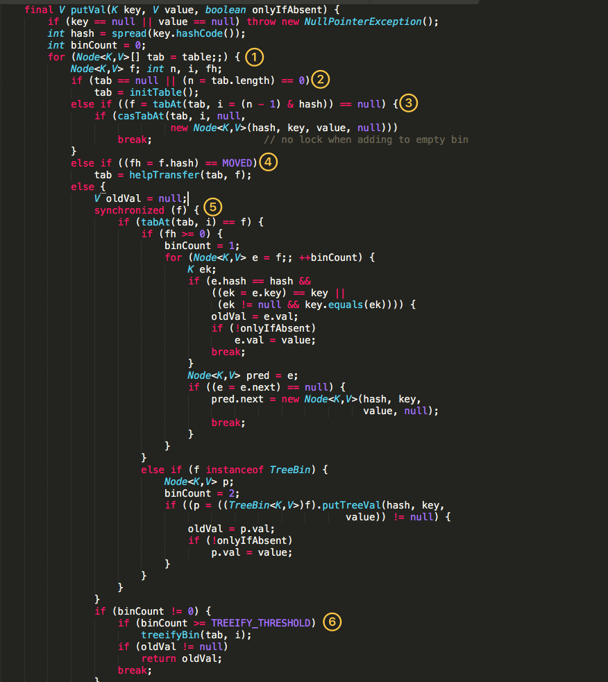

### HashMap

只有在添加元素才会开始初始化表。

new HashMap<>(int) // 传入的为map容量。实际大小为实际容量*负载因子取整

链表长度大于8，链表转成红黑树。删除数据时，红黑树节点过少时转成链表（在[2,6]范围内，具体要看红黑树结构），或者在扩容rehash时新树节点小于等于6转成链表

默认遇到重复键值，value更新

jdk8相对于jdk7变化

- 引入了红黑树，对于长链表查询效率更高
- 在resize时，链表依然按照顺序分配，不再翻转分配（jdk7链表逆序分配，并发使用时可能产生死循环）

### LinkedHashMap

继承自HashMap，同样也复用hashmap的数组+链表结构，只是新增了一条链表，来表示顺序。新增的节点都放到链表末尾

accessOrder: true表示访问列表为访问数据，false表示列表为插入顺序

put() 使用hashMap put方法

当表示访问顺序时，最新的访问的节点移至链表末尾

遍历时，从链表头开始遍历

### ThreadLocal

java.lang.ThreadLocal

ThreadLocal提供的线程的局部变量，其他线程不可访问。可能方便存取变量

实际上，ThreadLocal不保存任何属性，而是通过Thread中threadLocals保存线程的变量，threadLocal是ThreadLocalMap类

```java
static class ThreadLocalMap {
  static class Entry extends WeakReference<ThreadLocal<?>> {
    Object value;
    Entry(ThreadLocal<?> k, Object v) {
      super(k);
      value = v;
    }
  }
  // 变量表
  private Entry[] table;
  // map实际保存变量个数
  private int size = 0;
 	// map容量，当实际大小超过该容量时需要扩容
  private int threshold;
}
```

ThreadLocalMap包含实体组数，key为ThreadLocal变量，value为需要存储的对象，结构图如下


**内存泄露**

当ThreadLocal的直接引用被回收后，仍存在Entry的key引用，Entry的生命周期和Thread生命周期一样，若key为强引用，Thread为回收key则ThreadLocal就无法回收，造成内存泄露

所以key设计为弱引用，当ThreadLocal的直接引用被回收，仅存在key的弱引用，在下次gc的时候，ThreadLocal就会被回收。当引用key被回收后，ThreadLocal可以通过remove， get，set来回收key=null的Entry。

> jvm是按照对象来回收的，当对象不存在强引用后，就会进行回收

当线程退出后，线程ThreadLocalMap会被回收

注意使用ThreadLocal变量时，如果使用后未remove，可能产生很多问题

1. 当使用线程池时，线程循环使用，ThreadLocal不remove就不会丢
2. 内存泄露，Entry不能及时被清理

**在使用完ThreadLocal后及时remove**

## JUC

### Condition？

### ConcurrentHashMap

Jdk1.7和jdk1.8实现不同

#### jdk1.7

https://crossoverjie.top/2018/07/23/java-senior/ConcurrentHashMap/


ConcurrentHashMap结构，分为多个segment段，每个段类都一个HashEntry[]数组，类似于一个hashMap，各个段之间互不干扰

核心成员变量

```
/**
 * Segment 数组，存放数据时首先需要定位到具体的 Segment 中。
 */
final Segment<K,V>[] segments;

transient Set<K> keySet;
transient Set<Map.Entry<K,V>> entrySet;
```

```java
// 段是ConcurrentHashMap内部类
static final class Segment<K,V> extends ReentrantLock implements Serializable {
       private static final long serialVersionUID = 2249069246763182397L;
       
       // 和 HashMap 中的 HashEntry 作用一样，真正存放数据的桶
       transient volatile HashEntry<K,V>[] table;
       transient int count;
       transient int modCount;
       transient int threshold;
       final float loadFactor;      
}

static final class HashEntry<K,V> {
        final int hash;
        final K key;
        volatile V value;
        volatile HashEntry<K,V> next;
}
```

put方法

1. 通过key定位到Segment
2. 获取Segment的锁。第一步先尝试通过tryLock非公平锁方式CAS获取锁，若失败超过一定次数则lock阻塞获取锁

get方法不加锁

#### jdk1.8


结构类似于HashMap

put方法如下。键或值为空时抛出NPE



1. 遍历表
2. 表为空则进行初始化
3. 若当前桶未初始化，则通过cas进行初始化
4. 当hash=MOVED=-1时，需要进行扩容
5. 获取表头锁
6. 当链表数量大于8则转成红黑树

get方法，无需加锁。可以通过hash<0来识别map正在扩容，需要到nextTable查询结果

扩容

https://www.cnblogs.com/sanzao/p/10792546.html

- 扩容可以并发执行，当进行扩容时标记map为扩容。后续put操作可以帮助扩容

Jdk1.8相对于jdk1.7改动

- 引入了红黑树，提高查询效率
- 摒弃了段的概念，结构更像hashMap，直接锁定单个hash桶，锁粒度更小
- 加锁时直接使用synchronized（可能适用于并发度较高的场景）
- 扩容时将任务拆分，使用多线程并发执行加快扩容
- 获取map大小，引入计数器概念（CounterCell数组）直接无锁获取。而jdk1.7需要对所有段加锁

## 线程池

### FixedThreadPool

```java
Executors.newFixedThreadPool(10);
new ThreadPoolExecutor(nThreads,nThreads,0L, TimeUnit.MillSeconds, new LinkedBlockingQueue<Runnable>());
```

固定大小的线程池。核心线程数等于最大线程数，使用无界阻塞队列，线程不会过期

### SingleThreadPool

```java
Executors.newSingleThreadPool();
new ThreadPoolExecutor(1, 1,0L, TimeUnit.MILLISECONDS,new LinkedBlockingQueue<Runnable>());
```

和固定大小线程池相似，只有一个核心线程

### CachedThreadPool

```java
Executors.newCachedThreadPool();
new ThreadPoolExecutor(0, Integer.MAX_VALUE,60L, TimeUnit.SECONDS,new SynchronousQueue<Runnable>());
```

缓存线程池，无核心线程，当处理任务的线程不足会创建新线程。线程闲置超过60s则释放。当主线程提交任务的速率大于后台线程处理任务的速度，会不断地创建线程

SynchronousQueue：每个操作必须等待另一个线程的移除操作

缓存线程池的步骤

1. 首先执行SynchronousQueue.offer(Runnable task)。如果当前线程池中存在空闲线程正在执行SynchronousQueue.poll(keeyAliveTime, TimeUnit.NANOSECONDS)，则配对成功取出线程执行目标任务。否则跳至步骤2
2. 当线程池中无空闲线程，则创建一个新线程，执行目标任务
3. 线程执行完毕后，SynchronousQueue.poll(keeyAliveTime, TimeUnit.NANOSECONDS)。这个poll操作会让线程在SynchronousQueue中最多等待60s。若主线程提交了任务且与poll配对成功，取出线程执行；否则线程闲置超过60s，线程终止

### ForkJoinPool？

forkJoin提供了两个子类

- RecursiveAction：用于没有返回结果的任务
- RecursiveTask：用于有返回结果的任务

