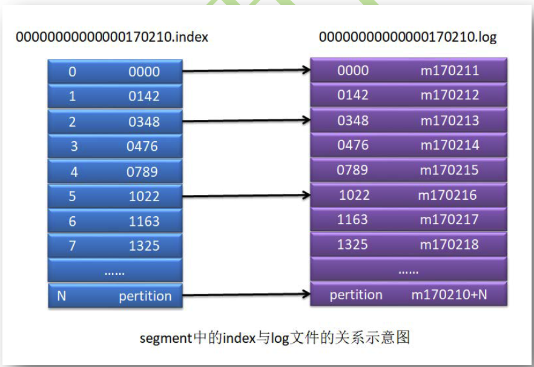

## get

- 消息分区，一个分区中有多个segment。消息分区有序，每个分区中的消息序号从1开始
- 消息序号需要由20位数字构成，大小为消息序号，一次递增1
- ISR
  - ISR in-sync replicas，副本同步列表
  - OSR outof-sync replicas，副本非同步列表（已死机器）
  - AR=ISR+OSR assigned replicas，所有副本列表。当挂掉的机器重启，能再次回到ISR中


**参考**

- https://www.bootwiki.com/apachekafka/apache-kafka-basic-operations.html

## 一、基础

### 1.1 概述

kafka是一个消息队列系统，吞吐量特别高，专门用于收集大数据、分析大数据。底层实现主要为scala

apache kafka是一个分布式发布-订阅消息系统和一个强大的队列，可以处理大量数据，能够将消息从一端传递给另一端，保证消息零丢失，非常适合离线和在线消费。为保证数据不丢失，kafka消息保存在磁盘中。kafka基于zookeeper完成节点间消息同步

### 1.2 相关角色

**Topic**

属于特定类别的消息流称为主题

**Partiton**

分区，每个主题有一个或多个分区

**Partition offset**

分区偏移量，每个消息都一个分区偏移量作为唯一表示

**Replicas of partition**

备份副本，不用来读或写，仅充当备份

**broker**

是kafka集群中的一个节点，即kafka主机。存档大量消息，消息保存在partition中

- 代理，是负责维护发布数据的简单系统。若一个主题存在N个代理和N个分区，则每个代理一个分区
- 若一个主题 存在的代理数大于分区数，则存在部分代理不负责分区；若代理数小于分区数，一个代理负责多个分区
- 为了broker负载均衡平均，partition数量应为broker数量的整数倍

**kafka cluster**

当存在多个代理时称为kafka集群。可以扩展集群，无需停机

**segment**

每个partition都分为多个大小相等的segment

**producer**

消息生产者，向代理发送消息

**consumer**

消息消费者，从代理处拉取消息。消息者通过消费偏移量来记录消费的位置

**partition leader**

每个partition都有多个副本，仅存在一个leader，负责分区消息读取和写入。所有的读写只能发生在leader上

**partition follower**

leader的追随者，当leader挂了follower变成leader。所有的follower都要从leader中同步消息

follower和leader是主备关系，而非主从

**zookeeper**

管理和协调代理。存储着主题、代理、消费偏移量等信息

**broker controller**

kafka集群的多个broker中，会选举一个称为broker controller，负责管理整个集群partition和副本replicas的状态

- leader是由broker controller选举出来的
- broker controller是由zookeeper选举出来的。优先选择启动的broker

**offset**

消息偏移量，相当于分区第一条消息的偏移量，每个分区唯一，大小64位，表示序号而非长度

**offset commit**

当消费者拉取一批消息消费，在规定时间消费完成后会将消息的offset提交到broker

当消费者消费超时是不会提交的

**rebalance**

当partition发生变化后，会进行分区再分配，即rebalance。

当进行rebalance时，整个broker集群会存在一段不可用的时间，消费者无法读取消息

**__consumer_offset**

当消费者消费消息完成后，会向broker提交offset，而offset被封装成一种特殊的消息保存在主题的partition中，主题为__consumer_offset。该topic默认50个分区，这些partition中的offset的有效期为一天

consumer group消费的offset存放在指定分区，分区计算公式：Math.abs(groupID.hashCode()) % 50

**group coordination**

group coordination是运行在每个broker上的进程，负责管理offset偏移量和rebalance，同时管理着当前broker所有的消费者组

当消费者需要消费数据时，需要获取消费偏移量，此时并不是从__consumer_offset 的partition中获取，而是从缓存中获取

缓存中的偏移量怎么来？当消费者消费完毕提交offset，同时保存到coordination的缓存中，再提交到__consumer_offset的partition

### 1.3 发布-订阅流程

- 生产者向主题发送消息
- kafka存储代理存储主题消息
- 消费订阅主题，kafka将向消费者提供消费偏移量，保存在zookeeper
- 消费定时从代理中拉取消息
- 代理收到消息后推送给消费者
- 消费者收到消息并处理，完成后向kafka代理确认。代理更新消费偏移量

### 1.4 分区消费

一个分区最多分配给一个消费者，一旦分配完成多余的消息者将无法订阅消息

同一个消费者组的消费者订阅同一消息，将以共享模式消费

## 二、命令实战

```sh
# 启动zookeeper
bin/zookeeper-server-start.sh config/zookeeper.properties
# 启动kafka broker
bin/kafka-server-start.sh config/server.properties

# 创建topic。replication-factor:代理数量；partition：分区数量
bin/kafka-topics.sh --create --zookeeper localhost:2181 --replication-factor 1 --partitions 1 --topic topic-name

# 启动生产者。
bin/kafka-console-producer.sh --broker-list localhost:9092 --topic topic-name
# 启动消费者
bin/kafka-console-consumer.sh --zookeeper localhost:2181 —topic topic-name --from-beginning

# 配置多个代理，需修改config/server.properties。修改 broker.id, port, log.dirs

# 修改主题（修改主题分区数量）
bin/kafka-topics.sh —zookeeper localhost:2181 --alter --topic topic_name --partitions count
# 删除主题
bin/kafka-topics.sh --zookeeper localhost:2181 --delete --topic topic_name
```

## 三、kafka架构

### 3.1 HW机制

> LEO 表示分区中消息的实际有效最大偏移量（leader宕机恢复后，会重置LEO）

highWaterMark，高水位标记，表示consumer可消费的最大偏移量。当消息发送到partition后，需要leader同步给其他follower完成，修改HW后才能被消费

HW为所有leader和follower的最小的偏移量（木桶效应），当消息保存到leader中后，leader同步给其他的follower，当所有分区的消费偏移量都增加了，才会增加HW

**HW截断**

当leader宕机了，选举一个follower称为新leader。新leader接收新消息，当原leader恢复后变为新leader的follower，复制数据。LEO重置，更新为老的HW，从新leader复制消息。这样可能造成老leader中 HW - LEO的数据丢失，使用ack=-1模式可以避免这种情况

### 3.2 消息发送的可靠机制

消息发送后返回ack，存在以下三种取值，可配置ack的值。消息发送失败producer会重发

1. ack=0，异步发送，生产者发送给kafka之后，不需要kafka反馈。效率最高，很可能丢失数据
2. ack=1，同步发送，生产者发送消息给kafka之后，broker中的partition leader接收后立即返回ack，不管处理结果如何。可能leader保存失败或宕机等会产生数据丢失
3. ack=-1，等同于all。同步发送，生产者发送消息给kafka之后，需要等到ISR中所有的副本都同步消息完成后，才返回ack。

> ack=-1的情况能否保证消息百分百发送成功？
>
> 不能，producer发送消息是批量发送的，先将需要发送的消息保存到缓存中，当达到一定数量再发送消息给kafka。如果发送消息时缓存已满，则无法发送消息，不过这种情况再发送者端就能感知到。

### 3.3 Partition leader选举范围

当leader挂了之后，会直接从ISR中选举一个follower。当ISR中没有follower怎么办？通过unclear.leader.election.enable的取值来限定leader的选举返回

- false，只能从ISR中选举。该策略可靠性高，可用性低
- true，默认，在ISR中没有副本的情况下可以选择该topic任意一个follower称为新leader（OSR），但是选出的新leader很可能存在问题，无法与其他的follower连接导致的单点问题。该策略可靠性低，可用性高

### 3.4 重复消息问题

#### 3.4.1 批量消费超时

consumer批量消费，当消费超时后，这批数据会重新消费导致重复消息。

解决方案:

1. 增加消费超时时间
2. 减少消费批次数量
3. 手动提交消费偏移量

#### 3.4.2 不同consumer重复消费

当一个消费者消费完成后未提交消费偏移量便宕机，分区重新分配给其他消费者后，会造成已消费但未提交的那批数据重复消息

解决方案：无法避免只能较少重复消费数据，比如手动提交消费偏移量或修改消费批次数量

### 3.5 消息路由策略

通过API发送消息时，生产者是以Record为消息发送的，包括key和value，key用于partition分区

- 当指定了partiton，直接写入到指定partition
- 当未指定partition，指定了key，通过对key取hashcode再与partition的数量取模，生成分区索引
- 当partition和key都未指定，则通过轮询选择一个partition

### 3.6 消息写入算法

1. producer向broker提交连接请求，其任意连接上的broker都会向其回应broker controller的地址
2. producer发送指定topic的消息，首先请求broker controller获取topic的partition leader地址。broker controller 请求zk获取partition leader 地址，返回给producer
3. producer向partition leader 发送指定topic消息
4. partition leader接收消息后写入本地log，并通知ISR的follower
5. ISR中的follower从leader同步消息后向leader发送ack
6. partition leader 收到ISR中所有follower的ack之后，更新HW，回复producer ack
7. 当leader等待follower的ack消息超时后，会将follower从ISR中移除，再更新HW

### 3.7 消费者消费消息解析过程

1. consumer向broker集群提交连接请求，其任意连接上的broker都向其回应broker controller地址
2. 当consumer提交了指定消费的topic，会向broker controller提交poll请求
3. broker controller会为consumer分配一个或多个partition leader，并将offset发送给consumer
4. consumer会按照broker controller分配的partition消费消息
5. consumer消费完成向broke发送offset
6. broker接到offset之后，将offset保存至__consumer_offset中
7. 以上消息消费过程重复执行，直至无消息消费。consumer可以重置offset

## 四、面试题

**4.1 描述broker、topic、partition和segment的关系**

**4.2 kafka中segment的文件分为两类，.log和.index文件，这两种文件的关系**

.index索引文件，.log日志文件，记录一一对应



**4.3 怎么分配partition和broker的数量**

**4.4 consumer与partition的对应关系**

**4.5 一个partition只能被一个consumer消费，设计的优劣**

方便offset管理。无法保证消费的平均性，因为partition的的存放本就不是平均的

**4.6 rebalance**

当消费者数量或分区数量发送变化，需要进行分区重新分配，该过程称为rebalance。

在均衡期间消费者无法读取消息，导致broker集群有一小段时间不可用，应尽量避免负载均衡

**4.7 消费者消息消费完成提交offset，该offset保存在哪里**

老版本的kafka是保存在zookeeper中，但zk不适合频繁的读写操作。新版本保存在指定主题__consumer_offset中。

**4.8 partition中的leader和follower是主从还是主备关系**

主备关系，只有leader提供服务。

**4.9 broker controller和partition leader由什么选举出来的**

**4.10 HW机制和HW截断**

**4.11 如何保证消息发送的可靠性**

**4.12 当partition leader挂了之后，如何进行选举**

**4.13 当leader挂了之后，开启从任何副本中选取一个副本，可能会丢失大量的消息，为什么？**

**4.14 当设置ack=-1时，可能会造成重复消费，为什么**

**4.15 重复消费的几种场景**