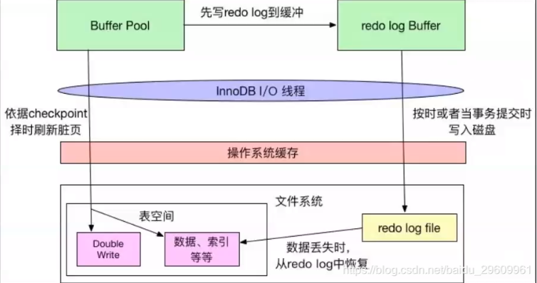

[TOC]

### 前置问题

1. mysql RR隔离级别可以解决幻读中的插入数据问题，但仍然能读取到删除的数据。解决幻读是通过间隙锁来实现的吗？那么读取的时候是不是不能在间隙锁之间插入数据？ 

   不是，利用MVCC机制，readView保存活跃事务。可以

2. 对于组合索引(a,b,c)，若c = 3 and b = 2 and a = 1是否会使用索引？会，mysql会对自动优化sql顺序

3. 使用in时会不会用到索引？当in中包含多个元素时，表中数据量小时，in集合中的元素占比总数据量比率小时会用到索引，较大不会用到索引；当表中数据量比较大时，in都会用到索引

4. 使用or会不会用到索引？主键索引会用到，非主键索引需要看in集合数量/总数量，若比率小于等于指定值（约0.18）则使用索引，否则不使用索引

5. unlock tables; 释放锁

6. 死锁的情况，相互等待

#### 锁

1. 表级读写锁；元数据锁（查询时添加，添加后无法修改表结构）；插入意向锁
2. 表级意向锁（为了快速检索表中是否存在X/S锁，应该是信号量方法实现）
3. 临键锁（Next-key）为记录锁+间隙锁，左开右闭
4. RR级别：主键索引命中加记录锁；未命中加间隙锁；范围查询命中加临键锁，未命中加间隙锁
5. RR级别：辅助索引命中，对辅助索引和主键加记录锁，以及辅助索引命中记录两侧加间隙锁；未命中添加间隙锁；范围查询未命中加间隙锁，命中加临键锁，命中的记录加记录锁
6. RR级别：非索引添加所有记录锁和间隙锁，相当于表级锁

#### sql优化

1. union收集所有结果后去重。union all直接收集结果，不去重
2. 隐式转换也可能会使用索引，如果转换足够简单的话

## 总结

### 问题

1. binlog日志刷新到磁盘的时间？

> 每次事务提交就刷新？或者仅依赖于checkpoint机制
>
> 答：在每事务提交时刷新到磁盘。通过sync_binlog控制每提交几次事务刷新到binlog文件一次

2. redo loge文件格式，保存的是什么内容？

答：保存修改后数据，即物理日志。


### mysql 忘记密码

```sh
# step1. 停止mysql；还有start restart
sudo /usr/local/mysql/support-files/mysql.server stop
# step2. 跳过登录服务
/usr/local/mysql/bin/mysqld_safe --skip-grant-tables
# step3. 无需密码登录
mysql -uroot -p
# step4. 刷新权限
mysql>flush privileges;
# step5. 设置新密码。成功
mysql>set password for 'root'@'localhost'=password('新密码');
# step6. 关闭跳过登录的程序，--skip-grant-tables。用新密码登录
```


## 一、逻辑架构图


### 1 Connectors

连接器，指不同语言与sql的交互

### 2 Management Services & Utilities

系统管理和控制工具

### 3 Connection Pool 连接池

- 管理用户连接，等待处理连接请求
- 负责接收Mysql Server的各种请求，接收连接请求，转发所有连接到线程管理模块。为每个连接都分配一个线程处理
- 负责Mysql Server与客户端的通信。接收客户端的请求，传递Server端的结果信息等。线程管理模块负责线程的维护，创建和销毁等

### 4 SQL Interface：sql接口

接收客户端的命令，返回执行的结果。比如select from就是调用sql interface

### 5 Parser 解析器

sql命令传递到解析器会被验证和解析

主要功能

a. 将sql语句进行词法分析和语法分析，生成语法树，然后根据不同的操作的类型记性进行后续操作

b. 如果在分解过程中遇到错误，说明该sql就是不合法的

### 6 Optimizer 查询优化器

sql查询之前会进行查询优化。explain可以查看sql语句执行计划，进行分析

### 7 Cache和Buffer 查询缓存

将查询的结果添加到缓存中，后续查询若缓存中存在则直接返回。

若查询缓存有命中的缓存结果，直接从缓存中获取结果。缓存分为表缓存、记录缓存、key缓存、权限缓存等

### 8 Pluggable Storage Engines 存储引擎

存储引擎就是实现如何存储数据、查询数据、建立索引

存储引擎分类：

- Innodb：5.5版本之后默认引擎。功能强大，支持事务，行级锁。.frm 表定义文件；ibd 数据文件和索引文件
- Myisam：5.5版本之前默认引擎。不支持事务，表级锁。.frm 表定义文件；myd 数据文件；.myi 索引文件
- Memory：内存存储引擎，只保存数据结构到磁盘中。数据全量保存在内存中，一旦重启数据全部丢失
- CSV：以csv格式保存数据

> 查看存储引擎
>
> mysql> show engines;

InnoDB与Myisam区别

- innodb支持事务，外键，myisam不支持
- innodb支持行级锁，myisam不支持
- innodb每次统计数据行数时(count(*))需要查询数据，myisam不需要（不能携带条件）
- innodb数据和索引存放在同一个文件，myisam存在在两个文件
- mysql5.5之前默认Myisam，之后默认Innodb

## 二、环境说明

### 1 文件结构

#### 1.1 日志文件（顺序IO）

mysql通过日志记录了数据库操作日志和错误信息。常见有操作日志、错误日志、慢查询日志、事务redo日志、中继日志等

```mysql
mysql> show variables liek 'log_%';
```

**a.错误日志**

默认开启，5.5.7版本之后无法关闭。日志文件名 hostname.err

**b.二进制日志**

默认是关闭的。需要配置 log-bin=mysql-bin开启

binlog记录了数据中所有的DDL和DML语句，不记录select语句。**对于DDL语句，直接记录到binlog日志中；对于DML语句，必须在事务提交后才能记录到binlog日志**

binlog日志主要用来主从复制、数据备份、数据恢复

```mysql
mysql> show variables like '%log_bin%';
+---------------------------------+---------------------------------------+
| Variable_name                   | Value                                 |
+---------------------------------+---------------------------------------+
| log_bin                         | ON                                    |
| log_bin_basename                | /usr/local/mysql/data/mysql-bin       |
| log_bin_index                   | /usr/local/mysql/data/mysql-bin.index |
| log_bin_trust_function_creators | OFF                                   |
| log_bin_use_v1_row_events       | OFF                                   |
| sql_log_bin                     | ON                                    |
+---------------------------------+---------------------------------------+
6 rows in set (0.00 sec)
```

**c.通用查询日志**

默认关闭，记录所有的增删改查操作，不建议开启

```sh
mysql> show variables like '%general%';
+------------------+---------------------------------+
| Variable_name    | Value                           |
+------------------+---------------------------------+
| general_log      | OFF                             |
| general_log_file | /usr/local/mysql/data/bogon.log |
+------------------+---------------------------------+
2 rows in set (0.00 sec)
```

**d. 慢查询日志**

默认关闭，用来记录慢查询

```sh
# 开启慢查询日志
slow_query_log=ON
# 慢查询阙值，单位秒
long_query_time=10
# 日志文件路径
slow_query_log_file=file_name
```

#### 1.2 数据文件（随机IO）

```mysql
mysql> show variables like '%datadir%';
+---------------+------------------------+
| Variable_name | Value                  |
+---------------+------------------------+
| datadir       | /usr/local/mysql/data/ |
+---------------+------------------------+
1 row in set (0.00 sec)
```

**Innodb数据文件**

- .frm：存储表结构信息
- .ibd：使用独享表空间存储表数据和索引，一张表对应一个ibd文件
- ibdata文件：使用共享表空间存储表数据和索引，所有表或多个共享一个文件

**Myisam数据文件**

- .frm：存储表结构信息
- .myd文件：主要用来存储数据
- .myi文件：主要用来存储索引

## 三、MysqlServe层

### 1 sql执行流程


### 2 连接器

连接数据库

```sh
mysql -h{ip} -P{port} -u{usename} -D{database} -p{password}
```

查询当前数据的连接状态

```mysql
mysql> show processlist;
+-----+------+-----------------+--------+---------+------+----------+------------------+
| Id  | User | Host            | db     | Command | Time | State    | Info             |
+-----+------+-----------------+--------+---------+------+----------+------------------+
| 206 | root | localhost:51955 | test   | Sleep   | 1764 |          | NULL             |
| 208 | root | localhost:52027 | test   | Sleep   | 1737 |          | NULL             |
| 209 | root | localhost:52034 | test   | Sleep   | 1735 |          | NULL             |
| 210 | root | localhost:52035 | test   | Sleep   | 1734 |          | NULL             |
| 211 | root | localhost:52051 | test   | Sleep   | 1729 |          | NULL             |
| 212 | root | localhost:52089 | test   | Sleep   | 1715 |          | NULL             |
| 213 | root | localhost:52173 | test   | Sleep   | 1683 |          | NULL             |
| 214 | root | localhost:52446 | test   | Sleep   | 1630 |          | NULL             |
| 215 | root | localhost:52532 | test   | Sleep   | 1599 |          | NULL             |
| 216 | root | localhost       | sakila | Query   |    0 | starting | show processlist |
| 217 | root | localhost:56706 | test   | Sleep   |    2 |          | NULL             |
+-----+------+-----------------+--------+---------+------+----------+------------------+
11 rows in set (0.00 sec)
```

创建连接后，若一定时间内没有操作（由参数wait_timeout控制，单位秒，默认8小时），连接自动断开

长连接值连接成功，客户端继续持有连接操作，则一直使用同一连接。短连接为使用完后就断开连接，下次重新建立，建立比较复杂，尽量使用长连接

长连接全部使用完成后，有时候mysql的内存上涨的特别快，因为mysql执行过程中临时使用的内存是保存在连接对象里的，只要连接断开才会释放。

如何解决清理长连接问题

1. 定期断开长连接。或者使用一段时间后，若执行过一个较大的操作，断开连接
2. mysql5.7版本，每个执行一个较大操作后，通过`mysql_reset_connection`来初始化连接资源，该过程不需要重连和重新鉴权，但是会将连接恢复到最初创建的状态

### 3 查询缓存

当执行查询语句时，会先从缓存中查询一次，若命中缓存直接返回；若未命中再执行下面操作查询，后续将查询结果保存在缓存中

缓存往往弊大于利：查询缓存失效的非常频繁，在更新数据之后便失效。反而再每次查询还赠加了查询缓存的操作。在mysql8已经移除了查询缓存

mysql可以设置指定语句开启查询缓存，将参数 `query_cache_type`设置为DEMAND，这样默认的sql不使用查询缓存，通过 select sql_cache 指定语句使用查询缓存。通过属性Qcache_hits (status)查看缓存命中次数

```sh
mysql> select sql_cache * from actor where actor_id  = 1;
+----------+------------+-----------+---------------------+
| actor_id | first_name | last_name | last_update         |
+----------+------------+-----------+---------------------+
|        1 | PENELOPE   | GUINESS   | 2006-02-15 04:34:33 |
+----------+------------+-----------+---------------------+
1 row in set, 1 warning (0.00 sec)

mysql> show status like '%Qcache%';
+-------------------------+---------+
| Variable_name           | Value   |
+-------------------------+---------+
| Qcache_free_blocks      | 1       |
| Qcache_free_memory      | 1030296 |
| Qcache_hits             | 0       |
| Qcache_inserts          | 1       |
| Qcache_lowmem_prunes    | 0       |
| Qcache_not_cached       | 1       |
| Qcache_queries_in_cache | 1       |
| Qcache_total_blocks     | 4       |
+-------------------------+---------+
8 rows in set (0.00 sec)

mysql> select sql_cache * from actor where actor_id  = 1;
+----------+------------+-----------+---------------------+
| actor_id | first_name | last_name | last_update         |
+----------+------------+-----------+---------------------+
|        1 | PENELOPE   | GUINESS   | 2006-02-15 04:34:33 |
+----------+------------+-----------+---------------------+
1 row in set, 1 warning (0.00 sec)

mysql> show status like '%Qcache%';
+-------------------------+---------+
| Variable_name           | Value   |
+-------------------------+---------+
| Qcache_free_blocks      | 1       |
| Qcache_free_memory      | 1030296 |
| Qcache_hits             | 1       |
| Qcache_inserts          | 1       |
| Qcache_lowmem_prunes    | 0       |
| Qcache_not_cached       | 1       |
| Qcache_queries_in_cache | 1       |
| Qcache_total_blocks     | 4       |
+-------------------------+---------+
8 rows in set (0.00 sec)
```

> 第一次查询缓存未命中，将结果缓存；第二次查询命中缓存。Qcache_hits表示查询命中次数

**清空查询缓存**

1. flush query cache // 清理查询缓存内存碎片
2. reset query cache // 清除查询缓存
3. flush tables // 关闭所有打开的表，同时清空查询缓存

### 4. 分析器

1. 词法分析，将sql分割多个字符串。比如关键字select from 等
2. 语法分析，根据词法分析的结果进行语法分析。
3. 若语法分析成功，生成解析树
4. 预处理器对解析树进行合法校验，如表是否存在，列是否存在等，校验用户是否有表的操作权限

### 5. 优化器

在sql执行前进行优化。通过explain命名查看sql执行过程

优化处理

1. 若存在多个索引，决定使用哪个索引
2. 若存在多个表的关联查询，决定各个表的连接顺序（小表优先）

### 6. 执行器

执行优化后的sql语句，执行步骤如下

1. 判断用户是否有权限执行，无权限结束
2. 如果有权限使用指定的存储引擎开始执行

## 四、InnoDB存储引擎

> 存储引擎是表结构的，一个数据库中可能存在多种存储引擎的表

innodb主要由内存池、磁盘文件、后台线程组成

### 1 InnoDB磁盘文件

InnoDB磁盘文件分为三大类：系统表空间、用户表空间、redolog日志文件及其归档文件

二进制文件是维护在Mysql Server层的

#### 1.1 系统表空间和用户表空间


**系统表空间存储那些数据？**

系统表空间是一个共享空间，被多个表共享。

系统表空间包含InnoDB数据字典（元数据及相关对象）、double write buffer、change buffer、undo logs的存储区域

系统表空间默认包含用户在系统表空间创建的数据和索引

**系统表空间配置解析**

系统表空间由一个或多个数据文件组成。默认一个初始大小10M，名为ibdata1的系统数据文件保存。用户可以用`innodb_data_file_path`对数据文件大小和数量进行配置

innodb_data_file_path为：innodb_data_file_path=datafile1[,datafile2]...

```mysql
mysql> show variables like 'innodb_data_file_path';
+-----------------------+------------------------+
| Variable_name         | Value                  |
+-----------------------+------------------------+
| innodb_data_file_path | ibdata1:12M:autoextend |
+-----------------------+------------------------+
# autoextend 可自动扩展
```

**使用用户表空间**

通过设置`innodb_file_per_table`来指定每个表创建一个独立的用户表空间，命名：表名.ibd。

通过这种方式，用户不会将所有数据保存在系统表空间中

```mysql
mysql> show variables like 'innodb_file_per_table';
+-----------------------+-------+
| Variable_name         | Value |
+-----------------------+-------+
| innodb_file_per_table | ON    |
+-----------------------+-------+
```

#### 1.2 重做日志文件

**重做日志文件**

在InnoDB数据目录存在两个重做日志文件 `ib_logfile0`和`ib_logfile1`文件，记录存储引擎的事务日志

**重做日志的作用**

用于备份，数据恢复。为提升高可用性，可以设置多个镜像日志组，将重做日志保存在不同机器上

**重做日志组如何写入数据**

InnoDB存储引擎至少有一个重做日志组，每个重做日志组至少有两个重做日志文件。

> 在日志组中的每个重做日志文件大小一致
>
> InnoDB存储引擎以循环写入的方式写数据，先写重做日志文件1，满了之后再写重做日志文件2。经过一次循环之后，又写重做日志文件1

**设置重做日志文件大小**

可以通过设置`innodb_log_file_size`来设置重做日志文件大小，但其大小设置对性能影响较大

- 若文件设置过小，会导致依据checkpoint的检查需要频繁刷新脏页到磁盘中，产生大量IO
- 若文件设置过大，在数据丢失后恢复需要很长时间

```mysql
mysql> show variables like 'innodb_log_file%';
+---------------------------+----------+
| Variable_name             | Value    |
+---------------------------+----------+
| innodb_log_file_size      | 50331648 |
| innodb_log_files_in_group | 2        |
+---------------------------+----------+
```

#### 1.3 InnoDB存储结构

表存储结构分为五层：表空间、段、区、页、行


##### 1 表空间

从功能上看，表空间分为共享表空间、独占表空间、通用表空间、临时表空间、Undo表空间

若设置属性`innodb_file_per_table`为1，表示每个表的数据都会保存在一个单独的表空间中

##### 2 段

表空间有多个段组成，常见段有数据段、索引段、回滚段

一个段空间是随着表大小自动扩展的，表有多大，段就有多大

##### 3 区

一个区有64个的页组成，一个区大小1M=64页（每页16K）。为保证区中页的连续性，区扩展时会一次申请4-5个区

##### 4 页

每页默认16K，是InnoDB管理磁盘的最小单位。通过属性`innodb_page_size`控制页大小

索引树上的一个节点就是一页，当节点数据满了再插入时，会发生页分裂

操作系统管理磁盘的最小单位是页，也是操作系统读写磁盘的最小单位。

```sh
# Unix系统获取页大小，默认4K
>getconf PAGE_SIZE
```

> InnoDB存储引擎默认每页16K，操作系统默认每页4K，所以每次InnoDB从磁盘中获取一页时，操作系统会分4次从磁盘文件中读取数据到内存，写入也是分为4次

##### 5 行

InnoDB数据以行为单位存储，一页中存在多行

### 2 InnoDB存储结构

存储结果图如下


#### 2.1 Buffer Pool缓冲池

未解决磁盘与内存读写速度差问题，引入了缓冲。缓冲池中分为以下几种

##### 2.1.1 数据页和索引页

可能会用到的数据页和索引页，以page为最小单位将数据和索引加载在内存中

##### 2.1.2 更新缓冲（插入缓冲）

> insert buffer page（大概在5.7以后更新为change buffer）

在InnoDB存储引擎中，需要根据主键顺序插入。当存储辅助索引插入，辅助索引的顺序性无法保证，造成离散的访问索引页，导致插入性能下降

此时InnoDB存储引擎设计了channge buffer来进行插入优化，对于辅助索引的插入或更新，并非每一次都直接插入到索引页中，而是先保存在channge buffer再后续统一合并插入到索引页中。

##### 2.1.3 自适应哈希索引

InnoDB根据访问的频率和模式，建立热点页和哈希索引来提高查询效率。一般索引在B+树需要访问3，4次，而哈希索引仅一次

InnoDB会根据sql使用情况来自动判断是否需要建立hash索引，当满足以下三个条件会自动创建哈希索引

1. 索引被查询的次数足够多，若次数大于N（N>17）此过程无限制

2. 基于查询的语句建立hash索引，其中包含三部分

   1. 匹配索引的列数
   2. 下一列匹配的字节数
   3. 是否从左匹配

   例如select * from table1 where a = 1 and b = 2，则生成hash info (2,0,true)，使用的次数足够多（大于100次）

3. 生成的索引能够命中某个数据页，且页中命中的数量大于页总数量的1/16

可以通过参数`innodb_adaptive_hash_index`来设置禁用或启用此特性。默认ON开启

##### 2.1.4 锁信息

InnoDB存储引擎支持行级锁，为保证数据的完整性和一致性，有时候需要用到锁

##### 2.1.5 数据字典信息

InnoDB的表信息缓存，可称为表定义缓存或数据字典

其中包含表结构、表名、表字段、表格式、视图、索引等

#### 2.2 内存数据落盘



##### 2.2.1 整体思路分析

InnoDB内存缓冲池刷新到page完成持久化，一个是脏页落盘；一个是预写redo log

当缓冲池中的数据比磁盘中新时，需要将缓冲池中数据持久化。刷新存在两种机制 WAL 和force log at commit

- WAL 要求数据变更写入磁盘前，必须将内存中的日志写入磁盘中
- force log at commit 要求一个事务提交时，所有日志必须刷新到磁盘中。若机器发生宕机可以利用日志恢复

在将缓冲中的日志刷新磁盘后，通过 fsync将缓冲数据刷新到磁盘中。

##### 2.2.2 脏页落盘

- 进行读取操作时，判断磁盘读取页是否存在缓冲池中，存在表示命中缓存直接读取；否则读取磁盘上的页
- 对数据库进行修改操作时，首先修改缓冲池中的页，再通过一定的频率刷新到磁盘中。通过checkPoint机制刷新到磁盘

##### 2.2.3 重做日志落盘

落盘策略，通过`innodb_flush_log_at_trx_commit`来控制

- 0：MYSQL每秒一次将log buffer中的数据写入到日志文件并同时fsync刷新到磁盘中。最多丢失1s的数据
- 1：每次事务提交时，将log buffer写入日志文件并同时fsync刷新到磁盘。默认，不会丢失数据
- 2：每次事务提交时，将log buffer写入日志文件缓冲，然后MYSQL以每秒一次将日志文件缓冲中数据同步到磁盘中。若机器发生故障，日志文件意外丢失则可能丢失1s的数据

> fsync是阻塞的，直到完成之后才能返回

#### 2.3 checkPoint检查点机制

当数据发生故障恢复时，需要依赖redo日志文件恢复，并不需要恢复全量日志，checkPoint记录了上次的刷盘的位置，直接执行checkPoint恢复未刷盘的数据。当缓冲池不够用或重做日志不可用且不能覆盖时，需要强制执行checkPoint进行数据刷盘

> 脏页：缓冲池中存在但磁盘中不存在的数据。遇到脏页需要淘汰时，必须强制执行checkPoint

checkPoint分类

**sharp checkpoint**

在数据库关闭时，将buffer pool中所有的数据刷新到磁盘中

**负重fuzzy checkpoint**

在数据库正常运行时，将不同脏页在不同实际刷新到磁盘，避免全量刷新因其性能问题。存在以下几种策略

1. Master Thread Checkpoint：在Master thread中以10s一次的频率将部分脏页从内存中刷新到磁盘中。该操作时也异步的，不阻塞数据库其他操作
2. FLUSH_LRU_LIST checkpoint：在单独的page cleaner线程中执行。通过LRU机制清理数据，当清理的页是脏页时需要执行落盘
3. ASYNC/SYNC Flush Checkpoint：在单独的page cleaner线程执行。当重做日志满了，将脏页刷新到磁盘。当未落盘的内容小于75%则无需落盘；若大于75%小于90%进行异步落盘；若大于90%进行同步落盘。在mysql5.6之后，无论同步还是异步落盘都不会阻塞数据库的操作
4. Dirty Page too much：由Master Thread线程1s一次执行，当脏页过多，超过变量`innodb_max_dirty_pages_pct`，则进行刷盘。默认75%

#### 2.4 Double Write

当将缓冲池的脏页刷新到磁盘时，并非直接刷新。而是先将数据刷新到Double write buffer中，double write buffer再同时同步到 doubleWrite空间和磁盘数据文件中。doubleWrite空间用作备份，后续恢复可以使用

> redo log日志不足以恢复吗？
>
> 一般情况时可以直接拿redo log日志恢复的，但是如果出现redo log复制页时只复制的一半，机器宕机，页只复制一半导致页不可用，数据丢失。且redo log中只记录了修改的数据，而非记录数据页的完整内容

#### 2.5 redo log buffer 重做日志缓冲

通过`innodb_flush_log_at_tx_commit`控制落盘策略，参考2.2.3

### 3 落盘流程图


## 五、事务

### 1 一条insert语句执行流程


1. 索引加意向锁，指定是针对唯一索引加锁，若出现多条相同的唯一索引字段插入，其他sql只能等待，若执行的sql回滚，执行其他插入语句；若执行的sql成功，其他插入语句报错
2. undo log：用于事务回滚
3. 先写undo log的redo log ，再写undo log，再写变更记录的redo log。若事务执行过程中mysql崩溃了，恢复时需要通过redo log恢复undo log，以恢复事务

### 2. 事务介绍

#### 2.1 事务概述

数据库事务四大特性 ACID

- 原子性（automic）：整个事务是原子的不可拆分，要么全部提交，要么全部不提交
- 一致性（consistent）：事务的开始到结束后，数据库的完整性不会被破坏。数据库的完整性包括：实体完整性（如行的主键存在且唯一）、列完整性（如字段的类型、长度、大小符合要求）、外键约束、用户自定义完整性（转账之后总金额不变）
- 隔离性（isolation）：事务之间是相互隔离的，不同事务之间互不影响。存在四种隔离级别
- 持久性（durability）：事务一旦提交，对数据库造成的影响就是永久性的

#### 2.2 隔离级别

存在四种隔离级别，由变量`tx_isolation`或`transaction_isolation`控制

##### 2.2.1 未提交读（READ UNCOMMITTED）

该模式下事务可以读到其他事务未提交的数据。也称为脏读

##### 2.2.2 已提交读（READ COMMITTED）

该模式下可以解决脏读，但可能出现重复读

##### 2.2.3 可重复读（REPEATABLE READ）

该模式下可以解决脏读和重复读，但不能解决幻读

##### 2.2.4 串行化（SERIALIZABLE）

对所有操作都进行加行锁，读加共享锁，写加排他锁。可解决脏读、重复读、幻读

隔离级别通过`transaction_isolation`变量控制

> SERIALIZABLE读添加的锁不是共享锁？SERIALIZABLE一般读添加的锁：写锁不阻塞一般读，一般读阻塞写
>
> 都在SERIALIZABLE级别下，当一个事务添加写锁时，另一个事务不加锁读不阻塞；但是一个进行一般读时，另一个进行写阻塞

XA事务

```mysql
# 开启xa事务
xa start 'test001';
select * from user where id = 1 for update ;
# xa事务结束
xa end 'test001';
# xa事务预提交
xa prepare 'test001';
# 等待
select sleep(100);
# xa事务最终提交
xa commit 'test001';
```

### 3 事务和MVCC底层原理

> 问题：当银行需要统计两个账户的总存款金额时，同时这两个账户又在进行转账交易，可能存在统计多了或少了的情况

#### 3.1 LBCC

基于锁的并发控制（LOCK BASE Concurrency Control），对于更新操作，增加记录锁，多个事务修改记录需要先获取锁，若锁已被占有需要等待。

对于上述问题，在统计的时候添加共享锁，等待全部数据统计完成再释放，可以保证统计的数据正常。但是加锁期间不能对数据进行修改，客户体验差

#### 3.2 MVCC

多版本并发控制（Multi Version Concurrency Control），为每条记录新增事务版本号和回滚版本号，使用多版本的方式来避免一些列完整性问题。

对于上述问题，统计相当于读取的是快照版本，用户之间可以随意进行交易，仍能保证的数据正常。

在每条记录新增隐藏字段创建版本号和删除版本号，当进行以下操作时。假设当前事务版本号为x

1. 读取：开启隐藏事务，读取创建版本号小于等于x，删除版本号大于x或为null的数据
2. 插入：新增数据时，设置创建版本号为x，删除版本号为null
3. 更新：先插入新数据，后删除。
4. 删除：设置删除版本号为x。

### 4 InnoDB的MVCC实现

MVCC指一种高并发的技术，读无需加任何锁，InnoDB的MVCC的实现依赖：隐藏字段，ReadView，undo log

#### 4.1 当前读和快照读

当前读：读取的数据为最新数据，读取时对数据添加锁，数据不能被修改。更新、删除操作使用

快照读：读取的快照版本，不加锁。查询使用

#### 4.2 一致性的非锁定读

mvcc在mysql中实现依赖的是undo log与read view

#### 4.3 回滚段undo log

undo log指的是为回滚记录的日志。回滚段分为插入回滚段和更新回滚段。

- insert undo log：在插入操作中产生的，只对当前事务可见，事务提交后可以直接删除而不需要依赖purge清除
- update undo log：指在更新或删除时生成的，数据删除之后并非直接删除，而是先放至undo log链表中，等待purge线程清理

> 事务回滚，应该执行sql的逆向操作（undo会存储逆向操作的sql，insert提交后应该就是删除这部分内容），恢复原有数据和索引。先回滚二级索引，再回滚聚集索引。

undo log理解应该至少有两种，一种是逻辑的日志，如下面的insert/update undo log，用于回滚；一种history list，指行记录的历史版本

##### 4.3.1 insert undo log


insert undo log记录如上，带*号表示对存储的字段进行了压缩

- next：记录了一下undo log的位置，通过该字段可以知道下一个undo log所占的空间字节数
- start：记录该undo log的开始位置
- type_cmpl：占用一字节，记录undo的类型。insert undo log类型存储的总是11
- undo no：记录事务的id
- table id：记录undo log对应的表对象id
- lenN colN：记录了本次操作所有新增的主键的列和值，当需要进行回滚时，根据主键找到对应的记录删除即可

> insert undo log比较好理解，正对一个事务操作的一张表，记录了插入的主键的列和值。len-唯一键名，col-值。需要回滚时只需根据唯一键值查询原数据再删除即可。

##### 4.3.2 update undo log


- DATA_TRX_ID：旧记录的事务id
- DATA_ROLL_PTR：旧记录的回滚段指针
- undate vector：表示因update操作导致发生改变的列，每个修改的列信息都要记录在undo log中
- type_cmpl：undate undo log类型
  - 12 TRX_UNDO_UPD_EXIST_REC：更新未被删除的记录
  - 13 TRX_UNDO_UPD_DEL_REC：更新一条已被删除的记录，列值可被修改；在innodb中时允许的，比如某条记录删除后，很快插入相同键值的记录，之前的记录还未被purge，就可能重用该记录的位置。将delete的记录标记为not DELETE
  - 14 TRX_UNDO_UPD_MARK_REC：将就标记为delete
- info_bits : 取自rec_get_info_bits，例如记录是否被标记删除

> undate undo log是针对一个事务下一个表的一个DML操作。
>
> n_unique_index表示唯一键列和值
>
> n_update_field表示旧表的数据
>
> n_bytes_below表示新表数据

##### 4.3.3 崩溃恢复

当实例从崩溃恢复时，需要将活跃的事务从undo中提取出来，对于ACTIVE的直接回滚；对于prepare的事务，如果该事务对应的binlog已经提交，则提交，否则回滚

**回滚实现**

先根据redo重做undo，读取其状态和类型等信息，创建内存结构，并存到每个回滚段上的undo list上

当初始化完成undo对象后，据此来恢复崩溃之前的事务链。根据回滚段的insert_undo_list来恢复插入事务，根据回滚段的update_undo_list来恢复更新事务。若同时存在插入和更新事务，则只恢复一个事务。出了恢复事务对象外，还需要恢复表锁及读写事务链表，从而恢复到崩溃之前的场景

当从undo恢复到崩溃前活跃的事务对象后，后台开启一个线程去进行回滚和清理操作。对于ACTIVE状态事务直接回滚；对于即非ACTIVE也非PREPARE状态的事务，则认为它时提交的，直接释放事务对象；对于PREPARE事务，进入XA Recover阶段，Server会扫描最后一个binlog文件，搜索undo记录中的XID（MYSQL_BIN_LOG::recover），若对应的XID已经存在binlog中，则提交事务，否则回滚事务。

> 为何只扫描最后一个binlog，因为每次写下一个binlog文件时，就表示上一个文件已经落盘成功了

#### 4.4 行记录隐藏字段

经典参考（附带源码认证）：https://blog.csdn.net/Waves___/article/details/105295060

InnoDB存储的MVCC实现为每行记录新增了几个字段：DATA_TRX_ID、DATA_ROLL_PTR、DB_ROW_ID（当没有主键时会隐式生成该字段）

**DATA_TRX_ID**

记录更新该条记录的事务ID，大小为6字节

**DATA_ROLL_PTR**

回滚指针，记录当前记录行的undo log信息，大小为7字节，InnoDB通过该字段找到之前版本的数据。在undo中以通过链条的形式连接

**DB_ROW_ID**

行表示（隐藏单调递增），大小为6字节。当表不存在主键时，InnoDB会为表生成这个隐式自动主键。另外，每条记录的头信息（record header）里有一个专门的删除表示（deleted_flag）来表示该记录是否已经被删除

**InnoDB表主键生成规则**

1. 自定义主键
2. 未自定主键时，系统自动选择一个非空唯一索引（若存在多个则选择第一个定义的索引，而不是第一个定义的索引的列）为主键
3. 上述条件均不满足，系统自动生成一个6字节大小的隐式id作为主键

#### 4.5 版本链

> 参考：http://mysql.taobao.org/monthly/2018/03/01/

每条记录可能产生多个副本（在更新时需要新增），通过回滚指针来生组织成一条`undo log`链。在查询使用时，每次都会线查到最新的节点，判断当前节点是否满足需要，若满足直接返回；若不满足通过回滚指针查找上一版本节点

每条记录记为一条undo log，当事务提交后，整个版本链称为`history list`。当事务提交后，当前事务的undo log才会提交到history list

#### 4.6 如何实现一致性读-ReadView

经典参考（附带源码认证）：https://blog.csdn.net/Waves___/article/details/105295060

ReadView数据结构

- Tx_ids：当前活跃事务id集合，表示已经开始但未提交的活跃事务，这些事务对当前事务可不见
- up_limit_id：活跃事务集合中最小id。小于该id表示事务已提交，对当前事务可见。
- low_limit_id：当前出现过的最大事务id+1（即下一个即将分配的事务id）。大于该事务表示在ReadView创建之后的事务，RR下对当前事务不可见
- creator_trx_id：创建当前事务的id

ReadView用来维护当前活跃事务，保存了对当前事务不可见的事务

可见性比较算法，trx_id：进行比较的目标事务id

1. 如果trx_id < up_limit_id，表示对当前事务可见，跳至5
2. 如果trx_id >= low_limit_id，表示该事务对当前事务不可见，跳至4
3. 如果up_limit_id <= trx_id  < low_limit_id，判断trx_id是否存在于trx_ids中，使用二分查找法，活跃事务id是顺序的
   1. 若存在，表示对当前事务不可见，跳至4。
   2. 若不存在，表示对当前事务可见，跳至5。
4. 根据回滚指针从undo log中取出上一版本的事务id即为trx_id，跳至1继续判断
5. 将当前事务可见行返回（最后还应该判断一下，行记录的删除标记是否为true，不为true才返回）

其中ReadView是单个事务持有的，其中RU和序列化不支持MVCC的，一个只读取最新数据，一个对每个操作都加锁，都能读取到最新数据。对于RC和RR支持如下

trx_sys 事务系统

读取ReadView时需要获取trx_sys->mutex（互斥锁），保证获取到最新的view

##### 4.6.1 已提交读级别

在事务中的每条查询语句执行之前生成ReadView，来获取当前的活跃事务。所以RC级别会产生重复读问题

##### 4.6.2 可重复读级别

仅在事务的**第一条查询语句执行**之前生成ReadView，避免了重复读和幻读问题

> 幻读，两次读取结果不一致，受到其他事务插入和删除数据提交影响。这里MVCC机制，在第一条语句在第一次执行查询语句之前获取ReadView，获取到排查的事务。对于新增事务插入或删除，事务id大于当前版本而不会被查询到；对于未提交的老事务 插入和删除操作，已经在ReadView中记录不会被读取到。
>
> 注意：在第一条查询语句执行之前生成而非在事务开启时就生成

##### 4.6.3 当前读不适用ReadView

当前读是加锁读，每次都读取最新数据。ReadView只适用于快照读

#### 4.7 MVCC的争论点

##### 4.7.1 RC下MVCC的问题


在RC隔离模式下，对于上述流程，事务B晚于事务A执行，事务A却读到了事务B提交的数据

##### 4.7.2 RR下MVCC的问题


在RR隔离级别下，对于上述流程，事务B晚于事务A执行，事务A却读到了事务B提交的数据

> 上述问题可以解释为：ReadView保存的最大id为当前最大事务id+1

#### 4.8 purge

旧数据不再被view访问后就会被删除。在mysql5.6之后支持独立purge线程，通过参数`Innodb_purge_threads`设置线程个数

### 5. 事务回滚和数据恢复

undo log存储不同于redo log，它保存在特殊的回滚段中。因redo log是物理日志，记录数据库页的物理修改操作，且只记录修改内容。对于undo log日志的修改也会被记录到redo log日志中。所以在进行数据恢复时，redo log用于恢复undo log，undo log用于事务回滚


### 6 锁获取实战

> 以下为InnoDB存储引擎，隔离级别RR

#### 6.1 互相占用

```mysql
# 事务1
start transaction;
update test set create_time = NOW() where id = 1;
sleep(10);
update test set create_time = NOW() where id = 2;
commit;

# 事务2
start transaction;
# 语句0
select * from test;
# 语句1
update test2 set create_time = NOW() where id = 1;
# 语句2
update test set create_time = NOW() where id = 3;
# 语句3
update test set create_time = NOW() where id = 2;
sleep(10);
update test set create_time = NOW() where id = 1;
commit;
```

对于两个事务，首先启动事务1；再启动事务2，发现语句0，1正常执行，语句2阻塞，待事务1执行完成后，语句2才执行

个人猜想，事务根据表级获取所有的需要的锁，当遇到更新或删除语句时，获取该事务下所有需要的锁

### 7 事务的实现

隔离性由锁机制实现。redo log实现原子性和持久化。undo log实现一致性，决定事务回滚或提交

### 8 分布式事务

在分布式系统中，可能存在涉及操作多个数据的事务，

分布式事务可以解决多数据事务性，通过提前感知所有事务，达成最终一致的决定

参考：https://github.com/doocs/advanced-java/blob/main/docs/distributed-system/distributed-transaction.md

#### **封锁协议**

1. 一级封锁协议：在数据修改前添加X锁，事务提前后释放
2. 二级封锁协议：在数据读之前添加S锁，读完释放。避免丢失修改、脏读
3. 三级封锁协议：在数据读之前添加S锁，在事务提交后释放，避免丢失修改、脏读、不可重复读

#### 8.1 两段锁提交（2PC）

通过引入一个协调者控制调度所有节点的执行。分为两段提交，第一段协调获取所有节点执行无锁需要的资源（锁），节点准备成功回复`prepared`；第二阶段协调者判断所有节点是否全部获取资源成功，成功则发送提交命令，让所有节点提交事务，否则回滚

通过XA事务实现上述两段锁协议

- xa_open，xa_close：建立和关闭与资源管理器的连接。
- xa_start，xa_end：开始和结束一个本地事务。
- xa_prepare，xa_commit，xa_rollback：预提交、提交和回滚一个本地事务。
- xa_recover：回滚一个已进行预提交的事务。

**两段锁前提条件**

- 所有crash节点最终都会恢复
- 每个事务都有WAL日志（先写日志，再将数据统一刷新到磁盘），并且日志存在于稳定的存储
- 各个机器碰到crash都可以通过WAL日志恢复

**两段锁提交的容错方式**

1. 协调者正常，参与方crash
2. 协调者crash，参与方正常
3. 协调者和参与方都crash

情况一：参与方在准备前异常就无法回复prepared，协调者将回滚整个事务；参与方在回复prepare之后creash，它恢复后可以通过其他参与方或协调者得知事务提交或回滚

情况二：通过选举新协调者，新协调者应该可以通过重新咨询参与方是否准备完毕

情况三：是两段锁提交无法完美解决的情况。当协调者和所有参与方都crash，只要在参与方恢复后询问恢复后的协调者或收到结果的参与方最终事务执行动作

spring+JTA可以实现XA事务的

**为什么XA事务需要在Serializable隔离级别下**

若非Serializable级别下，可能读的是快照的数据，导致分布式事务的不一致性，产生脏读

在Serializable级别下，读所有的读写加锁，避免了脏读

**方案分析**：

这种方案完全依赖数据库资源实现分布式事务，适合单块应用，访问多个库的分布式事务，由于直接锁住资源，不适合高并发。一般来说，要求单个服务不允许访问多个数据库，方便管理。

**缺点**：

- 只有协调者有超时设置，当参与者回复prepared，可能因为协调者挂了导致一直未发送最终事务结果，导致资源一直无法释放

#### 8.2 三段锁提交（3PC）

为了解决2PC协议的一些问题，3PC引入了准备阶段和超时机制。第一步协调者询问所有节点是否准备完毕，第二步预锁定资源，第三步提交或回滚。3PC协调者和参与者都有超时设置，当参与者回复prepared之后，默认等待超时未收第三步结果后统一提交事务（默认）

3PC提高了事务执行完成的概率

#### 8.3 TCC

全称：try、confirm、cancel

- try：对各个服务资源做检测以及对资源锁定或预留
- confirm：提交事务，各个服务执行实际操作
- cancel：提供事务回滚接口，当其中一个小事务发生异常时需要通过该接口补偿，把执行成功的给回滚

这种方案靠人工完成，人工提交及回滚，逻辑补偿，编写麻烦，很难维护。一般很少用，可能在金钱交易这方面会使用到。追求强一致性和高并发量

https://www.sofastack.tech/blog/seata-tcc-theory-design-realization/

**实现细节**

**1、分两阶段实现**

当对A账户扣款30元时，一般情况下直接扣除

TCC实现时

- try：冻结A账户30元，不是真正的扣除
- confirm：扣除A账户30元
- cancel：解冻A账户30元

**2、并发控制**

当两个事务同时对A账户扣款时，冻结资源应为两部分资源，保证事务键互不影响，提高并发量

**3、允许空回滚**

当调用try时，因网络原因丢包超时等为成功调用try方法，直接调用cancel方法，TCC服务收到cancel方法调用，称为空回滚，需要满足这种场景


**4、避免空悬挂**

当调用try方法时，因网络堵塞造成超时，但是TCC服务try方法执行成功。此时再触发cancel方法调用，当cancel方法早于try执行或try执行完成前执行，try资源会一直锁定，不会受到后续cancel回调，该场景称为空悬挂，可以通过超时检查取消的方式解决该问题

**5、幂等控制**

可能因为网络延迟、异常重试等机制，导致各方法重复调用，TCC服务需要支持幂等

Fescar 0.4.0 版本发布了 TCC 模式，由蚂蚁金服团队贡献

Sample 地址：https://github.com/fescar-group/fescar-samples/tree/master/tcc

#### 8.4 saga

金融核心等业务可能会选择TCC方案，保证强一致性和高并发性。但针对不要求强一致性的长事务，往往采用saga补充方案。

即业务流程中每个参与者执行完都提交事务，顺序提交，当后面的参与者执行失败后，回滚前面提交成功的事务

saga实现

- 每个事务提供提交方法和回滚方法
- 每个事务保证幂等性（mq重试或接口重试）

saga适用场景

- 流程很多的长事务，不要求强一致性
- 遗留系统无法提供TCC的三个接口

优势

- 一阶段提交本地事务，无锁，高性能
- 参与者可异步执行，高吞吐
- 补充方法易于实现，相当于反向操作

缺点：不保证事务的隔离性

#### 8.5 本地消息表

方案

1. A系统在本地事务里操作，同时插入一条数据到消息表
2. 接着A系统发送一条MQ消息
3. B系统接收消息后，在本地消息表插入一条消息，同时执行其他业务操作。若该消息已经处理过了，则回滚该事务，保证不重复消费
4. B系统执行成功后更新本地消息表和A系统的消息表。执行失败则不会更新消息表状态
5. A系统定时扫描本地消息表，若有未处理的消息，会再次发送MQ消息给B系统，直到B系统消费成功

该方案保证了最终一致性，A消息执行完之后发送消息，保证B系统也执行完成，严重依赖依赖于数据库消息表实现，并发量不高


#### 8.6 可靠消息最终一致性方案

基于RocketMQ事务消息实现分布式事务，达成最终一致性

#### 8.7 最大努力通知方案

1. 系统A本地事务执行完之后发送MQ消息
2. 存在一个最大努力通知服务，接到MQ消息后，保存到数据库或内存队列，调用B系统的接口
3. 若B系统执行成功则结束；若B系统执行失败，重试调用N次，最终还是失败则放弃

#### 总结

若对于强一致性的一些要求严格的场景，可以采用TCC方案。一般情况下可以使用RocketMQ实现分布式事务

## 六、索引

### 1. Explain

见下面sql优化部分

### 2 索引介绍

为提交查询速率而维护的一种数据结构，一般底层结构为B+树，innodb中索引与数据共同存在于同一个文件中.ibd，MyIsam中索引存在于.myi文件中

索引通常有聚集索引、覆盖索引、组合索引、前缀索引、唯一索引，都是B+树结构

#### 2.1 优势

- 增加查询速度
- 通过索引列对数据进行排序，降低排序的成本

#### 2.2 劣势

- 索引需要额外磁盘空间
- 在插入、更新和删除时需要同步更新索引文件的数据，会导致操作变慢

#### 2.3 索引创建、删除、修改

```mysql
# 主键索引
alter table table_name add primary key (col_name);
# 普通索引
alter table table_name add index index_name(col_name)
# 唯一索引
alter table table_name add unique index index_name(col_name)
# 全文索引，只能在CHAR、VARCHAR、TEXT类型上创建，但效率不高，一般使用其他专业工具查询es，lucene，solr
alter table table_name add fulltext index index_name(col_name)
# 执行全文搜索
select * from table where match(col_name) against('xxx');
# 前缀索引，只针对字符串前几个字段构建索引
alter table table_name add index index_name(column(length)));
# 索引删除
drop index index_name on table_name;
# 查看索引
show index from table_name;
```

### 3 索引数据结构

数据结构的选择，对于查询的数据结构，常用的有Hash表、二叉查找树、平衡二叉树、B树、B+树

数据结构动画网站：https://www.cs.usfca.edu/~galles/visualization/Algorithms.html

#### 3.1 B树

多叉平衡树，数据和索引都保存在B树节点中。

#### 3.2 B+树

多叉平衡树，非叶子节点保存键值，叶子节点保存数据（每个叶子节点保存一批数据）。每个叶子之前有前后指针，连成一条双向链表

#### 3.3 索引选择对比

B+树相对于B树的优势

- 单一节点能保存更多的数据，减少IO
- 所有查询都要查询叶子节点，查询性能稳定。
- 所有叶子节点形成有序列表，支持范围查询

为啥不用hash索引

- 数据库数据较大一般不能全部载入到内存，若使用hash索引虽然查询块，但（hash后）访问是随机的，缓存非常容易未命中，产生更多IO。而B+树是有序的，更容易命中缓存邻接节点
- B+树叶子节点是有序的，支持范围查询

为啥不用红黑树

- B+树是多路平衡树，显得更加矮胖，产生更少的IO。红黑树不适合文件存储

https://zhuanlan.zhihu.com/p/336020315

- innodb指针为6字节
- 叶子节点链表按页存储，若每条数据1K，则每页保存16条数据（innodb页大小为16K）
- 每个页不仅存放数据本身，还文件头部、页面头部、文件尾部等固定个数数据，数据放在用户记录中。其次用户记录也不仅仅包含数据，还存在删除标记、最小记录、记录数、记录类型等。最后innodb页也会保留1/16的空间空闲，以便插入更新使用
- 订单id以bigint来计算，2层B+树约保存15000条数据，4层B+树约保存1300W数据，B+树一般为2-4层

### 4 Mysql索引实现

#### 4.1 Myisam索引

主键索引和辅助索引都一样，索引文件存放在.myi文件中，数据文件存放在.myd文件中。

索引文件中非叶子节点存放键，叶子节点存放值（主键和辅助索引）和数据的地址

辅助索引和主键索引类似。除了辅助索引不是唯一的，等值查询找到数据之后还需要按照范围查询的方式向周边扩展查找

#### 4.2 InnoDB索引

##### 4.2.1 简介

官方地址：https://dev.mysql.com/doc/refman/5.7/en/innodb-index-types.html

聚簇索引：数据和索引都存放同一个文件，比如Innodb引擎

非聚簇索引：数据和索引存放在两个文件，比如Myisam引擎

聚簇索引优点

1. 当进行主键范围查询时，可以一次io读出多个节点，io次数更少。而非聚簇索引需要限定为主键id，再根据每个id去数据文件中去查询
2. 相比非聚簇索引，当使用主键查询时少了一次查询数据的io
3. 使用覆盖索引时可以直接查询结果无需二次查询

聚簇索引确定

1. 辅助索引需要二次查询，先查询主键，再根据主键查询数据
2. 插入速度严重依赖于插入顺序。若主键为顺序的能命中缓存插入较快，若为非顺序的需要进行频繁io
3. 更新主键时，成本高，需要更新主键索引和所有辅助索引
4. 聚簇索引的插入比非聚簇索引的插入慢的多，因为要保证主键的唯一性，需要遍历所有的主键索引叶子节点，但聚簇索引叶子节点更大，需要更多次数的io

##### 4.2.2 主键索引


磁盘IO：N次键值查询+检索叶子节点数量

> 主键索引使用自增id和uuid对比
>
> - uuid更长，占空间，影响查询效率
> - uuid是乱序的，数据库存在部分缓存页，数据是先保存到缓存页中的，因为乱序导致缓存中很可能找不到对应的缓存页，产生更多的磁盘io
> - 因uuid的乱序性，B+树中数据的分布会更加分散，导致频繁的页分裂

##### 4.2.3 辅助索引


先根据辅助索引查询到主键集合，再根据主键从主键索引中查询行数据

磁盘IO次数：N次键值查询+检索叶子节点数量+主键记录查询*M（匹配M条主键信息）

##### 4.2.4 组合索引

**1. 组合索引样例**

```sql
CREATE TABLE `index_combined` (
  `id` int(11) NOT NULL AUTO_INCREMENT,
  `a` int(11) DEFAULT NULL,
  `b` int(11) DEFAULT NULL,
  `c` int(11) DEFAULT NULL,
  `d` varchar(10) DEFAULT NULL,
  PRIMARY KEY (`id`),
  KEY `combined` (`a`,`b`,`c`)
) ENGINE=InnoDB AUTO_INCREMENT=6 DEFAULT CHARSET=utf8mb4

mysql> show index from index_combined;
+----------------+------------+----------+--------------+-------------+-----------+-------------+----------+--------+------+------------+---------+---------------+
| Table          | Non_unique | Key_name | Seq_in_index | Column_name | Collation | Cardinality | Sub_part | Packed | Null | Index_type | Comment | Index_comment |
+----------------+------------+----------+--------------+-------------+-----------+-------------+----------+--------+------+------------+---------+---------------+
| index_combined |          0 | PRIMARY  |            1 | id          | A         |           5 |     NULL | NULL   |      | BTREE      |         |               |
| index_combined |          1 | combined |            1 | a           | A         |           5 |     NULL | NULL   | YES  | BTREE      |         |               |
| index_combined |          1 | combined |            2 | b           | A         |           5 |     NULL | NULL   | YES  | BTREE      |         |               |
| index_combined |          1 | combined |            3 | c           | A         |           5 |     NULL | NULL   | YES  | BTREE      |         |               |
+----------------+------------+----------+--------------+-------------+-----------+-------------+----------+--------+------+------------+---------+---------------+
4 rows in set (0.01 sec)
```

**2. 解析**

针对组合索引(a, b, c) ，相当于索引三个(a) (a,b) (a,b,c)。

**3. 最左匹配原则**

组合索引适用于最左匹配原则，要使用索引必须有前置参数，比如(b) (c) (b, c)是不能使用索引的

> select * from index_combined where c = 1 and b=1 and a=1
>
> 这种情况数据库会自动优化条件的顺序，当还应当注意书写规范

组合索引当遇到 >, <, between, like 就停止匹配


**4. 组合索引创建规则**

1. 频繁出现在where条件中，建议创建组合索引
2. 当频繁出现在order by或group by，建议使用组合索引，而且需要按照索引的创建使用最左匹配原则去匹配顺序
3. 常出现在select中的，建议创建

**5. 实例分析**

以下sql除了创建(a,b)组合索引外，还有什么索引可能会提交查询效率？

```mysql
select * from table where a = 1 and b > 2 order c
```

当创建组合索引(a,c)也能使用到索引。此时使用(a,b)还是(a,c)取决于 b和c的识别度，建议选择识别度高的（相同值占比少的识别度更高）

##### 4.2.5 覆盖索引

上述提到使用辅助索引查询时，先查询到主键id，再根据主键id从主键索引中查找对应的数据，这种从主键二次查询称为“回表”查询

但并非每次都需要回表查询，若辅助索引中存在查询的数据则立即返回，无需回表。只要查询的类中仅为索引列或id，则无需回表

这种无需回表查询的操作，表示索引树覆盖了我们查询需求，称为覆盖索引。其中Using index表示使用了覆盖索引

```mysql
# 需要回表
mysql> explain select * from index_combined where a = 1 and b=1 and c=1;
+----+-------------+----------------+------------+------+---------------+----------+---------+-------------------+------+----------+-------+
| id | select_type | table          | partitions | type | possible_keys | key      | key_len | ref               | rows | filtered | Extra |
+----+-------------+----------------+------------+------+---------------+----------+---------+-------------------+------+----------+-------+
|  1 | SIMPLE      | index_combined | NULL       | ref  | combined      | combined | 15      | const,const,const |    1 |   100.00 | NULL  |
+----+-------------+----------------+------------+------+---------------+----------+---------+-------------------+------+----------+-------+
1 row in set, 1 warning (0.00 sec)

# 无需回表
mysql> explain select id,a,b,c from index_combined where a = 1 and b=1 and c=1;
+----+-------------+----------------+------------+------+---------------+----------+---------+-------------------+------+----------+-------------+
| id | select_type | table          | partitions | type | possible_keys | key      | key_len | ref               | rows | filtered | Extra       |
+----+-------------+----------------+------------+------+---------------+----------+---------+-------------------+------+----------+-------------+
|  1 | SIMPLE      | index_combined | NULL       | ref  | combined      | combined | 15      | const,const,const |    1 |   100.00 | Using index |
+----+-------------+----------------+------------+------+---------------+----------+---------+-------------------+------+----------+-------------+
1 row in set, 1 warning (0.00 sec)
```

当未命中索引，但可以仅通过索引树来优化查询，也称命中了覆盖索引

```mysql
mysql> explain select id,a,b,c from index_combined where b = 1;
+----+-------------+----------------+------------+-------+---------------+----------+---------+------+------+----------+--------------------------+
| id | select_type | table          | partitions | type  | possible_keys | key      | key_len | ref  | rows | filtered | Extra                    |
+----+-------------+----------------+------------+-------+---------------+----------+---------+------+------+----------+--------------------------+
|  1 | SIMPLE      | index_combined | NULL       | index | NULL          | combined | 15      | NULL |    5 |    20.00 | Using where; Using index |
+----+-------------+----------------+------------+-------+---------------+----------+---------+------+------+----------+--------------------------+
1 row in set, 1 warning (0.00 sec)
```

##### 4.2.6 索引条件下推ICP

```mysql
select * from index_combined where a = 13 and b > 16 and c = 5 and d = 'pdf';
```

当使用上述sql时，只能使用索引(a,b)，后面的组合索引就失效了

在mysql5.7版本新增功能索引条件下推ICP，在遇到失效索引条件（> < between like），若后续出现了可以继续使用的索引则可以继续依赖索引来减少查询记录数（应该只有组合索引）。通过配置mysql变量`optimizer_switch`中属性`index_condition_pushdown=on`表示开启索引条件下推ICP功能

```mysql
mysql> explain select * from index_combined where a = 13 and b > 16 and c = 5 and d = 'pdf';
+----+-------------+----------------+------------+-------+---------------+----------+---------+------+------+----------+------------------------------------+
| id | select_type | table          | partitions | type  | possible_keys | key      | key_len | ref  | rows | filtered | Extra                              |
+----+-------------+----------------+------------+-------+---------------+----------+---------+------+------+----------+------------------------------------+
|  1 | SIMPLE      | index_combined | NULL       | range | combined      | combined | 10      | NULL |    1 |    20.00 | Using index condition; Using where |
+----+-------------+----------------+------------+-------+---------------+----------+---------+------+------+----------+------------------------------------+
1 row in set, 1 warning (0.00 sec)
# useing index condition 表示使用了索引条件下推ICP
```


上图表示未使用ICP时，扫描了3条记录


上图表示使用了ICP时，扫描了2条记录

**所有索引条件的比较实在存储引擎层进行的；非索引条件比较实在Server层进行的**

### 5 索引创建原则

#### 5.1 哪些情况需要创建索引

1. 频繁使用where条件、order by、group by
2. select中频繁查询的列，可以考虑创建联合索引（命中覆盖索引，不回表）
3. 多表join关联查询，on连接的字段需要创建索引

#### 5.2 索引创建建议

1. 记录少时无需创建索引（预计1W-10W以内）
2. 索引不能过多，浪费空间。最多命中一个索引
3. 频繁更新的字段不建议作索引，索引维护成本高，会造成频繁的页分裂和页合并，性能消耗高
4. 不建议使用无序值作为索引。更新数据会发生频繁的页分裂，页内数据不紧凑，浪费磁盘空间
5. 尽量创建组合索引。组合索引能满足多个查询条件，同时也可能触发覆盖索引
6. 创建字符串索引时，可以考虑前缀索引
7. in和exists选择
   1. 当两个表差不多大时，in和exists差不多
   2. 当外层为大表内层为小表时，使用in更优
   3. 当外层为小表内层为大表时，使用exists更优

> Exists：每次遍历都会根据条件去执行exists语句，适用于大表
>
> in：先搜索in内部全部数据，再执行in操作

### 6 索引失效分析

#### 6.1 最左前缀匹配法则

#### 6.2 在索引列上计算不能命中索引

```mysql
mysql> explain select * from index_combined where a+1 =1;
+----+-------------+----------------+------------+------+---------------+------+---------+------+------+----------+-------------+
| id | select_type | table          | partitions | type | possible_keys | key  | key_len | ref  | rows | filtered | Extra       |
+----+-------------+----------------+------------+------+---------------+------+---------+------+------+----------+-------------+
|  1 | SIMPLE      | index_combined | NULL       | ALL  | NULL          | NULL | NULL    | NULL |    5 |   100.00 | Using where |
+----+-------------+----------------+------------+------+---------------+------+---------+------+------+----------+-------------+
1 row in set, 1 warning (0.00 sec)
```

#### 6.3 使用不等号判断不能命中索引

#### 6.4 索引字段使用null判断

```mysql
mysql> explain select * from index_combined where a is not null;
+----+-------------+----------------+------------+------+---------------+------+---------+------+------+----------+-------------+
| id | select_type | table          | partitions | type | possible_keys | key  | key_len | ref  | rows | filtered | Extra       |
+----+-------------+----------------+------------+------+---------------+------+---------+------+------+----------+-------------+
|  1 | SIMPLE      | index_combined | NULL       | ALL  | combined      | NULL | NULL    | NULL |    7 |    71.43 | Using where |
+----+-------------+----------------+------------+------+---------------+------+---------+------+------+----------+-------------+
1 row in set, 1 warning (0.00 sec)

mysql> explain select * from index_combined where a is null;
+----+-------------+----------------+------------+------+---------------+----------+---------+-------+------+----------+-----------------------+
| id | select_type | table          | partitions | type | possible_keys | key      | key_len | ref   | rows | filtered | Extra                 |
+----+-------------+----------------+------------+------+---------------+----------+---------+-------+------+----------+-----------------------+
|  1 | SIMPLE      | index_combined | NULL       | ref  | combined      | combined | 5       | const |    2 |   100.00 | Using index condition |
+----+-------------+----------------+------------+------+---------------+----------+---------+-------+------+----------+-----------------------+
1 row in set, 1 warning (0.00 sec)
```

is null能命中索引

is not null不能命中索引

#### 6.5 like不以通配符开头

#### 6.6 索引字符串需要加引号

不加引号索引失效，但是命中覆盖索引时索引生效

```mysql
CREATE TABLE `index_combined` (
  `id` int(11) NOT NULL AUTO_INCREMENT,
  `a` int(11) DEFAULT NULL,
  `b` int(11) DEFAULT NULL,
  `c` int(11) DEFAULT NULL,
  `d` varchar(10) DEFAULT NULL,
  PRIMARY KEY (`id`),
  KEY `combined` (`a`,`b`,`c`),
  KEY `dd` (`d`)
) ENGINE=InnoDB AUTO_INCREMENT=12 DEFAULT CHARSET=utf8mb4
```

```mysql
mysql> explain select * from index_combined where d = 12;
+----+-------------+----------------+------------+------+---------------+------+---------+------+------+----------+-------------+
| id | select_type | table          | partitions | type | possible_keys | key  | key_len | ref  | rows | filtered | Extra       |
+----+-------------+----------------+------------+------+---------------+------+---------+------+------+----------+-------------+
|  1 | SIMPLE      | index_combined | NULL       | ALL  | dd            | NULL | NULL    | NULL |    7 |    14.29 | Using where |
+----+-------------+----------------+------------+------+---------------+------+---------+------+------+----------+-------------+
1 row in set, 3 warnings (0.00 sec)
```

#### 6.7 索引字段使用in或or索引可能失效

数据库本身会对做决策，决定时使用索引还是不适用索引更快

```mysql
# 表结构
CREATE TABLE `data_large2` (
  `id` int(11) NOT NULL AUTO_INCREMENT,
  `gid` int(11) DEFAULT NULL,
  `address` varchar(20) DEFAULT NULL,
  `uid` int(11) DEFAULT NULL,
  PRIMARY KEY (`id`),
  UNIQUE KEY `uique_idx` (`uid`),
  KEY `gid_idx` (`gid`)
) ENGINE=InnoDB AUTO_INCREMENT=16372 DEFAULT CHARSET=utf8mb4
# 表中数据，12288条。其中uid=id,gid=uid/100（约100种结果）
# 情况1：主键索引。无论in多少数据，都使用了主键索引
explain select * from data_large2 where id in (select id from data_large2 where id <= (select MAX(id) from data_large2) * 1);
# 情况2：唯一索引。在比例小于等于0.18时使用索引，大于0.18不使用索引。0.18为测试值
explain select * from data_large2 where uid in (select uid from data_large2 where uid <= (select MAX(uid) from data_large2) * 1);
# 情况3：普通索引。和唯一索引一样
explain select * from data_large2 where gid in (select gid from data_large2 where gid <= (select MAX(gid) from data_large2) * 1);
```

结论：

- 对于主键索引：in会使用索引
- 对于非主键索引，是否走索引需要看数据区分度（当in集合数量小于总量的0.18倍时使用索引）
- or可以看做和in一样

> 数据库应该是模拟了使用索引和不使用索引时二者的耗时，选择一种耗时更少的方案去执行sql。

## 七、锁

### 1 update语句执行全流程


### 2 MySQL锁介绍

按照锁粒度区分

- 全局锁：数据库级别。mysql 的sql layer层是实现
- 标记锁：表级别。mysql的sql layer层实现
- 行级别：行记录级别。innodb实现

按照锁的功能区分

- 共享锁，S锁：只能手动添加，通过 select ... lock in share mode
- 排他锁，X锁：在事务中触发更新或删除时添加。也可以手动添加：select ... for update

### 3 全局锁

```mysql
# 添加全局读锁，锁定整个数据库
mysql> flush tables with read lock;
# 释放锁
mysql> unlock tables;
```

断开session也可以释放全局所

### 4 表级锁

#### 4.1 表级锁介绍

表级锁如下

1. 表锁。写锁
2. 元数据锁
3. 意向所
4. 自增锁

#### 4.2 表锁

**数据库状态**

table_locks_immediate: 产生表级锁的次数

table_locks_waited: 出现标记锁时等待的次数

```mysql
# 手动添加表锁，添加表锁后，当前session只能查询该表不能查询其他表
lock table <table_name> read(write), <table_name2> read(write)
# 查看表锁状态
show open tables;
# 释放表锁
unlock tables;
```

#### 4.3 元数据锁

元数据为表结构锁，当进行select查询时添加，添加后不允许其他事务对表结构进行修改

#### 4.4 意向锁 Intention locks

##### 4.4.1 介绍

当需要添加表锁的时，理论上需要遍历每行判断是否存在行锁或间隙锁，但是扫描效率太低。因此，在添加行锁的时候或先获取表级的意向锁，再获取行锁。后续其他事务需要添加表锁的时候，只需要判断意向锁来快速完成

**在插入完成就释放锁，无需等待事务提交**

> 此处意向锁应该是以信号量的方式实现，因为意向锁可重入，需要记录当前重入个数

##### 4.4.2 意向共享锁、意向排他锁

意向共享锁 IS：当需要获取S锁前，需要先获取IS

意向排他锁IX：当需要获取X前，需要先获取IX

| 是否兼容         | 当先上了IS锁 | IX   | S    | X    |
| ---------------- | ------------ | ---- | ---- | ---- |
| 是否能再获取IS锁 | Y            | Y    | Y    | N    |
| IX               | Y            | Y    | N    | Y    |
| S                | Y            | N    | Y    | N    |
| X                | N            | N    | N    | N    |

#### 4.5 自增锁

当存在自增主键时，插入数据需要获取自增锁，来保证自增数据的唯一性

### 5 行级锁

MySQL的行级锁，由存储引擎实现

innodb行锁是通过索引上的索引项来实现，所有只有通过索引条件检索的数据，才会使用行锁，否则使用表锁

按照锁定范围区分，行级锁分为四种：记录锁、间隙锁、临键锁、插入意向锁

按照功能划分为共享锁和排他锁

> 超时时间变量：单位 秒
>
> lock_wait_timeout：数据库获取锁超时时间
>
> innodb_lock_wait_timeout：innodb获取锁超时时间

#### 5.1 记录锁（record locks）

记录锁，仅仅锁住索引记录的一行。

当sql未使用索引，相当于对在每条聚合索引记录上添加X锁，类似于表锁

#### 5.2 间隙锁（gap locks）

间隙锁，锁住一个索引区间，在记录之前或之后，不包括记录本身

保证区间内不被插入新数据，防止幻读

#### 5.3 临键锁（next-key locks）

记录锁+间隙锁，左开右闭区间

InnoDB引擎默认使用临键锁，当出现下面情况会发送退化

- 当查询的记录唯一时，退化为记录锁
- 当查询的记录不存在时，退化为间隙锁
- 当使用范围查询时且命中了记录，保持临键锁

#### 5.4 行锁加锁规则

以下是针对RR隔离级别的讨论。RC隔离级别下只加记录锁，没有间隙锁

##### 5.4.1 主键索引

等值查询

- 命中记录，加记录锁
- 未命中记录，加间隙锁

范围查询

- 命中记录或未命中，包含where条件的区间，加临键锁

##### 5.4.2 辅助索引

等值查询

- 命中记录，辅助索引和主键索引加记录锁，辅助索引命中的记录两侧加间隙锁
- 未命中记录，加间隙锁

> 当辅助索引为唯一索引时，命中仅添加记录锁，行为和主键索引一致

范围查询

- 未命中记录，辅助索引加临键锁；辅助索引加临键锁中记录对应id加主键记录锁

- 命中记录，包含where条件的区间，辅助索引加临键锁。主键索引命中记录id的索引项加记录锁

##### 5.4.3 无索引

锁定所有记录+间隙

> 未使用索引，所以InnoDB是全量返回数据，锁定所有聚簇索引，由sql server来过滤。
>
> 存疑：mysql对此做了优化，将所有不满足的条件的记录释放锁。但实验尝试是锁定了所有记录，无论是否满足过滤条件

```mysql
# 表结构
CREATE TABLE `index_single` (
  `id` int(11) NOT NULL AUTO_INCREMENT,
  `a` int(11) DEFAULT NULL,
  PRIMARY KEY (`id`),
  KEY `aa` (`a`)
) ENGINE=InnoDB AUTO_INCREMENT=13 DEFAULT CHARSET=utf8mb4;
# 表数据
mysql> select * from index_single;
+----+------+
| id | a    |
+----+------+
|  1 |    1 |
|  4 |    4 |
|  7 |    7 |
| 11 |   11 |
+----+------+

# 主键索引
# 等值查询时，加记录锁或间隙锁
# 范围查询
# 情况1，范围查询-未命中记录。下面两次sql锁定结果一致
select * from index_single where id >= 2 and id <= 3 for update;
select * from index_single where id >= 2 and id < 4 for update;
# 锁定区间(1,4]
select * from index_single where id = 1 for update; # 正常
select * from index_single where id = 4 for update; # 阻塞
insert into index_single(id) values(2); # 阻塞
insert into index_single(id) values(3); # 阻塞

# 情况2，范围查询-命中记录。锁定区间(1,7]
select * from index_single where id >= 2 and id <= 4 for update;

# 辅助索引
# 情况1：等值查询命中记录。辅助索引锁定区间为(1,7)；主键索引锁定记录id=4
select * from index_single where a = 4 for update;
# 情况2：等值查询未命中记录。辅助索引锁定区间为(1,4)
select * from index_single where a = 3 for update;
# 情况3：范围查询-未命中记录。辅助索引锁定区间(1,4];主键索引锁定记录id=4
select * from index_single where a >=2 and a<=3 for update;
# 情况3：范围查询-命中记录。辅助索引锁定区间(1,7];主键索引锁定记录行id=(4，7)
select * from index_single where a >=2 and a<=4 for update;
```

#### 5.5 插入意向锁

当进行插入时，需要获取记录的行的插入意向锁，在锁释放前，其他事务不可插入相同id记录

#### 5.6 当前数据库行锁状态

```mysql
mysql> show status like 'innodb_row_lock%';
+-------------------------------+-------+
| Variable_name                 | Value |
+-------------------------------+-------+
| Innodb_row_lock_current_waits | 0     |
| Innodb_row_lock_time          | 65688 |
| Innodb_row_lock_time_avg      | 1397  |
| Innodb_row_lock_time_max      | 16619 |
| Innodb_row_lock_waits         | 47    |
+-------------------------------+-------+
5 rows in set (0.00 sec)
```

参数介绍：

- Innodb_row_lock_current_waits：当前行锁等待数
- Innodb_row_lock_waits：mysql系统从启动到现在总共等待行锁次数
- Innodb_row_lock_time：mysql行锁等待总耗时

**查看锁、事务状态**

```mysql
select * from information_schema.innodb_locks;
+----------------+-------------+-----------+-----------+----------------------------+------------+------------+-----------+----------+-----------+
| lock_id        | lock_trx_id | lock_mode | lock_type | lock_table                 | lock_index | lock_space | lock_page | lock_rec | lock_data |
+----------------+-------------+-----------+-----------+----------------------------+------------+------------+-----------+----------+-----------+
| 210696:457:3:3 | 210696      | X         | RECORD    | `frequency`.`index_single` | PRIMARY    |        457 |         3 |        3 | 4         |
| 210695:457:3:3 | 210695      | X         | RECORD    | `frequency`.`index_single` | PRIMARY    |        457 |         3 |        3 | 4         |
+----------------+-------------+-----------+-----------+----------------------------+------------+------------+-----------+----------+-----------+


select * from information_schema.innodb_lock_waits;
# blocking_trx_id：持有锁事务id
+-------------------+-------------------+-----------------+------------------+
| requesting_trx_id | requested_lock_id | blocking_trx_id | blocking_lock_id |
+-------------------+-------------------+-----------------+------------------+
| 210696            | 210696:457:3:3    | 210695          | 210695:457:3:3   |
+-------------------+-------------------+-----------------+------------------+

select * from information_schema.innodb_trx;
+--------+-----------+---------------------+-----------------------+---------------------+------------+---------------------+--------------------------------------------------+---------------------+-------------------+-------------------+------------------+-----------------------+-----------------+-------------------+-------------------------+---------------------+-------------------+------------------------+----------------------------+---------------------------+---------------------------+------------------+----------------------------+
| trx_id | trx_state | trx_started         | trx_requested_lock_id | trx_wait_started    | trx_weight | trx_mysql_thread_id | trx_query                                        | trx_operation_state | trx_tables_in_use | trx_tables_locked | trx_lock_structs | trx_lock_memory_bytes | trx_rows_locked | trx_rows_modified | trx_concurrency_tickets | trx_isolation_level | trx_unique_checks | trx_foreign_key_checks | trx_last_foreign_key_error | trx_adaptive_hash_latched | trx_adaptive_hash_timeout | trx_is_read_only | trx_autocommit_non_locking |
+--------+-----------+---------------------+-----------------------+---------------------+------------+---------------------+--------------------------------------------------+---------------------+-------------------+-------------------+------------------+-----------------------+-----------------+-------------------+-------------------------+---------------------+-------------------+------------------------+----------------------------+---------------------------+---------------------------+------------------+----------------------------+
| 210696 | LOCK WAIT | 2021-02-06 16:27:45 | 210696:457:3:3        | 2021-02-06 16:27:45 |          2 |                  73 | select * from index_single where id=4 for update | starting index read |                 1 |                 1 |                2 |                  1136 |               1 |                 0 |                       0 | REPEATABLE READ     |                 1 |                      1 | NULL                       |                         0 |                         0 |                0 |                          0 |
| 210695 | RUNNING   | 2021-02-06 16:18:57 | NULL                  | NULL                |          3 |                  11 | NULL                                             | NULL                |                 0 |                 1 |                3 |                  1136 |               4 |                 0 |                       0 | REPEATABLE READ     |                 1 |                      1 | NULL                       |                         0 |                         0 |                0 |                          0 |
+--------+-----------+---------------------+-----------------------+---------------------+------------+---------------------+--------------------------------------------------+---------------------+-------------------+-------------------+------------------+-----------------------+-----------------+-------------------+-------------------------+---------------------+-------------------+------------------------+----------------------------+---------------------------+---------------------------+------------------+----------------------------+
```

### 6 Serialiable隔离级别

行记录锁，对读操作加共享锁，对写操作加排他锁。范围上可以理解为RR级别的间隙锁、临键锁

### 7 复杂sql分析

索引条件下推ICP可能影响加锁范围。版本5.7开始支持ICP。若开启了ICP，扫描的数据范围可能变小，加锁的范围也会相应变小


> 商家辅助索引还应加上putime=20的记录锁，主键索引上添加对应id=100的记录所

若未开启ICP，主键索引id=4也需要加锁。若开启ICP，则无需加锁，通过索引过滤调了（红色虚线表示根据ICP开启与否来判断是否加锁）

### 8 死锁原理分析

#### 8.1 死锁发生的必要条件

1. 循环等待
2. 保持申请
3. 资源独占
4. 不可剥夺

#### 8.2 案例分析


对于情况一，很好理解。

对于情况二，资源抢占发生在主键索引上。针对session1，根据name筛选后需要获取id=(1,6)的主键索引记录锁；针对session2，根据pubtime筛选需要获取id=(6,1)的主键索引记录。二者都需获取这两条记录锁，而session1先获取1锁，session2先获取6锁，发生死锁

#### 8.3 如何解决和避免死锁

**如何解决死锁**

MySQL默认会主动探知死锁，回滚较小的事务，等待其他事务完成

**如何避免死锁**

1. 注意逻辑的交叉性，尽量避免交叉资源等待的情况
2. 提高运行速度。sql优化，减少子查询，减少连表查询，多用索引
3. 保持事务的轻量性，尽早提交事务。锁一旦获取就必须等到事务提交才释放，尽早提交事务较少锁占用时间

> 死锁发生时回滚事务报错：Deadlock found when trying to get lock; try restarting transaction
>
> 数据直接通过资源占用来判断死锁，无需等待获取锁超时。回滚小较小的事务（事务大小有插入、更新、删除的行数决定），回滚事务抛出如上错误。其他事务执行成功

#### 8.4 死锁实战排查

**开启innodb状态监控**

```sql
# 开启标准监控
set global innodb_status_output=ON;
# 开启锁监控
set global innodb_status_output_locks=ON;
```

##### 1. show engine innodb status

**事务模块日志**

```sql
------------
TRANSACTIONS
------------
Trx id counter 23103
Purge done for trx's n:o < 23090 undo n:o < 0 state: running but idle
History list length 13
LIST OF TRANSACTIONS FOR EACH SESSION:
---TRANSACTION 422168728399424, not started
0 lock struct(s), heap size 1136, 0 row lock(s)
---TRANSACTION 422168728397616, not started
0 lock struct(s), heap size 1136, 0 row lock(s)
---TRANSACTION 23102, ACTIVE 193 sec
4 lock struct(s), heap size 1136, 3 row lock(s), undo log entries 1
MySQL thread id 5, OS thread handle 123145373093888, query id 822 localhost root
TABLE LOCK table `test`.`user` trx id 23102 lock mode IX
RECORD LOCKS space id 73 page no 3 n bits 80 index PRIMARY of table `test`.`user` trx id 23102 lock_mode X locks gap before rec
Record lock, heap no 9 PHYSICAL RECORD: n_fields 5; compact format; info bits 0
 0: len 4; hex 80000004; asc     ;;
 1: len 6; hex 00000000560c; asc     V ;;
 2: len 7; hex 2c00000b900ab6; asc ,      ;;
 3: len 4; hex 80000004; asc     ;;
 4: len 3; hex 342d74; asc 4-t;;

RECORD LOCKS space id 73 page no 3 n bits 80 index PRIMARY of table `test`.`user` trx id 23102 lock_mode X
Record lock, heap no 10 PHYSICAL RECORD: n_fields 5; compact format; info bits 0
 0: len 4; hex 80000007; asc     ;;
 1: len 6; hex 00000000560c; asc     V ;;
 2: len 7; hex 2c00000b900ad7; asc ,      ;;
 3: len 4; hex 80000007; asc     ;;
 4: len 3; hex 372d74; asc 7-t;;

RECORD LOCKS space id 73 page no 3 n bits 80 index PRIMARY of table `test`.`user` trx id 23102 lock_mode X locks rec but not gap
Record lock, heap no 11 PHYSICAL RECORD: n_fields 5; compact format; info bits 0
 0: len 4; hex 8000000b; asc     ;;
 1: len 6; hex 000000005616; asc     V ;;
 2: len 7; hex 3500000b3d0456; asc 5   = V;;
 3: len 4; hex 8000000b; asc     ;;
 4: len 2; hex 3131; asc 11;;
```

- 记录锁（LOCK_REC_NOT_GAP）: lock_mode X locks rec but not gap
- 间隙锁（LOCK_GAP）: lock_mode X locks gap before rec
- Next-key 锁（LOCK_ORNIDARY）: lock_mode X
- 插入意向锁（LOCK_INSERT_INTENTION）: lock_mode X locks gap before rec insert intention

##### 2. on duplicate key update(未实践通，后续验证)

在并发情况下可能发生死锁，5.7版本加强，因为并发情况下on duplicate key加锁太弱了，可能造成RR隔离级别下的数据不一致：https://dev.mysql.com/doc/refman/5.7/en/insert.html

并发使用也可能造成binlog日志错误，bug：https://bugs.mysql.com/bug.php?id=50413

**解决方法**

1. 单线程插入使用
2. 减少事务大小
3. Mysql版本使用5.6，5.7才有这个错误
4. 用直接insert代替on duplicate key，重复抛出异常。insert ingore是否能解决这个问题？解决与否网上两种都出现过，待实践
5. 不建立或少建立唯一索引
6. 发生死锁时，mysql会自动回滚较小的事务，只要保证业务侧重试即可

参考

- https://zhuanlan.zhihu.com/p/29349080
- https://cloud.tencent.com/developer/article/1609770
- https://developer.aliyun.com/article/727076

## 八、sql优化

### 1. 慢查询

#### 1.1 简介

慢查询值得是执行耗时超过了指定阙值的sql，称为慢查询。开启慢查询后，慢查询sql会记录在慢查询文件中，以供分析

系统变量

- slow_query_log: 慢查询开关。默认OFF(0)关闭，设置ON(1)开启
- slow_query_log_file：慢查询日志文件地址
- long_query_time：慢查询耗时阙值，单位秒。执行超过该阙值就将sql记录在慢查询日志中

#### 1.2 慢查询日志分析工具mysqldumpslow

用于分析慢查询日志，工具位于mysql/bin下

```mysql
mysqldumpslow -s t -t 10 -g 'select' filename
```

常用参数介绍

-s

- al：平局锁定时间
- ar：平均返回时间
- at：平均查询时间（默认）
- c：计数
- l，r，t：锁定、返回、查询时间

-t：表示返回前几行数据

-g：匹配

```mysql
sh-3.2# mysqldumpslow -s t -t 3  ../data/yscdeMacBook-Pro-slow.log

Reading mysql slow query log from ../data/yscdeMacBook-Pro-slow.log
Count: 3  Time=3.06s (9s)  Lock=0.00s (0s)  Rows=0.0 (0), root[root]@localhost
  insert into data_large(a,b) select a,b from data_large

Count: 3  Time=2.34s (7s)  Lock=0.00s (0s)  Rows=1.0 (3), root[root]@localhost
  select sleep(N)

Died at /usr/local/mysql/bin/mysqldumpslow line 167, <> chunk 6.
```

分析结果

- 将某一个类型的sql归类，可以通过平均查询时间、平均锁定时间等排序。如select sleep(N)
- count：慢查询sql条数。time：平均时间耗时和总耗时...
- 当获取的种类少于指定的前N条时，打印一个Died at错误，查询结束。

### 2. Explain

#### 2.1 简介

对select语句的执行计划进行分析，并输出select执行的详细信息

数据准备

```sql
CREATE TABLE `tuser` (
  `id` int(11) NOT NULL AUTO_INCREMENT,
  `name` varchar(20) DEFAULT NULL,
  `age` int(11) DEFAULT NULL,
  `sex` char(1) DEFAULT NULL,
  `address` varchar(20) DEFAULT NULL,
  PRIMARY KEY (`id`),
  UNIQUE KEY `u_index` (`name`),
  KEY `address_idx` (`address`)
) ENGINE=InnoDB AUTO_INCREMENT=6 DEFAULT CHARSET=utf8mb4
insert into tuser(name, age, sex, address) values("zhangsan", 18, '1', "北京");
insert into tuser(name, age, sex, address) values("lisi", 19, '2', "杭州");
insert into tuser(name, age, sex, address) values("wangwu", 18, '2', "上海");
insert into tuser(name, age, sex, address) values("zhaoliu", 22, '1', "深圳");
insert into tuser(name, age, sex, address) values("tianqi", 22, '2', "广州");
```

#### 2.2 列属性说明

##### 2.2.1 id

sql标识符，id相同，执行顺序由上至下

```sql
mysql> explain select * from tuser left join tuser u2 on tuser.id = u2.id left join tuser u3 on u2.id = u3.id;
+----+-------------+-------+------------+--------+---------------+---------+---------+--------------------+------+----------+-------+
| id | select_type | table | partitions | type   | possible_keys | key     | key_len | ref                | rows | filtered | Extra |
+----+-------------+-------+------------+--------+---------------+---------+---------+--------------------+------+----------+-------+
|  1 | SIMPLE      | tuser | NULL       | ALL    | NULL          | NULL    | NULL    | NULL               |    5 |   100.00 | NULL  |
|  1 | SIMPLE      | u2    | NULL       | eq_ref | PRIMARY       | PRIMARY | 4       | frequency.tuser.id |    1 |   100.00 | NULL  |
|  1 | SIMPLE      | u3    | NULL       | eq_ref | PRIMARY       | PRIMARY | 4       | frequency.u2.id    |    1 |   100.00 | NULL  |
+----+-------------+-------+------------+--------+---------------+---------+---------+--------------------+------+----------+-------+
```

id不同，越大的执行的优先级越高

```sql
mysql> explain select * from tuser where id = (select id from tuser where id = (select id from tuser where id = 1));
+----+-------------+-------+------------+-------+---------------+---------+---------+-------+------+----------+-------------+
| id | select_type | table | partitions | type  | possible_keys | key     | key_len | ref   | rows | filtered | Extra       |
+----+-------------+-------+------------+-------+---------------+---------+---------+-------+------+----------+-------------+
|  1 | PRIMARY     | tuser | NULL       | const | PRIMARY       | PRIMARY | 4       | const |    1 |   100.00 | NULL        |
|  2 | SUBQUERY    | tuser | NULL       | const | PRIMARY       | PRIMARY | 4       | const |    1 |   100.00 | Using index |
|  3 | SUBQUERY    | tuser | NULL       | const | PRIMARY       | PRIMARY | 4       | const |    1 |   100.00 | Using index |
+----+-------------+-------+------------+-------+---------------+---------+---------+-------+------+----------+-------------+
```

##### 2.2.2 select_type

查询类型

**simple**：简单查询，表示不包括union和子查询的查询。在连接查询中，外层的查询为simple

**primary**：一个有union或子查询的查询，外层的查询为primary

**union**：union查询

**union result**：使用union进行查询后，最后会将所有的union得到的结果汇总区总，该过程称为union result

```sql
mysql> explain select * from tuser where id = 1 union select * from tuser where id = 1;
+----+--------------+------------+------------+-------+---------------+---------+---------+-------+------+----------+-----------------+
| id | select_type  | table      | partitions | type  | possible_keys | key     | key_len | ref   | rows | filtered | Extra           |
+----+--------------+------------+------------+-------+---------------+---------+---------+-------+------+----------+-----------------+
|  1 | PRIMARY      | tuser      | NULL       | const | PRIMARY       | PRIMARY | 4       | const |    1 |   100.00 | NULL            |
|  2 | UNION        | tuser      | NULL       | const | PRIMARY       | PRIMARY | 4       | const |    1 |   100.00 | NULL            |
| NULL | UNION RESULT | <union1,2> | NULL       | ALL   | NULL          | NULL    | NULL    | NULL  | NULL |     NULL | Using temporary |
+----+--------------+------------+------------+-------+---------------+---------+---------+-------+------+----------+-----------------+
```

**subquery**：子查询，出了from中的查询外，其他地方的子查询都可能是subquery

**dependent union**：与union一样，出现在union或union all中，但是该查询收到外部查询的影响

**dependent subquery**：与dependent union一样，出现在union或union all中，但是该查询收到外部查询的影响

```sql
mysql> explain select * from tuser where id in (select id from tuser union select id from tuser);
+----+--------------------+------------+------------+--------+---------------+---------+---------+------+------+----------+-----------------+
| id | select_type        | table      | partitions | type   | possible_keys | key     | key_len | ref  | rows | filtered | Extra           |
+----+--------------------+------------+------------+--------+---------------+---------+---------+------+------+----------+-----------------+
|  1 | PRIMARY            | tuser      | NULL       | ALL    | NULL          | NULL    | NULL    | NULL |    5 |   100.00 | Using where     |
|  2 | DEPENDENT SUBQUERY | tuser      | NULL       | eq_ref | PRIMARY       | PRIMARY | 4       | func |    1 |   100.00 | Using index     |
|  3 | DEPENDENT UNION    | tuser      | NULL       | eq_ref | PRIMARY       | PRIMARY | 4       | func |    1 |   100.00 | Using index     |
| NULL | UNION RESULT       | <union2,3> | NULL       | ALL    | NULL          | NULL    | NULL    | NULL | NULL |     NULL | Using temporary |
+----+--------------------+------------+------------+--------+---------------+---------+---------+------+------+----------+-----------------+
```

**derived**：衍生表，中间表。当产生中间表时用到

```sql
mysql> explain select * from (select * from tuser t1 union select * from tuser t2) t3;
+----+--------------+------------+------------+------+---------------+------+---------+------+------+----------+-----------------+
| id | select_type  | table      | partitions | type | possible_keys | key  | key_len | ref  | rows | filtered | Extra           |
+----+--------------+------------+------------+------+---------------+------+---------+------+------+----------+-----------------+
|  1 | PRIMARY      | <derived2> | NULL       | ALL  | NULL          | NULL | NULL    | NULL |   10 |   100.00 | NULL            |
|  2 | DERIVED      | t1         | NULL       | ALL  | NULL          | NULL | NULL    | NULL |    5 |   100.00 | NULL            |
|  3 | UNION        | t2         | NULL       | ALL  | NULL          | NULL | NULL    | NULL |    5 |   100.00 | NULL            |
| NULL | UNION RESULT | <union2,3> | NULL       | ALL  | NULL          | NULL | NULL    | NULL | NULL |     NULL | Using temporary |
+----+--------------+------------+------------+------+---------------+------+---------+------+------+----------+-----------------+
```

> union和union all的区别？
>
> union相对于union all的区别是多了将所有结果合并去重的步骤

##### 2.2.3 table

表名，当使用别名时显示别名。<derivedN>表示衍生表；<union..>:表示union结果

##### 2.2.4 type

显示查询的连接类型或访问类型，下面性能依次从高到低

```shell
system>const>eq_ref>ref>fulltext>ref_or_null>unique_subquery>index_subquery>range>index_merge>index>all
# 出了all之外，其他都可以使用索引
# 出了index_merge，其他都只用到一个索引
```

**system**：一种特殊的const，一般不会出现。

**const**：当使用到唯一索引或主键索引，且返回结果为一行时，结果通常是const

**eq_ref**：唯一性索引扫描，和const类型，常出现在连表字段连接中

**ref**：非唯一索引索引扫描

```sql
mysql> explain select * from tuser where address = '北京';
+----+-------------+-------+------------+------+---------------+-------------+---------+-------+------+----------+-------+
| id | select_type | table | partitions | type | possible_keys | key         | key_len | ref   | rows | filtered | Extra |
+----+-------------+-------+------------+------+---------------+-------------+---------+-------+------+----------+-------+
|  1 | SIMPLE      | tuser | NULL       | ref  | address_idx   | address_idx | 83      | const |    1 |   100.00 | NULL  |
+----+-------------+-------+------------+------+---------------+-------------+---------+-------+------+----------+-------+
```

**fullText**：mysql全文索引。全文索引优先级较高，若同时出现全文索引和普通索引时，优先选择全文索引

**ref_or_null**：和ref类型，只是增加了null的比较

**unique_subquery/index_subquery**：用于where形式子查询

**range**：索引范围扫描，常见于> < between in like等范围查询

**index_merge**：使用到多个索引时出现，最后取交集或并集，一般不会出现。这种情况需要扫描多个索引，效率不如range

**index**：使用到全索引扫描，如覆盖索引

**all**：无索引全表扫描

##### 2.2.5 possible_keys

可能用到的key

**2.2.6 key**

实际用到的key

##### 2.2.7 key_len

实际使用到的key的长度

字符串索引长度计算公式（单位字节）：

单个字符长度(根据字符集区分，utf8mb4=4, utf8=3, gbk=2, latin=1) * 字段定义长度 + 1（可为null时） + 2（变长字段）

int长度为4，tinyint长度为1

##### 2.2.8 ref

- 如果使用了常数的等值查询，该列为const
- 如果使用连表操作，该列为连表的字段
- 如果使用了表达式或函数，该列进行内部隐式转换，可能展示为func。

> 使用date_format(data, format) 不能识别至函数

##### 2.2.9 rows

估算扫描行数

##### 2.2.10 Extra(重点)

1. Null：命中索引
2. Using where：mysql服务器将在存储引擎检索后再进行过滤，可能命中索引
3. Using index：仅通过扫描索引便可完成sql。比如命中覆盖索引
4. Using where; Using index：仅通过辅助索引或主键索引（不遍历数据节点）完成范围查询
5. using index condition：表示使用了索引条件下推ICP（mysql5.7版本之后支持）
6. using temporary：表示使用临时表来存储结果，常用于union、分组查询、distinct非索引列
7. using filesort：mysql对结果使用额外的排序，无法仅利用索引完成的排序称为“文件排序”。命中覆盖索引的排序为using index，主键排序为null或index(仅查询主键时)
8. using join buffer：需要缓冲区来保存中间结果
9. impossible where：表示使用了无效的where查询条件，无法查询到结果。比如where 1 = 0
10. select tables optimized away：该值意味着仅通过使用索引，优化器可能仅从聚合函数结果中返回一行

#### 2.3 优化

##### 2.3.1 索引创建优化

- 组合索引应符合最左匹配法则
- 避免不等号查询
- like匹配时不要以通配符%或_开头
- 索引字段上不要使用算数表达式，会导致索引失效
- 相比in，使用exists优化
- 当场用到多个字段查询时，尽量创建复合索引
- 索引应查询的频率高，而更新的频率低
- 索引尽可能地小，比如选择较小的数据类型，字符串选择前缀索引，字段非空，字符串（字符类型尽可能小、变长类型尽可能小、尽量选择固定大小字符串）
- 应只能在不重复率尽量高的字段上建立索引
- order by、grou by、连表尽量使用索引
- 连表时小表驱动打标

##### 2.3.2 limit优化

使用limit限定个数

limit offset, size。从offset开始选择size条数据，offset从0开始

当offset较大时，查询效率比较低。可以通过限定where条件来筛选掉大部分无用的数据（比如id限制）

### 3. profile分析语句

mysql内部profile可以用来分析sql的每一步耗时

通过控制属性`profiling`控制，默认关闭

#### 3.1 配置属性

```mysql
mysql> show variables like '%profil%';
+------------------------+-------+
| Variable_name          | Value |
+------------------------+-------+
| have_profiling         | YES   |
| profiling              | OFF   |
| profiling_history_size | 15    |
+------------------------+-------+
3 rows in set (0.00 sec)
```

- Profiling: profile开关
- profiling_history_size：记录sql个数

#### 3.2 用法

打开后

**show profiles**：查询最近几次sql的耗时情况

```sql
mysql> show profiles;
+----------+------------+----------------------------------------+
| Query_ID | Duration   | Query                                  |
+----------+------------+----------------------------------------+
|        1 | 0.00154000 | show variables like '%profil%'         |
|        2 | 1.00323300 | select sleep(1)                        |
|        3 | 0.00028500 | select * from index_single             |
|        4 | 0.00005000 | show prifiles                          |
|        5 | 0.00005100 | show prifile                           |
|        6 | 1.48961900 | select * from data_large               |
|        7 | 0.40655600 | select * from data_large limit 1000000 |
|        8 | 0.00004800 | show prifile                           |
|        9 | 0.00117800 | show variables like '%profil%'         |
+----------+------------+----------------------------------------+
```

**show profile [for query <query_id>]**：查询某条sql的所有流程的耗时情况

> Sending data：发送数据，重要关注点
>
> 不写for query默认查看最新一条sql的执行情况

```sql
mysql> show profile for query 6;
+--------------------------------+----------+
| Status                         | Duration |
+--------------------------------+----------+
| starting                       | 0.000016 |
| Waiting for query cache lock   | 0.000003 |
| starting                       | 0.000002 |
| checking query cache for query | 0.000025 |
| checking permissions           | 0.000005 |
| Opening tables                 | 0.000020 |
| init                           | 0.000012 |
| System lock                    | 0.000008 |
| optimizing                     | 0.000003 |
| statistics                     | 0.000008 |
| preparing                      | 0.000010 |
| executing                      | 0.000004 |
| Sending data                   | 1.488659 |
| end                            | 0.000010 |
| query end                      | 0.000006 |
| closing tables                 | 0.000006 |
| freeing items                  | 0.000009 |
| logging slow query             | 0.000797 |
| cleaning up                    | 0.000016 |
+--------------------------------+----------+
```

### 4. 服务器层优化

#### 4.1 缓冲区优化

设置足够大的缓冲区`innodb_buffer_pool_size`（5.7默认约134M），将数据读到内存中操作

> 建议缓冲区大小设置为总内存的3/4或4/5

#### 4.2 降低磁盘写入次数

关闭不需要的日志：通用查询日志、慢查询日志

使用足够大的写入缓存，`innodb_log_file_size`

>  服务器层优化偏向于dba的工作，更多优化后续有需要再添加

### 5. 其他sql优化

#### 5.1 count(*), count(1), count(列名)

参考：https://zhuanlan.zhihu.com/p/28397595

##### 5.1.1 Myisam引擎

myisam保存了每个表的总数量值，当使用count(*)是直接获得结果，但不能带where条件

##### 5.2.2 InnoDB引擎

Count(*), count(1)和count(主键) 都会自动优化，索引选择优先级

最小的辅助索引>主键索引>无索引

> Conut(1) 和count(N)效果一样
>
> 为啥选择辅助索引不选择主键索引？因为主键索引叶子节点更大，扫描时产生的io更多，索引肯定从辅助索引中选择

当使用count(列名)会排除为null的列，与Count(*), count(1)和count(主键)不一样

```mysql
# 测试表
CREATE TABLE `data_large` (
  `id` int(11) NOT NULL AUTO_INCREMENT,
  `gid` int(11) DEFAULT NULL,
  `address` varchar(20) DEFAULT NULL,
  `tiny_id` tinyint(4) DEFAULT '1',
  PRIMARY KEY (`id`),
  KEY `gid_idx` (`gid`),
  KEY `tiny_id_idx` (`tiny_id`)
) ENGINE=InnoDB AUTO_INCREMENT=24509783 DEFAULT CHARSET=utf8mb4

# 可以通过force强制指定索引，但可能不生效
explain select count(id) from data_large force index(`PRIMARY`);
```

## 九、集群

### 1. 主从复制

#### 1.1 主从复制原理


#### 1.2 binlog和relay日志

##### 1.2.1 binlog日志的三种模式

binlog日志记录分为三种模式

**statement level模式**

该模式下每条修改数据sql都会记录到binlog中。slave在复制的时候获取binlog文件解析sql直接执行

优点：解决了row模式下的痛点，不需要记录每条发生变化的数据，减少磁盘io。

缺点：由于记录的是执行语句，在master执行成功也要保证在slave中执行成功，所以slave执行的时候一些上下文信息也必须要和master一致，为得到相同的结果。目前因为自定义函数、存储过程、触发器的功能可能导致无法复制成功

**rowlevel模式**

5.7默认。该模式下记录因每条sql而发生变化的所有数据，slave复制时进行相同修改

优点：slave复制时直接解析执行，无需关心上下文，不存在函数、存储过程、触发器的相关的一些复制失败问题

缺点：产生变更的数据可能会很多，磁盘io大

**mixed模式**

前两种模式的结合。mysql针对每条sql来判断使用statement还是row模式记录binlog

比如表结构变化的sql直接使用statement模式记录。update和delete简单的数据变更还是用row模式记录

##### 1.2.2 修改binlog日志模式

属性`binlog_format`，三种格式：statement, row, mixed

##### 1.2.3 查看binlog日志

binlog是二进制日志，需要依赖mysqlbinlog查看

```shell
# --base64-output=DECODE-ROWS 显示row模式带来的sql变更
# -d 指定数据库
# --start-datetime=datetime 指定sql的最早时间
# --stop-datetime=datetime 指定sql的最晚的时间
# --start-position/--stop-position 指定文件中sql的序号范围
# --offset=N 跳过前N个条目
# binlog若为行模式，需要添加-vv
mysqlbinlog --start-datetime='2018-07-10 00:00:00' --stop-datetime='2018-07-10 01:01:01' -d 库名 二进制文件
sudo mysqlbinlog --base64-output=DECODE-ROWS  -vv -d test mysql-bin.000020 | tail -n 100
```

```mysql
### SET
###   @1=52516 /* INT meta=0 nullable=0 is_null=0 */
###   @2=1 /* INT meta=0 nullable=1 is_null=0 */
###   @3='beijing' /* VARSTRING(80) meta=80 nullable=1 is_null=0 */
### INSERT INTO `frequency`.`data_large`
### SET
###   @1=52517 /* INT meta=0 nullable=0 is_null=0 */
###   @2=2 /* INT meta=0 nullable=1 is_null=0 */
###   @3='shanghai' /* VARSTRING(80) meta=80 nullable=1 is_null=0 */
### INSERT INTO `frequency`.`data_large`
### UPDATE `test`.`user`
### WHERE
###   @1=11 /* INT meta=0 nullable=0 is_null=0 */
###   @2=11 /* INT meta=0 nullable=1 is_null=0 */
###   @3='11-t' /* VARSTRING(20) meta=20 nullable=1 is_null=0 */
### SET
###   @1=11 /* INT meta=0 nullable=0 is_null=0 */
###   @2=11 /* INT meta=0 nullable=1 is_null=0 */
###   @3='11' /* VARSTRING(20) meta=20 nullable=1 is_null=0 */

# 原sql
insert into frequency.data_large(a, b) values(1, 'beijing');
insert into frequency.data_large(a, b) values(2, 'shanghai');
update user set name = '11' where id = 11;
```

#### 1.3 基于主从复制

##### 1.3.1 关闭防火墙

```sh
systemctl stop iptables（需要安装iptables服务）
systemctl stop firewalld（默认）
systemctl disable firewalld.service（设置开启不启动）
```

##### 1.3.2 主服务器配置

打开binlog日志开关，`log_bin`设置ON开启

Step1：修改my.cnf文件，重启mysql

```cnf
#启用二进制日志
log-bin=mysql-bin
#服务器唯一ID，一般取IP最后一段
server-id=1
```

Step2：主机给从机授予备份权限

> 用户不存在时需要创建用户：create user 'slave'@'%' identified by 'slave';

```sql
mysql>GRANT REPLICATION SLAVE ON *.* TO '从机MySQL用户名'@'从机IP' identified by
'从机MySQL密码';

# 例：GRANT REPLICATION SLAVE ON *.* TO 'slave'@'%' identified by 'slave'
# %表示任意ip，最后限制指定ip。
```

> 主要事项，mysql5.7对密码的强度有强制要求。`validate_password_length`: 密码最低长度。`validate_password_policy`: 密码强度级别
>
> validate_password_policy，默认1
>
> - 0 or low：长度限制
> - 1 or MEDUUM：长度、大/小写字母、特殊字符
> - 2 or STRONG：长度、大/小写字母、特殊字符、数字

Step3：刷新权限

```sh
mysql> FLUSH PRIVILEGES;
```

Step4: 查询master状态

```sql
mysql> show master status;
```

##### 1.3.3 从服务器配置

step1. 登录到从服务器。停止原slave

```sql
stop slave;
```

Step2. 设定需要复制的主服务器配置

```
> change master to master_host='127.0.0.1',master_port=3307,master_user='slave',master_password='slave',master_log_file='mysql-bin.000001',master_log_pos=749;

# master_log_file：master复制的起始文件
# master_log_pos：master复制的起始文件位置
```

step3. 开启slave

```mssql
mysql> start slave;
```

step4. 查看slave状态

```
mysql> show slave status \G
重要属性
Slave_IO_State: slave io状态
Slave_IO_Running：slave io运行情况
Slave_SQL_Running：slave sql运行状态
当Slave_IO_Running和Slave_SQL_Running都处于Yes状态表示连接成功
```

#### 1.4 主从延迟问题

主服务器将更新binlog文件，从服务器连接主服务器，同步binlog文件，写入自己的relaylog中，后台异步读取relaylog并执行，已达到主从复制的效果

可能因大并发的更新操作，导致从服务器拉取到后更新慢，造成一定的主从延迟

从服务器若是备份的作用，就可以关闭一些实时的配置，如sync_binlog=0等。增加从服务器也可以分散度，降低读的压力

判断主从延迟的方法，查看从服务器的状态`show slave status`中的属性`second behind master`

- NULL：表示主从复制为开启
- 数字：主从复制的延迟的时间，单位秒。为0时表示延迟无延迟

#### 1.5 Mac下配置双实例

Step1：创建配置文件

```txt
[mysqld_multi]
#mysqld     = /usr/local/mysql/bin/mysqld_safe
mysqladmin = /usr/local/mysql/bin/mysqladmin
user       = root
password   = 123456


[mysqld3307]
server-id=3307
port=3307
log-bin=mysql-bin

log-error=/Users/ysc/Softwares/mysql/mysql-cluster/master/mysqld.log
tmpdir=/Users/ysc/Softwares/mysql/mysql-cluster/master
slow_query_log=on
slow_query_log_file =/Users/ysc/Softwares/mysql/mysql-cluster/master/mysql-slow.log
long_query_time=1

socket=/Users/ysc/Softwares/mysql/mysql-cluster/master/mysql_3307.sock
pid-file=/Users/ysc/Softwares/mysql/mysql-cluster/master/mysql.pid

basedir=/Users/ysc/Softwares/mysql/mysql-cluster/master
datadir=/Users/ysc/Softwares/mysql/mysql-cluster/master/data

[mysqld3308]
server-id=3308
port=3308
log-bin=mysql-bin

log-error=/Users/ysc/Softwares/mysql/mysql-cluster/slave/mysqld.log
tmpdir=/Users/ysc/Softwares/mysql/mysql-cluster/slave

slow_query_log=on
slow_query_log_file =/Users/ysc/Softwares/mysql/mysql-cluster/slave/mysql-slow.log
long_query_time=1

socket=/Users/ysc/Softwares/mysql/mysql-cluster/slave/mysql_3308.sock
pid-file=/Users/ysc/Softwares/mysql/mysql-cluster/slave/mysql.pid


basedir=/Users/ysc/Softwares/mysql/mysql-cluster/slave
datadir=/Users/ysc/Softwares/mysql/mysql-cluster/slave/data

read_only=1


[mysqld]
character_set_server=utf8
```

step2:  创建主从文件目录 master, slave 

Step3：通过mysql_multi启动双实例

```sh
mysqld_multi --defaults-file=cluster.cnf start
# report查看运行状态
```

Step4: 启动mysql

```sh
sudo /usr/local/mysql/support-files/mysql.server start
```

Step5: 按照1.3 配置主服务器和从服务器

### 2. 集群搭建之读写分离

当需要分散机器读写压力，需要用到读写分离。主节点只负责写，从节点负责读（负载均衡）。以下可以通过两个工具完成读写分离 mysql-proxy和mysql-router

#### 2.1 mysql-proxy

官网下载：https://downloads.mysql.com/archives/proxy/

mysql-proxy生成了一个proxy，负责区分读写，负载均衡。客户端只要连接proxy即可。但proxy尚不稳定，官方不推荐生产环境使用，生产应该用mysql-router

Step1：下载，解压缩

Step2：创建mysql-proxy.cnf文件。修改cnf文件权限 chmod 660

```
[mysql-proxy]
user=root
# 数据库账号
admin-username=root
admin-password=root
proxy-address=192.168.68.132:4040
proxy-backend-addresses=192.168.68.132:3306
proxy-read-only-backend-addresses=192.168.68.133:3306
proxy-lua-script=./share/doc/mysql-proxy/rw-splitting.lua
log-file=./logs/mysql-proxy.log
log-level=debug
keepalive=true
daemon=true
```

Step3：修改lua脚本

```sh
if not proxy.global.config.rwsplitthen
proxy.global.config.rwsplit = {
min_idle_connections = 1, #默认超过4个连接数时，才开始读写分离，改为1 测试需要
max_idle_connections = 1, #默认8，改为1测试需要
is_debug = false
}
end
```

Step4: 启动工具

```sh
nohup ./mysql-proxy --defaults-file=mysql-proxy.cnf > mysql-proxy.out 2>&1 &
```

Step5: 客户端连接proxy

```sh
mysql -uroot -proot -hlocalhost -P4040
```

> mac环境下实验失败，无法执行mysql-proxy程序。该步骤应该适用于linux机器

#### 2.2 mysql-router

官方下载地址：https://dev.mysql.com/downloads/router/

Step1：下载解压缩

step2：创建mysqlrouter.cnf配置文件

```cnf
[logger]
level = INFO
[routing:secondary]
bind_address = localhost
bind_port = 7001
destinations = 192.168.68.132:3306,192.168.68.133:3306
routing_strategy = round-robin
[routing:primary]
bind_address = localhost
bind_port = 7002
destinations = 192.168.68.132:3306,192.168.68.133:3306
routing_strategy = first-available
```

客户端通过连接 bind_address:bind_port来路由值目标节点

这里设置了两个路由，第一个为循环路；第二个为选择第一个可用的机器

Step3：进入bin目录

```sh
./mysqlrouter -c mysqlrouter.conf &
```

### 3. 基于主从复制的高可用方案（了解）


双节点主从+keepalived/heartbeat方案，两个主节点互为主备，从节点复制气质一台主节点。当主节点宕机了迅速切换主节点，从节点页迅速切换，保证高可用性

- 两台主节点的auto_increment_increment（自增起始值）和auto_increment_offset（自增步长）需要设置成不通知，避免id生成重复

## 十、分库分表

### 1 概念

当数据库单表数据大时，性能急剧下降，此时就需要分表来保证性能。

> 阿里巴巴开发手册建议单表超过500万数据或大小超过2G就应该分表

分表分为两种方式，垂直分表和水平分表。

垂直切分：按照业务性或其他属性，将拥有很多属性的大表分成多个小表。

水平切分：同于同属性的表，将数据水平切分成多个表，定义分片规则

### 2 分片规则

#### 2.1 根据范围分片

比如按照时间范围或ID区间切分。

优点：逻辑清晰，能快速定位数据保存到哪个表里了；单表数量可控；水平扩展时只需要增加节点，无需对元数据进行重新分片

缺点：可能存在部分热点数据倒是数据分布不均匀，部分表的数据量压力可能比较大。

#### 2.2 根据[hash]取模分片

按照某个字段取模或hash取模分片。比如对订单号hash取模，指定32表。

优点：数据分片更加均匀；前期表的数量固定，分片规则固定

缺点：单表数据量不可控，可能持续增长；水平扩展比较麻烦，需要对元数据进行重新分片；

### 3 sharding jdbc

http://shardingsphere.apache.org/index_zh.html


#### 3.1 读写分离配置

https://shardingsphere.apache.org/document/legacy/4.x/document/cn/manual/sharding-jdbc/usage/read-write-splitting/

#### 3.2 分库分表配置

https://shardingsphere.apache.org/document/legacy/4.x/document/cn/manual/sharding-jdbc/usage/sharding/

#### 3.3 其他

当不存在分片键时，sharding会进行广播路由：对配置的所有表执行sql

