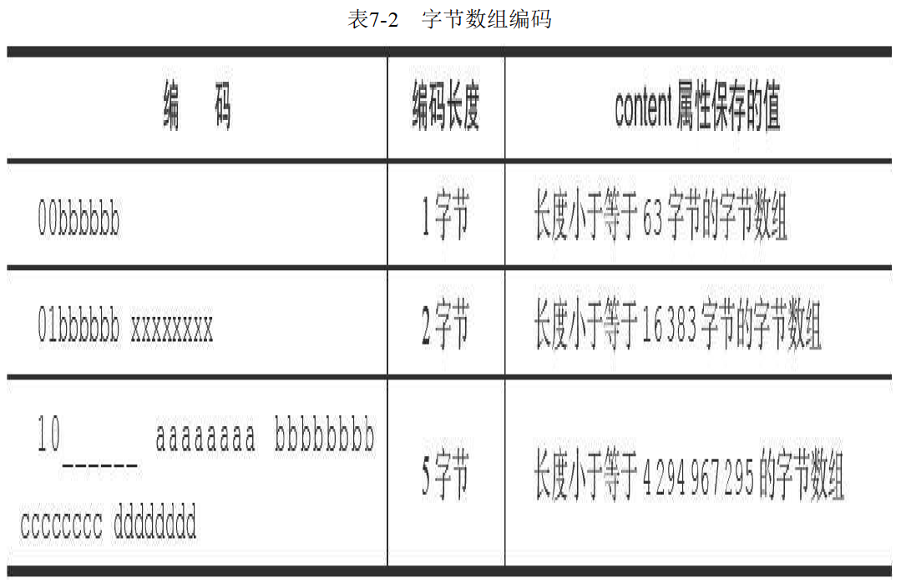
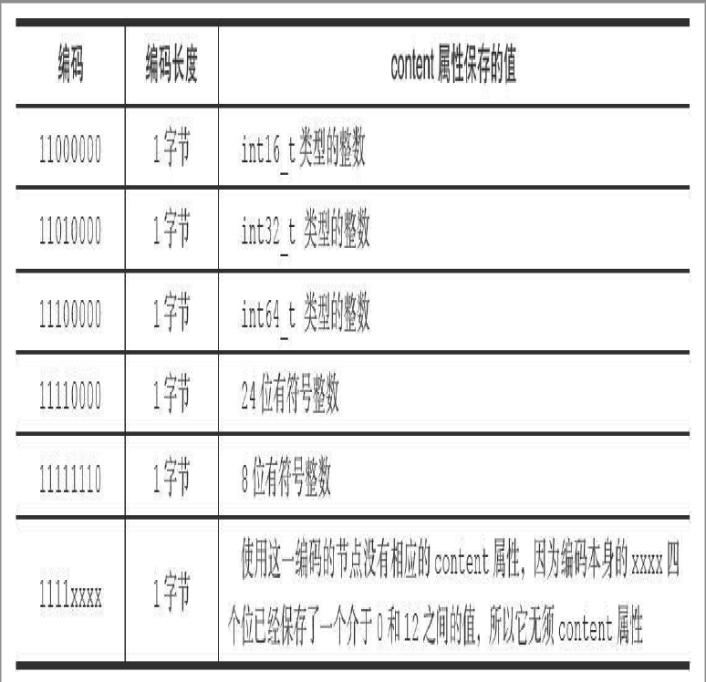

[TOC]
## 简介

key-value型内存数据库

key是字符串，value可以是字符串对象、列表对象、哈希对象、集合对象、有序集合对象


## 第2章 简单动态字符串

SDS(Simple Dynmic String)，简单动态字符串

### 2.1 SDS定义

```C
// sds.h/sdshdr结构
struct sdshdr {
  // 记录buf数组已使用字节的数量 等于SDS所保存字符串的长度
  int len;
  // 记录buf数组未使用的字节数量
  int free;
  // 字节数组，用于保存字符串
  char buf[];
}
```

SDS遵循C语言字符串的惯例（字符串以'\0'结尾，保存字符串的1字节空间不计算在SDS的len属性内）

### 2.2 SDS与C字符串的区别

**SDS常数(O1)获取字符串的长度**

**SDS的空间分配策略杜绝了内存缓存区溢出的情况**，内存不足会先扩展SDS的内空间至修改所需的大小

**字符串内存重新分配**

1. **空间预分配**：用于优化SDS的增长操作，当字符串修改后小于1M时，不仅会分配给字符串所需要的空间，还会分配与长度len相同的free空间，总的字符串实际大小=len+len+1byte（字符串结尾）；当SDS长度大于1M时，会额外分配1M的free空间。下次修改时，若free空间够用则不必扩容，实际大小=len+1M+1byte

2. **惰性空间释放**：当缩短SDS字符串时，并不会对字符串重新扩容，而是把多余空间记录到free中，用于下次使用

**二进制安全**：buf是字节数组，用于保存二进制数据，能保存空字符等特殊字符，SDS是用len表示字符串结尾而非空字符

**兼容部分C字符串的函数**

### 2.3 SDS API


## 第3章 链表

链表提供了高效的节点重排能力，以及顺序性的节点访问方式，可以通过增删节点来调整链表的长度

integers列表键包含了1024个整数，底层实现就是一个链表，每个节点都保存了一个整数值

### 3.1 链表和链表节点的实现

```c
// adlist.h/listNode，链表节点
typedef struct listNode {
  // 前置节点
  struct listNode * prev;
  // 后置节点
  struct listNode * next;
  // 节点的值
  void * value;
}listNode;
```

```c
// adlist.h/list 来表示链表
typedef struct list {
  listNode* head;
  listNode* tail;
  // 节点所含的节点数量
  unsigned long len;
  // 节点复制函数
  void *(*dup) (void *ptr);
  // 节点释放函数
  void (*free)(void *ptr);
  // 节点对比函数
  int (*match)(void *ptr,void *key);
}list;
```

## 第4章 字典

用于保存键值对的抽象数据结构，redis的数据库使用字典作为底层实现的

字典还是哈希键的底层实现之一，当哈希键包含的键值对比较多且元素都是比较长的字符串时，redis就是使用字典作为哈希键的底层实现

### 4.1 字典的实现

字典使用哈希表作为底层实现，哈希表有多个节点，每个节点保存字典的一个键值对

**哈希表**：包含一个（哈希节点）数组和一些长度变量

**哈希表节点**：包含键、值及next指针

**字典**：哈希表（两个表，第二个表在rehash时使用）、类型特定函数、私有数据、索引

### 4.2 哈希算法

当字典保存键值对时，先计算键的哈希值和索引值，再根据索引值，将键值对保存到哈希数据上

### 4.3 解决键冲突

当两个键值对分配到了哈希数据的同一个索引上，称这些键发生了冲突，则相同索引的节点构成链表，且新节点总是放在链表头部

### 4.4 rehash

当哈希表保存的键值对太多或太少时，程序会对哈希表进行扩展和收缩。

扩展操作：ht[1]（新表）的大小为第一个大于等于ht[0].used*2的 2的n次方

收缩操作：ht[1]的大小为第一个大于等于ht[0].used的 2的n次方

扩展完成，将数据都迁移到ht[1]上，释放ht[0]，将ht[1]设置为ht[0]，新建ht[1]

当以下条件满足时，程序自动对哈希表进行扩展操作

1）服务器没有**在执行**BGSAVE命令或BGREWRITEAOP命令，且哈希表的负载因子（已保存节点数/哈希表大小）大于等于1

2）服务器没有**正在执行**BGSAVE命令或BGREWRITEAOP命令，且哈希表的负载因子大于等于5

（ps:执行BGSAVE命令或BGREWRITEAOP命令时，redis需要创建服务器进程的子进程，通过写时复制来创建，为减少内存操作，执行这两个命令时扩大扩展因子。BGSAVE命令用于后台异步保存数据库的数据到磁盘）

当程序负载因子小于0.1时，自动对哈希表进行收缩操作

### 4.5 渐进式hash

扩展或收缩时，数据迁移，将ht[0]迁移到ht[1]中，是分多次，渐进式完成的。

数据迁移是将一个一个索引的数据迁移的，从0开始，等全部索引迁移完成后，迁移就完成了。

迁移过程中，对字典的操作

增：只在新表中新增

查：先去旧表查，找不到再找新表

删/更新：更新旧表和新表数据


## 第5章 跳跃表

一种有序数据结构，通过每个节点维持多个指向其它节点的指针，快速访问其他节点

跳跃表支持平均O(logN)、最坏O(N)的复杂度节点查找，也可以通过顺序性操作批量处理节点。跳跃表的查询效率可比得上平衡树，但又比平衡树简单

当一个有序集合包含的元素比较多或者集合中的元素成员是比较长的字符串时，redis会使用跳跃表作为有序集合键的底层实现。跳跃表另一种用在集群节点作为内部数据库，除此之外跳跃表没有其他用途

### 5.1 跳跃表实现

**zskiplist结构**

header/tail：指向跳跃表的表头/尾节点

level：记录跳跃表内，层数最大的节点的层数

length：跳跃表包含的节点数量

**zskiplistNode结构**
```c
typedef struct zskiplistNode {
    // 层
    struct zskiplistLevel {
        // 前进指针
        struct zskiplistNode *forward;
        // 跨度
        unsigned int span;
    } level[];
    // 后退指针
    struct zskiplistNode *backward;
    // 节点分值
    double score;
    // 成员对象
    robj *obj;
}
```

**层级节点**：1-32层

层（level）：节点的层级指针，帮助快速查找节点。每层都有前进指针和跨度（到下一节点的跨越节点数）。每次创建跳跃表节点时，根据幂次定律（越大的数出现的概率越小）随意生成一个1-32之间的值作为level数组的大小，即层数。

后退指针：只有一个，指向前一节点的指针，顺序性的

分值（double类型，从小到大排列）、成员对象（指向一个字符串对象，字符串保存一个SDS值）。插入和删除都要调整属性

分值相同的，按照成员对象在字典中的排序

**时间复杂度**
- 查询，插入，删除：平均O(lgn)，最坏O(n)
- 范围查询：平均O(lgn)，最坏O(n)

**拓展**

存疑：https://zhuanlan.zhihu.com/p/56941754

score可重复，因此要score相同时还需对比member

```c
// 默认值 p=1/4, MaxLevel=32
randomLevel() 
    level:= 1
    // random()生成[0, 1)的随机数
    where random() < p and level < MaxLevel do
        level := level+1
    return level
```

综上总结，每个节点的平均层数为 1/(1-p)

**查询遍历**
- 倒推法，假设已经定位了目标节点，类似爬楼梯方式，用最高层级向前回溯，该路径就是最短路径
- 下楼梯法：从头结点最高层节点开始，寻找下一节点分值小于等于目标节点的最大值，找到则向前遍历，否则下降一个层级指针接着找。遍历路径即为最短路径

### 优缺点，和红黑树对比
- 内存比红黑树更多。skiplist的节点平均指针数据为1/(1-p)，redis中p默认取1/4，平均每个节点1.33个指针，而平衡树只有1个
- 支持范围查询，节点是顺序的
- 实现更简单（比红黑树）。插入和删除时，只需要修改前后节点的指针关系

### 实现

- 当分数相同时，插入到分数相同数字的最后一个位置。即插入到最后一个小于等于的插入值的位置


## 第6章 整数集合

整数集合是一个有序、无重复的整数类型数据集合

当一个集合只包含整数值元素，并且元素数量不多时，redis就会使用整数集合作为集合键的底层实现

### 6.1 整数集合的实现

能保存类型为int16_t、int32_t或者int64_t的整数值，保证不出现重复元素

```c
// intset.h/intset 表示一个整数集合
typedef struct intset {
  // 编码方式
  unit32_t encoding;
  // 集合包含的元素数量
  unit32_t length;
  // 保存元素的数组
  int8_t contents[];
}intset;
```

contents数组时整数集合的底层实现：数组中按照值从小到大有序排列，且不包含任何重复项

contents属性虽然声明为int8_t类型的数组，但不保存任何int8_t类型的值，真正类型取决于encoding属性的值

encoding 为 INTSET_ENC_INT16，表示一个int16_t类型数据的数组（16位整数，-32768-32767）

Int32_t、int64_t类似

### 6.2 升级

当将一个新元素添加到整数集合里时，且新元素类型比整数集合现有所有元素类型都长时（判断插入数据的类型，和集合元素类型比较），整数集合需要先进行升级，共分三步

1）根据新元素类型，扩展底层数组的空间大小，并为新元素分配空间

2）将底层数组现有元素转换成新类型元素，转换后放置正确位置（移动位置），有序性不变

3）将新元素添加到底层数组里

每次添加新元素都可能引起升级，所以添加新元素的时间复杂度为O(N)

### 6.3 升级的好处

**提升灵活性**：C语言是静态类型语言，一般只使用一种类型的数组来存放一种类型的数据

**节约内存**：不必一开始就使用最大的空间（64位整数）去保存，以节约内存

### 6.4 降级

整数集合不支持降级

### 6.5 重点

* 整数集合是集合键的底层实现之一
* 底层实现为数组，以有序、无重复的方式保存集合元素。
* 支持元素升级（新增元素大小大于现有集合数据类型），不支持降级


## 第7章 压缩列表

压缩列表是列表键和哈希键的底层实现之一，当一个列表键只包含少量列表项，并且每个列表项比较小（要么是小整数值，要么是长度较短的字符串），redis就会使用压缩列表来做列表键的底层实现。哈希键同理，使用的列表项较小则使用压缩列表作为哈希键底层实现

### 7.1 压缩列表的构成

由一系列特殊编码的连续内存块组成的顺序型数据结构，一个压缩列表可以包含任意多个节点，每个节点保存**一个字节数组或一个整数值**。包括以下几项
- zlbytes，记录压缩列表占用的字节数
- zltail，记录压缩列表表尾节点距离压缩列表的起始位置地址的字节数，可快速定位表尾节点地址
- zllen，记录压缩列表包含的节点数
- entryX，记录各节点，每个压缩表多个节点
- zlend，标记列表末端。特殊值0xFF


### 7.2 压缩列表节点的构成

压缩列表节点:由 previous_entry_length 、encoding、content构成。每个节点保存一个字节数组或一个整数值

字节数组
- 长度小于等于63（2^6 - 1）的字节数据
- 长度小于等于16383（2^14 - 1）的字节数据
- 长度小于等于（2^32 - 1）的字节数据

**previous_entry_length**

以字节为单位，记录前一节点的长度。当前一节点长度小于254字节时，previous_entry_length为1字节，记录前一字节长度；当大于等于254字节时，该属性为5字节，第一字节为OxFE(十进制254)，后四个字节保存前一节点长度。可以通过当前节点位置-前一节点长度 获得前一节点位置，压缩列表从表尾向表头遍历就是通过这点实现

**encoding**

一字节、二字节或五字节，开头为00 01 10的表示字节数组。比如一字节的表示长度小于等于63字节的字节数组

一字节长，开头为11的整数编码。分为多种整数编码（int16,int32,int64,24有符号位等）






**content**

保存节点的值，可以是字节数组或整数

### 7.3 连锁更新

节点的previous_entry_length属性是一字节或五字节的，当前一节点大小发送变化（一字节变为五字节大小），可能出现连续的节点重新分配内存。每次分配内存的时间复杂度为O(N)（所有节点向后移动），连续更新可能导致分配N次内存，复杂度为O(n平方)，平均复杂度为O(N)。删除也可能产生连锁更新

### 7.4 重点

压缩列表作为一种节约内存而开发的顺序性数据结构，被作为列表键和哈希键的底层实现之一

可以包含任意多个节点，每个节点保存一个字节数组或整数值

添加新节点或删除节点时，可能引发连锁更新

> Redis5 没有ziplist了，只发现quicklist？
>
> 不，ziplist这个结构还有，只是压缩列表用了一种quicklist（ziplist和linkedList结合）

### 7.5 疑问
1. 遍历只能从表尾向表头遍历吗？
2. 新节点都放在表头吗？可以放在表头或表尾，如ziplistPush函数

## 第8章 对象

redis基于对象实现键值对，分别有字符串对象、列表对象、哈希对象、集合对象和有序集合对象，每种对象都用到了之前所述的数据结构

对象有自动回收机制（对象不再使用内存自动释放，采用引用计数法）

### 8.1 类型和编码

键和值都是对象，对象结构如下

```c
typedef struct redisObject {
  // 类型
  unsigned type:4;
  // 编码
  unsigned encoding:4;
  // 指向底层实现数据结构的指针
  void *ptr;
}robj;
```

### 8.2 字符串对象

字符串对象的编码是int、raw或emstr

若字符串保存一个可用long表示的整数，则编码为int；

若字符串对象保存一个长度小于等于32字节的字符串，编码为embstr；

若字符串对象保存一个长度大于32字节的字符串，编码为raw，用简单动态字符串保存（SDS）

> embstr编码是用于保存短字符的优化编码方式，和raw编码一样，都使用redisObject结构和sdshdr结构来表示字符串对象，但raw会分分配两次内存分别创建这两个结构，embstr只通过一次分配一块连续的空间保存这两个结构，释放内存也是只有一次

**编码转化**

int和embstr都可以转换成raw编码，embstr是一个只读串，当发生修改时会把它转换成raw再修改，不会再变回embstr类型
> append {key} {suffix}  往字符串中追加字符。int和embstr类型追加字符（包括int追加数字类型）之后都会变成raw类型

### 8.3 列表对象

列表对象的编码时ziplist或linkedlist

**编码转换**

当同时满足以下两个条件时，列表对象使用ziplist编码：

- 当对象保存的所有字符串长度都小于64字节(通过list-max-ziplist-value控制)
- 列表对象保存的元素数量小于512个（通过list-max-ziplist-entries控制）

否则需要使用linkedlist编码

命令
```sh
LPUSH key value [value ...] # 将新元素推入列表表头
RPUSH key value [value ...] # 将新元素添加到列表表尾
LPOP key # 移除并返回表头元素
LRANGE key start end # 返回[start,end]区间的元素，0-第一个，-1表示最后一个，-2表示导数第二个元素
```

### 8.4 哈希对象

哈希对象的编码可以是ziplist或hashtable

使用ziplist时存储哈希对象时，先后将保存了键和值的列表节点推入列表队尾，同一键值对节点总是挨在一起，键在前，值在后。

**编码转换**

当哈希对象同时满足以下两个条件时，哈希对象使用ziplist。否则使用hashtable

- 哈希对象的所有键值对的字符串长度都小于64字节（hash-max-ziplist-value调节）
- 哈希对象保存的键值对数量小于512个（hash-max-ziplist-entries调节）

ziplist编码格式会因为键太多或太长转码成hashTable格式

指令
```sh
hset key field value [field value ...] # 设置hash表的键值对
hget key field # 获取hash表的指定键对应值
hmget key field [field ...] # 获取哈希键的多个字段
hgetall key # 获取hash表key中所有的域和值
hdel key field [field ...] #删除消息表key指定域
hexists key field #查看set中键值是否存在
```

### 8.5 集合对象

集合对象的编码可以是intset或hashtable

**编码转换**

当同时满足以下两个条件时，对象使用intset编码，否则使用hashtable编码

- 保存的所有元素都是整数值
- 保存的元素数量不超过512个（set-max-intset-entries控制）

命令
```sh
sadd key value [value ...] # 集合key添加值
smembers key #遍历集合key
smove source destination member #将元素member从source移动到destination
# 当source中不存在或不存在该元素时，smove不执行任何操作
# 当destination中存在该元素时，smove只是将member从source中删除
# 当source或destination不是set时，报错
```

### 8.6 有序集合对象

编码可以是ziplist或skiplist

ziplist采用连续的地址保存元素的成员和分支，从小到大排列

skiplist编码使用字典（查询O(1)）和跳跃表（范围型操作很快，比如排序）两种结构实现有序集合。跳跃表按分值保存所有集合元素，方便进行范围型操作。字典保存了成员到分值的映射，方便查询成员分值

**编码转换**

当有序集合同时满足以下两个条件时，对象采用ziplist编码

- 保存元素数量小于128
- 所有元素长度都小于64字节

命令
```sh
zadd key score member [score member ...] # 为有序集合key添加元素
zrange start end [withscore] # 查询集合下标区间值，添加withscore则额外展示分数
```
### 8.7 类型检查与命令多态


redis分两种命令

一种是对任何类型的键操作，比如DEL、EXPIRE、RENAME、TYPE、OBJECT

一种是对指定类型的键操作

### 8.8 内存回收

通过引用计数法（refcount）来释放完成内存回收

### 8.9 对象共享

相同对象可以共享，通过引用计数法来计算对象的共享数

redis初始化创建了0到9999这一万个整数值，作为缓存对象

redis没有缓存字符串、列表等其他常量对象

### 8.10 对象的空转时长

redisObject对象的lru属性，记录了对象最后一次被程序命令访问的时间(不包括 OBJECT IDLETIME指令)

当前时间减去对象lru属性，得到的值(单位秒)被称为空转时长，可通过OBJECT IDLETIMEO key获取空转时长

当服务器占用内存超过指定值时，空转时长较高的键会被优先释放

### 8.11 重点

redis的每个键值对的键和值都是一个对象

redis有字符串、列表、哈希、集合、有序集合五种类型对象，每种对象都有至少两种或以上的编码方式

服务器在执行某些指令时，会进行类型检查（先检查对象类型，再判断编码调用相应指令）判断能否执行

redis通过引用计数法实现内存回收机制。缓存了0到9999度整数缓存对象

对象记录自己被最后一次访问的时间


# 第二部分 单机数据库的实现

## 第9章 数据库

### 9.1 服务器中的数据库

redis服务器所有数据库都保存在服务器状态redis.h/redisServer结构的db数组中，db数组的每项都是一个redis.h/redisDb结构，每个redisDb结构代表一个数据库

程序根据服务器状态的dbnum属性来决定创建多少数据库，默认16

### 9.2 切换数据库

通过SELECT命令来切换数据库，默认0号数据库

> select 1 # 切换1号数据库

### 9.3 数据库键空间

redisDb结构里的dict字典保存了数据库中所有的键值对，称字典为键空间

### 9.4 过期时间

EXPIRE key time 设置键的过期时间，经过指定的秒或毫秒后，服务器自动删除生存时间为0的键

通过EXPIREAT（单位秒）或PEXPIREAT（单位毫秒），设定键在指定UNIX时间戳过期。通过TIME指令可获取当前时间戳

TTL或PTTL获取键的剩余生存时间

四个指令底层都是基于PEXPIREAT实现

redisDb结构的expires字典保存了数据库所有键的过期时间，UNIX时间戳

PERSIST key 移除间的过期时间。（当键的ttl为-1时，表示永存，为-2时，键不存在当前数据库）

### 9.5 过期键删除策略

**定时删除**：每个键都创建一个定时器，键过期时删除键。

**惰性删除**：仅当指令访问时才判断键是否过期，过期则删除

**定期删除**：每隔一段时间，程序清理一次过期键。折中策略，可调节时间间隔来平衡内存和cpu的消耗

### 9.6 redis的过期键删除策略

**惰性删除**

**定期删除**：每次都从一定数量的数据库取出一定数量的随机键进行检查，并删除其中的过期键

### 9.9 重点

- 所有数据库都保存在redisServer.db数组中，数据库的数量由redisServer.dbnum属性保存
- 数据库主要有dict和expires两字典构成，dict字典保存键值对，expires字典保存键的过期时间，所有的操作都建立在字典之上
- 数据库的键总是一个字符串对象，值是任意一种redis对象类型
- expires字典的键指向数据库的某个键，值记录了数据库键的过期时间，过期时间是一个以毫秒为单位的UNIX时间戳
- redis实现用惰性删除和定期删除来清理过期键
- 执行SAVE和BGSAVE命令所产生的新RDB文件不会包含已过期的键
- 执行BGREWRITEAOF命令所产生的重新AOF文件不会包含已过期的键
- 当主服务器删除一个过期键后，它会向所有从服务器发送一条DEL命令，显示删除过期键；从服务器发现过期键也不会删除它，而是等待主服务器发来DEL命令，保证主从服务器的数据一致性
- 当redis命令对数据库进行修改后，服务器会根据配置向客户端发送数据库通知


## 第10章 RDB持久化

redis是内存数据库，提供RDB持久化功能，防止数据意外丢失。每次RDB持久化都将数据库所有键值对转化为RDB文件，保存到磁盘中。也可以将文件还原成数据库状态

> 每次rdb持久化都同步redis全量键值对，1G通常花费20s。每次持久化都先生成一个临时文件dump.rdb，备份完成之后将临时文件替换原备份文件

### 10.1 RDB文件的创建与载入

SAVE和BGSAVE命令可以生成RDB文件

SAVE会阻塞redis服务器进程，直至RDB文件创建完成

BGSAVE会派生一个子进程负责创建RDB文件，服务器进程继续处理命令请求

RDB文件的载入是服务器启动时自动执行的，且在载入rdb文件时会阻塞用户线程。载入时若开启AOF持久化，则优先载入AOF文件

**服务器在载入RDB文件期间，会一直处于阻塞状态**

### 10.2 自动间隔性保存

除了主动保存（执行SAVE或BGSAVE命令），redis还能配置让服务器每隔一段时间执行BGSAVE命令

默认配置

save 900 1

save 300 10

save 60 10000

若满足以上三个条件的任意一个，BGSAVE命令就会执行。解释，比如第三种，redis服务器在60秒之类，对数据库进行了至少10000次修改，服务器自动执行BGSAVE命令

### 10.3 RDB文件结构

**RDB文件结构**

**REDIS**：常量，长度5字节，保存着“REDIS”五个字符。通过REDIS判断载入的文件是否RDB文件

**db_version**：4字节，记录RDB文件的版本号，例"0006"表示RDB文件版本为第六版

**databases**：包含着任意多个数据库，以及库中的数据，当为空时表示没有数据

> 每个数据库结构如下
>
> - SELECTDB，1字节常量，表示数据库开头标记
> - Db_number，数据库号码（1、2或5字节）
> - Key_value_pairs表示数据库中的键值对数据

**EOF**：1字节，标识RDB文件正文内容的结束

**Check_sum**：8字节无符号整数，保存着一个校验和，通过前四部分计算得出，用来检测RDB文件是否出错

## 第11章 AOF持久化

RDB持久化通过保存数据库的键值对来持久化，而AOF(append only file)持久化通过保存服务器执行的写命令来保存数据库状态

AOF文件还原时创建一个伪客户端来执行命令

命令请求会先保存到AOF缓冲区中，之后再定期写入并同步到AOF文件

为提高效率，AOF重写会读取数据库状态来创建相应指令，得到的新AOF文件会覆盖老AOF文件

> 当一个键的数据太多时，无法用一条指令表示，会有多条指令

AOF重写是通过读取数据库状态而生成的，并不会依赖老的AOF文件

在执行BGREWRITEAOF时，AOF重写时提供一个重写缓存区，来保存重写时数据库执行的新指令，保证数据的一致性

## 第12章 事件

redis服务器是一个事件驱动程序，需要处理两类事件

- 文件事件：Redis服务器通过套接字与客户端进行连接，文件事件就是服务器对套接字操作的抽象
- 时间事件：Redis服务器的一些操作需要在给定的时间点执行，而时间事件就是服务器对该类操作的抽象

### 12.1 文件事件

Redis基于Reactor模式开发了自己的网络事件处理器，即文件事件处理器

文件事件处理器采用I/O多路复用来同时监听多个套接字。当监听的套接字准备好执行链接应答、读取、写入、关闭等操作时，相应的文件事件就会产生

文件事件处理器有四部分组成：套接字、I/O多路复用程序、文件事件分派器、事件处理器（连接应答处理器、命令请求处理器、命令回复处理器）

通过I/O多路复用程序监听多个套接字，接收数据成功将套接字放入到队列中，并向文件事件分派器传送这些套接字，有序、同步传送，当上一个套接字处理完毕之后，I/O多路复用程序才会向分派器发送下一套接字。事件分派器根据事件类型调用不同的时间处理器

> 套接字socket，网络通信的一端，等于ip+端口

#### 12.1.2 I/O多路复用程序的实现

I/O多路复用程序通过包装常见的epoll、select、evport和kqueue函数实现

#### 12.1.5 文件事件的处理器

##### 连接应答处理器

处理客户端连接请求应答。当客户端通过sys/socket.h/connect函数连接服务器监听套接字时，套接字就会产生AE_READABLE事件，引发应答处理

##### 命名请求处理器

处理客户端请求的处理器。当客户端向服务端发送命令请求的时候，套接字就会产生AE_READABLE事件，引发命令请求处理器执行

##### 命令回复处理器

将服务器执行获得的结果返回给客户端。当客户端准备好接收服务器传回的命令时，就会产生AE_WRITEABLE事件，引发命令处理器执行，并执行响应的套接字写入操作

> 全流程：服务端创建套接字监听事件，客户端发起连接请求后，服务端处理，应答成功；后续若服务端发送命名请求处理，服务端接收并处理；服务端执行命令后产生响应的回复命令，通过命令回复处理器写回到套接字，客户端读取

##### 复制处理器

当进行主从复制时，主从服务器都需要关联特别为复制功能编写的复制处理器

### 12.2 时间事件

时间事件分为两类：定时时间，周期性时间

>  serverCron函数中，对redis服务器进行定期的资源检查和调整，保证服务器长期、稳定地运行，主要工作包括：
>
>  - 更新服务器各类统计信息，比如时间、内存占用、数据库占用情况等
>  - 清理数据库中的过期键值对
>  - 关闭和清理连接失效的客户端
>  - 尝试进行AOF或RDB持久化操作
>  - 如果服务器时主服务器，那么对从服务器进行定期同步
>  - 如果处于集群模式，对集群进行定期同步和连接侧睡

### 12.3 事件的调度和执行

事件的调度和执行由ae.c/a eProcessEvents函数负责

时间的调度和执行规则：

- aeApiPoll函数的最大阻塞时间有到达时间最接近当前时间的时间事件决定
- 对文件事件和时间事件的处理都是同步、有序、原子的执行，不会中断事件处理
- 时间事件在文件事件之后执行，不会出现抢占。即时间事件的实际处理事件通常会比设定的到达事件晚一些

## 第13章 客户端

Redis服务器是典型的一对多服务器程序，一个服务器可以与多个客户端建立网路连接

通过使用I/O多领域服用技术实现的文件事件处理器，redis服务器使用单线程方式来处理命令请求，并与多个客户端进行网络连接

### 13.1 客户端属性

**套接字描述符**

**名字**：连接到服务器的客户端默认情况下是没有名字的

> 使用CLIENT list查看连接的客户端

**标志**：记录了客户端角色，以及客户端目前所处的状态

**输入缓冲区**：记录客户端发送的命令请求，不超过1GB

### 13.2 客户端的创建与关闭

普通客户端：通过网络链接与服务器进行连接的客户端

关闭普通客户端的方法

- 客户端进程退出或被杀死
- 客户端向服务器发送了带有不符合协议格式的命令请求
- 客户端发送的命令请求的大小超过了输入缓冲区的限制大小（默认1GB）
- 发送给客户端的命令恢复超过输出缓冲区的限制大小

服务器通过两种模式来限制输出客户端输出缓冲区的大小：

- 硬性限制：输出缓冲区的大小超过了硬性限制所设置的大小，服务器立即关闭客户端
- 软性限制：如果输出缓冲区大小超过软性限制但未超过硬性限制大小，服务器会持续监视客户端，若持续一直超过软性限制大小一定时间，则关闭客户端

**Lua脚本的伪客户端**：服务器在创建执行Lua脚本中包含redis命令的伪客户端

**AOF文件的伪客户端**：载入AOF文件时创建的伪客户端

## 第14章 服务器

### 14.1 命令请求的执行过程

set key value 这一指令，共执行

1. 客户端向服务器发送命令请求
2. 服务器接受并处理命令，在数据库进行设置操作，并产生命令回复OK
3. 服务器将回复命令OK发送给客户端
4. 客户端接受命令，并打印出来

**命令不区分大小写**

命令执行器步骤

1. 查找命令实现
2. 执行预备操作
3. 调用命令的实现函数
4. 执行后续工作：比如慢查询（需要服务器开启慢查询日志功能）、更新执行命令耗费时间、命令写入AOF缓冲区（服务器开启了AOF持久化功能下）、服务器复制情况下传播刚刚执行的命令至从服务器

### 14.2 serverCron函数

Redis服务器中的serverCron函数默认每隔100毫秒执行一次，负责管理服务器的资源

**更新服务器时间缓存**：服务器对当前时间做了缓存（获取系统当前时间需要执行一次系统调用），serverCron会更新当前时间缓存值。对于为键设置过期时间、添加慢查询日志这种高精确度需求的功能，还是会执行系统调用获取精确时间

**更新LRU时钟**：也是当前时间缓冲的一种

**更新服务器每秒执行次数**：每100毫秒执行一次，估算最近一秒处理的命令，抽样计算

**更新服务器内存峰值记录**

**处理SIGTERM信号**

**管理客户端资源**：超时释放客户端、输入缓冲区大小控制

**管理数据库资源**：serverCron函数每次执行都会调用databaseCron函数，对数据库进行检查，删除过期键、必要时进行字典收缩

**执行被延迟的BGREWRITEAOF**

**检查持久化操作的运行状态**

**将AOF缓冲区的内容写入AOF文件**

**关闭异步客户端**

**增加cronloops计数器的值**

### 14.3 初始化服务器

**初始化服务器状态结构**：设置运行id、配置文件路径、服务器频率、服务器运行架构、默认端口号、出水花服务器等LRU时钟等

**载入配置选项**：数据库数量、RDB功能、修改端口号等

**初始化服务器数据结构**：为服务器设置进程信号处理器、创建共享对象、监听事件、为serverCron创建事件函数、初始化后台I/O模块等

**还原数据库状态**：载入RDB文件或AOF文件，还原数据库状态

**执行时间循环**：完成后即初始化完成

## 第15章 复制

redis中用户可以执行SLAVEOF命令或设置slaveof选项，让一个服务器去复制另一个服务器，被复制的服务器称为主服务器，复制的服务器为从服务器

> slaveof <master_ip> <master_port>

### 15.1 旧版复制功能的实现

redis的复制功能分为同步和命令传播。同步操作作用于将从服务器的数据库状态更新至主服务器当前数据库状态；命令传播指在主服务器修改时，发送相同命令到从服务器执行

**复制**

1. 从服务器向主服务器发送sync命令
2. 收到sync命令的主服务器执行bgsave命令，在后台生成rdb文件，并使用缓冲区记录从现在开始执行的写命令
3. 当bgsave执行完后，主服务器将rdb文件发送给从服务器，从服务器接受并载入
4. 主服务器将缓冲区内的所有写命令发送给从服务器

### 15.2 旧版复制功能的缺陷

执行sync命令是全量复制数据，如果从服务器中间中断后重连，还通过sync复制全量数据，会浪费大量资源

### 15.3 新版复制功能的实现

redis2.8开始使用psync命令代替sync

psync包含完全重同步和部分重同步两种模式。部分重同步会在从服务器中断重练后，主服务器将中断时间的写命令发送给从服务器执行，提升效率

### 15.4 部分重同步的实现

功能构成

**复制偏移量**：主从服务器都保存了一个复制偏移量，来保证主从一致性。复制多少数据偏移量加多少，如果主从服务器复制偏移量不一致，则需要进行部分重同步

**复制积压缓冲区**：固定长度（默认1MB）FIFO的队列，保存最近一部分写命令。当执行命令同步的时候会保存命令至复制积压缓冲区，队列数据结构。如果复制偏移量之后的数据仍存在于复制积压缓冲区中，则进行部分重同步操作；反之则只能进行完整重同步操作

**服务器运行id**：主从服务器都有运行ID，作为唯一标志

### 15.5 复制的具体步骤
通过从服务器发送SLAVEOF命令，让从服务器去复制一个主服务器。发送SLAVEOF命令之后再通过psync指令同步

1. 设置主服务器地址和端口号
2. 建立套接字
3. 发送ping命令：检查套接字的读写状态是否正常；检查主服务器能否正常处理命令
4. 身份验证：从服务器设置了masterauth选项需要进行身份验证
5. 发送端口信息：向主服务器发送从服务器的监听端口号
6. 同步：从服务器向主服务器发送psync命令，执行同步操作。若从服务器之前未同步过任何主服务器，则采用完全重同步，否则采用部分重同步
7. 命令传播：完成同步之后，主从服务器就会进入命令传播阶段，主服务器一直发送执行的写命令，从服务器接收并执行，以保证主从服务器状态一致

### 15.6 心跳检测
在命令传播阶段，从服务器以每秒一次的频率向发送命令，表示存活状态


## 第16章 Sentinel

Sentinel（哨兵）事Redis的高可用性解决方案：由一个或多个Sentinel实例组成的Sentinel系统可以监视任意多个主服务器和从服务器。当主服务器进入下线状态时，自动将其底下的某个从服务器升级为主服务器

### 16.1 启动并初始化Sentinel

使用命令能启动一个Sentinel

> Redis-sentinel /path/to/your/sentinel.conf 或
>
> redis-server /path/to/your/sentinel.conf --sentinel

启动一个sentinel，需执行以下步骤

1. 初始化服务器：初始化一个redis服务器（该服务器没有保存数据），当成sentinel
2. 使用sentinel专用代码：将redis服务器使用的代码转换成sentinel专用代码，比如端口替换。redis服务器（Sentinel模式下）只能执行七个命令（ping、INFO等）
3. 初始化Sentinel状态：初始化一个结构，该结构保存了服务器和所有Sentinel功能有关的状态
4. 初始化Sentinel状态的masters属性：masters字典记录了主服务器相关信息
5. 创建连向主服务器的网络连接：sentinel会创建两个两个主服务器的异步网络，一个是命令连接（向主服务器发送命令，接受命令回复），一个是订阅连接

### 16.2 获取主服务器信息

Sentinel默认每十秒向被监视的主服务器发送INFO命令，通过回复来获取主服务器的当前状态

通过info命令回复，一方面可以获取主服务器的信息，包括run_id域记录的运行ID，以及role域记录的服务器角色名

另一方面可以获取从服务器的信息，ip+端口号

### 16.3 获取从服务器信息

当发现主服务器出现新的从服务器时，Sentinel会为它创建新实例结构，命令连接和订阅连接，默认每十秒一次向从服务器发送info命令

根据info返回获取从服务器的运行ID run_id,角色role，复制偏移量slave_repl_offset, 从服务器优先级slave_priority

### 16.4 向主/从服务器发送信息

Sentinel默认每两秒一次，通过命令连接向所有主/从服务器发送命令 (PUBLISH \__sentinel__:hello ...)，获取主从服务器的信息

### 16.5 接受来自主服务器和从服务器的频道信息

Sentinel通过命令和订阅频道发送信息，通过订阅频道接受信息

对于同一服务器，所有监听并订阅频道的sentinel都能收到其中一个sentinel在频道中发送的消息

### 16.6 检查主观下线状态

默认每一秒向实例（主从服务器、其他sentinel）发送ping命令

有效回复：+PONG、-LOADING、-MASTERDOWN三种的一种

若服务器联系50秒（默认）都返回无效回复，则标记服务器为主观下线

### 16.7 检查客观下线状态

当Sentinel判断一个主服务器为主观下线后，为确认其真正下线，会向其他Sentinel询问，当接收到足够的确认后，就将其从服务器判定为客观下线，并对主服务器执行故障转移

### 16.8 选举领头Sentinel

当服务器被判定为客观下线时，监视这个下线服务器的Sentinel会进行协商，选出领头Sentinel，对主服务器进行故障转移

选举规则（Raft算法领头选举的实现）：

每个发现服务器客观下线的Sentinel都会向其他Sentinel推举为领头，每个Sentinel只有一票，并采用先到先得规则，为第一个推举的投票（自己收到信息的第一个Sentinel，后面的作废），得票**超过半数**的成功选举为领头Sentinel。若在给定时限没有选出，各个Sentinel将在一段时间后继续投票，直至选出领头Sentinel为止

### 16.9 故障转移

领头Sentinel进行以下步骤

1. 在从服务器中选出一个转换为主服务器（选择slave_priority 可配置；复制偏移量最大的；id最小的从服务器作为主服务器）
2. 让其他所有从服务器改为复制新主服务器
3. 当原主服务器变为从服务器


## 第17章 集群

集群通过分片来进行数据共享，并提供复制和故障转移功能

### 17.1 节点

redis集群通常由多个节点组成，每个节点相互独立，相互连接通信。客户端可以与任何节点直连

一个redis集群至少需要3个主节点，3个从节点

```sh
cluster nodes #查看当前集群节点
cluster meet <ip> <port> #与指定节点握手，将其加入集群
```

#### 17.1.3 cluster meet命令的实现
当执行cluster meet命令后，A节点接B节点添加到集群中。其过程如下（类似三次握手）
1. A节点为B节点创建clusterNodes结构，添加到clusterState.nodes字典里
2. A节点通过指定的地址，向B节点发送meet命令
3. B节点为A节点创建clusterNodes结构，添加到clusterState.nodes字典里
4. 之后，B节点向A节点返回一条PONG命令
5. A节点接收之后，表示B节点已成功接收meet命令。A节点再次向B节点发送PING命令
6. 当B接收到A节点的PING命令之后，表示握手成功

### 17.2 槽指派

集群的整个数据库被分为16384个槽，数据库中的每个键都落在其中的一个槽上，集群中每个节点都可以处理0个或最多16384个槽。一个槽不能同时被两个主节点处理

当集群的数据库槽都有节点在处理时，集群处于上线状态；否则，集群处于下线状态

节点之间会互相同步自己负责的槽节点，即每个节点都知道槽锁对应的负责节点机器。当请求查询key时，若发现该key不在字节负责的槽内，则会向客户端返回MOVED错误，客户端根据MOVED信息转向正确的节点

#### 17.2.1 记录节点的槽指派信息
通过clusterNode记录节点槽指派信息
```c
struct struct clusterNode {
    // ...
    // 表示当前节点的槽处理关系
    // 若slot在索引上第i位为1，则表示节点处理槽i
    unsigned char slot[16384/8];
    // 处理槽的数量
    int numslots;
    // ...
}clusterNode;
```

#### 17.2.2 传播节点的槽指派信息
节点出了将自己负责的槽指派信息保存在slot和numslots中，还会将自己的slot信息发送给其他节点，节点记录在clusterState中。由此每个节点都知道所有槽的指派信息

#### 17.2.3 集群所有槽的指派信息
clusterState结构中记录了所有的当前处理节点信息，加快检索槽的处理节点。每个节点都会记录一个clusterState结构
```c
struct struct clusterState {
    //...
    // 索引i不为空表示槽i由指定节点处理
    // 索引i为空表示槽i为指派任何节点
    clusterNode *slot[16384];
    //...
}clusterState;
```

#### 17.2.4 cluster addslots命令
cluster addslots <slot> [<slot>...]
命令实现

1. 遍历查询所有的输入槽，判断是否已分派给其他节点处理
2. 若至少存在一个槽不满足条件，报错返回
3. 若输入槽都未分派，将这些槽分派给指定节点

### 17.3 在集群中执行指令
在集群中执行指令时，节点自动根据key计算对应的槽，然后判断自身是否负责改槽，若负责则直接处理；若不负责，则返回MOVED错误（不展示），然后根据MOVED错误返回的节点信息自动重定向到指定节点执行命令

MOVED错误：返回 MOVED <slot> <ip>:<port>
> 集群模式下不打印该错误，自动转自指定节点；非集群模式无法识别MOVED错误，只打印

```shell
redis-cli -c -p 8001 #使用集群模式连接机器
redis-cli -p 8001 #单机模式连接
```

节点数据库的实现：集群模式下节点只能使用0号数据库，单机模式可以使用其他数据库

### 17.4 重新分片

redis集群可以将任意分派的槽重新分给新的节点，其相关的键值也会移到目标节点

redis-trib对槽的键值对迁移（以一个槽为单位）
1. 判断目标节点是否准备好导入槽的键值对
2. 判断源节点是否准备好导出槽的键值对
3. 从源节点获取键值对，一次获取最多count个键值对
4. 将获取到的键值对发送给目标节点
5. 重复步骤3，4直至将槽的键值对迁移完成
6. 迁移完成后，redis-trib向任意节点发送命令，将槽指派给目标节点。这一指派会通过消息发送到集群中，通知该槽已迁移完成

### 17.5 ASK错误

当进行分片期间，源节点向目标节点迁移槽的时候，可能一部分处于源节点一部分处于目标节点

当源节点接到数据库命令时，相应的键值被迁移到了新节点，源节点会抛出ASK错误，并将客户端引向目标节点

ASKING 命令识别为在给定的目标节点执行一次命令，随后返回给源节点

**ASK错误与MOVED错误区别**：Moved错误表示槽点负责节点已经移到其他节点，下次收到改槽点命令直接转向新节点。而ASK错误只是临时措施，下一次命令转向新节点，以后对槽的命令仍然转向老节点

### 17.6 复制与故障迁移
#### 17.6.1 设置从节点
cluster replicate <node_id> #将当前节点设为从节点，复制<node_id>节点。若当前节点为主主节点且有处理的槽则不能执行复制命令

#### 17.6.2 故障检测
集群中每个节点都会想其他节点发送ping命令，如果在指定时间内没有返回，则标记该节点为疑似下线

若存在半数以上的节点都标记某节点为疑似下线，那么将该节点标记为已下线，并在集群中发送一条该节点已下线的广播消息

#### 17.6.3 故障转移
当一个从节点发现自己的主节点已下线时，开始进行故障转移
1. 从主节点下的所有从节点中选出一个
2. 对选出的从节点执行slave no one，设置为主节点
3. 新节点会撤销原主节点的槽指派，并将这些槽指向自己
4. 向集群中发送一条PONG广播消息，表示自己已成为新的主节点，且该主节点已经接管了原主节点的槽
5. 新主节点开始处理自己负责的槽命令，故障转移完成

#### 17.6.4 新主节点的选举
和sentinel选举类似

由发现主节点下线的从节点发起拉票，向集群中发送投票的广播消息，呼吁其他主节点给自己投票，集群中每个主节点都只有一票，先到先到，超过半数得票则选举成功

### 17.7 消息

节点发送的消息，消息由消息头和消息正文组成：

**MEET消息**：请求接收者加入到发送所在的集群

**PING消息**：检测节点是否在线

**PONG消息**：对MEET消息和PING消息的回应

**FAIL消息**：当主节点A判断主节点B已经进入FAIL状态， A会在集群中广播一条B的fail消息

**PUBLISH消息**：接受到PUBLISH消息的节点都会执行相同的PUBLIST命令

Gossip协议由MEET、PING、PONG三种消息实现

FAIL消息实现：当主节点A标记主节点B已下线时，A向集群广播一条B的FAIL消息，接收到该消息的节点都会标记节点B已下线

PUBLISHL消息实现：没收到PUBLISH命令的节点不仅向channel频道发送message 消息，还会向集群广播一条publish消息。所有接收到publish消息的节点都会向channel频道发送message消息。

### 重点

节点没收到命令，若处理的键所在的槽不是由自己负责的话，向客户端返回一个MOVED错误


## 第18章 发布与订阅

发布与订阅功能由publish、subscribe、psubscribe等命令组成

服务器状态在pubsub_channels字典保存了所有频道的订阅关系

服务器状态在pubsub_patterns链表保存了所有模式的订阅关系

publist通过访问pubsub_channels字典来向频道的所有订阅者发送消息，通过pubsub_patterns链表来向所有匹配频道的模式的订阅者发送消息


## 第19章 事务

通过MULTI、EXEC、WATCH等命令实现事务功能

事务执行期间，服务器不会中断事务去执行其他客户端的命令请求，保证事务中的所有命令执行完毕

以MULTI标记一个事务开始，EXEC表示事务提交。服务器将所有指令放入队列中，当事务提交，便开始执行队列中的命令

### 19.1 事务的实现

#### 1.事务开始

以MULTI命令标记开始一个事务。multi命令可以将执行命令的客户端从非事务状态切换至事务状态，通过客户端状态flag属性中打开REDIS_MULTI标识完成

#### 2.命令入队

客户端为非事务状态时，客户端的命令会立即执行

当为事务状态时，除EXEC、DISCARD、WATCH、MULTI之外的所有命令，都放事务队列中，客户端返回QUEUED回复

#### 3.事务队列

事务队列先进先出，当遇到错误指令时报错，事务关闭

#### 4.执行事务

### 19.2 WATCH命令的实现

watch命令是一个乐观锁。它在exec命令执行前，被监控的键有修改的话，服务器就拒绝事务，返回执行失败的空回复

数据库中的watched_keys字典，保存着被watch命令监视的数据库键，字典是一个链表

#### 19.3 事务的ACID

原子性（Atomicity）、一致性（Consistency）、隔离性（Islation）、持久性（Durability）

原子性：事务中指令要么全部执行要么全部不执行

一致性：
事务发生的错误当发生入队错误时，事务不能执行；当指令运行期发生错误，事务执行错误指令后依然继续执行，redis不支持事务回滚

隔离性；redis由单线程执行事务，事务执行期间不存在被其他事务中断，保证事务是串行的

持久性：redis事务提供的只是将所有的指令一同执行，没有持久化的功能。持久化依赖于服务器本身


## 第20章 Lua脚本

>  lua是一种轻量小巧的脚本语言，C语言编写，开源

Redis支持引入Lua脚本

使用EVAL可执行脚本

redis内嵌了Lua环境，并在启动时进行一系列修改，保证环境可用


## 第21章 排序

sort命令，通过快速排序算法实现

sort只向客户端返回排序结果，而不保存结果，可以通过STORE把结果保存在指定键里

**排序选项执行顺序**

排序->限制排序结果集的长度->获取外部键->保存排序结果集->向客户端返回排序结果集

ALPHA，假设排序键都是字符串，以字符串方式进行排序。不加此选项默认以数字进行排序

DESC，决定升序降序

BY，实用其他键的值作为权重排序

LIMIT，选择结果集中指定的元素

GET，选择键值元素的指定模式结果

STORE，将结果集保存在指定键中


## 第22章 二进制位数组

位数组

SETBIT：为指定位设值。 setbit exam 2 1 # 0000 0010

GEIBIT：获取指定。 getbit exam 2 1 # 1

BITCOUNT：统计位数组中1的数量

BITOP：进行按位与（and）、安位或（or）、安位异或（xor）、取反（not）运算

> bittop and-result key1 key2


## 第23章 慢查询日志

记录执行时间超过给定时长的命令请求

**服务器配置**

slowlog-log-slower-than(指定超时时间，单位微妙)

Slowlog-max-len: 最多保存的慢查询日志数量，队列形式存储

slowlog get 获取慢查询日志


## 第24章 监视器

通过执行MONITOR命令，实时接收并打印服务器当前处理命令

服务器所有监视器都记录在monitors链表中

服务器每次处理命令请求钱，都会调用函数，将请求相关信息发送给各个监视器


## 其他
### 指令
- OBJECT ENCODING [key]  //查看键值对象的类型