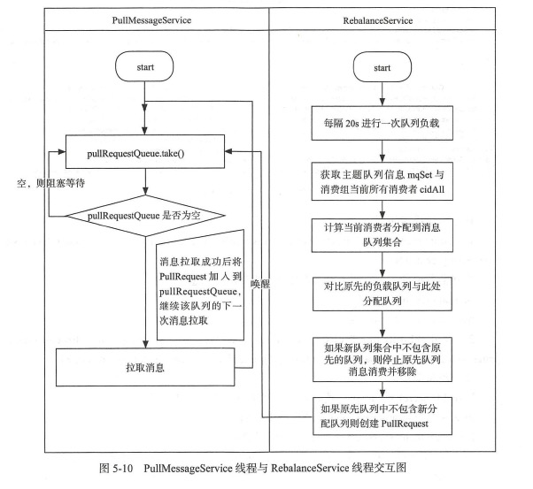

[TOC]


## 一、基础

### 1.2 Rocket源码目录结构

目录说明

- broker：broker模块
- client：消息客户端，包括消息生产者、消息消费者
- dev：开发者信息
- distribution：部署实例文件夹
- namesrv：nameserver实现相关类
- srvutil：服务器工具类
- store：消息存储相关类

### 1.3RocketMq设计理念

#### 1.3.1 设计优势(追求简单和性能)

- nameServer无状态，节点直接不同步信息。设计简单，每个nameserver都保存了全量的broker全量信息。设计简单
- 高效的IO存储机制。RocketMQ消息保存在文件中，大小固定，方便引入内存映射；消息顺序存储，同时引入了消费队列文件和索引文件，为方便消费和查询消息。
- 只保证消息至少消费一次。容忍一定缺陷，丢弃消息仅消费一次的要求，允许消息被重复消费，需要消费者自己控制消费幂等性

#### 1.3.2 设计目标

**消息过滤**

消息过滤指过滤指定类型的消息，支持在broker端和消费者端设置过滤机制

## 二、NameServer

### 2.1 架构设计


消息生产者（Producer）发送消息给消费服务器（broker），消息服务器负责消息存储和转发，消息消费者通过消费服务器主动推送消息或主动拉取消息两种方式订阅消息

1. NameServer与每台Broker保持长连接，并每隔10s检查broker是否存活，若120s内没收到心跳包，则从路由列表中将其移除，但路由变化并不会通知Producer（为了降低NameServer实现的复杂性）
1. broker每隔30s给NS发送心跳，配置信息
1. 每隔NS都保存了全量broker信息，且彼此没有通信关系， 无状态

### 2.3 NameServer 路由注册、故障剔除

#### 2.3.1 路由元信息

NameServer路由实现类：org.apache.rocketmq.namesrv.routeinfo.RouteInfoManager

- topicQueue: Topic消息队列路由信息，消息发送时根据路由负载均衡
- brokerAddrTable：Broker基础信息，包含brokerName、集群信息、主备broker信息
- clusterAddrTable:Broker集群信息，存储集群中所有Broker名称
- brokerLiveTable:Broker状态信息，每隔30s收到心跳包时直接更新
- filterServerTable：Broker上的FilterServer列表，用于类模式消息过滤

> 一个topic拥有多个消息队列，一个broker默认创建四个读队列四个写队列。多个broker组成一个集群

#### 2.3.2 路由注册

RocketMq路由注册通过心跳功能实现。Broker每隔30s（可配置区间10s-60s）向NameServer发送心跳信息，更新到brokerLiveTable中，NameServer每隔10s扫描brokerLiveTable，移除超过120s无响应的Broker信息，并断开socket连接

```
路由注册代码分析
1、接口合并
多个对外接口合并成一个接口，通过requestType来区分。封装公共的请求头，和请求体（byte[]）
2、接口加密
请求头中包含请求体的加密密钥bodyCrc32，校验请求是否正常(是否丢包，是否被篡改等)
```

#### 2.3.3 路由删除

RokcetMq有两种情况出发路由删除

1. NameServer定时扫描（每隔10s）broker存活信息，若broker上次心跳时间晚于当前时间120s，则移除该路由信息
2. Broker在正常关闭的时候，会执行unRegisterBroker命令，移除broker信息

> 移除路由信息，从topicQueueTable、brokerAddrTable、brokerLiveTable、filterServerTable删除与该broker的信息

#### 2.3.4 路由发现

RocketMQ发现路由不是实时的，当NameServer路由发生改变时，并不会通知客户端，而是通过客户端主动定时拉取最新配置来感知变化的（没有定时周期，暂未找到定时拉取的代码）。在发送消息时也会获取路由信息

> 本章疑问： NameServer通过当broker无心跳超过120s才更新路由信息，当Broker失效之后且在移除废弃路由之前，producer请求获取到broker信息，此时就会发送失败，producer如何保证高可用？答:producer自带失败重试机制,下次重试会绕过上次失败的broker发送.另还有故障延时机制,对出现故障的broker临时标为不可用
>
> 失败重试机制：
>
> 1. 当发送消息发生指定异常时，直接重试，如：RemotingException，MQClientException，MQBrokerException；若为InterruptedException异常或其他未知类型异常，发送直接报错
> 2. 在发送消息得到broker返回信息时，结果不为SEND_OK（其他错误刷盘超时、同步slave超时、slave不可用），且retryAnotherBrokerWhenNotStoreOK（默认false）为true时，自动重试。仅在SYNC模式下重试，ASYNC和ONEWAY模式下不重试
> 3. retryTimesWhenSendFailed：默认2。失败后重试次数，即最多发送retryTimesWhenSendFailed+1次

TODO

1. RouteInfoManager#unRegisterBroker 研究master broker不存活系统如何应对
2. RouteInfoManager#filterServerTable作用

## 三、RocketMQ消息发送

### 3.1 漫谈发送

消息发送分为同步发送、异步发送、单向发送消息三种

消息发送问题

1. 消息队列如何负载
2. 如何实现高可用
3. 批量发送消息如何实现一致性

### 3.2 RocketMQ消息

Message消息扩展内容

1. tag：用于过滤
2. key：Message索引键，多个用空格隔开
3. waitStoreOk：是否等待消息保存成功才返回
4. delayTimeDelay：延迟级别，用于定时消息或消息重试

### 3.3 生产者启动流程

#### 3.3.1 Producer

#### 3.3.2 消息生产者启动流程

clientId={clientIp}@{instance}[@unitName]

以clientId做为消费者唯一标记

### 3.4 消息发送基本流程

消费发送分为几步：消息校验、寻找路由、消息发送

#### 3.4.1 消息长度验证

每个消息默认最大4M

#### 3.4.2 查找主题路由信息

#### 3.4.3 选择消息队列

异常broker规避：当发送消息失败后重试，下次进行消息队列选择会自动避开上次的broker。但是可能出现选择到之前失败的broker，可能浪费一定性能

**开启broker故障延迟机制（sendLatencyFaultEnable=true），较悲观的做法，一旦发送失败或耗时偏高，则设置broker短暂不可用**

当消息发送完成后，会更新延迟记录表，发送耗时长的broker设置不可用的时间也越长，不管本次发送成功或失败

当发送消息失败时，若为broker相关异常，broker被设置成30s不可用

> TODO：若为顺序消息，消息分到不同的broker，能保证有序性吗？

#### 3.4.4 消息发送

1. 同步发送
2. 异步发送，对于异步消息进行了并发控制。通过参数clientAsyncSemaophoreValue来控制，默认65535.异步消息也能通过设置失败重试，但重试是在收到服务端入口响应包时进行的，如出现网络异常、网络超时不会重试
3. 单向发送，不关心发送结果，没有重试

### 3.5 批量消息发送

批量消息指将同一主题的消息打包一起发送到服务端，加快发送效率。但并非同一批次数量越多消息发送效率就越高，单条消息的长度会影响其他线程发送的时间

批量消息体MessageBatch继承自Message，内部包含字段List<Message> list，发送时将每个消息合并压缩成body（后续消费会正常解压） ，后续发送逻辑和单条消息发送逻辑一样。

批量消息限制

1. 不支持延迟消息
2. 每个批次消息不得大于1M（可设置固定大小分割器）
3. 各消息topic相同
4. waitStoreMsgOK相同

> 疑问，解压时对批量消息做特殊处理？有
>
> 是否支持顺序消息，若支持能保持批量有序吗？

### Producer属性
#### DefaultMQPushConsumerImpl
- consumeOrderly: 顺序性，目前在rebalance中有用到，如果为true，则集群模式下若新增消息队列，无法新建PullRequest，建议false

## 四、RocketMQ消息存储

### 4.1 存储概要设计

文件存储

1. CommitLog：消息存储文件，所有消息主题的消息存储到CommitLog文件中
2. ConsumeQueue：消息消费队列，消息到达CommitLog后，消息将转发到消息队列，供消费者消费
3. IndexFile：消息索引文件，用于消息检索
4. 事务状态服务：消息的事务状态
5. 定时消息服务：每个延迟级别对应一个消息消费队列，存储延迟队列的消息拉取进度

### 4.2 消息存储

消息存储类：DefaultMessageStore，核心属性如下

1. commitLog：CommitLog文件的存储实现类
2. 消息队列缓存列表。ConcurrentMap<String/*topic*/,ConcurrentMap<Integer/*queueId*/,ConcumeQueue>>
3. 消息队列文件刷盘线程
4. indexFile：索引文件实现类
5. brokerFile：broker配置属性
6. storeCheckPoint：文件刷盘检测点

### 4.3 消息发送存储过程

消息发送存储入口：org.apache.rocketmq.store.DefaultMessageStore#putMessage

step1：如果broker停止工作或broker为SLAVE或broker无写入权限则拒绝消息写入；如果主题长度大于255或消息属性大于65535则拒绝**该消息**写入

> 当日志中出现“message store is not writiable, so put Message is forbidden”，最可能是磁盘空间不足

step2：若定时消息的延迟级别大于0，将消息的主题及消息ID存储消息属性中，用延迟消息主题SCHEDULE_TOPIC_XXX、消息队列ID更新原先消息的主题与队列

step3：获取当前可以写入的commitLog文件。每个commitLog文件为1G，消息顺序写入文件中，文件名为第一个消息的偏移量，能根据偏移量快速定位消息，不足20位前面用0补齐。commitLog文件存储地址默认${ROCKETMQ_HOME}/store/commitlog文件

step4：在写入消息到commitLog之前，先putMessageLock获取锁，即消息存储到磁盘中是串行的

step5：设置消息的存储时间，如果mapperFile为空，说明第一次存储commitLog文件，第一个文件名为0...00(20个0)

step6：将消息追加到MappedFile中。

step7：创建全局消息唯一ID=ip(4字节)+端口(4字节)+消息偏移量(8字节)。通过MsgId获取消息偏移量，从而快速定位消息

step8：获取消息在消息队列中的偏移量。消息写入CommitLog之前保存了偏移量

step9：根据消息体的长度、主题长度、配置长度结合消息存储格式计算消息的总长度。消息格式如下(共17个字段，顺序存储)

1. TOTALSIZE：消息总长度，4字节
2. MAGICCODE：魔数，4字节
3. 其他字段等

step10：根据新消息长度+消息最小长度（8字节，文件大小4字节+魔数4字节）>commitLog文件剩余空间，则表示文件剩余空间不足以填充一个消息，填充剩余空白大小（4字节）+空白魔数（4字节），其他空间不填充。返回END_OF_FILE，需新建文件

step11：将消息存储到ByteBuffer中，然后新建AppendMessageResult。这里只是将消息映射到MappedFile中，消息并没有写入磁盘中

```
AppendMessageResult属性如下
1) AppendMessageStatus status，消息追加结果。PUT_OK 追加成功...
2) 消息物理偏移量
3) 消息id
4) 消息存储时间戳
5) 消息消费队列逻辑偏移量
6) int msgNumber 消息条数，批量发送消息时为总条数
```

step12：更新消息队列逻辑偏移量

step13：处理完消息追加逻辑后，释放putMessageLock锁

step14：DefaultAppendMessageCallback#doAppend 只将消息追加到内存中，根据策略同步刷盘或异步刷盘，将内存中的数据持久化到磁盘中

### 4.4 存储文件组织与内存映射

RocketMQ通过内存映射文件提高IO性能，无论CommitLog、ConsumeQueue还是IndexFile都是固定长度的，文件写满之后创建新文件

#### 4.4.1 MappedFileQueue映射文件队列

一个ConsumeQueue表示一个topic下一个队列的保存信息。一个队列下有很多consumeQueue文件，每个MappedFile对应一个CommitLog文件，consumeQueue通过MappedFileQueue保存文件列表

MappedFileQueue核心属性

1. CopyOnWriteArrayList<MappedFile> mappedFiles: MappedFile文件集合
2. long flushedWhere = 0，当前刷盘指针，前面的文件都刷入到磁盘了
3. long committedWhere=0，当前数据提交指针，内存中byteBuffer当前的写指针

#### 4.4.2 MappedFile存储文件

核心属性

1. OS_PAGE_SIZE:操作系统每页大小，默认4K
2. TOTAL_MAPPED_FILE:当前jvm实例中mapped对象个数
3. wrotePosition：写指针位置
4. commitPosition：当前文件的提交指针。若开启transientStorePoolEnable，则数据会存在TransientStorePool中，然后提交到ByteBuffer中，最后刷新到磁盘
5. flushedPosition：刷新到磁盘指针，该指针之前的数据已刷新到磁盘
6. writeBuffer：堆内存ByteBuffer，若不为空（transientStorePoolEnable为true是不为空），首先将数据提交到ByteBuffer中，然后提交到MappedFile对应的内存映射文件Buffer
7. transientStorePool：堆内存池，transientStorePoolEnable为true时启用
8. fileFromOffer：文件初始偏移量
9. mappedByteBuffer：物理文件对应的内存映射buffer
10. storeTimestamp=0，文件最后的写入时间

**1. MappedFile文件初始化**

存在两种情况：当transientStorePoolEnable为true时，先将内存存在堆外内存，然后通过commit将数据提交到内存映射buffer，最后通过Flush线程刷新到磁盘中；transientStorePoolEnable为false则没有对外内存

**2. MappedFile文件提交（commit）**

把commitedPosition到wrotePosition的数据复制到FileChannel中，然后更新commitPosition到wrotePosition

**3.MappedFile数据刷盘（flush）**

将mappedByteBuffer或fileChannel数据持久化到磁盘中

**4.获取MappedFile最大读指针（getReadPosition）**

获取文件最大空余空间（文件末尾）

**5.MappedFile文件销毁**

1. 关闭MappedFile文件。
2. 判断是否清理完成。判断引用数小于等于0且cleanupOver为true（MappedByteBuffer资源释放成功）
3. 关闭文件通道fileChannel，删除物理文件

#### 4.4.3 TransientStorePool

临时内存缓存池。引入的原因是提供一种内存锁定，将当前堆外内存一直锁定在内存中，避免被进程将内存交换到磁盘中

核心属性

1. poolSize：avaliableBuffers个数，默认5
2. fileSize：每个ByteBuffer大小
3. Deque<ByteBuffer> availableBuffers：ByteBuffer容器

### 4.5 RocketMq存储文件

存储路径${ROCKETMQ_HOME}/store，主要包括以下几个文件

1. commitlog：消息存储目录
2. config：运行时配置
3. index：消息索引文件目录
4. abort：在broker启动时创建，通过钩子函数，在jvm退出前删除abort文件。
5. checkpoint：文件检测点，存储commitlog文件最后一次刷盘时间戳、consumeQueue文件最后一次刷盘时间、index索引文件最后一次刷盘时间戳
6. consumequeue：消息消费队列存储目录。以及目录为消息主题，二级目录为消息队列。

#### 4.5.1 CommitLog文件

多个消息顺序存放。每个消息分两部分，前一部分4字节存放消息大小，后一部分着存放消息其他信息

**1. 通过偏移量和消息大小查询消息#getMessage(final long offset, final int size)**

首先根据偏移量计算得出对应文件，然后和文件名相减得到消息起始位置，再读取给定大小就是消息体。注意消息大小=消息实际大小（4字节）+消息体
> CommitLog中消息体前4字节就是消息大小，为何还要单独传size？

**2.获取下一文件的起始偏移量，CommitLog#rollNextFile**

答：根据该偏移量计算获取该偏移量下一文件的其实偏移量。offset - offset%mappedFileSize + mappedFileSize。（减去多余偏移量回到本文件开头便偏移量，再加一个CommitLog文件大小偏移量）

**3.获取消息最小偏移量**

首先选择目录下第一个文件，若文件可用则返回文件起始偏移量，否则选择下一文件

**4.通过偏移量获取消息#getData(final long offset)**

#### 4.5.2 Consumequeue

为方便根据topic查询消息，新增consumequeue文件，即索引文件。

为查询主题的消息（全部主题消息均保存在一套commitLog文件），设计了消息队列。消息队列的一级目录为topic，二级目录为消息队列。文件名最初消息的偏移量，比如第一个文件满之后，第二个文件名为00...06000000，起始偏移量600W

每个ConsumeQueue不会保存全量消息，仅保存 commitLog offset(8B，消息偏移量)+size(4B)+tag hashcode(8B)。每个消息20字节，每个文件固定30万个条目

刷盘时机：每隔一秒刷盘一次（两次刷盘间隔时间），对所有的topic-queue进行串行刷盘，通过FlushConsumeQueueService控制

**1、根据消息逻辑偏移量startIndex查询#getIndexBuffer(final long startIndex)**

逻辑偏移量，即消息序号，从1开始算。首先获得startIndex*20获得到在ConsumeQueue的物理偏移量。如果该offset小于最小逻辑偏移量，表示消息已经被删除。否则定位到具体文件及起始位置，读取20字节就是消息索引信息

**2、根据时间戳查询消息#getOffsetInQueueByTime(final long timestamp)**

首先根据时间戳查询第一个更新时间大于该时间戳的物理文件(每个ConsumeQueue文件保存最后更新时间)；再采用二分法检索，获取最大和最小偏移量（文件中有保存），获得中间偏移量和消息大小，通过这两个字段查询CommitLog得出保存时间，用保存时间与入参时间戳对比。相等则返回，不相等则二分

ConsumeQueue类对应一个topic下一个队列，ConsumeQueue类中存在所有文件列表，保存在mappedFileQueue中。

#### 4.5.3 IndexFile索引文件

> 当消息保存到commitlog文件后，再由特定线程转发保存到index文件

索引文件以命名规则：yyyyMMddHHmmssSSS

索引文件分为 IndexHeader头部、500万个Hash槽（每个4字节）、2000万个Index条目列表（每条目20字节）。顺序存储

刷盘时机：当上一个IndexFile文件条目满了才进行一次刷盘。IndexService控制

**IndexHeader头部**：40字节。记录消息最小、最大存储时间，消息最小、最大偏移量。hashSlotCount：槽已使用个数；index条目已使用个数

**Hash槽**：一个IndexFile包含500万个槽，每个槽存储落在该Hash槽的hashcode的index索引条目位置

**Index条目列表**：默认一个索引文件2000万个条目，每个条目信息如下

1. hashcode: key的hashcode。每个key为{topic}#{key}
2. phyoffset：消息对应的物理偏移量
3. timediff：该消息存储与第一条消息存储的时间差
4. preIndexNo：该槽中该条目前一条index索引，不存在则为0。hash冲突链式扩展

每增加一个index条目，就往index条目列表中顺序追加。IndexHeader通过indexCount记录当前已使用index条目数量。hash槽保存的是key（hashcode）对应index索引，出现hash冲突时保存最新index索引。通过preIndexNo追溯上一条冲突索引

**1、插入key**

> IndexFile#putKey(String key, long phyOffset/\*消息物理偏移量\*/, long storeTimestamp/\*消息保存时间\*/)
1. 计算key的hashCode，获得槽位置（hashCode%槽总数），计算槽绝对位置absSlotPos=header大小 + 槽位置 * 槽大小
2. 若mappedByteBuffer.get(absSlogPos)索引数小于0或大于最大值，初始化0
3. 计算存储时间与第一条消息的存储时间戳差值
4. 计算新条目绝对位置absIndexPos = header大小 + 槽位置 \* 槽大小 + 当前index条目数量 \* index大小
5. 依次将hashCode、消息物理偏移量、与首条消息保存时间差值、上一条index索引数量存储mappedByteBuffer中，key=absIndexPos
6. 将当前index的索引存储mappedByteBuffer中，key=absSlotPos
7. 更新IndexHeader文件，索引数量加一，非hash冲突情况槽数量加一

**2、根据key查询消息**
QueryMsgByKeySubCommand.queryByKey

1. 遍历所有的broker，根据key，topic查询消息，每个broker查询一定数量（默认64）
2. 查询时，遍历broker下所有的indexFile，查询对应key消息
3. 对于每个indexFile查询，首先计算key的hashCode，定位hash槽是否存在数据；若存在则得到index条目位置，对比key，若匹配成功则记录下来，若存在hash冲突则继续匹配上一条目，通过preIndexNo


#### 4.5.4 checkpoint文件

1. physicMsgTimestamp: commitLog文件刷盘时间点
2. logicsMsgTimestamp：消息消费队列文件刷盘时间点
3. indexMsgtimestamp：索引文件刷盘时间点


#### 4.5.5 根据msgId查询消息

MQAdminImpl.viewMessage(String msgId)

msgId为长度32位的十六进制字符串，由两部分组成，分别为broker的地址和消息偏移量，各16位，然后根据broker和消息偏移量获取消息

获取的msgId实际对应unique_key。实际的消息id，各个消息不一样。比如一个消息消费失败重试，原消息+重试消息的unique_key相同，但实际msgId不同

### 4.6 实时消息消费队列与索引文件

消息消费队列文件、索引文件都基于commitlog文件，需要及时更新，否则消息无法被及时消费。

RocketMQ通过线程ReputMessageService来监听CommitLog文件，定时同步（同步完一个后休息1ms继续）到CommitLog文件更新事件，此处同步更新ConsumeQueue和IndexFile文件

```java
// DefaultMessageStore.ReputMessageService
// step1. run函数
@Override
        public void run() {
            DefaultMessageStore.log.info(this.getServiceName() + " service started");

            while (!this.isStopped()) {
                try {
                    Thread.sleep(1);
                    this.doReput();
                } catch (Exception e) {
                    DefaultMessageStore.log.warn(this.getServiceName() + " service has exception. ", e);
                }
            }

            DefaultMessageStore.log.info(this.getServiceName() + " service end");
        }
// step2. 触发commitlog后置更新事件
SelectMappedBufferResult result = DefaultMessageStore.this.commitLog.getData(reputFromOffset);
// 从result中一条条读取消息
                            DispatchRequest dispatchRequest =
                                DefaultMessageStore.this.commitLog.checkMessageAndReturnSize(result.getByteBuffer(), false, false);
                            int size = dispatchRequest.getBufferSize() == -1 ? dispatchRequest.getMsgSize() : dispatchRequest.getBufferSize();
...
DefaultMessageStore.this.doDispatch(dispatchRequest);
// step3. 更新consumeQueue和indexFile文件
public void doDispatch(DispatchRequest req) {
        // dispatcherList包含consumeQueue和indexFile两种文件
        for (CommitLogDispatcher dispatcher : this.dispatcherList) {
            dispatcher.dispatch(req);
        }
    }
```

#### 4.6.1 同步到consumeQueue文件

将一条消息同步到consumeQueue文件中，即取出消息物理偏移量、大小、tag hashCode写入到ByteBuffer中，并根据consumeQueueOffset计算ConsumeQueue的物理地址，追加到内存中，然后刷盘到磁盘。ConsumeQueue的刷盘方式默认固定为异步刷盘

```java
// ConsumeQueue.class
// 保存一条消息到consumeQueue中
public void putMessagePositionInfoWrapper(DispatchRequest request) {
  // ...
  // 写入一条消息到内存中
  boolean result = this.putMessagePositionInfo(request.getCommitLogOffset(),
                request.getMsgSize(), tagsCode, request.getConsumeQueueOffset());
}
```

#### 4.6.2 同步到IndexFile文件

Step1：获取并创建indexFile文件，若文件为空则报错结束

Step2：获取indexFile文件的消息最大偏移量，若消息偏移量小于该偏移量则表示为重复消息，忽略本次构建

Step3：若消息keys不为空，将keys根据空格拆分成多个key，组装成保存至锁文件中realKey为{topic}#{key}，保存到IndexFile内存中，异步刷盘

step4：计算realKey的hashCode，槽位置，条目位置

> 一个broker一套index文件

```java
// step1
IndexFile indexFile = retryGetAndCreateIndexFile();
        if (indexFile != null) {
          ...
        }
// step2
if (msg.getCommitLogOffset() < endPhyOffset) {
                return;
            }
// step3
if (keys != null && keys.length() > 0) {
                String[] keyset = keys.split(MessageConst.KEY_SEPARATOR);
                for (int i = 0; i < keyset.length; i++) {
                    String key = keyset[i];
                    if (key.length() > 0) {
                        indexFile = putKey(indexFile, msg, buildKey(topic, key));
                        if (indexFile == null) {
                            log.error("putKey error commitlog {} uniqkey {}", req.getCommitLogOffset(), req.getUniqKey());
                            return;
                        }
                    }
                }
            }
private String buildKey(final String topic, final String key) {
        return topic + "#" + key;
    }
```

### 4.7 消息队列与索引文件恢复

由于消息顺序存储在CommitLog文件中，通过后台线程监控同步转发到ConsumeQueue和IndexFile中，若保存CommitLog文件后程序退出，导致索引文件与CommitLog文件不一致，这样消息就永远不会被消费。RocketMQ通过abort文件来感知是否正常退出，然后通过checkPoint文件的刷盘点来恢复消息

broker正常停止文件恢复：从倒数第三个开始恢复，若不足三个则从导数第一个文件开始恢复

broker异常停止文件恢复：从最后一个文件往前找，找到第一个消息存储正常的文件（通过验证消息）

> 恢复时可能导致消息重复保存

### 4.8 文件刷盘机制

RocketMQ的存储和读写是基于JDK NIO的内存映射机制的，消息首先存储在内存中，再根据不同策略将数据保存到磁盘。通过broker配置文件的flushDiskType来设置刷盘策略，ASYNC_FLUSH(默认)，SYNC_FLUSH。若为同步刷盘，消息保存到内存后同步调用MappedByteBuffer的force方法；若为异步刷盘，消息保存到内存后立即返回给消息发送端，通过后台线程将数据刷新到磁盘

> 本书默认以CommitLog文件刷盘为例子，ConsumeQueue与IndexFile刷盘的原理与CommitLog文件刷盘类似。索引文件的刷盘不是定时采用刷盘机制，而是每更新一次就会将上一次的改动刷新到磁盘中

### 4.9 文件过期清理机制

清理规则：对于非写文件，若在一定时间（默认72小时，通过broker的fileReservedTime配置）没有更新，就删除文件。每隔10s检测过期文件，分别清理CommitLog文件和ConsumeQueue文件

**step1. 配置属性**

1. fileReservedTime：文件保留时间，即文件写满后最长保存时间。默认72小时，当前broker推荐配置48小时
2. deletePhysicalInterval：指删除两个文件的间隔，在一次清除中可能清除多个文件
3. destroyMapedFileIntervalForcibly：被拒绝删除后文件的最大保留时间。在文件第一次删除后，通过该配置设置最长保留时间，在改时间范围内拒绝删除，引用减少1000；在改时间之外，文件被强制删除

**step2：满足触发删除文件的条件（一个即可）**

1. 指定删除文件的时间点，通过deleteWhen设置一天删除一次，默认凌晨4点执行 [4:00, 5:00) 均可删除
2. 判断磁盘空间是否充足。若磁盘空间不充足则可以删除
3. 手动触发，默认配置触发次数20次，每次手动触发减一次。通过调用executeDeletedFileManualy方法删除，目前暂未封装触发RocketMQ删除的指令

**默认配置属性**

1. diskMaxUsedSpaceRatio：表示commitLog、ConsumeQueue文件的所在磁盘分区的最大占用量，超过该值立即清理文件
2. cleanImmediately：表示是否需要立即执行文件过期清理
3. physicRatio：表示commitLog所在目录的磁盘分区的磁盘使用率
4. diskSpaceWarningLevelRatio：当磁盘分区超过该阙值则磁盘变为不可写，拒绝新消息写入。－Drocketmq. broker.diskSpace WamingLevelRatio配置，默认0.90
5. diskSpaceCleanForciblyRatio：当磁盘分区超过该阙值，建议立即执行文件清理，但不会拒绝消息写入。通过－Drocketmq. broker. diskSpaceCleanForciblyRatio配置，默认0.85

> 当磁盘使用率超过diskSpaceWarningLevelRatio，应该立即清理文件；磁盘使用率低于diskSpaceCleanForciblyRatio，磁盘恢复可写

```java
// DefaultMessageStore
public void start() {
  this.addScheduleTask();
}
public void addScheduleTask() {
  // 定时扫描待清理文件。默认每隔10s清理一次
        this.scheduledExecutorService.scheduleAtFixedRate(new Runnable() {
            @Override
            public void run() {
                DefaultMessageStore.this.cleanFilesPeriodically();
            }
        }, 1000 * 60, this.messageStoreConfig.getCleanResourceInterval(), TimeUnit.MILLISECONDS);
}
public void deleteExpiredFiles() {
  // 判断是否到达删除文件的时间。默认每天4点进行删除
  boolean timeup = this.isTimeToDelete();
  // 判断磁盘空间是否爆满需要删除
  boolean spacefull = this.isSpaceToDelete();
  // 手动删除次数。默认20次
  boolean manualDelete = this.manualDeleteFileSeveralTimes > 0;
}
// MappedFileQueue
/**
     * 扫描CommitLog文件列表，删除已过期的文件（排除最后一个文件，仅包括已写满的文件）。从最早的开始清理，一次最多清理10个文件
     * @param expiredTime
     * @param deleteFilesInterval 删除一个文件后的休眠时间
     * @param intervalForcibly
     * @param cleanImmediately 是否立即删除。若为true则不必判断文件是否过期
     * @return
     */
    public int deleteExpiredFileByTime(final long expiredTime,
        final int deleteFilesInterval,
        final long intervalForcibly,
        final boolean cleanImmediately) {
    }
```

### 总结

存储文件包括CommitLog（消息存储文件）、ConsumeQueue文件（消息消费队列文件）、indexFile（消息索引文件）、CheckoutPoint（刷盘检查点文件）、abort（异常检测文件）。CommitLog、ConsumeQueue、IndexFile使用固定长度，通过内存映射机制进行文件的读写。CommitLog以消息偏移量来给文件命名，并且消息存储是顺序的，方便快速定位文件。另基于内存映射机制提供同步刷盘和异步刷盘的机制，异步刷盘通过后台进程将内存中数据刷新到磁盘中

CommitLog，消息存储文件。采用单一文件保存所有主题的消息，顺序写入。同时建立了索引文件，可以快速查找文件

当消息到达CommitLog文件时，通过ReputMessageService线程接近实时地将消息发送消息消费队列和索引文件。broker在启动还会创建abort，通过注册钩子函数在broker停止前删除abort文件，若broker非正常停止则abort就不会正常被删除，用于判断broker是否正常关闭

RocketMQ不会永久存储消息，每天凌晨四点扫描或内存不足时清理超过72小时未更新的文件，不管消息是否被消费

## 五、消息消费

### 5.1 消费概述

消息消费分为集群模式和广播模式。对于集群模式，所有消费者均摊消息；对于广播模式，所有消费者消费全量消息

消息服务器与消费者之前存在两种模式，推模式和拉模式。拉模式是消费者主动发起，拉取消息；推模式是broker获取到消息后主动推送消息给消费者。推模式实现基于拉模式，封装。拉模式是消费者主动调用broker拉取消息

一个消息队列同一时间只能被一个消费者消费，一个消费者可以同时消费多个消息队列

广播消息注意事项

1. 消费失败的消息不会重投
2. 产生重复消息的概率高于集群模式
3. 不支持顺序消息
4. 不支持重置消费点
5. 当客户端重试后，从最小消费点开始消息。因此会丢失从关闭到启动期间的mq消息
6. 服务端不维护消息消费进度客户端维护，索引消息队列RocketMQ控制台不支持堆积消息查询、堆积消息预警和订阅关系查询功能

### 5.2 消息消费者

MQPushConsumer

1. void registerMessageListenenr(final MessageListenerConcurrently messageListener) 注册并发消息监听器
2. void registerMessageListenenr(final MessageListenerOrderly messageListener) 注册顺序消息监听器
3. void subscribe(final String topic, final String subExpression) 基于消息主题订阅消息。subExpression：消息过滤样式，tag或SQL92表达式
4. ? void subscribe(final String topic, final String fullClassName, final String filterClassSource) 基于主题订阅方式，消息过滤方式使用类模式。fullClassName：过滤类全路径名；fullClassSource：过滤类代码
5. void unsubscribe(final String topic) 取消订阅消息

DefaultMQPushConsumer

1. ?(已解惑)consumerFromWhere：当拉取不到消费进度时，设置消费起点策略。CONSUME_FROM_LAST_OFFSET，默认，从队列最大偏移量开始消费；CONSUME_FROM_FIRST_OFFSET，从队列最小偏移量开始消费；CONSUME_FROM_TIMESTAMP，从消费者启动时间戳开始消费

   > 对于配置了CONSUME_FROM_LAST_OFFSET，正常情况下，新的订阅关系会从队列最大偏移量开始消费；如果topic还比较新，其体现在topic第一条消息所在的commitlog还没被清理过，且topic的第一个索引文件也没被清理过，rocketmq会认定该topic消息量不大，从头开始消费

2. OffsetStore offsetStore 消息消费进度存储器

3. consumeThreadMin（默认20），消费最小线程数

4. consumeThreadMax（默认20），消费者最大线程数。消费者线程使用无界队列，故消费者线程最大为consumeThreadMin

5. consumeConcurrentlyMaxSpan(默认2000)，并发消息消费者的最大跨度，当消息队列中的消息的最大偏移量大于消息最小偏移量consumeConcurrentlyMaxSpan，则停止50ms再拉取消息

6. ?pullThresholdForQueue：默认1000，默认每1000次打印流控日志。

7. pullInterval=0，推模式下下次拉取间隔时间。默认拉取任务完成直接进行下一个拉取任务

8. pullBatchSize(默认32)：每次消息拉取所拉取的条数

9. consumeMessageBatchMaxSize(默认1)：每次消费时消息的最大条数，即传入Listener中的最大消息数量。（不足consumeMessageBatchMaxSize时直接拉取）

10. suspendCurrentQueueTimeMillis(默认1s)：延迟将该消息提交到消费者线程的等待时间

11. consumeTimeout(默认15分)：消息消费超时时间

12. maxReconsumeTimes（默认-1，即重试18次）：最大重试次数

13. messageDelayLevel：延迟等级，共18级。1s 5s 10s 30s 1m 2m 3m 4m 5m 6m 7m 8m 9m 10m 20m 30m 1h 2h

### 5.3 消费者启动流程

step1：构建订阅主题信息SubscriptionData并加入到RebalanceImpl订阅消息中，消息来源分为两个

1. 消费者主动订阅的消息
2. 重试消息，topic=%RETRY%+消费者组名(仅针对集群模式)

step2：初始化MQClientInstance、RebalanceImple等

step3：初始化消息进度，如果是集群消息，则保存在broker端；如果为广播消息，则保存在消费者端

step4：根据是否为顺序消息，创建线程消费

step5：向MQClientInstance注册消费者，启动MQClientInstance，jvm中所有生产者、消费者共用一个MQClientInstance

### 5.4 消息拉取

#### 5.4.1 PullMessageService实现

PullMessageService继承ServiceThread，属于一个线程类

**处理请求**

step1. 线程运行方法，不停地从pullRequestQueue中获取PullRequest，

```
@Override
public void run() {
    log.info(this.getServiceName() + " service started");

    while (!this.isStopped()) {
        try {
            PullRequest pullRequest = this.pullRequestQueue.take();
            this.pullMessage(pullRequest);
        } catch (InterruptedException ignored) {
        } catch (Exception e) {
            log.error("Pull Message Service Run Method exception", e);
        }
    }

    log.info(this.getServiceName() + " service end");
}
```

Step2. 获取消费者，处理拉取请求

```
private void pullMessage(final PullRequest pullRequest) {
    final MQConsumerInner consumer = this.mQClientFactory.selectConsumer(pullRequest.getConsumerGroup());
    if (consumer != null) {
        DefaultMQPushConsumerImpl impl = (DefaultMQPushConsumerImpl) consumer;
        impl.pullMessage(pullRequest);
    } else {
        log.warn("No matched consumer for the PullRequest {}, drop it", pullRequest);
    }
}
```

step3. impl.pullMessage(pullRequest) 拉取消息。通过监控消息缓存数量、消息缓存大小、消息消费偏移量来进行流量控制。最后将拉pullRequest放入pullRequestQueue中

**PullRequest**：每个消费者下每个队列对应一个PullRequest，用于拉取MQ消息。

- consumerGroup：消费者组名
- messageQueue：待拉取消费队列
- processQueue：消息处理队列。从broker拉取 的消息先存储到processQueue，然后再提交到消费者线程池消费
- nextOffset：待拉取的MessageQueue偏移量
- lockedFirst：是否被锁定

**processQueue**：消息队列缓存

- msgCount：缓存消息数
- msgSize：缓存消息大小
- TreeMap<Long, MessageExt> msgTreeMap：key-消息在cq中的逻辑偏移量，通过this.msgTreeMap.lastKey() - this.msgTreeMap.firstKey() 计算消息最大跨度

#### 5.4.2 ProcessQueue实现

ProcessQueue是MessageQueue在消费端的重现、快照。PullMessageService默认从消息服务器拉取32条消息，放至ProcessQueue中，然后PullMessageService将消息提交到消费者线程池，最后消息消费成功后从ProcessQueue中移除。消费者线程 ConsumeMessageService#submitConsumeRequest 消费消息

> ProcessQueue与MessageQueue一一对应，topic-brokerName-queueId 唯一键

#### 5.4.3 基本消息拉取过程

> 针对并发消息

**客户端封装拉取请求**

step1：消息拉取入口DefaultMQPushConsumerImpl.pullMessage。若当前消费者被挂起，则延迟1s再次放入到PullMessageService的拉取队列任务，结束本次拉取

```
final ProcessQueue processQueue = pullRequest.getProcessQueue();
if (processQueue.isDropped()) {
    log.info("the pull request[{}] is dropped.", pullRequest.toString());
    return;
}

pullRequest.getProcessQueue().setLastPullTimestamp(System.currentTimeMillis());

try {
    this.makeSureStateOK();
} catch (MQClientException e) {
    log.warn("pullMessage exception, consumer state not ok", e);
    this.executePullRequestLater(pullRequest, pullTimeDelayMillsWhenException);
    return;
}

if (this.isPause()) {
    log.warn("consumer was paused, execute pull request later. instanceName={}, group={}", this.defaultMQPushConsumer.getInstanceName(), this.defaultMQPushConsumer.getConsumerGroup());
    this.executePullRequestLater(pullRequest, PULL_TIME_DELAY_MILLS_WHEN_SUSPEND);
    return;
}
```

Step2. 进行消息拉取流量控制。

1. 消息处理总数和总大小。当队列缓存消息总数大于1000或总大小大于100M，将pullRequest放回pullProcessQueue中，50ms之后执行，结束本次拉取，每1000次打印警告日志
2. ProcessQueue中队列最小偏移量和最大偏移量间距大于1000时触发流控，将pullRequest放回pullProcessQueue中，50ms之后执行，结束本次拉取。每1000次打印警告日志

step3. 构建消息拉取系统标记

PullSysFlags枚举值含义

- FLAG_COMMIT_OFFSET: 表示从内存中读取消费的进度大于0，则标记
- FLAG_SUSPEND: 表示消息拉取时支持挂起
- FLAG_SUBSCRIPTION: 消息过滤机制为表达式，则标记
- FLAG_CLASS_FILTER: 消息过滤机制为类，则标记

Step4. 从服务端拉取消息。

```
try {
    this.pullAPIWrapper.pullKernelImpl(
        pullRequest.getMessageQueue(),
        subExpression,
        subscriptionData.getExpressionType(),
        subscriptionData.getSubVersion(),
        pullRequest.getNextOffset(),
        this.defaultMQPushConsumer.getPullBatchSize(),
        sysFlag,
        commitOffsetValue,
        BROKER_SUSPEND_MAX_TIME_MILLIS,
        CONSUMER_TIMEOUT_MILLIS_WHEN_SUSPEND,
        CommunicationMode.ASYNC,
        pullCallback
    );
} catch (Exception e) {
    log.error("pullKernelImpl exception", e);
    this.executePullRequestLater(pullRequest, pullTimeDelayMillsWhenException);
}
```

step5. 根据brokerName从缓存中获取地址，或不存在则从NameServer拉取更新

```
FindBrokerResult findBrokerResult =
    this.mQClientFactory.findBrokerAddressInSubscribe(mq.getBrokerName(),
        this.recalculatePullFromWhichNode(mq), false);
if (null == findBrokerResult) {
    this.mQClientFactory.updateTopicRouteInfoFromNameServer(mq.getTopic());
    findBrokerResult =
        this.mQClientFactory.findBrokerAddressInSubscribe(mq.getBrokerName(),
            this.recalculatePullFromWhichNode(mq), false);
}
```

step6. 拉取到消息的后调（仅展示拉取成功的情况），先把消息保存到processQuque中，再提交任务到消费者线程池

```java
PullCallback pullCallback = new PullCallback() {
            @Override
            public void onSuccess(PullResult pullResult) {
                if (pullResult != null) {
                    pullResult = DefaultMQPushConsumerImpl.this.pullAPIWrapper.processPullResult(pullRequest.getMessageQueue(), pullResult,
                        subscriptionData);

                    switch (pullResult.getPullStatus()) {
                        case FOUND:
                            long prevRequestOffset = pullRequest.getNextOffset();
                            pullRequest.setNextOffset(pullResult.getNextBeginOffset());
                            long pullRT = System.currentTimeMillis() - beginTimestamp;
                            DefaultMQPushConsumerImpl.this.getConsumerStatsManager().incPullRT(pullRequest.getConsumerGroup(),
                                pullRequest.getMessageQueue().getTopic(), pullRT);

                            long firstMsgOffset = Long.MAX_VALUE;
                            if (pullResult.getMsgFoundList() == null || pullResult.getMsgFoundList().isEmpty()) {
                                DefaultMQPushConsumerImpl.this.executePullRequestImmediately(pullRequest);
                            } else {
                                firstMsgOffset = pullResult.getMsgFoundList().get(0).getQueueOffset();

                                DefaultMQPushConsumerImpl.this.getConsumerStatsManager().incPullTPS(pullRequest.getConsumerGroup(),
                                    pullRequest.getMessageQueue().getTopic(), pullResult.getMsgFoundList().size());

                                // 将消息保存到processQueue中
                                boolean dispatchToConsume = processQueue.putMessage(pullResult.getMsgFoundList());
                                // 构造消费请求，防止consumeMessageService线程池中
                                DefaultMQPushConsumerImpl.this.consumeMessageService.submitConsumeRequest(
                                    pullResult.getMsgFoundList(),
                                    processQueue,
                                    pullRequest.getMessageQueue(),
                                    dispatchToConsume);

                                // pullInterval，默认拉取成功后立即开启下一次拉取
                                if (DefaultMQPushConsumerImpl.this.defaultMQPushConsumer.getPullInterval() > 0) {
                                    DefaultMQPushConsumerImpl.this.executePullRequestLater(pullRequest,
                                        DefaultMQPushConsumerImpl.this.defaultMQPushConsumer.getPullInterval());
                                } else {
                                    DefaultMQPushConsumerImpl.this.executePullRequestImmediately(pullRequest);
                                }
                            }

                            if (pullResult.getNextBeginOffset() < prevRequestOffset
                                || firstMsgOffset < prevRequestOffset) {
                                log.warn(
                                    "[BUG] pull message result maybe data wrong, nextBeginOffset: {} firstMsgOffset: {} prevRequestOffset: {}",
                                    pullResult.getNextBeginOffset(),
                                    firstMsgOffset,
                                    prevRequestOffset);
                            }

                            break;
                    }
                }
```

上述步骤完成后，通过MQClientFactory.getMQClientAPIImpl().pullMessage() 异步拉取消息

**消息服务broker查询并组装消息**

PullMessageProcessor.processRequest() 处理，返回RemotingCommand

**异步回调，客户端获取消息**

入口MQClientAPIImpl#pullMessageAsync，获取broker端返回消息，加工处理，回调异步成功函数。若找到对应消息，将消息保存到processQueue中。提交消费请求ConsumeRequest到ConsumeMessageService线程池中，每个消费批次一个请求。ConsumeRequest进行一次消费

**消息拉取长轮询机制**

### 5.5 消息队列负载与重新分布机制

问题1：PullRequest对象在什么时候创建并加入到PullRequestQueue中以便唤醒PullMessageService线程

RebalanceService线程每隔20s就会对所有的主题进行队列重新分配。每一次都会获取主题的所有队列信息、从broker中查询该主题下该消费者组的消费者信息，对新分配（新增）的消息队列创建一个PullRequest，去拉取消息。在一个JVM进程中，每个消费者组下每个队列只会存在一个PullRequest

问题2：集群中多个消费者如何负载多个消息队列，若有新的消费者怎么加入

由于每次进行重新负载时，broker都会实时查询消费者组下所有消费者，为消息队列、消费者列表排序，从而新的消费者也能分配到消息队列，消费消息



RebalanceService线程默认每隔20s执行一次mqClientFactory.doRebalance()方法。每个DefaultMQPushConsumerImpl都持有一个RebalanceImpl对象。doRebalance方法会对每个主题的消息队列进行重新负载，下面分析对单个主题如何进行负载均衡

step1：从主题订阅信息表中获取主题的队列信息cidAll。mqSet、cidAll任意一个为空则忽略本次负载均衡

step2： 首先对cidAll，mqAll排序，再进行分配算法

分配算法

1. AllocateMessageQueueAveragely：平均分配

> q1-q8分配。c1：q1,q2,q3 c2:q4,q5,q6 c3:q7,q8

1. AllocateMessageQueueAveragelyByCircle：平均轮询分配

> q1-q8分配。c1：q1,q4,q7 c2:q2,q5,q8 c3:q3,q6

1. AllocateMessageQueueConsistentHash 一致性hash。不推荐使用，因为消息队列的负载信息不容易跟踪
2. AllocateMessageQueueByConfig：根据配置，为消费者配置固定的消息队列
3. AllocateMessageQueueByMachineRoom：根据broker部署机房名，对每个消费者负责不同的Broker上的队列

...

> 负载均衡都在客户端完成
#### 5.5.1 producer负载均衡
生产者发送消息时，先获取路由信息TopicPublishInfo（先从内存中获取，获取不到再从NameServer中获取，此时会获取broker所有队列信息），再选择消息队列MessageQueue（每个producer可选择broker中其中任意一个队列），选择消息队列时分为开启broker容错延迟机制和非延迟机制，发送失败后重试重新选择消息队列

#### 5.5.2 consumer负载均衡
消费者启动时获取客户端实例，获取客户端实例MQClientInstance-mQClientFactory，根据clientId作为唯一表示增加缓存。统一clinetId公用一个实例。实例启动时，实例中rebalanceService开启一个线程，每隔20s进行重新负载

**1. Consumer端心跳包发送**

consumer启动后，会向RocketMQ集群中的所有broker建立连接，发送心跳包。broker收到心跳信息后，将consumer信息维护在ConsumerManager的本地缓存consumerTable中。负载均衡时遍历consumerTable，进行负载

**2.Consumer端负载均衡实现类-RebalanceImpl**

RebalanceService每隔20s遍历MQClientInstance中的消费者列表；消费者负载均衡，其中再遍历消费者订阅的主题，进行负载均衡。广播模式下获取全部队列直接对比更新；集群模式下，查询最新的消息队列和消费者信息，排序，根据clientId重新分配消息队列，再和老配置对比更新

### 5.6 消息消费过程

#### 5.6.1 消息消费

首先PullMessageService线程拉取服务端消息，拉取成功后将消息保存到ProcessQueue中，然后调用ConsumeMessageService#submitConsumeRequest进行消费

step1. 创建消费任务线程，提交到线程池。若拉取的总消息数大于消费批次大小，则按照消费批次大小分为多个批次，每个批次用一个线程去消费

```java
@Override
public void submitConsumeRequest(
    final List<MessageExt> msgs,
    final ProcessQueue processQueue,
    final MessageQueue messageQueue,
    final boolean dispatchToConsume) {
    final int consumeBatchSize = this.defaultMQPushConsumer.getConsumeMessageBatchMaxSize();
    if (msgs.size() <= consumeBatchSize) {
        ConsumeRequest consumeRequest = new ConsumeRequest(msgs, processQueue, messageQueue);
        try {
            this.consumeExecutor.submit(consumeRequest);
        } catch (RejectedExecutionException e) {
            this.submitConsumeRequestLater(consumeRequest);
        }
    } else {
        for (int total = 0; total < msgs.size(); ) {
            List<MessageExt> msgThis = new ArrayList<MessageExt>(consumeBatchSize);
            for (int i = 0; i < consumeBatchSize; i++, total++) {
                if (total < msgs.size()) {
                    msgThis.add(msgs.get(total));
                } else {
                    break;
                }
            }

            ConsumeRequest consumeRequest = new ConsumeRequest(msgThis, processQueue, messageQueue);
            try {
                this.consumeExecutor.submit(consumeRequest);
            } catch (RejectedExecutionException e) {
                for (; total < msgs.size(); total++) {
                    msgThis.add(msgs.get(total));
                }

                this.submitConsumeRequestLater(consumeRequest);
            }
        }
    }
}
```

step2. 运行消费线程，调用监听者消费函数

```java
public void run() {
            if (this.processQueue.isDropped()) {
                log.info("the message queue not be able to consume, because it's dropped. group={} {}", ConsumeMessageConcurrentlyService.this.consumerGroup, this.messageQueue);
                return;
            }

            MessageListenerConcurrently listener = ConsumeMessageConcurrentlyService.this.messageListener;
            ConsumeConcurrentlyContext context = new ConsumeConcurrentlyContext(messageQueue);
            ConsumeConcurrentlyStatus status = null;
            defaultMQPushConsumerImpl.resetRetryAndNamespace(msgs, defaultMQPushConsumer.getConsumerGroup());

            ConsumeMessageContext consumeMessageContext = null;
            if (ConsumeMessageConcurrentlyService.this.defaultMQPushConsumerImpl.hasHook()) {
                consumeMessageContext = new ConsumeMessageContext();
                consumeMessageContext.setNamespace(defaultMQPushConsumer.getNamespace());
                consumeMessageContext.setConsumerGroup(defaultMQPushConsumer.getConsumerGroup());
                consumeMessageContext.setProps(new HashMap<String, String>());
                consumeMessageContext.setMq(messageQueue);
                consumeMessageContext.setMsgList(msgs);
                consumeMessageContext.setSuccess(false);
                ConsumeMessageConcurrentlyService.this.defaultMQPushConsumerImpl.executeHookBefore(consumeMessageContext);
            }

            long beginTimestamp = System.currentTimeMillis();
            boolean hasException = false;
            ConsumeReturnType returnType = ConsumeReturnType.SUCCESS;
            try {
                // 为消息设置消费开始时间
                if (msgs != null && !msgs.isEmpty()) {
                    for (MessageExt msg : msgs) {
                        MessageAccessor.setConsumeStartTimeStamp(msg, String.valueOf(System.currentTimeMillis()));
                    }
                }
                // 调用自定义实现方法，消费消息
                status = listener.consumeMessage(Collections.unmodifiableList(msgs), context);
            } catch (Throwable e) {
                log.warn("consumeMessage exception: {} Group: {} Msgs: {} MQ: {}",
                    RemotingHelper.exceptionSimpleDesc(e),
                    ConsumeMessageConcurrentlyService.this.consumerGroup,
                    msgs,
                    messageQueue);
                hasException = true;
            }
            // 超时，串行调用消费方法，如果超时则记录，重试消息。
            long consumeRT = System.currentTimeMillis() - beginTimestamp;
            if (null == status) {
                if (hasException) {
                    returnType = ConsumeReturnType.EXCEPTION;
                } else {
                    returnType = ConsumeReturnType.RETURNNULL;
                }
            } else if (consumeRT >= defaultMQPushConsumer.getConsumeTimeout() * 1000) {
                returnType = ConsumeReturnType.TIME_OUT;
            } else if (ConsumeConcurrentlyStatus.RECONSUME_LATER == status) {
                returnType = ConsumeReturnType.FAILED;
            } else if (ConsumeConcurrentlyStatus.CONSUME_SUCCESS == status) {
                returnType = ConsumeReturnType.SUCCESS;
            }

            if (ConsumeMessageConcurrentlyService.this.defaultMQPushConsumerImpl.hasHook()) {
                consumeMessageContext.getProps().put(MixAll.CONSUME_CONTEXT_TYPE, returnType.name());
            }

            if (null == status) {
                log.warn("consumeMessage return null, Group: {} Msgs: {} MQ: {}",
                    ConsumeMessageConcurrentlyService.this.consumerGroup,
                    msgs,
                    messageQueue);
                status = ConsumeConcurrentlyStatus.RECONSUME_LATER;
            }

            // 执行钩子函数
            if (ConsumeMessageConcurrentlyService.this.defaultMQPushConsumerImpl.hasHook()) {
                consumeMessageContext.setStatus(status.toString());
                consumeMessageContext.setSuccess(ConsumeConcurrentlyStatus.CONSUME_SUCCESS == status);
                ConsumeMessageConcurrentlyService.this.defaultMQPushConsumerImpl.executeHookAfter(consumeMessageContext);
            }

            ConsumeMessageConcurrentlyService.this.getConsumerStatsManager()
                .incConsumeRT(ConsumeMessageConcurrentlyService.this.consumerGroup, messageQueue.getTopic(), consumeRT);

            if (!processQueue.isDropped()) {
                // 处理消费结果，决定是否消费成功
                ConsumeMessageConcurrentlyService.this.processConsumeResult(status, context, this);
            } else {
                log.warn("processQueue is dropped without process consume result. messageQueue={}, msgs={}", messageQueue, msgs);
            }
        }
```

step3. 对消息消费结果进行处理。消费成功的消息修改成功和失败偏移量，消费失败的消息更新失败偏移量，延迟等级加一

```java
public void processConsumeResult(
    final ConsumeConcurrentlyStatus status,
    final ConsumeConcurrentlyContext context,
    final ConsumeRequest consumeRequest
) {
    int ackIndex = context.getAckIndex();

    if (consumeRequest.getMsgs().isEmpty())
        return;

    switch (status) {
        case CONSUME_SUCCESS:
            if (ackIndex >= consumeRequest.getMsgs().size()) {
                ackIndex = consumeRequest.getMsgs().size() - 1;
            }
            int ok = ackIndex + 1;
            int failed = consumeRequest.getMsgs().size() - ok;
            this.getConsumerStatsManager().incConsumeOKTPS(consumerGroup, consumeRequest.getMessageQueue().getTopic(), ok);
            this.getConsumerStatsManager().incConsumeFailedTPS(consumerGroup, consumeRequest.getMessageQueue().getTopic(), failed);
            break;
        case RECONSUME_LATER:
            ackIndex = -1;
            this.getConsumerStatsManager().incConsumeFailedTPS(consumerGroup, consumeRequest.getMessageQueue().getTopic(),
                consumeRequest.getMsgs().size());
            break;
        default:
            break;
    }

    switch (this.defaultMQPushConsumer.getMessageModel()) {
        case BROADCASTING:
            // 广播消息，消息消费完成直接删除
            for (int i = ackIndex + 1; i < consumeRequest.getMsgs().size(); i++) {
                MessageExt msg = consumeRequest.getMsgs().get(i);
                log.warn("BROADCASTING, the message consume failed, drop it, {}", msg.toString());
            }
            break;
        case CLUSTERING:
            List<MessageExt> msgBackFailed = new ArrayList<MessageExt>(consumeRequest.getMsgs().size());
            for (int i = ackIndex + 1; i < consumeRequest.getMsgs().size(); i++) {
                MessageExt msg = consumeRequest.getMsgs().get(i);
                boolean result = this.sendMessageBack(msg, context);
                if (!result) {
                    msg.setReconsumeTimes(msg.getReconsumeTimes() + 1);
                    msgBackFailed.add(msg);
                }
            }

            // 无失败消息，延迟5s再次处理
            if (!msgBackFailed.isEmpty()) {
                consumeRequest.getMsgs().removeAll(msgBackFailed);

                this.submitConsumeRequestLater(msgBackFailed, consumeRequest.getProcessQueue(), consumeRequest.getMessageQueue());
            }
            break;
        default:
            break;
    }

    // 更新消息偏移量
    long offset = consumeRequest.getProcessQueue().removeMessage(consumeRequest.getMsgs());
    if (offset >= 0 && !consumeRequest.getProcessQueue().isDropped()) {
      // 更新offset
        this.defaultMQPushConsumerImpl.getOffsetStore().updateOffset(consumeRequest.getMessageQueue(), offset, true);
    }
}
```

step4. 从内存中移除消息，取processQueue中最小偏移量为最新提交偏移量

```java
// 移除消息，并返回内存中消息队列最小偏移量
    public long removeMessage(final List<MessageExt> msgs) {
        long result = -1;
        final long now = System.currentTimeMillis();
        try {
            this.lockTreeMap.writeLock().lockInterruptibly();
            this.lastConsumeTimestamp = now;
            try {
                if (!msgTreeMap.isEmpty()) {
                    result = this.queueOffsetMax + 1;
                    int removedCnt = 0;
                    for (MessageExt msg : msgs) {
                        MessageExt prev = msgTreeMap.remove(msg.getQueueOffset());
                        if (prev != null) {
                            removedCnt--;
                            msgSize.addAndGet(0 - msg.getBody().length);
                        }
                    }
                    msgCount.addAndGet(removedCnt);

                    // 返回processQueue中最小消息偏移量
                    if (!msgTreeMap.isEmpty()) {
                        result = msgTreeMap.firstKey();
                    }
                }
            } finally {
                this.lockTreeMap.writeLock().unlock();
            }
        } catch (Throwable t) {
            log.error("removeMessage exception", t);
        }
```

Step5. 更新offset到内存中，offsetTable结构。

step6. offset异步持久化，将offset保存到broker端。集群模式下，RemoteBrokerOffsetStore类管理offset进度，通过后台持久化到broker中，持久化时机如下

1. 当拉取消息时返回 OFFSET_ILLEGAL，目标offset太大或太小，可能不存在于当前commitlog文件中。此时进行指定队列持久化
2. 移除无用的消息队列时，进行持久化
3. 当DefaultMQPushConsumerImpl调用shutdown方法时进行持久化（还有pull模式消费者）
4. MQClientInstance每隔5s进行一次offset持久化

> 当消息返回RECONSUME_LATER后，消息仍然会向前推进。因为存储器会生成一条全新的消息，与原消息属性一致，拥有一个唯一的全新msgId，并存储原消息id。该消息会保存到commitLog文件中，与原消息无任何关联

监听者接收到的消息，List<MessageExt> list，实际上是MessageClientExt。所以获取获取的MsgId实际上是 UNIQ_KEY

```java
// MessageClientExt
@Override
public String getMsgId() {
    String uniqID = MessageClientIDSetter.getUniqID(this);
    if (uniqID == null) {
        return this.getOffsetMsgId();
    } else {
        return uniqID;
    }
}
```

#### 5.6.2 消息确认（ACK）

Step1. 若消息监听器消息消费的结果是RECONSUME_LATER，需要给broker发送延迟消息。若发送ACK消息，消息发送入口MQClientAPIImpl.consumerSendMessageBack，命名编码RequestCode.CONSUMER_SEND_MSG_BACK

step2. 消息处理器入口SendMessageProcessor.asyncConsumerSendMsgBack。校验订阅者组信息、broker写权限、订阅者重试队列数量

```java
SubscriptionGroupConfig subscriptionGroupConfig =
    this.brokerController.getSubscriptionGroupManager().findSubscriptionGroupConfig(requestHeader.getGroup());
// 订阅者组不存在直接返回
if (null == subscriptionGroupConfig) {
    response.setCode(ResponseCode.SUBSCRIPTION_GROUP_NOT_EXIST);
    response.setRemark("subscription group not exist, " + requestHeader.getGroup() + " "
        + FAQUrl.suggestTodo(FAQUrl.SUBSCRIPTION_GROUP_NOT_EXIST));
    return CompletableFuture.completedFuture(response);
}
// 校验broker是否有写权限
if (!PermName.isWriteable(this.brokerController.getBrokerConfig().getBrokerPermission())) {
    response.setCode(ResponseCode.NO_PERMISSION);
    response.setRemark("the broker[" + this.brokerController.getBrokerConfig().getBrokerIP1() + "] sending message is forbidden");
    return CompletableFuture.completedFuture(response);
}
// 校验订阅者重试队列数量
if (subscriptionGroupConfig.getRetryQueueNums() <= 0) {
    response.setCode(ResponseCode.SUCCESS);
    response.setRemark(null);
    return CompletableFuture.completedFuture(response);
}
```

step3. 获取重试消息topic=%RETRY%+{consumerGroup}

```java
String newTopic = MixAll.getRetryTopic(requestHeader.getGroup());
int queueIdInt = Math.abs(this.random.nextInt() % 99999999) % subscriptionGroupConfig.getRetryQueueNums();
int topicSysFlag = 0;
if (requestHeader.isUnitMode()) {
    topicSysFlag = TopicSysFlag.buildSysFlag(false, true);
}
TopicConfig topicConfig = this.brokerController.getTopicConfigManager().createTopicInSendMessageBackMethod(
            newTopic,
            subscriptionGroupConfig.getRetryQueueNums(),
            PermName.PERM_WRITE | PermName.PERM_READ, topicSysFlag);
```

step4. 设置延迟等级。当消息大于最大重试次数则将该消息投递到死信队列中。否则设置新延迟等级

```java
int delayLevel = requestHeader.getDelayLevel();

int maxReconsumeTimes = subscriptionGroupConfig.getRetryMaxTimes();
if (request.getVersion() >= MQVersion.Version.V3_4_9.ordinal()) {
    maxReconsumeTimes = requestHeader.getMaxReconsumeTimes();
}

if (msgExt.getReconsumeTimes() >= maxReconsumeTimes || delayLevel < 0) {
    // 当重试次数大于最大重试次数后，将该消息投递到死信队列中，topic=%DLQ%+{consumerGroup}
    newTopic = MixAll.getDLQTopic(requestHeader.getGroup());
    queueIdInt = Math.abs(this.random.nextInt() % 99999999) % DLQ_NUMS_PER_GROUP;

    topicConfig = this.brokerController.getTopicConfigManager().createTopicInSendMessageBackMethod(newTopic,
            DLQ_NUMS_PER_GROUP,
            PermName.PERM_WRITE, 0);
    if (null == topicConfig) {
        response.setCode(ResponseCode.SYSTEM_ERROR);
        response.setRemark("topic[" + newTopic + "] not exist");
        return CompletableFuture.completedFuture(response);
    }
} else {
    if (0 == delayLevel) {
        delayLevel = 3 + msgExt.getReconsumeTimes();
    }
    msgExt.setDelayTimeLevel(delayLevel);
}
```

step5. 根据原消息属性创建一个新消息，拥有新的MsgId，保存到broker中。不修改原消息。只有主题，队列id与原消息不一致，原消息id保存新消息属性ORIGIN_MESSAGE_ID中。newTopic=%RETRY%+{consumerGroup}

```java
MessageExtBrokerInner msgInner = new MessageExtBrokerInner();
msgInner.setTopic(newTopic);
msgInner.setBody(msgExt.getBody());
msgInner.setFlag(msgExt.getFlag());
MessageAccessor.setProperties(msgInner, msgExt.getProperties());
msgInner.setPropertiesString(MessageDecoder.messageProperties2String(msgExt.getProperties()));
msgInner.setTagsCode(MessageExtBrokerInner.tagsString2tagsCode(null, msgExt.getTags()));

msgInner.setQueueId(queueIdInt);
msgInner.setSysFlag(msgExt.getSysFlag());
msgInner.setBornTimestamp(msgExt.getBornTimestamp());
msgInner.setBornHost(msgExt.getBornHost());
msgInner.setStoreHost(msgExt.getStoreHost());
msgInner.setReconsumeTimes(msgExt.getReconsumeTimes() + 1);

String originMsgId = MessageAccessor.getOriginMessageId(msgExt);
```

step6. 消息保存到broker端

```java
CompletableFuture<PutMessageResult> putMessageResult = this.brokerController.getMessageStore().asyncPutMessage(msgInner);
return putMessageResult.thenApply((r) -> {
    if (r != null) {
        switch (r.getPutMessageStatus()) {
            case PUT_OK:
                String backTopic = msgExt.getTopic();
                String correctTopic = msgExt.getProperty(MessageConst.PROPERTY_RETRY_TOPIC);
                if (correctTopic != null) {
                    backTopic = correctTopic;
                }
                this.brokerController.getBrokerStatsManager().incSendBackNums(requestHeader.getGroup(), backTopic);
                response.setCode(ResponseCode.SUCCESS);
                response.setRemark(null);
                return response;
            default:
                break;
        }
        response.setCode(ResponseCode.SYSTEM_ERROR);
        response.setRemark(r.getPutMessageStatus().name());
        return response;
    }
    response.setCode(ResponseCode.SYSTEM_ERROR);
    response.setRemark("putMessageResult is null");
    return response;
});
```

step7. 消息存入到CommitLog文件中，通过CommitLog.putMessage。消息保存Commit前，判断消息延迟等级，若延迟等级大于0，保存原消息主题、原消息队列id至属性REAL_TOPIC、REAL_QID中，topic设置为SCHEDULE_TOPIC_XXXX

ACK消息存入CommitLog后，定时消息通过延迟机制定时扫描拉取去消费。

#### 5.6.3 消费进度管理

##### 5.6.3.1 广播模式消息进度存储
实现类LocalFileOffsetStore，物理文件存储在消费者端，MQClientInstance启动定时任务，每5s执行一次持久化消息进度

文件地址：默认主目录文件地址/.rocketmq_offsets，可通过-Drocketmq.clien.localOffsetStoreDir设置主目录地址。具体地址：/.rocketmq_offsets/{mqClientFactory.getClientId}/groupName/offset.json

```json
// 物理文件内容
{
    "offsetTable":{
        {
            "brokerName":"broker-a",
            "queueId":0,
            "topic":testA
        }:0,
        {
            "brokerName":"broker-a",
            "queueId":1,
            "topic":testA
        }:2,
    }
}
```
##### 5.6.3.2 集群模式消息进度存储
实现类RemoteBrokerOffsetStore，将消息消费进度保存在broker端，broker端默认每10s持久化一次消费进度

物理文件地址{store}/config/consumeOffset.json，该文件存储每个主题每个消费者下所有队列的消费偏移量（逻辑偏移量，对应consumeQueue中的消息序号），初始偏移量0。

##### 5.6.3.3 消费进度设计思考

step1.消费者线程池每消费完一个消息后，就会将消息从ProcessQueue移除，返回最小消息偏移量。当不会重复消息，此时当broker重启则ProcessQueue内存信息丢失重载，又重最小消费进度开始消费，此时会产生消息重复消费

```java
public long removeMessage(final List<MessageExt> msgs) {
        long result = -1;
        final long now = System.currentTimeMillis();
        try {
            this.lockTreeMap.writeLock().lockInterruptibly();
            this.lastConsumeTimestamp = now;
            try {
                if (!msgTreeMap.isEmpty()) {
                    result = this.queueOffsetMax + 1;
                    int removedCnt = 0;
                    for (MessageExt msg : msgs) {
                        MessageExt prev = msgTreeMap.remove(msg.getQueueOffset());
                        if (prev != null) {
                            removedCnt--;
                            msgSize.addAndGet(0 - msg.getBody().length);
                        }
                    }
                    msgCount.addAndGet(removedCnt);

                    // 返回processQueue中最小消息偏移量
                    if (!msgTreeMap.isEmpty()) {
                        result = msgTreeMap.firstKey();
                    }
                }
            } finally {
                this.lockTreeMap.writeLock().unlock();
            }
        } catch (Throwable t) {
            log.error("removeMessage exception", t);
        }

        return result;
    }
```


step2.触发消息进度更新另一个时机在消息重新负载时，此时将ProcessQueue设置成Droped，持久化该消息队列的消费进度，并从内存中移除


```json
// 物理文件内容
{
	"offsetTable":{
		"SELF_TEST_TOPIC@SELF_TEST_TOPICconsumer":{0:37,1:7,2:10,3:8
		},
		"SELF_TEST_TOPIC2@SELF_TEST_TOPICconsumer2":{0:1,1:0,2:0,3:1,4:0,5:0,6:0,7:0
		}
	}
}
```


### 5.7 定时消息机制
实现类：ScheduleMessageService。字段解析
- ConcurrentMap<Integer /* level \*/, Long/\* delay timeMillis */>：延迟级别与延迟时间映射关系表
- ConcurrentMap<Integer /*leve\*/, Long /\* offset\*/> offsetTable：延时消息消费偏移量记录表。持久化到物理文件{store}/config/delayOffset.json。slave broker端定时持久化，每10s一次
> slave broker定时同步内容：topics.json、consumeOffset.json、delayOffset.json、subscriptionGroup.json


定时消息保存
1. 消息保存到CommitLog文件前先判断延迟等级，若延迟等级大于0则设置消息topic=SCHEDULE_TOPIC_XXX，消息队列为delayLevel减一。原topic和queueId存储属性REAL_TOPIC、REAL_QID中
2. 消息经由commitLog文件转发到消息队列SCHEDULE_TOPIC_XXX的消息消费队列

定时消息消费
1. 定时消息处理类启动时，为每个延迟队列新建一个初始延迟1s的任务，设置延迟等级和逻辑消息偏移量
2. 任务启动时，根据逻辑消息偏移量从ConsumeQueue获取消息（此处获取的是从指定位置至最新读位置的批量消息，遍历循环处理），再从CommitLog中获取消息存储时间
3. 若消息存储时间+延迟时间小于等于当前时间，则创建新消息，恢复原topic（REAL_TOPIC属性）和queueId（REAL_QID属性）及其他属性，同步保存到broker端。若保存成功，继续处理下一条消息；若保存失败，新建延迟为1s的任务，更新消费偏移量，结束本次任务
4. 若消息存储时间+延迟时间小于等于当前时间，则新延迟任务（延迟时间=延迟任务执行时间-当前时间），添加到线程池中，更新最新消费偏移量。结束本次任务
5. 当该批消息处理完毕后或未获取到消息，则新建延迟时间为100ms的任务，添加到线程池中，结束本次任务

### 5.8 消息过滤机制

### 5.9 顺序消息
#### 5.9.1 消息队列负载
与并发消息不同的是，创建消息队列拉取任务时需要先锁住该broker队列

#### 5.9.2 消息拉取
若消息队列未被锁定，需要再过3s后再次执行该任务

#### 5.9.3 消息消费
与并发消费不同的是：消息消息必须成功锁定消息消费队列

顺序消息消费失败后，每隔1s重试，且不会消费后面消息，所以顺序消息容易阻塞

广播消息不支持重试

## 6. 消息过滤
## 7. RocketMQ主从同步（HA）机制
> HA: High Available 高可用
### 7.1 主从复制
从服务器在启动时与主服务器建立了长连接。定时同步主服务器消息，然后获取服务器的CommitLog的最大消息偏移量，与主服务器对比，小于主服务器偏移量则将差值的消息返回给从服务器。循环进行，达到主从同步

RocketMQ主从同步的实现类
1. HAService：HA主从同步的核心实现类
2. HAService$AcceptSocketService:HA Master端监听客户连接实现类
3. HAService$GroupTransferService：主从同步通知类
4. HAService$HAClient: HA Client实现类
5. HAConnection: HA Master服务端HA连接对象的封装，与Broker从服务器的网络读写类
6. HAConnection$ReadSocketService: HA Master网络读实现类
7. HAConnection$WriteSocketService: HA Master网络写实现类

#### 7.1.1 HAService
1. 主服务器启动，并从特定端口监听从服务器的连接
2. 从服务器主动连接主服务器，主服务器接收连接，并建立TCP连接
3. 从服务器向主服务器发送待拉取消息偏移量，主服务器解析并返回消息
4. 从服务器保存消息并继续发送同步请求

#### 7.1.2 AcceptSocketService
Master服务器实现监听从服务器的连接

#### 7.1.3 GroupTransferService
负责主从完成同步后通知因等待HA同步结果而阻塞的消息发送者。判断是否完成主从同步的依据时当前Slave完成主从同步的最大偏移量是否大于等于消息发送者发送给消息服务端返回的下一条消息起始偏移量，如果是则唤醒消息发送线程，否则等待1s再次判断，最多判断5次，否则超时

#### 7.1.4 HAClient
主从同步slave端的核心实现类。

#### 7.1.5 HAConnection
Master服务端HA连接对象的封装

### 7.2 读写分离

> 消息拉取，消费者首先都是先从主服务器拉取消息，然后主服务器根据负载压力，建议下次拉取从主服务器还是从服务器。若主服务器繁忙，则建议从指定的从服务器1中拉取消息。只会从一条从服务器拉取

## 8. 事务消息
### 8.1 实现
总结流程
1. 发送prepare事务消息，保存主题和队列id，修改新主题为RMQ_SYS_TRANS_HALF_TOPIC，队列id为0
2. 执行本地事务，返回执行结果
3. 若事务执行结果为提交，则将prepare消息删除，还原消息，保存到CommitLog中
4. 若事务执行结果为回滚，删除prepare消息
5. 若事务执行结果为未知，不做任何操作
6. 系统会定时查询prepare消息和已处理消息，判断是否需要回查本地事务。默认每隔一分钟查询一次，超过最大回查次数则回滚该消息。回查任务结果也分为提交、回滚、未知。若prepare回查超过最大次数则回滚该消息

> 将prepare消息删除：不是真正的删除，而是新建一个RMQ_SYS_TRANS_OP_HALF_TOPIC消息并保存到CommitLog中，该主题表示的是已被提交或回滚的消息

实现TransactionListener监听器即可。一个执行本地事务的方法，一个回查本地事务的方法。建议将MsgId保存入库记录事务状态

> 每个执行任务会有三种结果：未知、提交、回滚。当返回未知时，broker会再次通过定时回查

### 8.2 发送消息
实现类TransactionMQProducer
1. 发送prepare消息。添加消息属性TRAN_MSG(true表示prepare消息)和PGROUP(原消息生产者组)
2. 执行本地事务
3. 将本地事务执行结果发送给broker服务器，处理类EndTransactionProcess

### 8.3 事务消息回查事务状态
TransactionalMessageCheckService线程定时回查RMQ_SYS_TRANS_HALF_TOPIC消息的事务状态，默认频率一分钟。

事务消息限制：
1. 不支持延迟消息和批量消息
2. 默认重查超过15次则回滚消息，并打印日志。可通过重写AbstractTransactionalMessageCheckListener来实现重试超过指定次数的行为