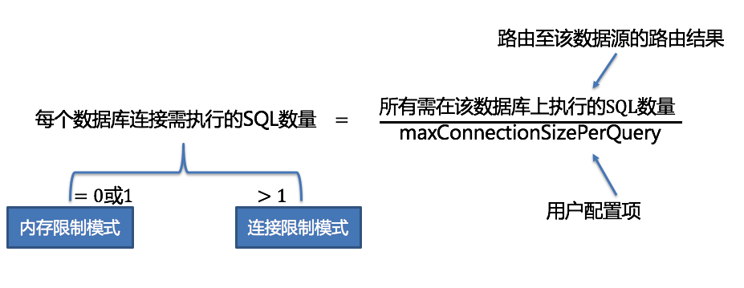

## shardingJDBC内核剖析

sql解析=>查询优化=>sql路由=>sql改写=>sql执行=>结果归并

> DQL：数据查询语句，如select

### 1. 解析引擎

对sql解析，进行词法分析和预发分析，生成语法树

### 2. 路由引擎

#### 2.1 分片路由

根据分片键路由

**直接路由**：通过指定hint值直接分表（即指定该sql路由分片值），sql无需指定分片键。兼容性最好，但不支持分库

**标准路由**：sharding最推荐的路由方式，通过解析sql获得分片键，进行路由。当分片键为等值查询时，路由到单表。当分片键为between或in时，sql最终可能拆分成多个sql

```sql
# 原sql，根据order_id分表
SELECT * FROM t_order WHERE order_id IN (1, 2);
# 解析sql
SELECT * FROM t_order_0 WHERE order_id IN (1, 2);
SELECT * FROM t_order_1 WHERE order_id IN (1, 2);
# 疑问：为什么不优化成 t_order_0 ... order_id in (1)？
# 答：分片路由是全表分。在sql改写时可以实现将sql进行优化成t_order_0 ... order_id in (1)，当ShardingSphere暂时未实现此策略
```

**笛卡尔路由**：连表查询，无法确定绑定关系，产生笛卡尔积路由

#### 2.2 广播路由

不携带分片键的sql，采取广播路由方式，广播路由分为以下几种

**全库表路由**：路由全库表，一般用于sql查询

**全库路由**：对数据库路由，根据逻辑库名找到物理库名执行，如`SET autocommit=0;`

**全实例路由**：用于TCL操作，向用户授权操作

`CREATE USER customer@127.0.0.1 identified BY '123';`

**单播路由**：比如获取表结构信息，单表获取即可`describe table`

**阻断路由**：如切换数据库，实际不生效，因为sharding指定了逻辑库名。`use order_db`

### 3. 改写引擎

#### 正确性改写

对于sql改写，获取到正确路由表名之后，并非全局字符串替换，因为可能出现字符串出现表名、别名引用、别名与表名重名等情况

```sql
# 字符串包含表名
SELECT order_id FROM t_order WHERE order_id=1 AND remarks=' t_order xxx';
# 包含别名引用
SELECT t_order.order_id FROM t_order WHERE t_order.order_id=1 AND remarks=' t_order xxx';
# 别名与表名相同，只要改表名
SELECT t_order.order_id FROM t_order AS t_order WHERE t_order.order_id=1 AND remarks=' t_order xxx';
```

#### 补列

第一种情况是在结果归并前并未获取所需的列，如order by或group by

```sql
# 原sql。若直接路由执行，结果归并时无法排序
SELECT order_id FROM t_order ORDER BY user_id;
# 改写sql
SELECT order_id, user_id FROM t_order ORDER BY user_id;

# 原sql。平均
SELECT AVG(price) FROM t_order WHERE user_id=1;
# 获取总数和数量，最后归并时计算平均结果
SELECT COUNT(price) AS AVG_DERIVED_COUNT_0, SUM(price) AS AVG_DERIVED_SUM_0 FROM t_order WHERE user_id=1;
```

第二种情况是在insert时，若使用数据库自增主键，在分库分表情况下不能保证主键全库表唯一。sharding在这做了优化，实现全库表分布式自增主键，sql自动改写

```sql
INSERT INTO t_order (`field1`, `field2`) VALUES (10, 1);
# 若order_id为自增主键
INSERT INTO t_order (`field1`, `field2`, order_id) VALUES (10, 1, xxxxx);
```

#### 分页修正

分页修正，即limit改写，limit范围改写为limit 0, {起始大小+数量}

```sql
# 原sql
SELECT score FROM t_score ORDER BY score DESC LIMIT 1, 2;
# 拆分sql
SELECT score FROM t_score ORDER BY score DESC LIMIT 0, 3;
SELECT score FROM t_score ORDER BY score DESC LIMIT 0, 3;
```


#### 批量拆分

insert 批量拆分，插入对应表

```sql
INSERT INTO t_order (order_id, xxx) VALUES (1, 'xxx'), (2, 'xxx'), (3, 'xxx');
## 改写sql
INSERT INTO t_order_0 (order_id, xxx) VALUES (2, 'xxx');
INSERT INTO t_order_1 (order_id, xxx) VALUES (1, 'xxx'), (3, 'xxx');
```

in批量拆分，目前sharding未实现，但不能影响最终结果

```sql
SELECT * FROM t_order WHERE order_id IN (1, 2, 3);
## 当前改写结果
SELECT * FROM t_order_0 WHERE order_id IN (1, 2, 3);
SELECT * FROM t_order_1 WHERE order_id IN (1, 2, 3);
```

#### 优化改写

**单节点优化**：无需进行优化改写、无需结果归并

**流式归并改写**：它仅为包含`GROUP BY`的SQL增加`ORDER BY`以及和分组项相同的排序项和排序顺序，用于将内存归并转化为流式归并

### 4. 执行引擎

在sql进行解析改写后，分为多个表路由的情况时，它不是简单把sql发送给jdbc执行，也并非直接将请求放入到线程池中并发执行，而是根据连接的不同而选择

#### 4.1 内存限制模式

针对每个sql创建一个连接，对结果进行流式归并

#### 4.2 连接限制模式

限定逻辑sql路由在每个数据库最多建立一个连接，数据库可以并发执行，对结果进行内存归并

#### 4.3 自动化执行引擎

对于上述内存限制模式和连接限制模式，需要用户去关注，增加学习成本，sharding提供了自动化执行引擎。自动选择连接模式

sharding为数据库实例配置每个sql路由的最大连接数`maxConnectionSizePerQuery`。即当数据库执行的sql数量大于配置时，采用连接限制模式，否则采用内存限制模式。



#### 4.4 死锁

当一次查询需要获取一个数据库两个连接时，若一个一个获取，可能存在死锁的情况。数据库对连接做了优化，对需要获取的连接一次性获取

1. 当获取一个数据库连接时，无需锁定资源，因为不会出现死锁忙等的情况
2. 在内存限制模式才使用资源锁定，在连接限制模式下不存在死锁问题

### 5. 归并引擎

#### 5.1 遍历归并

将结果收集归并

#### 5.2 排序归并

将结果归并后，进行排序

#### 5.3 分组归并

流式归并：采用游标方式完成归并


内存归并：在内存中完成操作

#### 5.4 聚合函数归并

对于MAX和MIN，将分组结果再进行最大最小比较

对于SUM和COUNT，将对分组结果进行累加

对于AVG，需要通过sql改写为获取SUM和COUNT，再计算平均值

#### 5.5 分页归并

limit返回修改，修改为limit 0, {起始值+大小}

```sql
select * from table limit a, b
## 改写
select * from table limit 0, {a+b}
```

## 基本概念

### 不支持项

| sql                                                          | 原因                                                         |
| ------------------------------------------------------------ | ------------------------------------------------------------ |
| INSERT INTO tbl_name (col1, col2, …) VALUES(1+2, ?, …)       | values语句不支持算术表达式<br />（可能很难动态计算value，依赖数据库计算，导致可能无法确定分片键） |
| INSERT INTO tbl_name (col1, col2, …) SELECT col1, col2, … FROM tbl_name WHERE col3 = ? | insert into...select                                         |
| SELECT COUNT(col1) as count_alias FROM tbl_name GROUP BY col1 HAVING count_alias > ? | Having（应该可以实现，结果归并之后再having判断）             |
| SELECT * FROM tbl_name1 UNION SELECT * FROM tbl_name2        | union                                                        |
| SELECT * FROM tbl_name1 UNION ALL SELECT * FROM tbl_name2    | union all                                                    |
| SELECT * FROM ds.tbl_name1                                   | 包含schema                                                   |
| SELECT SUM(DISTINCT col1), SUM(col1) FROM tbl_name           | 使用普通聚合函数和DISTINCT函数                               |

