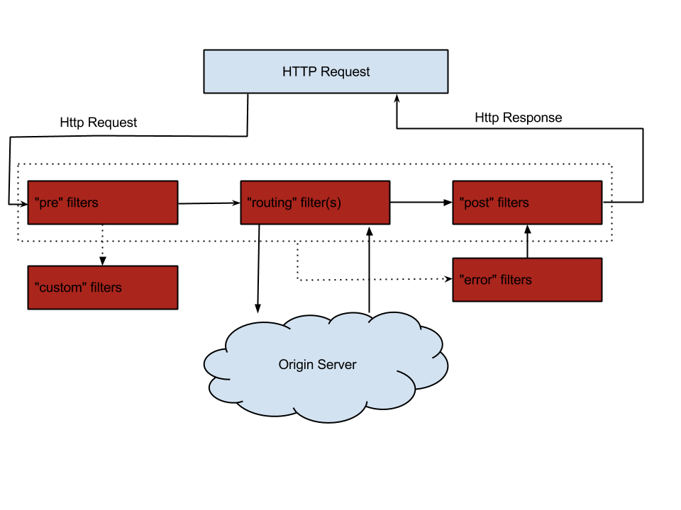

## 一、spring cloud基础

springcloud为分布式系统提供了一套简易模型，轻松开发分布式系统

springcloud是基于springboot，微服务系统架构的一站式解决方案

spring cloud中文网：https://www.springcloud.cc/

spring cloud中文社区：https://www.springcloud.cn/

## 二、微服务中心Eureka

### 2.1 Eureka概述

#### 2.1.1 Eureka简介

Eureka是Netfix开发的服务发现框架，本事是一个基于REST服务，主要用于AWS域，以达到负载均衡和中间层故障转移的目的。springCloud将它集成在spring-cloud-netfix中

Eureka是一个专门用于服务发现的服务器，一些服务注册到该服务器，一些服务通过该服务器查找需要调用的服务。其他可提供服务发现的有zookeeper， consul，Eureka等

#### 2.1.2 Erueka架构


#### 2.1.3 CAP定理

**概念**

CAP定理指在一个分布式系统中，C（consistency）一致性，A（available）可用性，P（partition tolerant） 分区容错性

- C 一致性：分布式系统多个主机的数据保持一致性的特性。当数据发生更新后，多个主机仍能达到数据一致的状态
- A 可用性：系统提供的服务对外一致保证可用性。即对一个请求在一定时间内正常响应
- P 分区容错性：分布式系统在遇到任何分区故障时，仍能保证对外提供一致性和可用性的服务

**定理**

对于分布式系统，网络分区是不可避免的，网络环境相对不可控，必须保证分区容错性。然而一致性和可用性不可兼得，要么CP要么AP

其中zookeeper和eureka作为服务中心，eureka保证AP，zk保证CP

#### 2.1.4 eureka自动保护机制

默认情况下，eurekaServer在90秒内没有检测到服务列表中的服务，则自动将该服务剔除。但是很多情况下并非主机故障，而是网络问题

因此eureka有一个自动保护机制，即当eurekaServer容忍一定的错误，在一定时间内收到的心跳小于阙值，eureka进入自我保护机制：服务列表只可进入读取、写入，不能进行删除操作	，直到eurekaServer收到的心跳数大于阙值才退出自我保护机制

**自动保护配置**

```yml
eureka:
	server:
		# 默认0.85，表示收到的心跳小于应收数据的0.85，就进入自我保护状态
		renewal-percent-threshold: 0.75
		# 自我保护机制开关，默认true
		enable-self-preservation: false
```

#### 2.1.5 Eureka中的region与zone配置

架构图如下


Eureka中具有Region和Availability Zone（简称AZ）概念，是云计算的概念

Region表示区域，大型云服务一般会根据固定省份、城市床架不同的机房，这些不同机房一般是不能”内网连通“的，这些区域成为Region

为了提高容灾能力，一个域又存在好几个AZ，这些AZ内网连通，且用户可以根据自己的需求选择不同的AZ，当指定AZ出现问题时系统自动切换到其他AZ

每个AZ中有多个eruekaServer，为service提供服务

## 三、OpenFeign与Ribbon

### 3.1 Ribbon

spring cloud ribbon是一个基于http和tcp的客户端负载均衡工具，基于Netflix Ribbon实现

注入一个的restTemplate，后续直接注入使用即可。@LoadBalanced表示支持负载均衡

```java
@Bean
@LoadBalanced
public RestTemplate restTemplate() {
  return new RestTemplate();
}
```

### 3.2 OpenFeign

OpenFeign可以将提供者提供的RestFul服务伪装为接口进行消费。消费者只需使用 feign接口+注解的方式即可调用服务提供者提供的restful服务。OpenFeign就是feign加上spring mvc那一套注解

feign内部集成了ribbon

1. 引入包

```xml
<!--openfeign --> 
<dependency>
   <groupId>org.springframework.cloud</groupId>
   <artifactId>spring-cloud-starter-openfeign</artifactId>
</dependency>
<!--feign -->
<dependency>
  <groupId>org.springframework.cloud</groupId>
  <artifactId>spring-cloud-starter-feign</artifactId>
</dependency>
```

2. 服务提供者注册服务，如erueka，启动类上添加 @EnableEurekaClient。配置服务名 spring.application.name
3. 服务调用者，配置类开启feign client配置。@EnableFeignClients
4. 创建feign client

```java
import com.ysc.exercise.springcloud.consumer.dto.Product;
import org.springframework.cloud.openfeign.FeignClient;
import org.springframework.web.bind.annotation.GetMapping;
import org.springframework.web.bind.annotation.PathVariable;
import org.springframework.web.bind.annotation.RequestMapping;

@FeignClient(name = "producer-8081")
@RequestMapping("temp")
public interface ProducerTempClient {
    @GetMapping("hello")
    String hello();

    @GetMapping("product/get/{id}")
    Product getById(@PathVariable Integer id);
}
```

**feign超时配置**

```yml
feign:
  client:
    config:
      default:
        # 连接超时时间
        connectTimeout: 2000
        # 读超时时间
        readTimeout: 5000
      # 配置name=producer-8081的feignClient
      producer-8081:
        readTimeout: 2000
```

**feign压缩配置**

```yml
feign:
	# feign支持对请求和响应进行压缩以提高通信效率
  compression:
    # 请求压缩的配置
    request:
      enabled: true
      mime-types: ["text/xml", "application/xml", "application/json"]
      min-request-size: 2048
    # 响应压缩的配置
    response:
      enabled: true
```

### 3.3 负载均衡策略

#### 3.3.1 内置负载均衡策略

**1. RoundRoBinRule**：轮询策略。ribbon默认，若经过一轮没有找到可用的provider，其最多轮询10轮，最终还没找到，返回null

**2.RetryRule：**重试策略。先按照RoundRoBinRule获取，若获取失败则在指定的时限内重试。默认500ms

**3. BestAvaiableRule**：最可用策略，选择并发量最小的provider发送，即连接的消费者数量最少

**4. WeightedResponseTimeRule**：根据provider平均响应时间计算权重，响应越快权重越大，被选择的概率即越高。刚启动时采用轮询策略

> 省略其他不常用的策略

#### 3.3.2 更换负载均衡策略

**添加包**

```xml
 <dependency>
   <groupId>com.netflix.ribbon</groupId>
   <artifactId>ribbon-loadbalancer</artifactId>
   <version>2.3.0</version>
</dependency>
```

**修改配置文件**：

```yml
# 选择要负载的服务名
producer-8081:
  ribbon:
    # 负载均衡策略
    NFLoadBalancerRuleClassName: com.netflix.loadbalancer.RandomRule
```

**注册负载均衡策略**

```java
@Bean
public IRule loadBalanceRule() {
  return new RoundRobinRule();
}
```

**自定义负载均衡策略，实现IRule**


## 四、Hystrix服务熔断与降级

### 4.1 用法

#### 4.1.1 fallbackMethod服务降级

1.引入包

```xml
<dependency>
  <groupId>org.springframework.cloud</groupId>
  <artifactId>spring-cloud-starter-netflix-hystrix</artifactId>
  <version>2.2.6.RELEASE</version>
</dependency>
```

2. 修改

```java
@HystrixCommand(fallbackMethod = "getHystrix")
@GetMapping("error")
public String error() {
  throw new RuntimeException("自主抛出异常");
}

public String getHystrix() {
  return "服务被降级";
}
```

3. 启动类上添加注解@EnableCircuitBreaker

> 或者使用@SpringCloudApplication，该注解集成了多个注解

#### 4.1.2 fallbackFactory服务降级

当一个类存在方法级和类级降级时，方法级优先级更高

实现FallbackFactory<T>，并配置为@Component

#### 4.1.3 feign服务降级

该方案会直接将feignMethod屏蔽掉

```java
package com.ysc.exercise.springcloud.consumer.client;

import com.ysc.exercise.springcloud.consumer.dto.Product;
import org.springframework.cloud.openfeign.FeignClient;
import org.springframework.web.bind.annotation.GetMapping;
import org.springframework.web.bind.annotation.PathVariable;
import org.springframework.web.bind.annotation.RequestMapping;

@FeignClient(value = "producer-8081", fallback = ProducerTempClientHystrix.class)
@RequestMapping("temp")
public interface ProducerTempClient {
    @GetMapping("hello")
    String hello();

    @GetMapping("product/get/{id}")
    Product getById(@PathVariable Integer id);

    @GetMapping("sleep/{second}")
    String sleep(@PathVariable int second);

    @GetMapping("error")
    String error();
}
```

```java
package com.ysc.exercise.springcloud.consumer.client;

import com.ysc.exercise.springcloud.consumer.dto.Product;
import org.springframework.stereotype.Component;
import org.springframework.web.bind.annotation.RequestMapping;
@Component
@RequestMapping("fallback/temp")
public class ProducerTempClientHystrix implements ProducerTempClient {
    @Override
    public String hello() {
        return null;
    }

    @Override
    public Product getById(Integer id) {
        return null;
    }

    @Override
    public String sleep(int second) {
        return "sleep()被降级";
    }

    @Override
    public String error() {
        return "error()降级";
    }
}
```

### 4.2 Hystrix高级属性配置

#### 4.2.1 执行隔离策略

对依赖请求的数量进行限制的策略，称为执行隔离

执行隔离的作用：防止服务熔断，防止服务雪崩

**(1) 类型**

- 线程隔离：默认隔离策略，系统创建一个依赖线程池，为每个依赖分配一个线程，当线程分配完成则请求阻塞
- 信号量隔离：为每个依赖分配一个信号量，信号量分配的数量决定并发数量，以及阻塞的情况

**(2)修改策略**

```properties
hystrix.command.default.execution.isolation.strategy=thread
hystrix.command.default.execution.isolation.strategy=semaphore
```

#### 4.2.2 执行隔离其他属性

**（1）线程执行超时时限**

```properties
# 执行超时时间开关，默认true开启
hystrix.command.default.execution.timeout.enabled
# 执行隔离时间阙值，超过该时间执行隔离。默认1000毫秒
hystrix.command.default.execution.isolation.thread.timeoutInMilliseconds
```

**（2）超时中断**

```properties
# 超时即中断 开关，默认true开启
hystrix.command.default.execution.isolation.thread.interruptOnTimeout
```

**（3）取消中断**

```properties
# 若请求取消，则判定为中断。默认false表示取消不中断
hystrix.command.default.execution.isolation.thread.interruptOnCancel
```

**（4）信号量个数**

```properties
# 若采用信号量策略，该属性控制信号量个数，即请求处理的并发量
hystrix.command.default.execution.isolation.semaphore.maxConcurrentRequests
```

#### 4.2.3 服务熔断属性

```properties
# 服务熔断开关，默认true
hystrix.command.default.circuitBreaker.enabled
# 熔断器开启阙值，即在一定时间内（10s）请求数量超过了该配置的最大数量（默认20），则开启熔断器。熔断器开启后解决一切服务，关闭接收一切服务
hystrix.command.default.circuitBreaker.requestVolumeThreshold
# 熔断时间窗，当熔断器设置该属性的时长后，熔断器会尝试关闭，以恢复熔断服务。默认5000毫秒
hystrix.command.default.circuitBreaker.sleepWindowInMilliseconds
# 熔断错误率，当请求的错误率超过该阙值后则开启熔断器，默认50，即50%
hystrix.command.default.circuitBreaker.errorThresholdPercentage
# 强制开启熔断器，无需条件直接开启，拒绝所有请求。默认false
hystrix.command.default.circuitBreaker.forceOpen
# 强制关闭熔断器，无需条件直接关闭，通过所有请求。默认false
hystrix.command.default.circuitBreaker.forceClosed
```

#### 4.2.4 线程池相关属性


### 4.3 Dashboard监控仪表盘

以GUI的形式展示消费者的情况，包括处理器方法与service方法调用执行情况，熔断器CircuidBreaker的状态等

## 五、微服务网关ZUUL

网关是系统唯一的对外入口，介于客户端与服务端之间，用于实现鉴权、限流、路由、监控等功能

### 5.1 网关zuul

可以自定义路径来代替服务名，即自定义策略。保证安全性

### 5.1.1 路由前缀

通过统一路由前缀对请求进行归档

### 5.1.2 服务名屏蔽

可以通过路径访问到指定的服务名。为防止服务侵入，可以将服务名称屏蔽

```yml
zuul:
	# 指定统一前缀
	prefix: /zuul
	# 屏蔽所有微服务名称
	ignored-services: "*"
	# 屏蔽指定的微服务名称
	# ignored-service: 'producer'
	# 屏蔽指定路径
	ignored-patterns: /**/list/**
	# 指定token屏蔽
	sensitive-headers: token
  routes:
  	#指定微服务的路径幽静
  	producer-8081: /p1
  	producer-8082: /p2
	
```

### 5.1.3 路径屏蔽

屏蔽指定路径URI

### 5.1.4 请求头屏蔽

默认情况下，cookie、set-cookie等敏感请求头信息会被zuul屏蔽掉，也可以指定屏蔽的请求头

### 5.2 请求过滤

zuul在请求之前、中、后都可以进行请求过滤

#### 5.2.1 路由过滤架构



#### 5.2.2 实现

创建实现ZuulFilter的过滤器组件

### 5.3 限流

#### 5.3.1 漏桶算法

把请求当成水，用一定容量的桶承接。桶底部有一个出水口，以恒定速率消费请求。当请求积压量大于桶容量，则桶溢出，直接丢弃新请求

请求处理速率固定

#### 5.3.2 令牌桶算法

以固定的速率生成令牌，放入桶中。针对每个请求，都需要获取令牌才能处理，当桶中无令牌则拒绝该请求。

可快速处理一定量的突发请求

google的开源项目guava项目的RateLimiter使用就是令牌桶算法

#### 5.4 灰度发布

## 六、分布式配置管理

