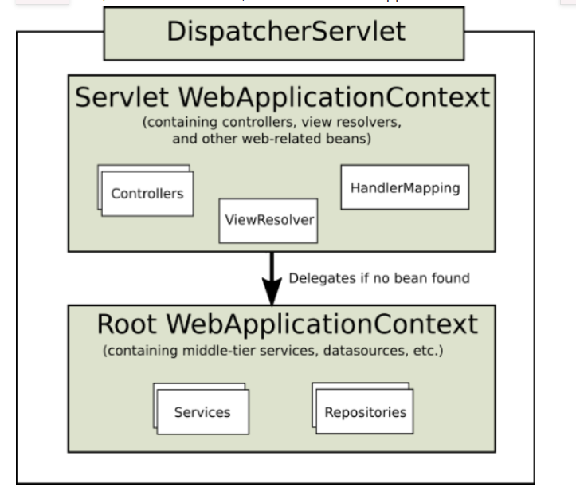

[TOC]

# 基本介绍

## 基础概念

### BS和CS开发架构

- BS架构，浏览器-服务器架构
- CS架构，客户端-服务器架构

> 目前大部分Java开发都是基于BS架构的，应用系统分为标准三层架构：表现层、业务层、持久层

JaveEE制定了一套规范，进行BS架构的处理，这套规范就是Servlet

### 应用系统三层架构

- 表现层
  - web层，负责接收客户端请求，返回相应结果。通常客户端使用http协议请求web层
  - 表现层包含展示层和控制层：控制层负责接收请求
  - 表现层接到请求后会调用业务层
- 业务层
  - service层，负责处理业务逻辑。业务层可能依赖持久层，获取数据
- 持久层
  - dao层，负责数据持久化

### MVC设计模式

- model（模型）：包括业务模型和数据模型，数据模型用于封装数据，业务模型用于处理业务
- view（视图）：展示页面。通常指jsp或html
- controller（控制器）：处理业务逻辑

## SpringMVC介绍

SpringMVC是一种基于MVC设计模式的请求驱动类型的轻量级web框架，属于springframework的产品。是目前比较主流的MVC框架，已超越struct2

通过一套注解，能简单的编写请求控制器，支持Restful的请求

### 六大组件说明

#### 1.前端控制器 DispatcherServlet

用户请求到达前端控制器，它就相当于mvc模式中的C，dispatcherServlet是整个流程控制的中心，

由它调用其它组件处理用户的请求，dispatcherServlet的存在降低了组件之间的耦合性。

#### 2.处理器映射器HandlerMapping

作用：保存handler，对外根据url查询处理器。

> Map<String, Object> 存储handler，key为url，value为handler

前端控制器调用handlerMapping，返回handlerExecutionChain（包括拦截器和处理器）

#### 3.处理器适配器HandlerAdapter

作用：适配；执行处理器

前端控制器根据类型匹配对应处理器适配器，一个类型对应一种处理器适配器。目前存在适配器类型

1. HttpRequestHandlerAdapter：将httpRequestHandler适配成handlerAdapter
2. SimpleHandlerAdapter：将simpleHandler适配成handlerAdapter
3. RequestMappingAdapter：将注解方式处理器适配成handlerAdapter

#### 4.处理器Handler

处理业务请求，由程序员控制。目前存在处理器类型

1. 自定义处理器
2. HttpRequestHandler接口（标准）
3. SimpleControllerHandler接口
4. 注解方式的处理器 @Controller

#### 5.视图解析器ViewResolve

接收前端控制器传入的ModelAndView，将其解析成View，填充数据，返回。默认InternalResourceViewResolver类

#### 6.视图渲染器

将视图美化渲染，返回。视图解析器中自带，大部分视图解析器中都没有视图渲染器

#### mvc流程处理

1. 用户发送请求至前端控制器DispatcherServlet
2. DispatcherServlet收到请求调用处理器映射器HandlerMapping
3. 处理器映射器根据请求url找到具体的处理器，生成处理器执行链HandlerExecutionChain（包括处理器对象和处理器拦截器）一并返回给DispatcherServlet
4. DispatcherServlet根据Handler获取处理器适配器HandlerAdapter并执行HandlerAdapter处理一系列的操作。如参数封装，数据格式装换，数据验证等操作
5. 拦截器前置处理
6. 处理器执行器执行处理器Handler（Controller，也叫页面控制器），返回ModelAndView
7. HandlerAdapter将Handler执行结果ModelAndView返回到DispatcherServlet
8. 拦截器后置处理
9. DispatcherServlet将ModelAndView传给ViewReslover视图解析器(多个)解析，解析成View（生成页面）
11. 视图渲染器对View进行渲染视图（视图美化）
12. DispatcherServlet返回给客户端

# 项目搭建

## 入门工程

添加mvc依赖、jstl依赖和servlet-api依赖

### pom.xml

```xml
<?xml version="1.0" encoding="UTF-8"?>
<project xmlns="http://maven.apache.org/POM/4.0.0"
         xmlns:xsi="http://www.w3.org/2001/XMLSchema-instance"
         xsi:schemaLocation="http://maven.apache.org/POM/4.0.0 http://maven.apache.org/xsd/maven-4.0.0.xsd">
    <modelVersion>4.0.0</modelVersion>
    <groupId>com.ysc</groupId>
    <version>1.0.SNAPSHOT</version>
    <artifactId>springmvc</artifactId>
    <packaging>war</packaging>

    <dependencies>
        <!-- spring MVC依赖包 -->
        <dependency>
            <groupId>org.springframework</groupId>
            <artifactId>spring-webmvc</artifactId>
            <version>5.0.7.RELEASE</version>
        </dependency>

        <!-- jstl -->
        <dependency>
            <groupId>javax.servlet</groupId>
            <artifactId>jstl</artifactId>
            <version>1.2</version>
        </dependency>

        <!-- servlet -->
        <dependency>
            <groupId>javax.servlet</groupId>
            <artifactId>servlet-api</artifactId>
            <version>2.5</version>
            <scope>provided</scope>
        </dependency>

    </dependencies>
    <build>
        <plugins>
            <!-- 配置Maven的JDK编译级别 -->
            <plugin>
                <groupId>org.apache.maven.plugins</groupId>
                <artifactId>maven-compiler-plugin</artifactId>
                <version>3.2</version>
                <configuration>
                    <source>1.8</source>
                    <target>1.8</target>
                    <encoding>UTF-8</encoding>
                </configuration>
            </plugin>

            <plugin>
                <groupId>org.apache.tomcat.maven</groupId>
                <artifactId>tomcat7-maven-plugin</artifactId>
                <version>2.2</version>
                <configuration>
                    <path>/</path>
                    <port>8080</port>
                </configuration>
            </plugin>
        </plugins>
    </build>

</project>
```

### 配置文件

添加web.xml文件至目录 webapp/WEB-INF/

```xml
<?xml version="1.0" encoding="UTF-8"?>
<web-app xmlns:xsi="http://www.w3.org/2001/XMLSchema-instance"
   xmlns="http://java.sun.com/xml/ns/javaee"
   xsi:schemaLocation="http://java.sun.com/xml/ns/javaee http://java.sun.com/xml/ns/javaee/web-app_2_5.xsd"
   version="2.5">
   <!-- 学习前置条件 -->
   <!-- 问题1：web.xml中servelet、filter、listener、context-param加载顺序 -->
   <!-- 问题2：load-on-startup标签的作用，影响了servlet对象创建的时机 -->
   <!-- 问题3：url-pattern标签的配置方式有四种：/dispatcherServlet、 /servlet/* 、* 、/ ,以上四种配置，优先级是如何的 -->
   <!-- 问题4：url-pattern标签的配置为/*报错，原因是它拦截了JSP请求，但是又不能处理JSP请求。为什么配置/就不拦截JSP请求，而配置/*，就会拦截JSP请求 -->
   <!-- 问题5：配置了springmvc去读取spring配置文件之后，就产生了spring父子容器的问题 -->

   <!-- 配置前端控制器 -->
   <servlet>
      <servlet-name>springmvc</servlet-name>
      <servlet-class>org.springframework.web.servlet.DispatcherServlet</servlet-class>
      <!-- 设置spring配置文件路径 -->
      <!-- 如果不设置初始化参数，那么DispatcherServlet会读取默认路径下的配置文件 -->
      <!-- 默认配置文件路径：/WEB-INF/springmvc-servlet.xml -->
      <init-param>
         <param-name>contextConfigLocation</param-name>
         <param-value>classpath:springmvc.xml</param-value>
      </init-param>
      <!-- 指定初始化时机，设置为2，表示Tomcat启动时，DispatcherServlet会跟随着初始化 -->
      <!-- 如果不指定初始化时机，DispatcherServlet就会在第一次被请求的时候，才会初始化，而且只会被初始化一次 -->
      <load-on-startup>2</load-on-startup>
   </servlet>
   <servlet-mapping>
      <servlet-name>springmvc</servlet-name>
      <!-- URL-PATTERN的设置 -->
      <!-- 不要配置为/*,否则报错 -->
      <!-- 通俗解释：/*，会拦截整个项目中的资源访问，包含JSP和静态资源的访问，对于静态资源的访问springMVC提供了默认的Handler处理器 -->
      <!-- 但是对于JSP来讲，springmvc没有提供默认的处理器，我们也没有手动编写对于的处理器，此时按照springmvc的处理流程分析得知，它短路了 -->
      <url-pattern>/</url-pattern>
   </servlet-mapping>
</web-app>
```

添加springmvc.xml文件，DispatcherServlet启动会加在该文件，上面已配置。地址resources/

```xml
<?xml version="1.0" encoding="UTF-8"?>
<beans xmlns="http://www.springframework.org/schema/beans"
   xmlns:xsi="http://www.w3.org/2001/XMLSchema-instance"
   xmlns:context="http://www.springframework.org/schema/context"
   xmlns:mvc="http://www.springframework.org/schema/mvc"
   xsi:schemaLocation="http://www.springframework.org/schema/beans
        http://www.springframework.org/schema/beans/spring-beans.xsd
        http://www.springframework.org/schema/context
        http://www.springframework.org/schema/context/spring-context.xsd
        http://www.springframework.org/schema/mvc
        http://www.springframework.org/schema/mvc/spring-mvc.xsd">

    <!-- 配置处理器Bean的读取 -->
   <!-- 扫描controller注解,多个包中间使用半角逗号分隔 -->
   <context:component-scan base-package="com.ysc.controller"/>
    
    <!-- 配置三大组件之处理器适配器和处理器映射器 -->
    <!-- 内置了RequestMappingHandlerMapping和RequestMappingHandlerAdapter等组件注册-->
    <mvc:annotation-driven />   
    
    <!-- 配置三大组件之视图解析器 -->
    <!-- InternalResourceViewResolver:默认支持JSP视图解析-->
    <!-- 完整路径：   /WEB-INF/jsp/xxx.jsp -->
    <bean class="org.springframework.web.servlet.view.InternalResourceViewResolver">
      <property name="prefix" value="/WEB-INF/jsp/" />
      <property name="suffix" value=".jsp" />
   </bean>
</beans>
```

### 编码部分

#### Controller

处理器开发方式有很多

- 实现HttpRequestHandler接口
- 实现Controller接口
- 使用注解@Controller（推荐）

> @Controller注解的类中的每个@RequestMapping注解的方法，最终都会转换为HandlerMethod类，这个类就是springmvc真正意义上的处理器

# 应用掌握篇

## 返回值处理

### 不使用注解

#### ModelAndView

controller中可返回ModelAndView，对象中可添加Model数据、指定view

#### void

不返回，在放入参数上添加request和response

```java
void service(HttpServletRequest request,HttpServletResponse response){}

// 1.通过request转发
request.getRequestDispatcher("页面路径").forward(request, response);
// 2.通过response重定向
response.sendRedirect("url")
// 3.通过response指定返回结果
response.setCharacterEncoding("utf-8");
response.setContentType("application/json;charset=utf-8");
response.getWriter().write("json串");
```

#### String(推荐)

```java
//1.逻辑视图名
return "item/list";
// 2.重定向
return "redirect:itemList";
//3.转发
return "forward:itemList";
```

> 重定向与转发：重定向是客户端行为，地址有两个，两次请求；转发是服务端行为，地址仅一个，一次请求，较快

### 使用注解

#### @ResponseBody

ResponseBody根据Controller返回的类型，选择内置的9中HttpMessageConverter匹配

HttpMessageConverter分为两步处理

1. 指定HttpServletResponse的ContentType值
2. 将数据放入到HttpServletResponse的响应体中

**MappingJacksonHttpMessageConverter**

- 处理POJO返回类型。系统默认使用该处理器处理POJO对象类型，转换成json字符串返回
- 将ContentType设置为application/json;charset=utf-8
- 调用response.getWriter()将json格式的字符串返回给调用方

**StringHttpMessageConverter**

- 处理String类型
- 将ContentType设置为text/plain;charset=utf-8
- 调用response.getWriter()将String格式的字符串返回给调用方

## 参数绑定处理

参数绑定是将请求参数串中的value获取到之后，转换为相应的对象传给controller参数

请求参数都是String类型，转换对象有String、POJO等类型

### 默认的参数绑定

存在部分默认的绑定参数，这些参数可以直接添加controller方法入参中，处理器适配器自动识别并匹配

- HttpServletRequest：通过request对象获取请求信息
- HttpServletResponse：通过response对象传递信息
- HttpSession：获取session中的信息
- InputStream、OutputStream、Reader、Writer、Model、ModelMap

### 参数绑定使用要求

#### 简单类型

要求请求中的key和controller的字段名一致，当不一致时需要使用注解@RequestParam指定value来变更字段名

**@RequestParam**

- value：入参字段名
- required：是否必传，默认true

#### POJO类型

要求表单数据中的数据与POJO形参属性名一致

#### 集合或数组类型

使用数组接收，String[]， 不能使用List

### 自定义日期格式绑定

不支持识别任意格式日期，需要添加转换器

Converter

```java
public class DateConverter implements Converter<String, Date> {
@Override
public Date convert(String source) {
SimpleDateFormat simpleDateFormat = new SimpleDateFormat("yyyy-MM-dd");
try {
return simpleDateFormat.parse(source);
} catch (ParseException e) {
e.printStackTrace();
}
return null;
}
}
```

Converter配置

```xml
<!-- 加载注解驱动 -->
<mvc:annotation-driven conversion-service="conversionService"/>
<!-- 转换器配置 -->
<bean id="conversionService" class="org.springframework.format.support.FormattingConversionServiceFactoryBean">
<property name="converters">
<set>
<bean class="com.kkb.ssm.controller.converter.DateConverter"/>
</set>
</property>
</bean>
```

### 文件格式参数绑定

1.添加依赖包

```xml
<dependency>
<groupId>commons-fileupload</groupId>
<artifactId>commons-fileupload</artifactId>
<version>1.3.1</version>
</dependency>
```

2.上传文件页面表单处需要指定 enctype=”multipart/form-data”

> Application/x-www-form-urlencoded: 会对中文进行URL编码，并且以多个参数使用&连接，上传文件只能上传文件名
>
> Text/plain: 纯文本形式，不会对中文进行URL编码，不会使用&连接多个参数，上传文件只能上传文件名

3.配置Multipart解析器。在springmvc.xml中添加解析器

```xml
<!-- multipart类型解析器，文件上传 -->
<bean id="multipartResolver"
class="org.springframework.web.multipart.commons.CommonsMultipartResolver">
<!-- 上传文件的最大尺寸 5M-->
<property name="maxUploadSize" value="5242880"/>
</bean>
```

4.Controller使用MultipartFile接收文件

## @RequestMapping

用于映射url和HandlerMethod方法，可作用于类或方法上

属性

- method：请求方式，get、post、delete、put
- params属性：过滤。

> 如 params={"name", "price>500"} ：只能接收存在name字段且price大于500的请求

> @RequestMapping若不指定方法，则表示该方法路径支持所有的请求类型。@GetMapping表示Get方式的@RequestMapping

## RESTful支持

- URI：统一资源标识符，粗略概念。如www.baidu.com/item
- URL：统一资源定位符，详细地址，URL是URI的子集。如www.baidu.com/item/1.html

### RESTful

- 资源：网络上的实体，可以是图片、文本、歌曲等具体资源，每个资源都有一个特定URI
- 状态转化：每发出一个http请求，就代表客户端与服务端的一次交互过程。http协议是无状态的，客户端需要操作服务器改变其资源，就需要一种状态转换。常用以下四种
  - get：获取资源
  - post：新建资源
  - put：更新资源
  - delete：删除资源

### SpringMVC对RESTful的支持

@PathVariable：可以解析url中的模板变量

```java
// http://localhost:8080/item/3/size
@RequsetMapping("item/{id}/{property}", )
public String getItem(@PathVariable Integer id, @PathVariable String property) {
}
```

#### 静态资源访问

如果在DispatcherServlet中设置url-pattern为/则必须对静态资源做特殊处理，否则会被拦截

在springmvc.xml中添加以下标签。springmvc就会把mapping映射到ResourceHttpRequestHandler，静态资源转发是就能找到对应的处理器了

```xml
<mvc:resources location="/js/" mapping="/js/" />
<mvc:resources location="/css/" mapping="/css/" />
```

## 拦截器应用

springmvc的拦截器interceptor实现对每一个请求处理前后进行相关的业务处理，类似于servlet中的filter。

在springmvc中定义一个拦截器的方法

- 实现HandlerInterceptor接口，或继承其实现类，比如HandlerInterceptorAdapter
- 实现springmvc的WebRequestInterceptor接口，或继承其实现类

### 定义拦截器

继承HandlerInterceptor，该接口有三个方法待实现

- preHandler：handler执行前调用，判断是否拦截请求，true表示放行
- postHandler：handler执行后并在返回ModelAndView前调用，可对ModelAndView对象进行操作
- afterCompletion：执行完handler之后调用。应用场景：统一日志处理、统一异常处理

### 配置拦截器

可配置全局拦截器和指定HandlerMapping拦截器

```xml
<!-- 配置全局mapping的拦截器 -->
<mvc:interceptors>
  <!-- 公共拦截器可以拦截所有请求，而且可以有多个 -->
  <bean class="com.kkb.ssm.interceptor.MyHandlerInterceptor" />
  <bean class="com.kkb.ssm.interceptor.MyHandlerInterceptor2" />
  <!-- 如果有针对特定URL的拦截器，则进行以下配置 -->
  <mvc:interceptor>
    <!-- /**表示所有URL和子URL路径 -->
    <mvc:mapping path="/orders/**" />
    <!-- 特定请求的拦截器只能有一个 -->
    <bean class="com.kkb.ssm.interceptor.MyHandlerInterceptor3" />
  </mvc:interceptor>
</mvc:interceptors>
```

> 若匹配到多个拦截器，按照从上往下进行优先级排序。preHandler方法优先级高的先执行，postHandler和afterCompletion方法优先级低的先执行

## Cors跨域

浏览器因为安全问题，配置了同源策略。即相同DNS域名、端口、协议的为同源。同源的页面下才能进行js和dom操作，若非同源则任何dom操作都是禁止的。不同源下的访问称为跨域访问。

下面表格中a.js无法获取b.js的内容

端口号不同http://www.baidu.com/a.js vs. http://www.baidu.com:8080/b.js

主域相同子域不同http://www.baidu.com/a.js vs. http://blog.baidu.com/b.js

协议不同http://www.baidu.com/a.js vs. https://www.baidu.com/b.js

域名不同http://www.baidu.com/a.js vs. http://www.qq.com/b.js

域名和对应ip http://www.baidu.com/a.js vs. http://192.168.2.2/b.js

> 若不存在同源策略可能会存在安全的一些列问题

### 如何解决跨越

从两方面考虑

- 避开ajax请求方式
- 解约同源限制的问题

解决跨域的方式

- 基于javascript的src方式
- 基于jquery的JSONP方式。只能进行get提交
- 基于CORS的方式（解决同源）。支持get和post

### CORS

- cors是一个w3c标准，跨站资源共享(cross-origin resource sharing)
- 它允许浏览器向跨源服务器发出XmlHttpRequest请求，从而克服了AJAX只能同源的限制
- 需要浏览器支持。IE版本不得低于10
- CORS原理
  - 客户端自动向请求头注入origin
  - 服务端向响应头注入Access-Control-Allow-Origin
  - 浏览器检查到Access-Control-Allow-Origin就可以进行跨源

### 客户端跨源处理

请求分为简单请求和复杂请求两种

满足一下两种条件的为简单请求

1. 请求访问为其中之一：HEAD、GET、POST
2. http请求头信息不超出以下资源
   1. Accept
   2. Accept-Language
   3. Content-Language
   4. Last-Event-ID
   5. Content-Type：仅限三个值，application/x-www-form-urlencoded, multipart/form-data, text/plain

#### 简单请求

请求头中增加字段origin

- Origin: 请求必须，表示请求源地址信息。协议+域名+端口

响应头中包含

- Access-Control-Allow-Origin：必须，服务器返回，要么是请求时origin的值，要么是*，表示接收任何域名的的请求
- Access-Control-Allow-Credentials: 服务器返回可选，表示服务端是否允许跨域发送cookie，默认cookie不在跨越请求中。即使服务器跨越支持cookie，请求段也需要在ajax请求中设置withCredentials=true属性，否则浏览器发送不会携带cookie。另外要发送cookie，Access-Control-Allow-Origin就不能配置*而需要设置具体地址
- Access-Control-Expose-Headers：可选。cors跨越请求时，XMLHttpRequest的getResponseHeader()`方法只能拿到6个基本字段：`Cache-Control`、`Content-Language`、`Content-Type`、`Expires`、`Last-Modified`、`Pragma。如果想拿到更多字段，就必须在Access-Control-Expose-Headers中指定

#### 非简单请求

非简单请求的cors请求，在正式通信之前先发送一次http预检请求。浏览器先询问当前网页所在域名是否允许跨域访问，以及支持哪些http动词和头信息字段，只有得到肯定答复，才能继续发送XmlHttpRequest请求

**预检请求**

预检请求的请求方式为OPTIONS，主要包含以下特殊字段

- Access-Control-Request-Method：必须。表示cors请求会用到哪些方法

- Access-Control-Request-Headers：表示会额外发送的头信息

服务器收到预检请求后，检查origin、Access-Control-Request-Method和Access-control-request-header字段后，确认允许跨越，便可做出响应

```
OPTIONS /cors HTTP/1.1
Origin: http://api.bob.com
Access-Control-Request-Method: PUT
Access-Control-Request-Headers: X-Custom-Header
Host: api.alice.com
Accept-Language: en-US
Connection: keep-alive
User-Agent: Mozilla/5.0...
```

**预检请求的回应**

- Access-Control-Allow-Methods：必须，服务器返回。表示服务器支持的所有跨越方法
- Access-Control-Allow-Headers：服务器返回。如果浏览器请求包含Access-Control-Request-Headers字段，则Access-Control-Allow-Headers是必须的，表示服务器所支持的所有头信息
- Access-Control-Max-Age：服务器可选。用来指定本次预检的有效期
- Access-Control-Allow-Credentials：与简单请求含义一致

```
HTTP/1.1 200 OK
Date: Mon, 01 Dec 2008 01:15:39 GMT
Server: Apache/2.0.61 (Unix)
Access-Control-Allow-Origin: http://api.bob.com
Access-Control-Allow-Methods: GET, POST, PUT
Access-Control-Allow-Headers: X-Custom-Header
Content-Type: text/html; charset=utf-8
Content-Encoding: gzip
Content-Length: 0
Keep-Alive: timeout=2, max=100
Connection: Keep-Alive
Content-Type: text/plain
```

**若通过预检请求，以后每次CORS请求都像简单请求一样，浏览器自动为请求添加origin**

### 服务端跨域实现

#### 跨越实现

springmvc4.x以上可以通过注解@CrossOrigin解决跨域，可以作用域类上或方法上

在springmvc.xml上配置：

```xml
<mvc:cors>
  <mvc:mapping path="/**" />
</mvc:cors>
```


## 父子容器



上图展示了两个ApplicationContext

- Servlet WebApplicationContext：对J2EE三层架构中的web层进行配置，如控制（controller），视图解析器（viewResolver）。通过springmvc中的DispatcherServlet加载配置
- Root WebApplicationContext：对J2EE三层架构中业务层和持久层进行配置。一般通过ContextLoaderListener来加载。

ContextLoaderListener会先被初始化，生成Root WebApplicationContext。DispatcherServlet再初始化时，会根据<init-param\>元素中ContextConfigLocation配置的文件路径，创建Servlet WebApplicationContext，同时会先查找Root WebApplicationContext是否存在，并将它设置称自己的parent加载器。（双亲委派原则）

```xml
<!-- 配置前端控制器 -->
<servlet>
   <servlet-name>ssm</servlet-name>
   <servlet-class>org.springframework.web.servlet.DispatcherServlet</servlet-class>
   <init-param>
      <param-name>contextConfigLocation</param-name>
      <param-value>classpath:spring/springmvc.xml</param-value>
   </init-param>
   <load-on-startup>2</load-on-startup>
</servlet>
<servlet-mapping>
   <servlet-name>ssm</servlet-name>
   <url-pattern>/</url-pattern>
</servlet-mapping>

<!-- 指定持久层和业务层的spring配置文件路径 -->
<context-param>
   <param-name>contextConfigLocation</param-name>
   <param-value>classpath:spring/applicationContext-*.xml</param-value>
</context-param>
<listener>
   <listener-class>org.springframework.web.context.ContextLoaderListener</listener-class>
</listener>
```

# 应用了解篇

## Mock测试

## @ControllerAdvise

配置@ExceptionHandler进行全局异常处理

# 源码阅读

## 1. springmvc源码

引入包

```xml
<dependency>
	<groupId>org.springframework</groupId>
  <artifactId>spring-webmvc</artifactId>
</dependency>
```

### 1.1 类解析

#### 1.1.1 Servlet生命周期

- init：bean初始化调用
- service：servlet对象被http请求访问时调用
- destroy：servlet对象被销毁时调用

#### 1.1.2 InitializingBean接口

spring初始化有两种方式：

- 实现initializingBean接口，在bean初始化时会调用afterPropertiesSet方法
- 通过反射调用配置中的`init-method`属性指定的方法
  - 系统调用`initializingBean`的初始化方法，然后再调用`init-method`指定的方法

接口配置的效率较高

