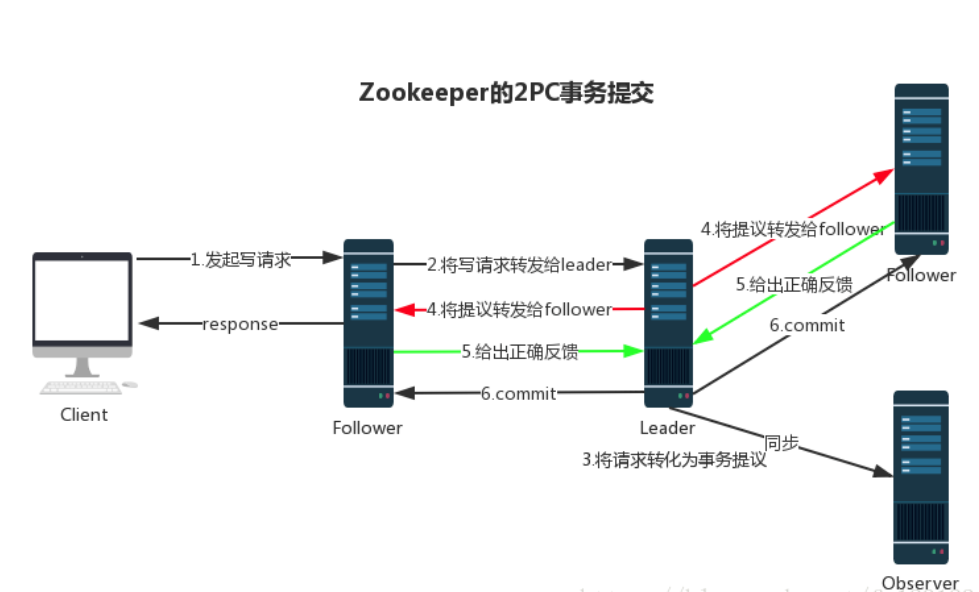

### 简介

解决分布式一致性问题

CAP思想

- C-一致性：保证实例之间的数据一致性
- A-高可用性：保证每次请求都能在指定时间得到正确的响应
- P-分区容错性：分布式系统在遇到部分网络分区出现错误的时候，仍然能够对外提供一致性和高可用性服务

BASE理论

- 基本可用：允许出现部分错误（页面降级，服务降级）
- 软状态：允许分布式系统出现中间状态，指可以出现延时的最终一致性
- 最终一致性：经过一定时间后满足最终一致性

节点类型

- 临时节点：节点创建后一直存在，直到当前会话关闭。临时节点没有子节点
- 永久节点：节点创建后一直存在，除非手动移除
- 顺序节点：对于来自客户端的每个更新请求，ZooKeeper 都会分配一个全局唯一的递增编号，这个编号反应了所有事务操作的先后顺序，应用程序可以使用 ZooKeeper 这个特性来实现更高层次的同步原语。该节点可以是临时的也可以是持久的。

### 客户端基本指令

```sh
# 启动zk服务器
zkServer
# 启动zk客户端
sh bin/zkCli
```

#### create

create [-s] [-e] {path} {data} [acl] 创建节点

- -s：表示顺序节点
- -e：表示临时节点。下一次直接进入有缓存，临时节点还在，一会儿就没了
- acl：访问权限相关，默认是world，共享访问

#### ls

ls [-s|-w|-R] {path} 查看指定路径下目录列表

- -s：查看明细信息

```
[zk: localhost:2181(CONNECTED) 30] ls -s /self
[]
# 创建节点事务id
cZxid = 0x3
# 创建时间
ctime = Wed May 12 00:20:37 CST 2021
# 最后修改事务id
mZxid = 0x3
# 最后修改时间
mtime = Wed May 12 00:20:37 CST 2021
# 表示子节点变更的最后事务id，仅当子节点列表个数变化才会变更(不包括孙节点)，子节点内容变化不变
pZxid = 0x3
# 子节点版本号，子节点每次修改加一
cversion = 0
# 数据版本号，数据每次修改加一。比如新增子节点，不包括数据变更
dataVersion = 0
# 权限版本号，权限每次修改加一
aclVersion = 0
# 创建该临时节点的会话id，若为持久节点，则为0
ephemeralOwner = 0x10000f16d040000
# 节点的数据长度
dataLength = 3
# 统计拥有的子节点数量
numChildren = 0
```

#### delete

删除节点

#### stat

查看节点状态信息，类似ls -s

### 消息广播



zk中通过ZAB协议分布式数据一致性

#### 消息广播

节点角色

- leader：领导者，提供写服务。负责投票的发起和决议，更新系统状态
- follower：跟随者，提供读服务。用于接收客户端请求并向客户端返回结果，在投票过程中参与投票
- observer：观察者，提供读服务。可以接收客户端写请求，将请求转发到leader，但不参与投票过程。observer仅同步leader数据，目的是为了扩展系统，提供读性能

**处理流程**：消息装发到leader之后，根据2pc原理，leader向其他follower发送proposal请求锁定资源，等待回应。当半数以上follower回应ack，leader便向所有follower发送commit请求

#### 崩溃恢复

正常情况下zk运行良好，若leader发生崩溃，或因网络原因导致leader与半数follower失去连续，就会进入崩溃恢复模式，选出一个新leader，崩溃有以下情况

- leader发送完commit消息后，立即崩溃
- leader发送完proposal消息后，立即崩溃

恢复策略

- 选举zxid的最大节点作为新leader
- 新leader将事务中未提交的日志重新进行处理

### 选举流程

**参数**

- 服务器ID（myid）：服务器id，唯一，id越大投票时权重越大
- 事务ID（zxid）：值越大表示数据越新
- 偏移时钟（epoch）：同一轮投票时时钟一致，每次投票完成加一

#### 选举流程

1. 当leader不存在（服务器启动时或leader崩溃），开始选举。首先将所有的follower状态改为LOCKING
2. 每个server发送广播消息，呼吁其他server投票
3. 处理投票。参与投票的server收到消息，首先校验投票的有效性（epoch），是否接受来自LOCKING状态的服务器投票，在进行如下判断
   1. 对比epoch（是否为本轮投票）
   2. 投票给最大zxid的server
   3. 若zxid相同，则投票给最大myid的server
4. 统计投票。服务器收到投票后，判断票数是否过半，若过半则确认新leader，若未过半下次继续投票
5. 改变服务器状态。一旦确定了状态，新leader状态改为LEADING，其他follower状态改为FOLLOWING

### 分布式锁实现

https://www.jianshu.com/p/5d12a01018e1

#### 排它锁/非公平锁

利用zk统计节点唯一性，在获取排它锁时，所有客户端调用create()方法，在/exclusive_lock节点下创建临时子节点/exclusive_lock/lock，最终只有一个客户端能创建成功，其他失败的客户端会注册一个子节点变更的watch监听事件，以便锁释放后重试获取

当获取锁的客户端宕机，则session关闭，自动删除临时节点，通知其他客户端获取锁。

#### 公平锁

非公平锁下可能造大量的客户端监听同一个key，当key删除时会造成大量的回调，对zk集群十分不利，因此引入公平锁

1. 客户端在同一目录下创建临时顺序节点
2. 创建成功后，获得顺序节点列表中所有节点，判断自身是否为第一个节点
3. 若为第一个节点，则获取锁成功；若非第一个节点，则通过watch机制监听上一个顺序节点，等待其释放锁通知自己

> 当监听一个不存在的路径节点是，返回null，之后可获得一个删除事件
>
> WatchedEvent state:SyncConnected type:NodeDeleted path:/perm/tmp1/node0000000011
>
> 节点数据更新事件
>
> WatchedEvent state:SyncConnected type:NodeDataChanged path:/perm/tmp1
>
> 注：get {path} -w 只能获得一次监听回调

#### 共享锁

对某对象添加共享锁后，后续只能对该对象进行读取，也只能添加共享锁

#### 分布式锁实现

Curator直接封装实现

### zk实现分布式锁优缺点

优点

- 非阻塞型，通过监听事件实现监听锁对象释放，可实现客户端宕机自动释放，超时等待
- 一致性强，键值保存需要等待半数以上follower准备成功才能提交，保证了高可用性

缺点

- 非公平锁，可能造成监听回调线程，回调消耗大，发生惊群现象，影响zk集群，可考虑切换公平锁

### 路由注册

