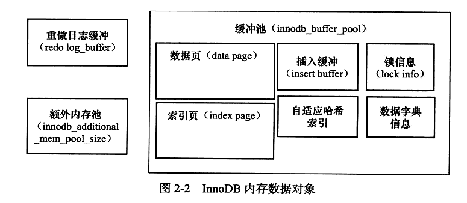

## 1 Mysql体系结构和存储引擎

### 1.1 数据库和实例

**数据库**：储存数据的**文件集合**

**实例**：数据管理软件，对数据进行查询、更新、删除等操作

**配置文件读取顺序**：/etc/my.cnf -> /etc/mysql/my.cnf -> /usr/local/mysql/etc/my.cnf -> ~/.my.cnf（相同属性取最后文件的配置）

数据库是由一个个文件组成，对这些文件进行数据库操作（SELECT、INSERT、UPDATE、DELETE）来修改数据库内容，需要通过数据库实例来完成

### 1.2 MySQL体系结构

存储引擎是基于表的，而不是数据库

### 1.3 MySQL存储引擎

**InnoDB存储引擎**：支持事务，行锁设计、支持外键、支持全文索引。MySQL5.5.8版本之后的默认存储引擎，之前是MyISAM

**MyISAM存储引擎**：不支持事务、表锁设计，支持全文索引。它的缓冲池只缓存索引文件而不缓存数据文件。由MYD和MYI组成，MYD存放数据文件，MYI存放索引文件

**NDB存储引擎**：集群存储引擎。连接操作（JOIN）再MySQL数据库层完成的，而不是再存储引擎层完成的

**Memory存储引擎**：将表的数据存放在内存中，数据库重启或崩溃数据都将消失，适合存储临时数据的临时表。只支持表锁，并发性能较差，varchar存储是按照char方式进行的。只支持INSERT和SELECT操作

## 2 InnoDB存储引擎

### 1 InnoDB体系结构
> Mysql5.5使用InnoDB版本1.1.x；mysql5.6使用InnoDB版本1.2.x

#### 1.1 后台线程

主要作用是负责刷新内存池中的数据，保证缓冲池中的内存缓存时最近的数据。同时将已修改的数据文件刷新到磁盘文件，保证数据库的异常恢复

**Master Thread**：一个核心的后台线程，主要负责将缓冲池的数据异步刷新到磁盘，保证数据的唯一性。包括脏页的刷新、合并插入缓冲、undo页的回收

**IO Thread**：InnoDB中大量使用了AIO(Async IO)来处理IO请求，可以极大提高数据库性能。IO Thread主要负责这些IO请求的回调处理。从InnoDB1.0.x开始，IO thread包含log thread和insert buffer thread各一个，read、write线程各四个，读写线程数可通过变量调整

**Purge Thread**：回收已经使用并分配的undo页（事务被提交后，其使用的undolog可能仍然需要）。InnoDB1.1之前通过master thread回收undo页，InnoDB1.1开始分离出purge thread单独回收undo页，分散master的压力。purge thread数量默认为1，InnoDB1.1当设置大于1也自动调整成1.InnoDB1.2支持purge线程数动态调整，变量`innodb_purge_threads`

**Page Cleaner Thread**：InnoDB1.2.x版本引入，脏页的刷新操作交给这个线程单独处理，为减轻master thread压力

#### 1.2 内存



**缓冲池**：内存区域，来弥补磁盘速度较慢对数据库性能的影响。通过参数 innodb_buffer_pool_size配置缓冲池大小。其中innodb允许存在多个缓冲池，每个页根据哈希值分配到各个缓冲池中，通过`innodb_buffer_pool_instances`配置缓冲池个数

缓冲池缓存的数据页类型有：索引页、数据页、undo页、插入缓存、自适应哈希索引、InnoDB存储的锁信息、数据字典信息等。

**重做日志缓冲**：重做日志缓冲区，下面几种情况会将重做内容新到外部磁盘的重做日志文件

- Master Thread每一秒将重做日志缓冲刷新到重做日志文件
- 每个事务提交时将重做日志缓冲刷新到重做日志文件
- 当重做日志缓冲池剩余空间小于1/2时，重置日志缓冲刷新到重做日志文件。

**额外的内存池**：从缓冲池中申请内存，每个缓冲池中的对象需要存储LRU、锁、等待等信息，对象的内存需要从额外内存池中申请

### 2 checkpoint技术

checkpoint是指将缓冲池的脏页刷新到磁盘中的技术。

当数据库发生宕机后，对数据库恢复，通过redolog进行重做。checkpoint之前的页都刷新到磁盘，只需重做checkpoint之后的页。当事务提交时，先写重做日志，再刷新缓冲池的页数据

> redolog每个log group至少有两个redolog，文件循环写入，写满了重写覆盖下一个文件

在innodb引擎，checkpoint是将缓冲池中脏页刷新到磁盘中。至于每次刷新多少页到磁盘，从哪获取脏页，已经checkpoint触发时机。在innodb引擎中分为两种

**sharp checkpoint**

发生在数据库关闭时执行，将所有的脏页刷新到磁盘中，这是默认的工作方式。即参数`innodb_fast_shutdown`=1控制。

**Fuzzy checkpoint**

模糊刷新，触发实际分为以下几个

- Master Thread Checkpoint：master thread以默认每秒一次从缓冲池的脏页列表中获取一定比例的页刷新到磁盘，该操作是异步的
- FLUSH_LRU_LIST Checkpoint：innodb存储引擎保证LRU列表中需要差不多100个空闲页可供使用。在innodb1.1.x及以前，该操作会阻塞用户查询线程。执行操作，若发现不足100空闲也，则从LRU列表中移除，若移除页为脏页则进行checkpoint。在innodb1.2.x开始，这个检查单独放在一个page cleaner线程中执行，通过参数`innodb_lru_scan_depth`控制空闲页的数量，默认1024
- Async/Sync Flush Checkpoint：指当重做日志不可用时（指没有可用的空白空间或已刷盘的空间），需要强制将一批脏页刷新到磁盘中。若将已刷新到重做日志的LSN即为redo_lsn，将已刷新到磁盘的最新的LSN记为checkpoint_lsn，则定义checkpoint_page = redo_lsn - checkpoint_lsn。
  - 再定义变量async_water_mark = 75% * total_redo_log_file_size，sync_water_mark = 90% * total_redo_log_file_size
  - 当checkpoint < async_water_mark 时，不执行checkpoint
  - 当 async_water_mark < checkpoint < sync_water_mark 时，执行异步checkpoint，innodb1.2开始通过单独page cleaner thread执行清理
  - 当checkpoint > sync_water_mark是，同步执行checkpoint，阻塞用户查询。
- Dirty Page too much：当脏页数量太多时，进行checkpoint。参数`innodb_max_dirty_pages_pct`表示脏页过多的阙值，默认75，表示脏页数量超过缓冲池中的75%时，强制进行checkpoint

### 3 Master Thread工作方式

### 4 关键特性

#### 4.1 插入缓冲

##### 4.1.1 insert buffer

不是缓冲池的组成部分，和数据页一样是物理页的组成部分。通常行记录都是按照主键递增的顺序插入的，因此插入聚集索引一般是顺序的，不需要磁盘的随机读取。（磁盘的随机读取会造成插入性能下降）。

非聚集索引（无序的）的插入操作会导致磁盘的随机读取，影响插入性能。通过Insert Buffer可以提高插入非聚集性索引的插入性能

> 聚集索引：B+叶子节点保存的索引值和数据。一个表只能有一个聚集索引，mysql主键就是聚集索引。聚集索引一般是有序的，如果使用UUID这种无需的记录会导致插入变慢
>
> 非聚集索引：B+树叶子节点保存索引值和主键值，一个表可以有多个

对非聚集索引的插入，由于不是顺序性的插入。所以先判断非聚集索引也是否在缓冲池中，没有先放到Insert Buffer对象中，有则直接插入

Insert Buffer的使用需要满足两个条件：索引是辅助索引（非聚集索引）；索引不是唯一的。当插入非聚集索引时，若插入的非聚集索引页出现在缓冲池中，则直接插入；如不存在先插入到insert buffer中，后续再以一定频率和辅助页叶子节点merge，提高了非唯一的聚集索引的插入顺序

> 为什么要限定非唯一？因为若索引为唯一的，就不能直接插入insert buffer，必须要判断该记录是不是唯一的，势必要消耗更多磁盘io

Insert Buffer是B+树结构，insert buffer默认最大内存为缓冲池总内存的50%

##### 4.1.2 change buffer

适用于非唯一的辅助索引
对DML操作进行缓存，比如删除：先标记删除，再真正删除

参数（innodb1.2.x开始）

- innodb_change_buffer_max_size：表示change buffer的最大内存（值为整数，表示占据内存池的百分比），默认25
- innodb_change_buffering：all表示启用所有，none表示不启用，changes表示启用insert和delete，其他值暂不深入研究

##### 4.1.3 merge insert buffer

insert buffer合并到辅助索引中的，触发时机如下

- 辅助索引页被读到缓冲池中
- insert buffer bitmap页追踪到该辅助索引页少于1/32可用空间
- master thread线程每秒进行一次合并操作

#### 4.2 两次写

带给存储引擎数据页的可靠性。当写入部分数据时机器宕机，导致部分写失效。

Innodb引擎的默认页大小是16KB，而操作系统的文件写入是以4KB为单位，当对一个页写入磁盘时，只写入了一部分（比如4/16）mysql挂了，该页只有一部分写入到磁盘中了。当使用redolog进行恢复时，会检查该页的checksum（checksum表示最后事务号），而该页已经损坏找不到checksum，无法进行重做恢复

double write流程

1. 先将脏页数据保存到double write buffer中。然后进行以下两个操作
2. 将double write buffer（默认2M）按照每个表1M的方式，保存共享表空间，以做备份。
3. 将数据保存到重做日志缓冲区，刷新到磁盘

> 使用double write恢复时，先校验的页的checksum，若发现也损坏则通过共享表空间恢复损坏页，再进行重做

#### 4.3 自适应哈希索引

如果通过索引查询，B+树在生产环境一般都是3-4层，所以需要进行3-4次磁盘IO，而hash索引查询一次即可

自适应哈希索引（Adaptive Hash Index，AHI）是innodb自动创建的，自动根据访问的频率和模式来为某些热点页建立，对于(a,b)的联合索引，访问模式（只允许等值查询）如下

- Where a=xxx
- Where a=xxx and b=xxx

对同一种查询进行连续一定次数的访问，交替上述两种则不行，连续超过一定次数，则创建AHI，另外创建AHI还需要满足一下条件

- 以该模式访问了100次
- 也访问模式访问了N次，其中N=页中记录*1/16。即页中命中数据至少占比1/16

使用哈希索引后，读取和写入速度可以提高2倍，辅助索引的连接操作性能可以提高5倍

#### 4.4 异步IO

为提高磁盘操作性能，数据库系统都采用异步IO（AIO）的方式来处理磁盘操作。即用户在发送一个IO请求后，无需等待此IO结果继续发起下一IO，当全部请求发送完毕，等待所有IO操作完成，这称为AIO

AIO的另一优势是可以进行IO merge，比如需要访问页(8,6) (8,7) (8,8)，每个页16KB，至少需要3次IO，而AIO判断这三个IO是连续的，则合并成一个IO，从(8,6)开始读取48KB的页

#### 4.5 刷新邻接页

刷新一个脏页时，InnoDB存储引擎会检测该页所在区的所有页，如果是脏页那就一起刷新，通过AIO将多个IO合并为一个IO。

这种操作需要考虑下面两个问题

- 是不是可能将不怎么脏的页刷新到磁盘，不就该页又变为脏页
- 固态硬盘具有比较高的IOPS(input/ouput operation Per Second，每秒磁盘输入输出)，不建议开启此功能

在innodb1.2.x，通过参数`innodb_flush_neighbors`控制是否开启刷新邻接页功能，默认1开启

### 5 启动、关闭与恢复

在关闭数据库时，通过`innodb_fast_shutdown`控制innodb的行为

- 0，表示在数据库关闭时，完成所有的full purge和merge insert buffer，并将所有的脏页刷新到磁盘。该操作可能比较耗时，但在innodb升级时，必须设置为0
- 1，默认值。表示在数据库关闭时，不必完成full pruge和merge insert buffer，只需要将所有的脏页刷新到磁盘
- 2，表示不完成full purge和merge insert buffer，也不刷新脏页，而是将日志全部写入日志文件，保证不会有任务事务的丢失，但是下次数据库启动时需要进行恢复

## 第3章 文件

> 物理日志：存储数据被修改的值
>
> 逻辑日志：存储数据修改的sql

### 3.1 参数文件

指定mysql实例启动的参数

**动态参数**：实例运行时可修改

**静态参数**：实例生命周期内不可变

Global ，全局（参数）

session，会话（参数）

```sql
-- 查询参数，不写参数类型默认session
show [global/session] variables like '%';
```

### 3.2 日志文件

错误日志、二进制日志、慢查询日志、查询日志

**慢查询日志**

```
log_queries_not_using_indexes=ON // 数据未使用索引则记录到慢查询日志中
slow_query_log=ON/OFF //开/关慢查询
long_query_time=10 // 慢查询日志阙值（秒）
```

**二进制日志**

记录了对Mysql数据库执行更改的所有操作，默认不开启，开启时数据库性能降低约1%

> 只记录DML、DDL等引起数据库数据变更的操作，不记录select，show等查询语句，对于update无影响行数的也不记录。不记录参数的修改

通过控制参数`bin-log`=[name]来启动二进制日志，指定二进制日志文件名，文件名[name].000001，写满了写下一个文件

使用事务时，所有未提交的二进制日志会记录到一个缓存中，缓存到由binlog_cache_size决定，默认32K，基于会话

binlog日志格式(建议默认设置ROW，当执行影响范围大的sql的时临时改为STATEMENT)：
- STATEMENT格式，记录日志逻辑sql语句，即sql语句；
- ROW格式（文件更大），记录修改后发生变化的每行数据（记录数据每列的新老数据，不管是否变更）
- MIX格式，混用前两种格式

当使用事务的存储引擎时，所有未提交的二进制日志都会保存到一个会话级别的缓存中，当事务提交时将缓存中的二进制日志刷新到二进制文件中。缓冲大小由参数`binlog_cache_size`控制，默认32K，当事务中需要缓存的数据大于该值时，会通过建立临时文件存储，但会使得流程变慢。索引缓存大小不能过小。可通过状态属性`Binlog_cache_use`binlog缓存使用总次数，`Binlog_cache_disk_use` 表示使用binlog缓存时建立临时文件的次数

通过参数`sync_binlog`表示二进制日志每进行几次事务提交就写入binlog文件。在事务提交前一刻写入binlog文件

- sync_binlog=0，每次事务提交都刷新到binlog文件，但不刷新到磁盘数据文件。有系统后台异步持久化
- sync_binlog=N，每进行N次事务提交后将数据刷新到binlog文件中，同时执行一次fsync的刷新磁盘数据文件

### 3.3 套接字文件

UNIX系统本地连接mysql可以采用UNIX域套接字方式，需要一个套接字文件，由参数socket控制

### 3.4 pid文件

当mysql实例启动时将自己的进程id写入pid文件中，参数pid_file控制文件

### 3.5 表结构定义文件

mysql数据存储根据表进行的，每个表都有对应的文件，后缀.frm，文件记录了表结构定义。相应地还为用户创建了一个v_a视图，v_a.frm文件

### 3.6 InnoDB存储引擎文件

#### 3.6.1 表空间文件

将存储数据库按表空间存放

#### 3.6.2 重做日志文件

每个InnoDB存储引擎至少有一个重做日志文件组，每个组至少两个重做日志文件，提高重做日志的高可用性。采用循环写入的方式（写文件1，写满写文件2，，，在写满最后一个文件写文件1）

> 二进制日志和重做日志都是记录的事务日志，二者有何区别？
>
> 二进制日志会记录Mysql数据所有的相关日志记录，包括InnoDB、Myisam等其他存储引擎的日志。其记录的是数据库数据发生变化的逻辑日志，即变化的逻辑语句，只在事务提交前写入磁盘
>
> innodb存储引擎的重做日志只记录本身的事务日志，记录每个页更改的物理情况（记录变更后的数据），在事务中的很多时机进行

重做日志的落盘机制，通过参数`innodb_flush_log_at_trx_commit`控制

- 0表示事务提交时，不将事务的重做日志刷新到磁盘，而是等待master thread的每秒定时刷新
- 1(默认值)表示每次事务提交时，同步把缓存中的内容刷新到磁盘
- 2表示将重做日志异步刷新到磁盘，即写入到文件系统的缓存中，后续通过异步方式同步到磁盘文件

## 第4章 表

### 4.1 索引组织表

InnoDB存储引擎中，如果表没有显式定义主键，会按照下面方式自定义主键

- 判断表中是否有非空唯一索引，有则该列为主键（存在多个，则选择第一个定义的索引为主键，而不是第一个定义的列）
- 不符合上述条件，InnoDB存储引擎自动创建一个6字节的指针

_rowid可以显示表的主键，但仅适用于非空唯一索引的单列且类型为数字 为主键的情况，其他情况使用则报错

### 4.2 InnoDB 逻辑存储结构

数据都存处在表空间中，表空间又由段、区、页、行组成

**表空间**

默认情况下InnoDB存储引擎有一个共享表空间ibdata1，所有数据都存放在这个表空间中

若用户启用了参数innodb_file_per_table，则每张表内的数据都可以单独放到一个表空间内。但只存放数据、索引和插入缓冲Bitmap页，其他（回滚、插入缓冲索引页、系统事务信息、二次写缓冲等）仍放在原共享表空间中

表空间存储了事务信息，但不会在事务回滚后立即回收事务信息，而是不需要则标记为可用空间供下次undo使用

**段**：表空间由各个段组成，常见有数据段、索引段、回滚段等。数据段为B+树的叶子节点，索引段为B+树的非索引节点

**区**：由连续页组成，每个区固定大小1MB，InnoDB储存引擎页为16K，一个区中有64个连续的页。为保证页的连续性，每次申请空间都是申请4-5个区。但是，当启用innodb_file_per_table参数时，创建表默认大小96K，这小于一个区的大小，因为创建表先使用32个页的大小的碎片页存放数据，用完之后再申请64个连续页

**页**：是InnoDB磁盘管理的最小单位，默认每个页16K，常见页为数据页、undo页、系统页、事务数据页等

**行**：数据按行存放，每页最多存放16KB/2 - 200=7992行纪录

### 4.3 InnoDB 行记录格式

> 行纪录格式，通过show table status like ''来查看表的行格式
>
> row_format字段表示行纪录结构

**Compact行记录格式**

| 变长字段长度列表(最大2字节) | NULL标志位（1字节） | 记录头信息（5字节） | 列1数据 | 列2数据 | ...  |
| --------------------------- | ------------------- | ------------------- | ------- | ------- | ---- |
|                             |                     |                     |         |         |      |
一个页存放的行数据越多性能越高

mysql varchar类型最大长度为65535

**Redundant行记录格式**

| 字段长度偏移列表(最大2字节) | 记录头信息（5字节） | 列1数据 | 列2数据 | ...  |
| --------------------------- | ------------------- | ------- | ------- | ---- |
|                             |                     |         |         |      |
mysql5.0之前InnoDB的行记录存储方式，mysql一行支持的最多的列为1023

**行溢出数据**

VARCHAR最大长度65535字节，是指表中所有varchar列的长度总和（字节长度，GBK每个字符2字节，长度最多32767；UTF-8每个字符3字节，长度最多21845），实际可用长度为65532

当数据大小超过一页的大小，发生行数据溢出时，数据页只保存数据的前768字节，实际数据保存在BLOB页中

**Compressed和Dynamic行纪录格式**

对于行溢出数据，数据页纸存放20字节的指针，实际数据都存放在Off Page中

**CHAR的行结构存储**

固定长度字符类型，char(N)为字符的长度而非字节长度

char类型可存储<=N字符长度的字符串，对未满长度的字符填充0x20（空格）

### 4.4 InnoDB数据页结构

数据页由以下几部分组成

File Header：38字节，记录头信息

Page Header：56字节，记录数据页的状态信息

Infimum和Supermum Record：用于限定记录的边界。infimum记录页中比任何主键值都小的值，Supremum指比任何可能大的值还要大的值

User Record：实际存储行的内容

Free Record：空闲空间，存放被删除的记录

Page Directory：存放了记录的相对位置

File Trailer：为了检测页是否已经完整写入磁盘

### 4.5 Name File Formats 机制

为兼容不同版本页结构

### 4.6 约束

**数据完整性**

用户通过定义Primary Key或Unique Key约束来保证实体的完整性

**约束的创建和查找**

- 表建立时就进行约束定义
- 使用Alter table来创建约束

**约束和索引的区别**

索引是数据结构，既逻辑上的概念，又在数据库中代表着物理存储的方式

约束是逻辑概念，保证数据存储的完整性

非空约束、enum和set约束、触发器

**外键约束**

MyISAM存储引擎不支持外键，InnoDB支持

### 4.7 视图

一个命令的虚表，没有实际物理存储，主要用来查找数据

创建视图是使用 with check option，当使用视图插入数据，不满足视图条件的数据不能被插入，抛出异常

**物化视图**

将视图的数据实例化存储，加快查询。Oracle支持物化视图，mysql不支持

### 4.8 分区表

分区是指将表或索引分成多个更小、更可管理的部分

mysql支持水平分区不支持垂直分区。支持局部分区，一个分区既存放数据又存放索引，不支持全局区分，所有数据索引都放在一个对象中。

mysql5.6及以下版本通过变量 have_partitioning来判断是否启用分区功能，5.6以上版本通过show plugins 查看partition是否为active，支持分区

> 水平分区：将表的不同行记录分配到不同物理文件中
>
> 垂直分区：将表的不同列记录分配到不同物理文件中

支持分区类型

- RANGE分区：行数据基于属于一个连续区间的列值被放入分区。主要用于日期列分区。只能对YEAR(), TO_DAYS(), TO_SECONDS(), UNIX_TIMESTAMP()优化，自动分区
- LIST分区：和RANGE分区类似，只是LIST分区面向离散的值。定义指定的值在哪个分区，若插入的值不在分区抛异常
- HASH分区：根据用户自定义表达式的值进行分区，不能为负
- KEY分区：根据mysql提供的哈希函数进行分区
- COLUMNS分区：上面四种数据必须是整数。而columns可以使用非整数列进行分区

若表中存在唯一索引，分区列必须是唯一索引的一个组成部分(一列即可)

指定分区可以使sql查询更快(总数据更少)

**子分区**

在分区的基础上再分区，但只允许RANGE和LIST分区上进行HASH或KEY的子分区

**分区和性能**

分区可能感觉不到查询速度的提升，使用不当甚至可能急速下降（分区之后一个B+树分成了多个B+树，每个分区一棵，但高度减少的很少，即一次查询的次数减少的很少。而当未使用唯一索引查询时，分区的话就会查询每个分区，IO执行次数更多）

**在表和分区间交换数据**

允许将分区表的数据移到非分区表中，有一些约束条件

## 第5章 索引与算法

### 5.1 InnoDB存储引擎支持的常见索引

- B+树索引
- 全文索引
- 哈希索引

> InnoDB存储引擎支持的哈希索引是自适应的，引擎会根据表的使用情况自动为表生成哈希索引，不能人为干预是否在一张表中生成哈希索引。
>
> 注：虽然innnodb存储引擎能选择使用hash（或b+树索引），但实际上hash索引会自动转为B+树索引，可以通过show indexes from table查看。表的create语句虽然还是in hash，但实际上是B+树索引
>
> B+树索引只能找到被查找数据所在的页，然后数据把页读入内存中，在内存中查找数据

### 5.2 数据结构与算法

二分查找法

二叉查找树和平衡二叉树

**B+树**

B+树当插入节点，叶节点满时，会先尝试将溢出节点往兄弟节点移，同样能保持平衡

### B+树索引

B+树的高读一般2-4层，一次io至多0.01秒

**聚集索引**：按照每张表的主键构造一棵B+树，叶子节点存放整张表的记录数据。对于主键的排序查找和范围查找速度非常快

**辅助索引**（非聚集索引）：叶子节点不包含行记录的全部数据。叶子节点除包含键值外，还包含一个书签，用来告诉引擎索引对应的行数据位置

#### B+树索引的管理

ALTER TABLE，CREATE/DROP INDEX 会改变索引

show index from，查看索引

### 5.5 Cardinality值

索引一般用在查找的数据范围为很少一部分才使用，对于字段范围很小的，一下查出大量结果行，不需要使用索引，如性别、地区、类型等

Cardinality为show index结果中的属性，表示索引中不重复记录数的预估值，Cardinality/n_row_in_table尽可能接近1，使用的索引的价值才最高

需要更新Cardinality信息的策略：

- 表中1/16的数据已发生过变化
- stat_modified_counter(表示变化的此数，对同一行进行操作多次也记多次，避免多同一行进行多次操作无法触发第一次类型的情况)>2000000000

Cardinality的计算方式，抽象预估法：

- 取得b+树索引中叶子节点的数量，记为A
- 所及取得B+树索引中的8个叶子节点，统计每个页不同记录的个数，即为p1,p2,,,p8
- 根据采样计算预估值，Cardinality=(p1+p2+...+p8)*A/8

### 5.6 B+树索引的使用

**联合索引**：最左匹配法

> 比如联合索引(a,b)，使用B+树存储的数据如，(1,1),(1,2),(1,4),(2,2),(2,3)(3,3), 在第一个字段排好序的情况下再排第二个字段，索引能触发(a,b)和(a)形式的索引，而(b)就无法触发索引

**覆盖索引**：innodb存储引擎支持覆盖索引，即从辅助索引就能查到的数据，不需要查询聚集索引。辅助索引不包含整行记录的所有信息，其大小远远小于聚集索引，减少IO操作

**优化器不使用索引的情况**：使用索引，查到的只是数据的位置，仍需要根据位置进行一次书签访问来找出整行的数据。书签访问时无序的，变为磁盘上的离散读操作，如果访问的数据占表的一大部分（一般20%），优化器会直接使用聚集索引来查找数据（如使用自增主键查询，全局扫表）

**索引提示**：mysql数据库支持索引提示，显示地告诉优化器使用哪个索引，但有些情况需要手动指定，index hint：

- mysql数据库优化器错误地选择的索引，导致sql运行更慢。此类情况很少
- sql预计可以选择的索引非常多，优化器会分析各种索引使用的耗时情况，来选择哪种索引，但如果分析的时长很高，分析的意义就不大了

> force index 强制指定使用哪种索引

**Multi-Range Read优化**：减少磁盘的随机访问，转化为较为顺序的数据访问 

工作方式：

- 将查询得到的辅助索引存放在一个缓存中，缓存中的数据是根据辅助索引排序的
- 将缓存中的键值根据rowId进行排序
- 根据rowId的排序顺序来访问实际的数据文件

**Index Condition Pushdown优化**：当进行索引查询时，首先进行索引查找记录，在根据where查找，这是未开启此功能的做法。开启后在取出索引的同时进行where条件的过滤

### 5.7 哈希算法

哈希索引只适用于等值查询，不适合范围查询。哈希索引是数据库自动维护创建的

### 5.8 全文检索

like '%xxx%'，这种范围查找B+树不起作用，需要用到全文索引

全文索引是将储存于数据库中的整本书或整篇文章的任意内容找出来的技术，mysql1.2开始innodb支持全文索引

#### 倒排索引

全文索引通常根据倒排索引实现，它在服务表中存储了单词于单词自身在一个或多个文档中的映射，有两种形式

- inverted file index，表现形式为{单词，单词所在的文档ID}
- full inverted index，表现形式为{单词，(单词所在的文档ID，在具体文档中的位置)}

全文索引的限制：

- 每张表只能有一个全文索引
- 由多列组合的全文索引列必须使用相同的字符集和排序规则
- 不支持没有单词界定符的语言，如中文、日语、韩语等

#### 全文索引

```sql
# 语法
match(col1,col2,...) against(expr[search_modifier])
search_modifier:
{
	in natural language mode
	| in natural language mode with query expansion
	| in boolean mode
	| with query expansion
}
# 例
select * from fts_a where match(body)
against ('Porridge' in natural language mode)
```

全文索引的几种模式

**1. Natural Language**

通过match函数匹配，默认采用该模式，查询指定work的文档，结果根据单词的相关性排序，相关性计算如下：

- word是否在文档中出现过
- word出现的次数
- word在索引列中的数量
- 多少个文档包含该word

全文索引的其他因素

- 查询的word在stopword列中，忽略该字符串的查询
- 查询的word字段长度是否在[innode_ft_min_token_size, innode_ft_max_token_size]

**2. Boolean**

- +表示该word必须存在
- -表示该word必须排除
- (no operator) 表示该word可选，如果出现，相关性会更高
- @dintance表示查询的多个单词之间的距离是否在distance之内，单位字节
- \> 表示出现该单词增加相关性
- < 表示出现该单词降低相关性
- ~ 出现该单词，相关性为负
- \* 表示以该单词为开头的单词，如te*
- " 表示短语
  - ('"like hot"' in boolean mode)

**3. query expansion**

Mysql支持全文索引的扩展查询。比如database关键，可能还希望查到mysql、oracle、DB2等关键词，即设置好扩展查询配置后，对某一个单词进行扩展，将包含扩展字段的结果

## 第6章 锁

### 6.1 锁概念

锁机制用于管理对共享资源的并发访问

### 6.2 lock和latch

latch是一种轻量级锁，锁定的时间必须短，时间一旦变长性能会变差。

|          | lock                                                  | latch                                                        |
| -------- | ----------------------------------------------------- | ------------------------------------------------------------ |
| 对象     | 事务                                                  | 线程                                                         |
| 保护     | 数据库内容                                            | 内存数据结构                                                 |
| 持续时间 | 整个事务过程                                          | 临界资源                                                     |
| 模式     | 行锁、表锁、意向锁                                    | 读写锁、互斥量                                               |
| 死锁     | 通过waits-for graph、time out等机制进行死锁检查与处理 | 无死锁检测与处理机制。仅通过应用程序加锁的顺序保证无死锁的情况发生 |
| 存在于   | Lock Manager的哈希表中                                | 每个数据结构的对象中                                         |

### 6.3 Innodb存储引擎中的锁

#### 锁的类型

行级锁

- 共享锁（S lock），允许事务读一行数据
- 排他锁（X lock），允许事务删除或更新一行数据
- 意向共享锁（IS lock），事务想要获取一张表中某几行的共享锁
- 意向排他锁（IX lock），事务想要获取一张表中某几行的排他锁

  注：兼容Y，不兼容N

|      | IS   | IX   | S    | X    |
| ---- | ---- | ---- | ---- | ---- |
| IS   | Y    | Y    | Y    | N    |
| IX   | Y    | Y    | N    | N    |
| S    | Y    | N    | Y    | N    |
| X    | N    | N    | N    | N    |

#### 一致性的非锁定读

通过行多版本控制的方式来读取当前执行时间数据库中行的数据。即如果读取的行正在执行update或delete操作，此时读取操作会选择读取该行的快照数据

> 查询事务隔离级别：select @@tx_islation\G;

#### 一致性的锁定读

Select ... for update 对读取的记录加X锁

select ... lock in share mode 对读取的记录加S锁

当事务提交了，锁就释放了

#### 自增长与锁

自动增长通过auto-inc locking这一特殊锁实现，为提高性能，在完成插入sql后立即释放锁（而非事务提交）。但是并发性能不太好

**插入类型**

insert-like：指所有的插入语句

simple inserts：只在插入前就能确定插入行数的语句，如insert，replace

bulk inserts：指在插入前不能确认插入行数的语句。如insert...select

Mixed-mode inserts：指插入中有一部分的值是自增长的，有一部分是确定的

**插入模式innodb_autoinc_lock_mode对自增的印象**:

0：mysql5.1.22版本之前自增长的实现方式，通过表锁auto-inc locking方式控制自增长

1：参数的默认值。对”simple inserts“，该种模式用互斥量去对内存中的计数器进行累加的操作。对于“bulk inserts”，还是使用传统表锁auto-inc locking方式。

2：对于所有的“insert-like”的语句都是通过互斥量，性能最高。并发时可能产生自增长不连续的值（重复）

**外键和锁**

对于外键若没有显示对该列加索引，innodb引擎会自动对其加索引，避免表锁。

### 6.4 锁的算法

### 6.4.1 行锁的3种算法

- Record Lock：单个行记录上的锁
- Gap Lock：间隙锁，锁定一个范围，但不包含记录本身
- Next-Key Lock：Gap Lock+Record Lock，锁定一个范围，并且锁定记录本身

> Next-key Lock
>
> 如一个索引有10，11，13，20。那么该索引可能被Next-Key Locking的区间为
>
> (负无穷,10], (10,11], (11,13], (13,20], (20,正无穷)
>
> previous-key locking则是左闭右开

RC级别下只有记录锁，RR级别下存在三种锁

### 6.4.2 解决Phantom Problem（幻读问题）

Phantom Problem是指在同一事务下，连续执行两次同样的sql可能导致不一样的记录行数，第二次的sql语句可能会返回之前不存在的行

### 6.6 阻塞

一个事务中的锁需要等待另一个事务释放，确保事务正常的进行

Innodb_lock_wait_timeout变量控制等待锁的时间，单位秒

### 6.7 死锁

死锁指两个或两个以上事务在执行过程中，因争夺资源而相互等待的现象

> 产生死锁的必要条件
>
> 1. 资源独占
> 2. 保持申请
> 3. 循环等待
> 4. 不可剥夺

系统中任何一个事务发生死锁的概率约等于 
$$
n^2*r^4/4*R^2
$$

- n，系统中事务的数量
- r，每个事务操作的数量
- R，操作数据的集合

### 6.8 锁升级

锁升级指将锁的粒度降低，如行级锁升级为页锁，页锁升级为表锁

sql server发现若一下情况可能发生所升级

- 由一句sql在一个对象上持有的锁的数量超过了阙值，默认值5000。如果是不同对象，则不会发生锁升级
- 锁资源占用的内存超过了激活内的40%就会发生锁升级

Innodb存储引擎不存在锁升级，它不是根据记录产生行锁的，而是根据事务访问的每个页对锁进行管理的，采用位图的方式

## 第7章 事务

### 7.1 简介

事务的四大特性

- 原子性：不可分割，要么都执行要么都不执行
- 一致性：事务将数据库从一种状态转变到另一种状态
- 隔离性：事务之间的操作相互隔离，互不影响
- 持久性：事务一旦提交，其结果就是永久性的

分类

**扁平事务**

最简单的一种，使用页最为频繁。扁平事务中，所有事务都处于同一层次，要么都执行要么都不执行。由begin work开始，commit work或rollback work结束，其间的操作是原子的

**带有保存点的扁平事务**

支持回滚到保存点的扁平事务。save work: tag

保存点是易失的，当系统崩溃时，所有保存点都将消失。事务恢复则要从最开始进行，不能从最近的一个保存点继续执行

**链事务**

思想：在提交一个事务时，释放不需要的数据对象，将必要的处理上下文隐式传给下一个要开始的事务

与扁平事务不同的是，链事务只能恢复到最近的一个保存点。链事务在执行commit后释放了当前事务所持有的锁，而带有保存点的扁平事务不影响迄今为止所持有的锁

**嵌套事务**

由一个顶层事务控制各个层次的事务

**分布式事务**

通常是一个在分布式环境下运行的扁平事务

### 7.2 事务的实现

#### redo

重做日志用来实现事务的原子性和持久性。由两部分组成：内存中的重做日志缓冲，易失；重做日志文件，持久

当事务提交时，先写重做日志，再进行事务的commit操作

InnoDB通过force Log at Commit机制实现事务的持久性。为确保每次日志都写入重做日志文件，在每次写入到重做日志缓冲后，innodb存储引擎都要进行一次fsync操作，将重做日志缓存的内容刷新到重做日志文件中。fsync的效率取决于磁盘的性能

> fsync：将重做日志缓存刷新到磁盘上，持久化
>
> innodb_flush_log_at_trx_commit控制重做日志刷新到磁盘的策略，取值如下
>
> - 1，默认值。事务提交一次就必须调用一次fsync操作
> - 0，事务提交不进行写入重做日志操作。仅有master thread中会进行fsync操作，每一秒进行一次重做日志的fsync操作
> - 2，事务提交将重做日志写入重做日志文件，但仅写入文件系统的缓存中，不进行fsync操作。仅当数据库发送宕机时，会丢失文件系统缓存未刷新到重做日志文件的那部分事务

**log block**

重做日志缓存、重做日志都是以512字节存储的，即以块的形式保存，成为日志块。其中日志块头12字节，日志块尾8字节，日志内容492字节

**log group**

日志组，包含多个重做日志文件

log buffer根据一定的规则将内存中的log block刷新到磁盘

- 事务提交时
- 当log buffer中有一半的内存空间以及被使用时
- log checkpoint时

LSN：日志序列号，表示重做日志写入的总量，8字节。包含

- 重做日志写入的总量
- checkpoint的位置
- 页的版本

> 若当前重做日志的LSN为1000，事务1写入了100字节的重做日志，LSN变为1100

redolog file的写入并不是完全顺序的，redolog file除了保存log buffer刷新到log block外还保存了一些其他信息，即每个redolog file前2K不保存log block信息，如下
- log file header： 521B
- checkpoint1：512B
- 空：512B
- checkpoint2：512B

且仅在log group中的第一个redo log file存储以上2K信息，其他redo log file仍保留着2K空间，但不保存上述信息。因此除了log block的写入操作，还需要更新前2KB的信息，对redo log file的写入并非完全顺序的

> log group包含多个redo log file文件。redo log file文件包含多个log block块


#### undo

undo记录逻辑日志，对每行记录进行记录。对于回滚操作，生成与原操作相反的操作

当事务进行回滚时，就需要undo。undo存放的是数据库内部的一个特殊段，位于共享空间。undo log的产生会伴着redo log的产生

innodb1.2版本存在多个rollback segment（默认128），支持的事务数量为128 * 1024

undo log格式

- insert undo log：insert操作产生的undo log
- update undo log：是对delete和update操作产生的undo log

当进行insert和update操作时，会产生redo log...

事务提交后，对应undo log，存储引擎会做如下操作
- 将undo log放入列表中，等待purge操作
- 判断undo log所在的页是否可重用（判断undo页的使用空间是否小于3/4），若可以分配给下个事务使用

#### purge

update和delete操作可能不直接删除原有的数据，只是把记录上的delete flag设置为1，记录仍存在于B+树中。删除真正通过purge操作

因为InnoDB存储引擎支持MVCC，需要保存之前记录的版本，待该记录不在被其他事务引用后才能清除

全局动态参数`innodb_purge_batch_size`用来设置每次purge删除的undo page数量。在innodb1.2版本之后默认300。设置的越大表示每次清理的undo page越多。当清理速率小于生产速率导致undo page积压时，history list会很越来越长，查询性能降低。全局动态参数`innodb_max_purge_lag`用来控制history list长度。当长度大于该参数时，其会延缓DML的操作。参数默认0不做任何限制；当大于0时，就会延缓DML操作，算法 delay=((length(history_list) - innodb_max_purge_lag) * 10) - 5
单位毫秒。delay的对象是行而非DML操作。innodb1.2版本加入了参数`innodb_max_purge_lag_delay`表示delay的最大毫秒数，避免sql线程出现无限延时等待

#### group commit

多个commit操作，以减少fsync的次数

### 7.3 事务控制语句

事务默认自动提交，通过set autocommit=0关闭自动提交

控制语句

- start transaction | begin：显式地开启一个事务
- commit：提交事务。类似commit work
- rollback：回滚。类似rollback work
- savepoint ${identifier}：建立保存点
- release savepoint ${identifier}：删除一个事务的保存点，删除不存在的保存点抛出异常
- rollback to [savepointer] ${identifier}：回滚到指定保存点
- set transaction：设置事务的隔离级别。innodb存储引擎的隔离级别有：read uncommitted、read committed、repeatable read、serializable

### 7.4 隐式提交的sql语句

- DDL语句
- DCL语句：grant、revoke等

### 7.5 对事务操作的统计

系统状态：com_commit和com_rollback。不过只能统计显式的提交和回滚的次数

### 7.6 事务隔离级别

数据库隔离级别，变量tx_isolation控制

REPEATABLE-READ 重复读：默认级别。采用Next-Key Locking方式加锁

READ-COMMITTED 读提交。采用Record Lock加锁

READ-UNCOMMITTED 未读提交

Seriailiable 序列化，隔离级别最高。隔离级别越高的性能消耗越大

| N不能出现，Y可能出现 | 脏读 | 重复读 | 幻读 |
| -------------------- | ---- | ------ | ---- |
| READ-UNCOMMITTED     | Y    | Y      | Y    |
| READ-COMMITTED       | N    | Y      | Y    |
| REPEATABLE-READ      | N    | N      | Y    |
| Seriailiable         | N    | N      | N    |

脏读：一个事务访可以访问到另一个事务未提交的数据，违反数据库的隔离性

重复读：同一事务下，同一记录查询两次得到的结果不一致

幻读： 同一事务下，一条sql执行两次，得到的记录条数不一致

丢失更新：一个事务的更新操作被另一个事务的更新操作覆盖。任何隔离界别都不会导致丢失更新

**其中mysql Innodb引擎用Next-key锁避免的幻读的产生，因此Innodb引擎Seriailiable仅用于分布式**

事务隔离级别越低，请求锁越少或保持的锁的时间就越短，但实际差别不大可忽略不计


### 记录锁，间隙锁，next-key锁

- 记录锁(Record lock)，锁定一行数据
- 间隙锁(Gap lock)，锁定一个开区间的数据
- Next-key lock，记录锁和间隙锁的组合。左开右闭

READ-COMMITTED级别下只有记录锁，即只能锁定到现有记录行。无法锁定新增或不存在的行

REPEATABLE-READ，使用Next-key锁（记录锁和间隙锁的组合）

#### 间隙锁

参考：https://zhuanlan.zhihu.com/p/48269420

1. 使用唯一索引测试。

   库中表id一个唯一索引，有记录值 1，4，7。分别锁定固定值和范围，测试锁的存在。其中存在行级锁1，4，7；间隙锁(1,4) (4,7)

L表示Lock。横轴表示锁定固定值

| 记录行测试 | 固定值3 | 固定值2(不存在的值) | [2,5] | (2,5) |
| ---------- | ------- | ------------------- | ----- | ----- |
| 1          |         |                     |       |       |
| 2          |         | L                   | L     | L     |
| 3          |         | L                   | L     | L     |
| 4          | L       |                     | L     | L     |
| 5          |         |                     | L     | L     |
| 6          |         |                     | L     | L     |
| 7          |         |                     | L     | L     |

**结论**

- 唯一索引，对某一存在的行加锁，产生记录锁
- 对不存在的行加锁，产生间隙锁，开区间。
- 对范围内的数据加锁，产生Next-key锁，左开右闭。

2. 使用非唯一索引测试。
   - 对存在的一行加锁。产生本身数据行的记录锁，和前后两个间隙锁。（此情况与唯一索引不一致）
   - 对不存在的一行加锁，产生间隙锁
   - 对范围型数据加锁，产生Next-key，左开右闭

3. 对非索引列加锁，不管加锁的数据如何，锁定的都是全表

### 7.7 分布式事务

#### 7.7.1 mysql数据库分布式事务

innodb存储引擎提供了对XA事务的支持，并通过它来实现分布式事务。使用分布式事务时，隔离级别必须设置为serializable

XA事务允许不同数据库之间的分布式事务，mysql、oracle、sql server等。

XA事务由以下几部分组成

- 资源管理器：提供访问事务资源的方法。通常一个数据库就是一个资源管理器
- 事务管理器：协调参与全局事务中的各个事务。需要和参与全局事务的所有资源管理器进行通信
- 应用程序：定义事务的边界，指全局事务中的操作

分布式事务使用两段锁提交方式。

1. 第一阶段，所有参与全局事务的节点开始准备，告知事务管理器准备就绪
2. 第二阶段，事务管理器告知资源管理器执行rollback或commit，若任何一节点不能提交，所有节点都将回滚。

> innodb_support_xa变量控制xa事务的开关

####  7.7.2 内部xa事务

前面的是外部事务，即资源管理器mysql数据库本身。还有种内部xa事务，指在存储引擎和插件之间，或存储引擎和存储引擎之间

## 第8章 备份与恢复

### 8.1 备份与恢复

备份方法

- Hot Backup（热备）：在数据库运行中直接备份，对正在运行的数据库操作没有任何影响
- Cold Backup（冷备）：在数据库停止的时候备份
- Warn Backup（温备）：在数据库运行中备份，但会对当前数据库操作有影响。如加全局锁保证备份数据的一致性

备份后的文件内容分

- 逻辑备份：文件内容可读，一般为文本文件。有sql语句组成，或者表内实际数据组成
- 裸文件备份：复制数据库的物理文件

### 8.7 复制

复制的步骤

1. 主服务器把数据更改记录二进制日志中
2. 从服务器把主服务器的二进制日志复制到自己的中继日志中。IO线程负责
3. 从服务器重做中继日志中的日志，把更改应用到自己的数据库上，以达到数据库的一致性。sql线程负责

复制是异步进行的，存在主从服务器之间的执行延时

show slave status

- read_master_log_pos, 显示当前同步到主服务器上二进制日志的偏移量位置，单位字节。即IO线程读取到主服务器的位置
- Slave_io_state,显示当前io线程的状态
- master_log_file,显示当前同步的主服务器的二进制日志文件
- relay_master_log_file,当前中继日志同步的二进制日志
- relay_log_file,显示当前写入的中继日志
- relay_log_pos，显示当前执行到中继日志的偏移量位置
- slave_io_running，从服务器中IO线程的运行状态
- slave_sql_running,从服务器中sql线程的运行状态
- exec_master_log_pos,表示同步到主服务器的二进制日志偏移量的位置。（read_master_log_pos - exec_master_log_pos）可表示当前sql线程运行的延时，单位字节。即该值表示sql线程读取到中继日志的位置

show master status

- position，记录当前二进制日志偏移量的位置，单位字节

## 第9章 性能调优

### 9.1 CPU选择

OLTP，在线事务处理，innodb存储引擎一般都用OLTP的数据库应用。特点

- 用户操作的并发量大
- 事务处理的时间一般比较短
- 查询的语句较为简单，一般都走索引，复杂的查询少

OLAP，在线分析处理，多用在数据仓库或数据集市，一般执行复杂的sql

当前数据库，一条sql只能再一个cpu中工作

### 9.2 内存的重要性

通常Innodb存储引擎的缓冲池命中率不应该小于99%

服务器状态参数

- Innodb_buffer_pool_reads,从物理磁盘读取页的次数
- innodb_buffer_pool_read_ahead,预读的次数
- Innodb_buffer_pool_read_ahead_evicted, 预读的页，但是没有被读取就从缓冲池中被替换的页的数量
- innodb_buffer_pool_read_requests, 从缓冲池中读取页的次数
- innodb_data_read, 总共读入的字节数
- Innodb_data_reads, 发起读请求的次数，每次读取可能需要读取几个页

缓冲池命中率=缓冲池读取次数/（缓冲池读取次数+预读次数+磁盘读取次数）

### 9.3 硬盘对数据库性能的影响

传统机械硬盘：可以随机访问

固态硬盘： 内部由闪存组成，低延迟性、低功耗

### 9.4 合理地设置RAID

RAID（独立磁盘冗余数组）基本思想是把多个相对便宜的硬盘组合起来，成为一个磁盘数组，使其性能超过一个容量大的硬盘。

### 9.5 操作系统的选择

Linux首选

windows操作系统下表名不区分大小写，linux操作系统下区分


### 疑问
1. 2.6.1 插入缓冲，插入无需非聚集索引时，数据页的存放按照主键的顺序存放，无须访问磁盘读取页码。而非聚集索引是无序的，需要离散地访问非聚集索引页，找到该索引所在的页码，需要进行对磁盘的随机读取。加入了插入缓冲后就不需要随机读取了

