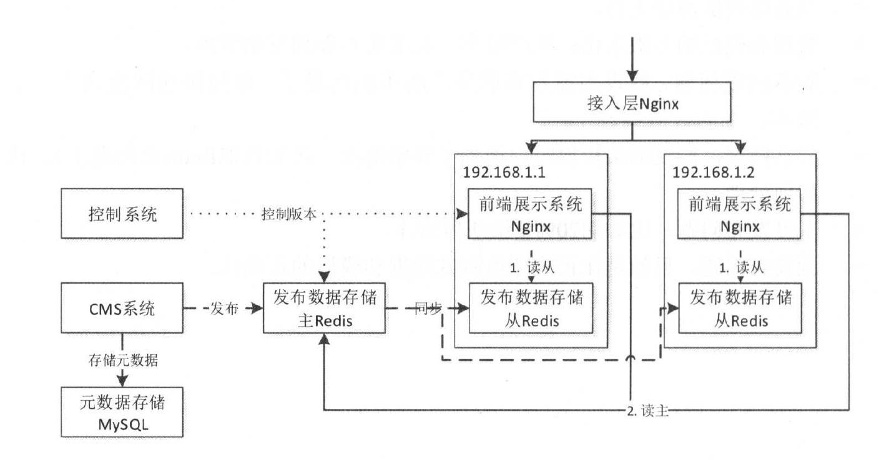

## 1 交易性系统设计原则

### 1.1 高并发原则

#### 1.1.1 无状态

无状态服务适合水平扩展，一般应用是无状态的，配置文件是有状态的

#### 1.1.2 拆分

系统维度、功能维度、读写维度、AOP维度、模块维度（web、service、dao）

#### 1.1.3 服务化

#### 1.1.4 消息队列

#### 1.1.5 数据异构

**数据异构**

对原始数据做异构保存，已完成某些功能。比如订单表根据订单号分库分表，当需要查询用户的订单列表时，直接全路由查询性能损耗过大。此时可以通过增加用户订单的异构表，来提升查询效率。还可能需要对历史数据做归档处理

#### 1.1.6 缓存银弹

**1 浏览器缓存**

设置请求的过期时间，对请求头Expires、Cache-control进行控制，适合对实时性不敏感的数据，如用户评价、商家评分、广告词等，不适用于的库存、价格等高实时性要求数据

**2 APP客户端缓存**

提前下发给App端 js/css/image等静态数据，提前缓存

**3 CDN缓存**

部分活动页、图片可以推送到附近的cdn节点中，用户可以请求附近的cdn节点获取缓存。存在两种机制：推送机制（当内容变更时主动推送到cdn节点）和拉取机制（先访问边缘cdn节点，若没有则访问源服务器获取数据并存储在节点上）。注意url中不能有随机数，否则无法缓存，每次都需要访问源服务器

**4 接入层缓存**

nginx搭建接入层

**5 应用层缓存**

缓存在应用重启时失效，可能迎来流量风暴，可使用redis缓存

**6 分布式缓存**

单机redis可能无法存储大数据量，需引入redis集群，采用一致性哈性分片算法将数据存储到多台服务器

#### 1.1.7 并发化

程序并发处理

## 2 负载均衡与反向代理

为实现负载均衡、失败重试等，通过Nginx实现。Nginx一般使用七层负载均衡。为了提高吞吐量，一般会在DNS和Nginx之间引入接入层，如使用LVS(软件负载均衡)和F5（硬负负载均衡）可以做四层负载均衡，即首先从DNS解析到LVS/F5，在转发到Nginx。而从1.9.0开始Nginx也支持四层复杂均衡

- 上游服务器：Nginx配置的上游服务器
- 失败重试机制：当配置服务器超时或者不存活时，是否需要通过访问其他服务器进行重试

### 2.1 upstream

通过配置upstream完成反向代理

```nginx
upstream backend {
  server 127.0.0.1 8080 weight=1;
  server 127.0.0.1 8090 weight=2;
}
```

如上根据权重划分，默认为1。如上每三次请求，2次分给8090，1次分给8080

### 2.2 负载均衡算法

Rount-robin：轮询，默认算法

ip_hash：根据客户ip进行负载均衡。一致性hash，hash key [consistent]

```nginx
# iphash
upstream backend {
  ip_hash;
  server 127.0.0.1 8080 weight=1;
  server 127.0.0.1 8090 weight=2;
}
#一致性hash算法，consistent_key动态指定
upstream backend {
  hash $consistent_key consistent;
  server 127.0.0.1 8080 weight=1;
  server 127.0.0.1 8090 weight=2;
}
```

### 2.3 失败重试

当配置max_fials和fail_timeout后，上游服务器fail_timeout失败次数超过max_fials则将服务器剔除，fail_timeout再重新加回

```nginx
upstream backend {
  server 127.0.0.1 8080 max_fials=2 fail_timeout=10s weight=1
  server 127.0.0.1 8090 max_fials=2 fail_timeout=10s weight=2;
}
```

#### 2.4 健康检查

支持tcp心跳检查和http心跳检查

**tcp心跳检查**

```nginx
upstream backend {
  server 127.0.0.1 8080 weight=1;
  server 127.0.0.1 8090 weight=2;
  check interval=3000 rise=1 fail=3 timeout=2000 type=tcp;
}
```

- interval：检查间隔时间
- rise：检查成功多少次后，应用标记为存活，并可以处理请求
- fail：检查失败多少次后，应用标记为不存货
- timeout：检查请求的超时时间配置

**http心跳检查**

- check_http_send：即检查时发送的http请求
- check_http_expect_alive：当上游服务器返回指定状态码时，即认为存活

### 2.5 其他配置

#### 2.5.1 域名上游服务器

在nginx中，通过解析配置文件时就将ip地址记录到upstream上，当配置域名时先记录到域名中，当域名发生变化不会更新upstream

#### 2.5.2 备份上游服务器

配置8090位备份服务器，当所有上游服务器都不存货时才会转发到备份服务器

```nginx
upstream backend {
  server 127.0.0.1 8080 weight=1;
  server 127.0.0.1 8090 weight=2 backup;
}
```

#### 2.5.3 不可用服务器

配置服务器不可用

```nginx
upstream backend {
  server 127.0.0.1 8080 weight=1;
  server 127.0.0.1 8090 weight=2 down;
}
```

### 2.6 长连接

通过keepalive配置每个Worker进程的最大可缓存空闲长连接数，当超过最大数量通过LRU筛选关闭长连接。keepalive不控制worker进程与上游服务器的总连接数

```nginx
upstream backend {
  server 127.0.0.1 8080 weight=1;
  server 127.0.0.1 8090 weight=2 backup;
  keepalive 100;
}
# 配置长连接后，还应配置
location / {
  # 支持长连接
  proxy_http_version 1.1;
  proxy_set_header Connection "";
  proxy_pass http://backend;
}
```

如请求为1.0，请求配置需要发送"Connection:Keep-Alive"

keepalive获取长连接：1.获取目标服务器地址（负载均衡）；2.轮询空闲连接池，若缓存连接与目标连接地址相同，则直接复用；若空闲连接池没有可用长连接，则创建短连接

释放连接流程：从释放连接池中选择要释放的连接，尝试重新放入空闲连接池中，若空闲连接池满则发生震荡；

总长连接数量=空闲连接池+释放连接池的长连接总数

建议只对小报文请求创建长连接

### 2.7 反向代理配置

### 2.8 http动态复杂均衡

Consul是一个分布式服务注册和服务发现系统，通过http api实现服务注册、 服务发现。可实现动态负载均衡

consul+consule-template：每次配置变更都需要reload nginx。但是reload nginx有一定损耗，每次都会优雅地释放长连接

consul+openresty：可实现无reload的动态负载均衡

#### 2.9 Nginx四层负载均衡

> 二层负载均衡：根据OSI模型分的负载均衡，对虚拟的MAC地址进行负载均衡，以分配实际的MAC地址
>
> 三层负载均衡：对虚拟IP进行负载均衡转发
>
> 四层负载均衡(tcp)：从传输层开始，使用ip+端口号接收请求再负载均衡转发
>
> 七层负载均衡(http)：从应用层开始，对虚拟URL，进行负载均衡转发

目前常用haProxy进行四层负载均衡，nginx也支持四层负载均衡

#### 2.9.1 静态负载均衡

#### 2.9.2 动态负载均衡

## 3 隔离术

### 3.1 线程隔离

主要是线程池隔离，避免线程池间相互影响

### 3.2 进程隔离

子系统拆分，多实例部署

### 3.3 集群隔离

### 3.4 机房隔离

### 3.5 读写分离

比如redis读写分离，写请求读redis，若全部失败再请求写redis

### 3.6 动静隔离

一般将css/js/image等静态资源保存在CDN上

### 3.7 爬虫隔离

### 3.8 热点隔离

秒杀、抢购数据隔离

### 3.9 资源隔离

磁盘、cpu、内存、网络

### 3.10 Hystrix

## 4 限流

### 4.1 限流算法

#### 4.1.1 令牌桶

令牌桶是一个存放固定容量的桶，以固定的速率生成令牌放入桶中。桶容量优先，当桶满了新令牌直接丢弃。当请求过来处理需要n个令牌，若令牌不足则请求将被限流（丢弃或在缓冲区等待）

#### 4.1.2 漏桶算法

以固定速率出水，处理请求。以任意速率流水至桶中，当桶满了则溢出，请求丢弃。

令牌桶与漏桶对比

- 令牌桶控制平均流入速率，当请求过多没有令牌则丢弃或等待。令牌桶可应对突然请求流量
- 漏桶控制的是平均流出速率，即请求处理速率固定，桶容量固定，溢出则丢弃请求

### 4.2 应用级限流

#### 4.2.1 限流总并发/连接/请求数

tomcat配置

- acceptCount：请求排队最大数量。当tomcat无可用线程是，请求进入等待队列，当等待队列达到最大值，请求直接丢弃
- maxConnections：瞬时最大连接数，超出的会排队
- maxThreads：tomcat能启动用来处理请求的最大线程数。maxConnections与tomcat的运行模式有关，当tomcat使用的是BIO，maxConnections应和maxThreads一致；当tomcat使用的是NIO，maxThreads应远大于maxConnections

#### 4.2.2 限流总资源数

数据连接、线程

#### 4.2.3 线程某个接口的总并发/请求数

可以通过计数器实现控制接口的总请求数

#### 4.2.4 限制某个接口的时间窗口请求数

在一个时间窗口内，限制某个接口的最大请求数

#### 4.2.5 平滑限流某个接口的请求数

之前几种不能很好地应对突发请求，可通过令牌桶实现平滑处理请求

```java
RateLimiter rateLimiter = RateLimiter.create(1);
System.out.println(rateLimiter.acquire(5));
System.out.println(rateLimiter.acquire(1));
System.out.println(rateLimiter.acquire(2));

// 允许获取将来的令牌，但下次获取需要等待
0 5 1
  
// 冷启动。表示在启动1s后达到平均速率，每秒生成5个令牌
RateLimiter rateLimiter = RateLimiter.create(5, 1, TimeUnit.SECONDS);
```

### 4.3 分布式限流

**redis+lua实现**：偏向于业务性限流，贴近业务，更加灵活

**nginx+lua实现**：偏向于流量入口的限流，更加通用，基于ip、接口限流

### 4.4 接入层限流

接入层通常指请求的入口，主要目的有：负载均衡，非法请求过滤，限流，降级，缓存，AB测试，服务质量监控

#### 4.4.1 ngx_http_limit_conn_module

limit_conn指的是某个key对应的连接数进行限流，可按照ip来限制连接数，或按照域名限制。但是只有nginx处理过且读取了整个请求的请求连接才会记录

**配置示例**

```nginx
http {
  limit_conn_zone $binary_remote_addr zone=addr:10m;
  limit_conn_log_level error;
  limit_conn_status 503;
  ...
  server
  ...
  location /limit {
    # addr与上面对应
    limit_conn addr 1
  }
}
```

- limit_conn: 配置存放key和最大连接数，此处设置为1
- limit_conn_zone：配置key和对应共享内存大小，$binary_remote_addr表示ip地址，还可用$server_name表示域名
- limit_conn_status：配置被限流后返回的状态码，默认503
- limit_conn_log_level：限流日志级别，默认error

**limit_conn主要执行流程**

- 判断对应key的连接数是否超过了最大连接
- 若超过最大连接，返回limit_conn_status，打印限流日志
- 否则响应key加一，在结束请求阶段会调用注册的回调的函数对key对应连接数减一

#### 4.4.2 ngx_http_limit_req_module

limit_req是漏桶算法实现，用于指定key请求限流

```nginx
http {
  limit_req_zone $binary_remote_addr zone=one:10m rate=1r/s;
  limit_conn_log_level error;
  limit_conn_status 503;
  ...
  server
  ...
  location /limit {
    # addr与上面对应
    limit_req zone=one burst=5 nodelay
  }
}
```

- limit_req: 配置限流区域、桶容量（并发容量，默认为0），是否延迟模式（默认延迟模式）
- limit_req_zone：配置限流key，key对应共享内存大小，固定请求速率。固定请求速率用rate表示，支持r/s和r/m，最终都会转换为每秒的请求速率

**limit_req主要执行流程如下**

1. 首选判断最后一次请求时间与当前请求时间对比，判断是否需要限流，若不需要直接跳至4，否则跳至2
2. 若没有配置桶容量burst，则桶容量为0，按照固定速率处理请求，若果请求被限流，返回503
3. 若配置了桶容量burst>0
   1. 延迟模式时，如果桶满了请求会被限流，若没满请求以固定速率被处理
   2. 非延迟模式时（配置nodelay），不会以固定速率处理请求，可以处理突发请求，如果请求被限流则直接返回响应的错误码
4. 若果没有被限流，请求正常处理
5. nginx会选择一些key（3个节点）进行过期处理，进行内存回收

#### 4.4.3 lua-resty-limit-traffic

可以根据实际情况动态变化key、桶大小、速率

### 4.5 节流

若要对重复的时间处理一次，或在一定时间内只处理一次，可通过节流实现

#### 4.5.1 throttleFirst/throttleLast

throttleFirst指在一个时间窗口内只处理第一个请求

实际场景如：网页中的resize、scroll（滑动）、mousemove事件

#### 4.5.2 throttleWithTimeout

throttleWithTimeout指的是限制连个连续时间的最小间隔时间。当两个连续事件小于最小间隔时间，则丢弃上一请求

比如搜索关键字补全，当补充下一关键字，上一个关键字的补全信息请求就会失效，直接执行下一关键字请求

## 5 降级特技

### 5.1 降级预案

降级分为自动降级和人工降级

- 普通：以网络波动或上线导致请求超时，可自动降级
- 警告或错误：服务一段时间内有错误(95%-100%)，或可用率低于(90%)，或者连接池用完了，或访问量激增，可自动降级或手动降级
- 严重错误：因特殊原因出现大量数据错误，需手动降级

降级分类

- 页面降级：在大促等一些活动期间，某些页面占用一些稀缺资源，可以对其整个降级，丢卒保帅
- 页面片段降级：比如，商品详情页商家部分数据错误，对其进行降级
- 页面异步请求降级：比如商品详情页推荐信息、配送等异步加载请求降级
- 服务功能降级：对非核心功能进行降级，比如相关分类、更多推荐、热榜等
- 读降级：若后端服务出现问题可只读缓存，适用于一致性要求不高的服务
- 写降级：比如秒杀抢购可先进行缓存的更新，然后异步扣减库存到DB，保存最终一致性即可
- 爬虫降级：在大促期间，可对爬虫流量返回空数据或静态数据
- 风控降级：对于抢购、秒杀业务，进行机器人拦截、风控拦截部分请求

### 5.2 自动开关降级

自动降级是根据系统资源、系统负载、SLA等指标进行降级

#### 5.2.1 超时降级

对于指定接口约定好超时时间和重试次数，超时则降级

#### 5.2.2 统计失败次数降级

对某个接口定义失败次数统计，用于一些不稳定接口，当失败次数超过阈值开启熔断开关，待一定时间后恢复再尝试开启。这块就是熔断了

#### 5.2.3 故障降级

当远程服务挂了，使用默认的配置。比如库存挂了使用默认库存，广告挂了采用默认广告资源图

### 5.3 人工降级

提供降级开关，当遇到一些系统无法处理或无法容忍的错误时，通过人工降级方式处理

比如同步改为异步，强一致性改为最终一致性等

### 5.4 读服务降级

### 5.5 写服务降级

写服务在大部分情况下不可降级。写服务降级方案如同步改异步，降级写并发量

降级场景：大促秒杀活动，抢货

方案：先扣减Redis库存，成功再扣减DB库存，若性能扛不住则通过发送消息实现异步扣减DB库存，实现同步改异步降级

### 5.6 多级降级

### 5.7 配置中心

实现动态修改降级开发等配置，不用重启服务

### 5.8 使用Hystrix实现降级

当开启了降级处理，调用业务方法超时或异常时会调用getFallback处理，当失败率非常高，直接快速失败而不会调用fallback，降级分类

### 5.9 适应Hystrix实现熔断

熔断开关状态

- 关闭：熔断关闭，请求正常处理，但需要对请求做计数，记录成功请求和失败请求数
- 开启：熔断开启，请求拒绝或走备用方案。具体分两种，强制打开熔断开关和因请求的错误率超过阈值而打开熔断开关。其中后者熔断开关开启后，一定时间恢复成半打开状态
- 半开启：熔断开关半开启，可以处理部分请求。这是一个尝试恢复的阶段，在一定时间内成功率大于阈值，熔断开关可以变成关闭状态，否则重新开启或重新计数

#### 5.9.3 采样统计

- BucketedCounterStream：计数统计，比如记录一定时间窗口内的成功、超时、异常、线程池拒绝、信号量拒绝等，记录在第N组中，统计时则统计前N-1组数据，第N组还在实时变化中
- RollingConcurrencyStream：最大并发统计，如Command/ThreadPool的最大并发数
- RollingDistributionStream：延时百分比统计，统计P50，P99，P999数据

## 6 超时或重试机制

### 6.1 简介

- 代理层重试：如Nginx、Haproxy
- web容器超时：tomcat、jetty等，提供http服务运行环境的，需配置超时时间
- 中间件的超时与重试：JSF（rpc）、JMQ、Dubbo
- 数据库客户端超时：如数据获取连接超时，sql执行超时，事务执行超时等
- 业务超时：业务功能超时，如超时活动关闭，任务处理超时，可通过Future#get(timeout, unit)实现
- 前端Ajax超时：前端控制超时时间

### 6.2 代理层超时与重试

#### 6.2.1 Nginx

**1. 客户端超时设置**

连接目标地址超时、socket读超时、获取连接超时

**2. DNS解析超时设置**

resolve_timeout配置默认30s，即DNS解析超时时间

Nginx在启动时会将server中的域名解析成ip保存在Nginx端，当域名对应ip发生变化时Nginx中upstream ip不会变化

**3. 代理超时设置**

upstream配置代理超时

```nginx
upstream backend {
  # 在fail_timeout时间内失败超过max_fail则认定服务不可用，暂时移除
  server localhost:8080 max_fail=2 fail_timeout=10s;
  server localhost:8090 max_fail=2 fail_timeout=10s;
}

server {
  location /test {
    proxy_pass http://backend;
    # 与上游服务器连接超时
    proxy_connect_timeout 2s;
    proxy_read_timeout 5s;
    proxy_send_timeout 5s;
    
    # 失败重试次数
    proxy_next_upstream_tries 2;
    # 重试最大超时时间。即在10s内允许2次重试
    proxy_next_upstream_timeout 10s;
  }
}
```

**4. lua相关超时设置**

#### 6.2.2 Twemproxy

Twemproxy时Twitter开源的Redis和Memcache的代理中间件，目的是减少与后端缓存服务器的连接数

timeout：建立连接，接收请求超时时间。默认永不超时

### 6.3 容器超时

tomcat配置如下，

- connectionTimeout：默认60000，即60s
- socket.soTimeout：从客户端读取数据的超时时间，默认60s
- asyncTimeout：servlet3请求的超时时间，默认30s
- connectionUploadTimeout：文件上传超时时间
- keepAliveTimeout和maxKeepAliveTimeout：配置-1永不超时

### 6.4 中间件超时与重试

### 6.7 业务超时

业务超时主要分为两种

- 业务性：比如活动结束，或超时状态变更，可以通过worker设置
- 服务调用型：整个服务的超时时间

总结

超时设置：前端Ajax超时 > 代理 > 容器 > 接口 > 中间件、数据库、业务超时

## 7 回滚机制

出现异常后的回滚机制。比如代码库回滚、部署版本回滚、事务回滚、分布式事务回滚、数据版本回滚、静态资源版本回滚

### 7.5 静态资源

对静态资源划分版本，以实现可回滚

静态资源一般放在CDN上，缓存时间较长为一个月。若出现问题也需要删除CDN缓存

## 8 压测与预案

为验证并获取系统的高可用性，平均承载能力和最大承载能力，接口的响应耗时，接口可用性，TP999等信息，通过压力测试验证

## 9 应用级缓存

通过查询缓存快速返回，减小DB压力

如计算机数据读取：CPU->L1/L2/L3->内存->磁盘

maven仓库jar包寻找：本地仓库->私服->中心仓库

### 9.3 缓存回收策略

基于空间或容量：当缓存大小超过了阈值，则按照缓存淘汰策略回收缓存

基于时间：TTL：数据存活期，存活超过ttl则移除；TTI：空闲期，数据空闲超过一定时间移除

基于对象应用：软引用和弱引用，当遇到GC时回收

淘汰策略：FIFO，LRU，LFU

### 9.4 java缓存类型

堆缓存：一般通过软引用、弱引用来保存缓存对象。缓存对象的增多会延迟GC时间

堆外缓存：堆外的缓存对象，不会影响GC时间，但需要相应的序列化和反序列化，大小收机器内存影响

磁盘缓存：保存在磁盘上

分布式缓存：上述的缓存在多台实例上，存在单机容量问题和数据一致性问题

#### 9.4.1 堆缓存

**gauva cache实现**

由LocalManualCache实现，其内部通过封装LocalCache保存数据，LocalCache实现ConcurrentMap，通过持有Segment实现，类似1.7的ConcurrentHashMap？

```java
Cache<String, String> cache = CacheBuilder.newBuilder()
                .maximumSize(100)
                .expireAfterWrite(120, TimeUnit.SECONDS)
                .expireAfterAccess(30, TimeUnit.SECONDS)
                .concurrencyLevel(4)
                .build();
```

- maximumSize：缓存最大容量，当超过该容量时通过LRU淘汰缓存
- expireAfterWrite：设置TTL，在规定时间写入后未更新则淘汰
- expireAfterAccess：设置TTI，在规定时间访问后未被访问则淘汰
- weakKeys/weakValues：设置弱引用键值
- softValues：设置软引用值
- invalidate：主动失败指定缓存
- concurrencyLevel：设置并发级别，级别越大处理能力越大
- recordStatus：启动统计信息，比如命中率

**Ehcache3.x实现**

引入包

```xml
<dependency>
  <groupId>org.ehcache</groupId>
  <artifactId>ehcache</artifactId>
  <version>3.5.2</version>
</dependency>
```

封装比较多，其底层还是依赖ConcurrentHashMap

```java
CacheManager cacheManager = CacheManagerBuilder.newCacheManagerBuilder()
                .build(true);
        CacheConfigurationBuilder<String, String> cacheConfigurationBuilder = CacheConfigurationBuilder
                .newCacheConfigurationBuilder(String.class,
                        String.class,
                        // 设置缓存条目数量，按照LRU回收
                        ResourcePoolsBuilder.newResourcePoolsBuilder().heap(2, EntryUnit.ENTRIES))
                .withDispatcherConcurrency(4)
                // 设置TTL
                .withExpiry(Expirations.timeToLiveExpiration(Duration.of(10, TimeUnit.SECONDS)))
                // 设置TTI
                .withExpiry(Expirations.timeToIdleExpiration(Duration.of(3, TimeUnit.SECONDS)));
Cache<String, String> cache = cacheManager.createCache("mycache", cacheConfigurationBuilder);
        cache.put("1","1");
        cache.put("2","1");
        printCache(cache);
				// 淘汰1
        cache.put("3","1");
        printCache(cache);
				// 返回null
        System.out.println(cache.get("1"));
        System.out.println(cache.get("2"));
        cache.remove("1");
        cache.remove("2");
        printCache(cache);
				// 全部过期
        Thread.sleep(3000);
        printCache(cache);
static void printCache(Cache<?, ?> cache) {
        System.out.println("----print cache start---");
        for (Cache.Entry<?, ?> entry : cache) {
            System.out.println(entry.getKey() + ":" + entry.getValue());
        }
        System.out.println("----print cache end---");
    }
```

**MapDB 3.x实现**

HTreeMap，不支持统计命中率

- expireMaxSize：缓存容量
- expireAfterCreate/expireAfterUpdate：设置TTL
- expireAfterGet：设置TTI
- expireExecutor：类似guava，通过定时缓冲池清理失效缓存
- concurrencyScala：并发级别

#### 9.4.2 堆外缓存

**Ehcache 3.x实现**

```java
CacheManager cacheManager = CacheManagerBuilder.newCacheManagerBuilder()
                .build(true);
        CacheConfigurationBuilder<String, String> cacheConfigurationBuilder = CacheConfigurationBuilder
                .newCacheConfigurationBuilder(String.class,
                        String.class,
                        // 设置缓存条目数量，按照LRU回收
                        ResourcePoolsBuilder.newResourcePoolsBuilder().offheap(100, MemoryUnit.MB))
                .withDispatcherConcurrency(4)
                // 设置TTL
                .withExpiry(Expirations.timeToLiveExpiration(Duration.of(2, TimeUnit.SECONDS)))
                // 设置TTI
                .withExpiry(Expirations.timeToIdleExpiration(Duration.of(3, TimeUnit.SECONDS)));
```

当超过量，采用LRU淘汰过期键值对

**MapDB 3.xs实现**

#### 9.4.3 磁盘缓存

**Encache 3.x实现**

当jvm停止时，需要调用cacheManager.close()，保证内存数据落到磁盘

```java
CacheManager cacheManager = CacheManagerBuilder.newCacheManagerBuilder()
                .using(PooledExecutionServiceConfigurationBuilder.newPooledExecutionServiceConfigurationBuilder()
                .defaultPool("default", 1, 10).build())
                .with(new CacheManagerPersistenceConfiguration(new File("./bak")))
                .build(true);
        CacheConfigurationBuilder<String, Byte[]> cacheConfigurationBuilder = CacheConfigurationBuilder
                .newCacheConfigurationBuilder(String.class,
                        Byte[].class,
                        // 设置缓存条目数量，按照LRU回收
                        ResourcePoolsBuilder.newResourcePoolsBuilder().offheap(2, MemoryUnit.MB))
                .withDiskStoreThreadPool("default", 5)
                .withDispatcherConcurrency(4)
                // 设置TTL
                .withExpiry(Expirations.timeToLiveExpiration(Duration.of(100, TimeUnit.SECONDS)))
                .withSizeOfMaxObjectGraph(3)
                .withSizeOfMaxObjectSize(1, MemoryUnit.KB);
```

**MapDB 3.x实现**

操作完缓存后需要调用db.commit()提交事务

#### 9.4.4 分布式缓存

可使用Ehcache+Terracotta server实现，Redis分布式缓存更方便

#### 9.4.5 多级缓存

先查询堆缓存，没有再查询磁盘缓存

### 9.5 应用级缓存实例

#### 9.5.1 多级缓存API封装

本地缓存可以设置为分布式缓存的过期时间的一般，防止本地缓存有效时间太多导致数据不一致

异步更新写缓存

#### 9.5.2 Null Cache

#### 9.5.3 强制获取最新数据

当需要强制更新数据时，应刷新缓存

#### 9.5.4 失败统计

#### 9.5.5 延迟报警

如果一出问题就报警，报警服务可能太多，或者受到报警信息太多，实际上系统内置容错可通过重试即可解决。此时可通过设置触发N次才报警M次，延迟且减少报警

### 9.6 缓存使用模式实践

#### 9.6.1 Cache-Aside

使用aop去更新缓存，当触发数据库更新时，则更新缓存（删除）

#### 9.6.6 Copy-Pattern

读时复制和写时复制

### 9.7 性能测试

使用JMH进行性能测试

总结：

缓存回收策略：基于空间、容量、时间、java对象引用，淘汰策略：FIFO，LRU，LFU

Java缓存，常用Ehcache、MapDB实现

- 堆内缓存（受JVM堆大小限制）、堆外缓存（受机器内存限制）、磁盘缓存、分布式缓存、多级缓存

## 10 Http缓存

### 10.2 Http缓存

#### 10.2.1 Last-Modified

- Last-Modified：表示文档最后修改时间
- Expires：http/1.0规范定义，表示文档在浏览器的过期时间
- Cache-Control：http/1.1规范定义，表示浏览器缓存控制，max-age=20表示文档可以在浏览器缓存20s。Cache-Control优先级高于Expires

请求发送时若携带if-Modified-Since请求头，会拿if-Modified-Since的时间和Last-Modified对比，判断是否发生变更，若未变更直接返回304

**Ctrl+F5强制刷新**

强制刷新不会携带if-Modified-Since，而携带Cache-Control: no-cache，不使用缓存

**Age**

表示内存在代理层从创建开启生存的时间

**Via**

一般用于代理层，表示最终访问了哪些代理层，用的协议、代理层缓存是否命中等

#### 10.2.2 ETag

适用于弱实体，即内容语义没变即可，可以理解只判断文档摘要而不校验具体内容，不精确校验，而Last-Modified校验精确内容

总结

1. 服务端响应的Last-Modified会在下次请求，请求头添加上If-Modified-Since请求头，用来对比是否相等，相等直接返回304。ctrl+F5强制刷新请求头不会携带If-Modified-Since
2. Cache-Control优先级高于Expires，表示文档缓存有效时间，一般情况下Expires=当前系统时间+缓存时间(Cache-Control:max-age)
3. ETag仅校验文档摘要，做模糊校验，而Last-Modified做精确校验，一旦变更即可感知到

### 10.3 Http客户端缓存

#### 10.3.3 查找缓存

- 请求不是http1.1，不走缓存
- 请求方法不是get或post，不走缓存
- 请求头中有Pargma，不走缓存
- 请求头中有Cache-Control为no-stroe或no-cache，不走缓存

#### 10.3.4 缓存未命中

若请求头中有Cache-Control：only-if-cached，则表示请求只从缓存中获取，未命中则返回504

#### 10.3.9 缓存头总结

Cache-Control

- public：可共享缓存，响应可被缓存
- private：私有缓存（客户端可以缓存，代理服务器不能缓存），响应不能被缓存
- no-cache：允许缓存者缓存，但是使用时需要回源验证
- no-store：请求和响应禁止缓存
- max-age：缓存的保鲜期，和Expires类似，判断缓存是否新鲜
- s-maxage：与max-age的区别是仅用于共享缓存，当客户端缓存不新鲜时遇到此头需要重新验证
- max-stale：缓存的最大陈旧时间，若缓存不新鲜且还在陈旧时间内，则可以返回陈旧的内容
- Min-fresh：缓存最小的新鲜期，请求时（保鲜期-当前age）<min-fresh判断内容是否新鲜
- must-revaliable：当缓存过了新鲜期后，必须回源重新验证。与no-cache类似，但no-cache允许后台重新验证，而must-revaliable不能，要求更加严格
- proxy-revaliable：与must-revaliable类似，但是只对代理服务器有效，客户端遇到此头需要回源重新验证
- only-if-cached：请求时只能使用缓存响应，如果没有缓存则返回504

### 10.4 Nginx http缓存设置

#### 10.4.1 expires

若使用nginx做静态资源服务器，可通过expires进行缓存控制

```nginx
location /img {
  alias /export/img;
  expires 1d;
}
```

对于静态资源自动添加ETag，可以通过etag off禁止生成ETag

#### 10.4.2 If-Modified-Since

决定Last-Modified与If-Modified-Since时间对比方式，默认If\_Modified\_Since extra 表示精确匹配，If\_Modified\_Since _before表示最后修改时间早于或等于If-Modified-Since就返回304，命中缓存

#### 10.4.3 nginx proxy_pass

```nginx
location /back {
  proxy_pass http://localhost:8080/server;
  expires 5s;
}
```

nginx转发，可通过expires配置缓存有效时间，若缓存有效则直接返回，不必请求后端。若命中缓存，则返回缓存和304给客户端

各地CDN节点 > Nginx服务器

### 10.5 Nginx代理层缓存

**proxy\_cache_path指令配置**

- levels=1:2 ：表示创建两级目录结构，一级目录是一个字符，二级目录时两个字符
- keys_zone=cache:512M：设置存储缓存key和相关的内存区域，1M大概能缓存8000个key
- inactive:5m ：表示缓存多久未被访问就失效移除，默认10分钟
- max_size=8g：缓存最大阈值，当超过阈值采用LRU淘汰缓存
- use\_tmp\_tmp：若为on，则内容首先被写入临时文件，再重命名到proxy\_cache_path指定的目录。若为off则直接写入到proxy\_cache_path指定目录，建议off

**proxy_cache配置**

```nginx
location = /cache {
  # 指定使用哪个共享区域保存缓存
  proxy_cache cache;
  # 设置缓存使用的key，默认为完整URL
  proxy_cache_key $schema$proxy_host$request_uri;
  # 为不同的响应状态吗设置缓存时间，若未指定状态则表示全部状态码的缓存时间
  proxy_cache_valid 200 5s;
  proxy_pass http://backend_tomcat/cache$is_args$args;
  # 在响应头添加缓存命中状态。比如HIT表示命中缓存，EXPIRED：缓存命中但过期了，回源到后端获取最新内容
  add_header cache-status $upstream_cache_status;
}
```

还可以通过添加X-Accel-Expires、Cache-Control、Expires来设置缓存时间

- proxy\_cache_lock：当多个客户端请求至nginx时，若开启了proxy\_cache_lock（默认off），则只有一个请求会转发到后端，其他请求等待。等第一个请求响应成功后，其他请求覆盖第一个请求的结果直接返回，减少后端请求量。
- Proxy\_cache_lock_age：当第一个请求超时Proxy\_cache_lock_age（默认5s），其他请求全部打到后端，且结果不会缓存

#### 10.5.2 清理缓存

```nginx
location ~ /purge(/.*) {
  allow 127.0.0.1;
  deny all;
  # 手动清理缓存接口，该方法用于清理缓存，需要配置访问权限，用户和密码才能访问
  proxy_cache_purge cache$1$is_args$args;
}
```

### 10.6 总结

- js/css/image下缓存时间可以设久一点，一个月或一年，通过页面修改版本来控制过期
- 需要有清理缓存的接口
- AB测试需要禁用浏览器缓存，可以考虑服务端缓存
- Last-Modified校验最新修改数据，ETag校验文档摘要，适用于不太精确的数据比如图片
- http客户端缓存：Cache-Control
- nginx缓存配置：expires，if-modified-since时间匹配
- nginx代理层缓存：proxy_cache_valid, proxy_cache_lock
- 清理缓存入口

## 11 多级缓存

### 11.1 多级缓存介绍

1. 应用接入访问Nginx，进行负载均衡
2. Nginx读取本地缓存（Lua Shared Dict、Local Redis实现），若存在直接返回，否则进入下一步。用于应对热点数据
3. 查询分布式缓存（如Redis缓存，读集群）。减少访问回源数据
4. 可选，查询分布式缓存主Redis，防止从Redis未及时同步
5. 查询Tomcat堆缓存。避免缓存崩溃的之后的冲击
6. 当所有缓存都未命中，查询DB。数据保存到Tomcat堆缓存、分布式缓存、Nginx缓存中

主要分为：Nginx缓存、分布式缓存、Tomcat堆缓存

### 11.2 如何缓存数据

sql执行>提交事务>更新缓存

维度化缓存和增量缓存：缓存尽量设计的小一点，分为多个维度，在更新时可以更新更少的缓存。可以通过Hash，set等结构或key拆分实现

大value缓存：可以进行压缩和key拆分

热点缓存：可以拆分读写缓存

### 11.3 分布式缓存与应用负载均衡

负载均衡-轮询：请求分配更加均衡，当增加服务器时会使得缓存命中率下降。比如原来10的命中率未90%，增加10台服务器之后变更45%

负载均衡-一致性哈希：相同请求都会转发到同一台机器。增加服务器后缓存命中率几乎不变，但可能因热点数据导致机器负载过高

### 11.4 热点数据与更新缓存

单机全量缓存+主从：回源之后把数据更新到主从Redis集群上，然后通过消息订阅或懒加载的方式更新缓存

分布式缓存+应用本地热点：对于分布式缓存，需要在Nginx+lua应用缓存减少Redis集群的冲击，即先查询本地缓存，再查询Redis缓存，再查询Tomcat缓存

正常采用一致性哈希模式进行负载均衡，当访问突破一定阈值则自动切换为轮询模式。

通过建立热点发现系统来统计热点数据，并推送到Nginx本地缓存

### 11.5 更新缓存与原子性

- 更新完数据库之后发送mq消息，更新缓存
- 监听数据库binlog，更新缓存。可通过canal实现

### 11.6 缓存崩溃与快速恢复

### 11.6.1 取模

针对请求对实例数取模，若其中一个实例挂了，导致导量缓存未命中。可通过主从切换保证高可用

#### 11.6.2 一致性哈希

#### 11.6.3 快速恢复

主从机制

通过work进行缓存预热，或者缓存崩溃后的恢复

## 12 连接池线程池详解

通过复用连接来减少连接创建和释放带来的损耗，将连接保存到连接池中

### 12.1 数据库连接池

#### 12.1.1 DBCP连接池

class="org.apache.common.dbcp2.BasicDataSource"

- maxConnLifetimeMills：连接存活的最长时间，小于等于0表示禁用
- timeBetweenEivctionRunMills：驱除定时器执行周期，小于等于0不执行
- softMinEvictableIdleTimeMillis：连接空闲多久驱除
- minEvictableIdleTimeMillis：连接空闲多久被驱除，与soft..是或关系
- numTestsPerEvicationRun：每次测试多少空闲对象
- testWhileIdle：当连接空闲时是否测试，即保持连接一直存活
- testOnBorrow：获取连接时测试一下

#### 12.1.2 DBCP配置建议

- 几个池大小设置一样，禁用关闭孤儿连接（把程序写健壮），禁用定时器（Mysql连接空闲8小时后自动断开）
- 在jvm关闭一定要关闭连接池，否则可能造成jvm频繁关闭导致tomcat连接不能释放

### 12.2 HttpClient连接池

- maxTotal：连接池的最大连接数
- defaultMaxPerRoute：每个路由的最大连接数，按照域名或ip分路由
- validateAfterInactivity：从连接池获取连接，连接不活跃多久进行一次验证
- EvictIdleConnections(60, TimeUnit.SECONDS)：定期回收闲置连接
- evictExpiredConnections()：定期回收过期连接

> 在释放过期连接和空闲连接时，IdleConnectionEvitor会周期性的调用closeIdleConnections和closeExpiresConnections，它们的实现是通过对线程池加一把锁，然后遍历。建议只开启evictExpiredConnections。过期时间是通过响应头“keep-alive:timeout=time”的time实现

- connectionTimeToLive：连接存活时间，如果不设置，根据长连接信息决定

> 使用EntityUtils.consume(response.getEntity()) 或EntityUtils.toString(response.Entity())来消费响应体，不推荐使用HttpEntity#getContent#close方法来释放连接，处理不好抛出异常会导致连接不能释放。也不推荐使用CloseableHttpResponse#close关闭连接，它将直接关闭Socket，导致长连接不能复用

- httpClinet是线程安全的
- jvm停止或重启时，需关闭连接池
- 在开启长连接时才是真正的连接池，短连接不能复用

### 12.3 线程池

#### 12.3.2 tomcat线程池

- accept：请求队列大小，默认100。当tomcat没有空闲线程处理请求时，则将请求放入任务队列中，等待执行。若任务队列慢了，直接拒绝
- maxConnections：Tomcat能处理的最大并发连接数，默认100，当超过最大连接后请求放入等待队列中。BIO默认是maxThreads
- minSpareThreads：Tomcat线程池最小线程数，默认10
- maxThreads：线程池最大连接数，默认200。线程空闲一定时间会释放

## 13 异步并发实战

### 13.1 同步阻塞调用

串行化调用

### 13.2 异步Future

### 13.3 异步Callback

### 13.4 异步编排CompletableFuture

## 14 如何扩容

单体应用垂直扩容：增加单机配置，如cpu、内存、磁盘、网卡等

单体应用水平扩容：复制更多的镜像来创建更多副本，实现水平扩容

### 14.3 应用拆分

数据库主从同步，当一致性要求高时直接读主库，一般读从库

### 14.4 数据库拆分

同步双写，把数据同步写到两个redis集群，若存在一个失败即失败

异步双写，把数据变更发送到数据总线（比如MQ），然后异步更新其他集群数据，性能较好，但存在一定延迟

Redis集群主从复制，主从断开连接，数据保存到复制缓存区，当复制缓存区满了从节点仍未恢复，会导致旧缓存数据被覆盖丢失，此后从节点再回复就需要全量复制

### 14.5 分库分表

#### 14.5.2 分库分表策略

##### 14.5.2.1 取模

按照主键取模进行分库分表，或者先哈希再取模。优点是数据分散均匀，缺点是按照非主键维度查询需要跨库、跨表查询，甚至全库全表路由，扩容时需要对历史数据迁移，重新取模到新表中

扩容实现，一般是成倍扩容

1. 新库作为原库的从节点进行数据复制，等待主从同步完成
2. 停止应用，并等待一段时间保证主从同步完成，再更新分库分表规则，并取消从库复制
3. 启动应用进行写库，然后删除冗余数据即可

##### 14.5.2.2 分区

按照时间分区、范围分区进行分库分表，比如一个月一个表，一年一个库。范围分区规则如0-2000W一个表。若分区规则比较复杂，可以新建路由表来存储分表规则。分区实现分库分表优点是易于扩展，无需修改历史数据，缺点是可能存在热点数据倒是部分库表数据量大

另外也可以通过取模加分区实现，比如现根据hash取模定位库，再通过时间进行分表

#### 14.5.3 使用sharding-jdbc进行分库分表

sharing-jdbc支持柔性事务（弱事务），尽最大努力送达，即在事务失败后通过最大努力反复尝试送达实现。

sharding柔性事务分为同步送达和异步送达。同步送达直接重试，异步送达需要依赖Zookeeper和elastic-job，异步进行重试，当事务最终失败进入失败列表，需要定期进行人工干预

#### 14.5.5 使用sharding-jdbc进行读写分离

配置读写分离数据源，读请求只打到从库。为保证强一致性，可以通过HintManager机制强制读取主库

sharding-jdbc的读写分离最大限度上避免了因主从复制延迟带来的数据不一致性问题，当sharding-jdbc遇到一个写请求之后，会是的其他请求强制路由到主节点，读取最新数据

### 14.6 数据异构

分库分表带来了很多查询的问题，查询必须携带分片键才能进行快速查询。在数据量和访问量双高的请求（没有分片键查询），可以通过数据异构来查询，异构数据可以通过订阅MQ或binlog解析构建

#### 14.6.1 查询维度异构

比如订单表按照订单号进行分库分表，可以异构商家订单表和用户订单表，来实现查询

或者采用ES集群

#### 14.6.2 聚合数据异构

将各个表数据聚合成value保存在KV存储系统中

### 14.7 任务系统扩容

Elastic-job是一款开源的分布式任务调度框架，分为两部分。Elastic-job-lite：轻量级无中心解决方案，可以动态暂定和恢复任务实例，目前不支持动态扩容任务实例。Elastic-job-cloud使用Mesos+Docker解决方案，可以根据任务负载来动态实现启动和停止任务实例，以及任务治理

Elastic-job-lite：实现了分布式任务调度、动态扩缩容、任务分片、失效转移、运维平台等

总结：取模、分区算法进行分库分表。sharding-jdbc读写分离，柔性事务，防止读后学数据不一致。数据异构

## 15 队列术

### 15.1 应用场景

队列的几个特点

- 异步处理：任务异步处理不阻塞
- 系统解耦：降低系统间耦合性，上下游关联性拆解
- 数据同步：数据同步下游
- 流量消费：通过队列控制下游流量的消费

### 15.2 缓冲队列

比如log4j采用日志缓存区

log4j2同步日志和异步日志，默认同步日志

AsyncAppender：采用ArrayBlockingQueue保存异步输出的日志事件。每个AsyncAppender内部维护了一个queue，并对应多个Appender。每个AsyncAppender对应一个线程打印日志

AsyncLogger：采用了Disruptor框架，框架内部采用了一个数据结构RingBuffer，环缓存，通过CAS实现线程安全。日志事件统一交给RingBuffer去处理并保存，后面将日志事件交给对应的Appender处理，所有的AsyncLogger日志事件都交个一个EventProcesser线程打印

### 15.4 消息队列

### 15.5 请求队列

使用漏斗模式：队列限流>过滤>限流>成功，达到业务数据库

### 15.6 数据总线队列

otter是基于canal的一款分布式数据库同步系统，同步原数据库，更新到另一数据库中

### 15.8 其他队列

优先级队列、副本队列、镜像队列、队列并发数、推送拉取

### 15.11 基于canal实现数据异构

可以通过canal订阅数据库binlog日志来完成数据同步，数据异构，缓存更新

#### 15.11.2 canal简介

canal server：高可用通过zk维护。canal server目前读取的binlog事件只保存在内存中，且只有一个canal client能消费，其他作为备机。若需要多端消费，可以先发送kafka再进行消费

canal client：订阅canal  server，消费变更的表数据，然后写入镜像数据库、异构数据库、缓存数据库

#### 15.11.3 canal实例

修改my.ini配置文件

```
log-bin=mysql-bin
binlog-format=ROW # 使用Row模式，不能使用mixed模式
server_id=1 # 主数据库id，不能与数据库重复
```

总结：队列（异步处理、系统解耦、数据同步、流量削峰）、消息队列、缓存队列、请求队列、canal（数据同步、数据异构、缓存更新）

## 17 京东商品详情页服务闭环实践

### 17.2 整体架构

1. 首先进入Nginx+lua缓存，命中缓存直接返回
2. 查询分布式Redis集群，命中数据直接返回
3. 调用Tomcat进行回源处理，然后把结果异步写入Redis集群中
   1. 回源处理先查询本地堆内存，堆内存时间一般为Redis缓存时间的一般
   2. 若不命中，则读取主Redis集群
   3. 再读数据库

## 18 OpenResty开发

OpenResty=Nginx+lua+ngx_lua

### 18.1 简介

#### 18.1.1 Nginx优点

设计为一个主进程多个工作线程的的工作模式，每个进程是单线程用来处理多个连接，采用非阻塞IO处理多个连接，减少了上下文切换

nginx更改配置后重启后非常快，可达毫秒级，而且支持不停机升级Nginx、动态重载Nginx配置

Nginx模板非常多功能强大，包括http负载均衡、内容缓存、web服务器、方向代理等

#### 18.1.2 lua优点

lua是一种轻量级、可嵌入的脚本语言，非常容易嵌入到其他语言中使用。

#### 18.1.3 ngx_lua

ngx_lua时nginx的一个模块，将lua嵌入到nginx中，部署在nginx运行

#### 18.1.5 OpenResty生态

OpenResty提供了一些常用的ngx_lua开发模块，设置mysql数据库、Redis、限流、模块渲染等常用组件功能

### 18.2 基于OpenResty的常用架构模式

#### 18.2.1 负载均衡

通过LVS+HAProxy将流量转发给核心nginx，核心Nginx再转发给业务Nginx

- 核心nginx是无状态的，可在这层实现流量分组、内容缓存、请求头过滤、故障切换、限流、防火墙等通用型功能
- 业务nginx用于实现业务逻辑，比如内容压缩、AB测试、降级

## 19 应用数据静态化架构 高性能单页WEB应用

### 19.1 整体架构

动态化访问的整体架构如下，分为三大系统：CMS系统、控制系统和前端展示系统



#### 19.1.1 CMS系统

cms系统可配置页面的模板和数据

- 如何访问预发布版本？在url参数中添加predeploy=true，另外可在访问中添加密码校验pwd=？
- 多版本如何存储？使用Redis的hash结构存储

## 20 使用OpenResty开发Web服务

### 20.2 单DB结构

早期架构：Nginx直接upstream直接路由到tomcat服务器，然后查询数据库

#### 20.2.1 DB+Cache+数据库读写分离

#### 20.2.2 OpenResty+Local Redis+MySQL 集群架构

OpenResty首先通过lua读取本地redis(redis与OpenResty安装在同一机器上，本地读取，减少网络延时)。若不命中再读取Tomcat集群，读取mysql数据库

#### 20.2.3 OpenResty+Redis集群+MySQL集群架构


### 疑问：

1. ddos攻击

