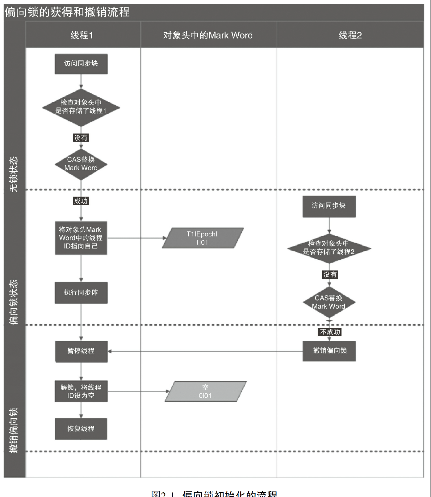

- 读前感

- - 对于并发，是一个很重要的内容，必学。目前推荐有两本《Java并发编程的艺术》《Java并发编程实战》，并发编程艺术比较简单，入门先看，后续有时间再看编程实战，加深对并发的理解

- 1 并发编程的挑战

- - 上下文切换

  - - 保存当前任务上下文，切换到另一个任务上下文，执行。单核CPU处理多线程时，通过不停切换线程完成，时间片一般是几十毫秒

- 2 java底层实现

  - 术语

  - 内存屏障：用于实现对内存操作的顺序限制
  - 缓存行：缓存中可分配的最小存储单位

  - 缓存命中：读的数据在高速缓存中存在，不必读主内存

  - 写命中：需要写入的数据在高速缓存中存在，不必写主内存

  - 缓存行填充：当处理器识别到从内存中读数是可缓存的，处理器读取整个缓存行到适当的缓存

  - compare and swap：比较并交换

  - volatile实现原理

    - （为提高处理速度，处理器不直接和内存进行通信，而是先将内存中数据读到内部缓存（L1，L2或其他））再进行操作
    - volatile修饰的变量修改时，会多一行代码（Lock前缀开头），需要额外做两件事

      - 更新数据后将cpu的缓存数据更新到系统内存中，通过锁定系统内存中缓存行，保证更新的原子性
      - 处理器缓存数据的写回到内存会导致其他处理器缓存失效。处理器通过嗅探技术，能感知系统内存中共享变量发生变化，一旦发生变化则设置自己的缓存失效。待下次访问该缓存时重新从系统内存中填充缓存。

  - synchronized，锁

    - 当一个线程尝试进入同步块前，必须先获得锁，在退出同步块后释放锁

    - Java对象头里有锁标志

      - 无状态锁：偏向锁标记-0，锁标志位-01
      - 偏向锁：偏向锁标记-1，锁标志位-01
      - 轻量级锁：锁标志位-00，指向栈中所记录的指针
      - 重量级锁：锁标志为-10，指向互斥量（重量级锁）的指针
      - GC标记：锁标志为-11

    - 

    - 锁的升级和对比，锁共4种状态，级别从低到高：无状态锁，偏向级锁状态，轻量级锁状态，重量级锁状态。锁可以升级但不能降级

    - - 偏向锁。多数情况下锁总是由同一线程获取，为了使获得锁的代价更低引入了偏向锁。偏向锁是当出现锁竞争才会释放锁的机制。

      - 当发生锁竞争时，偏向锁会撤销，但需要等到全局安全点（这个时间没有正在执行的字节码）。先暂停线程，检查线程是否存活，不存活设置成无锁；存活就将锁偏向其他线程
        - jvm可配置关闭关闭偏向锁。-XX:UseBiasedLocking=false关闭偏向锁
        - 适合只有一个线程访问同步块场景

      - 

      > 对象初始状态偏向锁标记为1，处于偏向状态。当发生锁竞争释放偏向锁之后，取消偏向状态，改为非偏向锁。后续无法再变为偏向锁

      - 轻量级锁。利用CAS来尝试获取（CAS将对象头中的mark work替换成执行所记录的指针），若失败则线程尝试使用自旋获取锁；当尝试CAS释放锁时，成功表示没有竞争，失败则存在锁竞争，锁膨胀为重量级锁，线程阻塞。锁不存在降级

    - 

    > 当通过CAS自旋获取锁时，若在自旋结束前获得了锁，则获取成功；若在自旋结束后仍未获得锁（自旋限制一定次数），则阻塞自己，升级成重量级锁
    >
    > 轻量级锁至少在每次申请、释放时都要执行一次CAS。而偏向锁只在初始化时执行一次CAS

  - 锁优缺点对比

    - 偏向锁：性能消耗最低，无竞争，且只有在第一个申请锁的线程会使用偏向锁。当出现锁竞争时，会释放偏向锁，无法再重新获取到
    - 轻量级锁：性能消耗较低，无竞争，多个线程交替使用锁。竞争的线程不会阻塞，通过自旋竞争锁，若竞争失败则升级为重量级锁
    - 重量级锁：性能消耗最高，有竞争，且锁竞争时间长。会产生线程阻塞，追求吞吐量

  - 实现原子操作

  - - CAS算法（compare and swap），在更新值之前先确保预期值（取到的原来的值）和原来的值一致，否则更新失败。但CAS存在三大问题

    - ABA问题，当变量由A变成B，再变成A，CAS检查无法感知它发生过变化，不符合CAS的检查目的。可以通过增加版本号s的方式解决此问题
      - 循环时间长开销过大，当CAS更新不成功便循环尝试更新。若JVM能支持处理器提供的pause指令，效率会提升。pause作用：一是可以延迟处理流水线指令；二是避免在退出循环时因内存顺序冲突而引起的流水线被清空
      - 只能保证一个变量的原子性。解决：将多个变量放在一个对象里

    - 使用总线锁，其他处理的请求会被阻塞，锁定的处理器可以独占共享内存

    - 使用缓存锁保证原子性，总线锁消耗太大，缓存锁消耗更小，通过缓存一致性保证无两个处理器同时修改同一内存区域数据。

    - 当操作的数据跨越多个缓存行时，只能采用总线锁
      - 部分处理器不支持缓存锁定

- 3 Java内存模型

- - 内存模型的基础

    - 线程之间通过共享内存（隐式）和消息传递（显式）来通信及同步
    - Java中所有实例域、静态域和数组元素都存在堆内存中，堆内存线程共享
      - Java线程之间的通信由Java内存模型（JMM）控制。每个线程都有一个本地内存（JMM的一个抽象概念，并不真实存在），共享内存，通过JMM通信
    - 指令的重排序
      - 在执行程序时，为提高性能，编译器和处理器会对指令做重排序
      - 重排序分3种。从源代码到最终执行代码到指令序列，会经历下面三种重排序（顺序执行），得到最终执行序列。1是编译器重排序，23是处理器重排序
        - 1、编译器优化的重排序
        - 2、指令并行的重排序。现代处理器对指令采用了并行技术，并将多条指令重叠执行，如果不存在数据依赖性，可以改变指令执行的顺序
        - 3、内存系统的重排序。由于处理器使用读写缓存，使得加载和存储看起来时乱序的
      - JMM编译器禁止特定类型的重排序，通过插入特定内存屏障实现
    - 并发模型的分类，处理器的不同重排序的规则也不同。分别有读-读，读-写，写-写，数据依赖等重排序指令顺序
    - happens-before，如果一个操作的执行结果要对另一个操作可见，两个操作必须存在happens-before关系。两操作可以在一个线程内，也可以在不同线程内。
      - 两个操作若存在happens-before关系，并不意味前一个操作必须在后一个操作之前执行
  - 重排序

    - 为了提升性能，编译器和处理器常常会对指令进行重排序，但都不会改变存在数据依赖的两个操作的执行顺序
    - as-if-serial：不管怎么重排序，程序的执行结果都不能被改变
    - 在单线程中，对存在控制依赖的操作重排序，不会改变执行结果。在多线程中则不一定，多线程可能会对存在控制依赖的操作重排序，进而改变执行结果
  - 顺序一致性

    - 顺序一致性模型特性
      - 一个线程中的所有操作必须按照程序的顺序执行
      - 在模型内，每个操作都必须是原子的且立刻对所有线程可见
      - 对于未同步的多线程程序，JMM只提供最小安全性，线程读到值是默认值或最新的值
      - 在内存模型中，对long/double的操作分为两步执行（一步处理四个字节），但从JDK5开始，仅允许把64位的写操作分为两步执行，读操作必须具有原子性（在单个事务中读）
    - 未同步程序的执行特性
      - 未同步程序在JMM上执行时无序的，执行结果无法预知。未同步模型有如下几个差异
        - 顺序一致性模型按照程序的顺序的执行，JMM不保证顺序性
        - 顺序一致性模型所有线程能看到一致的操作执行顺序，而JMM不保证
        - JMM不保证对long/double的写操作具有原子性，而顺序一致性模型保证对long/double的读写操作具有原子性
  - violate

    - 特性
      - 可见性，对单个变量的读，总能读到最新的值（多线程更新之后最新的值）
      - 原子性，对单个变量的读/写都是原子性的，对复合操作不具有原子性
    - volatile变量读写通过主内存通信。当写一个violate变量时，JMM会把该线程对应的本地内存的共享变量值刷新到主内存中；当读一个voilate变量时，JMM会使本地缓存失效，从而去读区主缓存
    - 重排序

      - 两个violate操作不能进行重排序
      - 第一个操作是violate读时，第二个操作为普通读写不能重排序
      - 第二个操作是violate写时，第一个操作为普通读写不能重排序
    - 内存屏障
      - 在每个volatile写操作前增加一个StoreStore屏障。防止上面的操作与下面的volatile重排序
      - 在每个volatile读操作后增加一个StoreLoad屏障。防止上面的volatile与下面的volatile重排序
      - 在每个volatile读操作后增加一个LoadLoad屏障。防止上面的volatile与下面的volatile重排序
      - 在每个volatile读操作后增加一个LoadStore屏障。防止上面的volatile与下面的普通读写重排序
  - 锁的内存定义
    - 当线程获得锁时，JMM会把该线程的本地缓存置为无效
    - 当线程释放锁时，会将本地缓存同步到主内存中
  - final域的内存语义

    - 禁止把final域的写重排序到构造函数外
    - 禁止对对象和读该对象final域进行重排序（即读final域时对象一定初始化完成了）
  - happens-before

    - 定义
      - 如果一个操作happens-before另一个操作，第一个操作的执行结果一定对另一操作的可见，且第一个操作的执行顺序排在之前
      - 两个操作存在happens-before关系，并不能保证Java平台具体实现按照happens-before关系指定的顺序执行，若果重排序之后的结果与happens-before的结果一致，这种重排序是允许的
    - happens-before保证正确同步的多线程执行结果不被改变
  - 双重检查锁定与延迟初始化
    - 单例模式获取实例：双重检查锁定与延迟初始化
    - 当jvm进行类初始化时，会获取类的一个锁，支持多线程同步初始化类（其他类阻塞）。初始化类会分为很多步骤，频繁释放锁和锁竞争

- 4 Java并发编程基础

- - 线程简介

    - Thread
      - start()，线程进入运行态，开始运行
      - wait()，线程进入等待态，需要其它线程唤醒。释放锁资源。调用wait方法的线程必须持有该对象的锁(wait函数原话：必须是该对象监视器的owner)，否则抛出异常

      - sleep()，线程由运行态变成阻塞态，不会释放锁资源

      - yield()，静态方法，线程由运行态变成就绪态，放在相同优先级队列的末尾

      - join()，暂停当前线程，运行调用方线程（调用join方法的线程），直至调用方线程结束。也可以指定先运行调用方线程多长时间

      - interrupt()，为线程设置一个中断标记，含有中断标记的线程调用部分函数会抛出InterruptException

      - notify()， 唤醒一个线程

      - notifyAll()， 唤醒所有线程

      - 过期方法，不建议使用

        - suspend()，悬挂/暂定线程。缺点是暂停时线程不会释放锁，而是占用资源进入睡眠态
        - resumed()，恢复线程
        - stop()，终止线程。缺点是通常是不给线程完成工作释放资源的机会来达成线程停止的作用，实际线程可能最后处于不确定状态

    - Java线程优先级

      - java线程优先级只是表示CPU会优先（高概率）分配给高优先级的线程，但并不是高优先级一定比底油先救线程先执行，这是一种概率事件
      - 存疑：只是java设置线程优先级会这样，操作系统还是直接的调度者，先执行高优先级的线程

    - Daemon（守护）线程

      - daemon是一种支持线程，用于程序中后台调度及支持性工作。当虚拟机中没有非daemon线程时，虚拟机会退出。可通过Thread.setDaemon(true)来设置当前线程为daemon线程

  - 启动和终止线程

    - 中断
      - 中断interrupt()只是对线程的一个中断标记，并不会使线程变成阻塞态。部分函数都会抛出InterruptException，表示含有中断标记的线程无法调用函数出错
      - 可利用中断标记来中断线程

  - 线程间通信

    - Thread方法（下面等待唤醒函数需要锁定对象或类）
      - wait()，放弃对象锁，线程由运行态变为等待态
      - wait(long)，最长等待一定时间，可被提前唤醒
      - notify()，唤醒一个处于等待该对象的等待态线程，使其变成就绪态
      - notifyAll()，唤醒所有..

- 5 java中的锁

- - 队列同步器

    - 接口
      - getState() 获取当前同步状态
      - setState(int newState) 设置当前同步状态
      - compareAndSetState(int expect, int update) 使用CAS设置当前状态，保证设置的原子性

  - 重入锁

    - 表示能支持重入的锁，即该锁支持一个线程对资源的重复加锁
    - 实现重进入

      - 线程再次获取锁。判断获取锁的线程是否为当前获取资源的线程，如是允许重进入
      - 锁的最终释放。重复获取了n次锁，需要释放n次才能真正释放锁

    - 获取锁的公平性，FIFO（先到的先获取锁）

      - 公平性锁采用FIFO原则，线程虽然不会饥饿，但存在大量的线程切换。非公平性锁则不然，能保证大量的吞吐量

  - 读写锁（ReentrantReadWriteLock）

    - 用于读多写少的场景，性能和吞吐量更好。吞吐量优先，支持重进入，写锁能降级为读锁

  - Condition接口

    - 提供类似于Object监视器功能（Objec中含有wait，notif方法，配合synchronized可实现等待/通知模式），功能更强大。
      - 多个等待队列，支持在等待状态中不相应中断，支持超时等待等

- 6 java并发容器和框架

- - ConcurrentHashMap

    - HashMap，非线程安全，在map.put并发操作时，可能形成环形结构
      - 如何形成环形。在Java7版本中，hash当容量太小要扩容，但是扩容时链表元素的顺序的反着的（由于具体实现原因），导致A-B-null会变成B-A-null，如果两个线程同时进行扩容，线程1执行到将节点A保存好了，准备保存B时，线程2已经扩容完成将链表顺序编程B-A-null，此时线程1继续扩容，本该B后面是null，但这里却发现B后面还是A，继而又保存A是的，A-B-A-null，这样A-B节点结构成环
      - 参考：https://blog.csdn.net/weixin_30344795/article/details/95930150?depth_1-utm_source=distribute.pc_relevant.none-task-blog-BlogCommendFromBaidu-1&utm_source=distribute.pc_relevant.none-task-blog-BlogCommendFromBaidu-1
      - Java8扩容时修改了这块，保存的原来链表的顺序。但仍不能保证HashMap是线程安全的。比如两个线程同时进行put和resize时，put给链表尾部增加一个新节点，而resize让尾部节点后为null，改变了意思
      - HashMap扩容，一个个节点不变，只是创建了一批新引用，修改 了原节点的关系

    - HashTable，线程安全，但效率低，函数都是通过加synchronized方法实现线程安全（synchronized方法只能同时被一个线程调用）

    - ConcurrentHashMap，采用分段锁，提升并发效率

    - 由Segment数组结构和HashEntry数组结构组成，Segment是可重入锁，用于锁，结构和HashMap类似，是一种数组和链表结构，一个Segment包含一个HashEntry。HashEntry用于存储数据

    - Segment

      - 数组最大长度为2^16=65536，concurrencyLevel表示左移个数，即16
      - 两次hash，为了节点分布更均匀
      - get函数不加锁，因为将共享变量都设置成了violate，保存读到的正确性
      - 扩容时只对单个Segment扩容，统计ConcurrentHashMap元素大小时也需要对所有Segment元素求和，计算大小时直接加和可能得不到正确的总大小（之前累加过的可能发生变化）。所以ConcurrentHashMap采用尝试2次不加锁加和统计，若失败再采用加锁（锁住影响元素变量的操作，如put,clear,remove）。至于容器如何感知元素加和前后是否发生变化，采用共享变量modCount来感知，元素发生变量modCount都会加1，加和前后对比modCount是否相等即可

  - ConcurrentLinkedQueue

    - 采用无锁算法（CAS）实现线程安全

  - Java里的阻塞队列

    - BlockingQueue
      - 支持阻塞的插入方法，当队列满时，队列会阻塞插入元素的线程，直至队列不满
      - 支持阻塞的移除方法，当队列为空时，队列会阻塞移除方法，直至队列非空

    - 常见方法及队列不可用时应对情况（队列满，队列为空）

      - 插入及队列满时的应对情况
        - add(抛异常），offer（返回特殊值），put（一直阻塞），offer(e, time, unit)(超时退出)

      - 移除及队列空时的应对情况

        - remove（抛异常），poll（返回特殊值），take（一直阻塞），poll（time, unit）（超时退出）

      - 检查方法

        - element（抛异常），peek（返回特殊值）

  - Fork/Join框架

    - Fork/Join框架时Java7提供的一个并发执行的框架，把一个大任务分割成多个小任务，最后将小任务结果汇总得到大任务的结果
    - 工作窃取算法，指某个线程从其它队列里窃取任务来执行。窃取线程从队列尾部取任务处理，原线程从队列首部曲任务处理，减少线程竞争

- 7 Java中的原子操作类

- - sun.misc.Unsafe

    - Jvm自带的原子操作类，带有原子CAS方法（CAS如何实现，依赖于CPU，是一条原子指令）。汇编方面解释，CAS是一条系统原语，属于操作系统用于范畴，由若干条指令组成，且原语的执行必须是连续不能中断的，所以CAS是一条原子指令
    - 方法

      - public native long objectFieldOffset(Field f); // 返回域字段所在类的偏移量
      - public native Object getObject(Object o, long offset);  // 返回对象o中偏移量为offset的对象变量
      - public native void putObject(Object o, long offset, Object x); // 将对象x引用设置给对象o中偏移量offset的对象变量
      - public native Object getObjectVolatile(Object o, long offset);  // 支持volatile load语义
      - public native boolean compareAndSwapObject(Objecte, long offset, Object expected, Object x); // 原子操作，若对象o中偏移量offset的对象变量为期望值则更新为新值。另还有Int，Long方法，boolean自动转换为int来使用

  - 原子类

    - AtomicReference 原子引用类
    - AutomicInteger 原子整型类
    - AtomicIntegerFieldUpdater 原子整型字段类
    - AtomicStampedReference 原子更新带版本的引用类型，解决ABA问题

- 8 Java中的并发工具类

- - CountDownLatch

    - 等待多线程完成，当调用countDownLatch时，CountDownLatch的计数就会减一，当CountDownLatch调用await方法时，会阻塞当前线程，知道计数为0
    - 可用于多个线程处理完任务后需要合并得出结果

  - 同步屏障CyclicBarrier

    - 当线程到达一个屏障时被阻塞，知道最后一个线程到达屏障时，所有阻塞的线程才会继续运行
    - 当调用await方法时表示线程到达屏障，被阻塞，直到阻塞线程数达到屏障的最大量才释放线程

    - 可用于多线程计算数据

    - 与CountDownLatch区别

      - CountDownLatch只能运行一次，CyclicBarrier能执行运行线程，reset

  - 控制并发线程数的Semaophore

    - 控制访问特定资源的线程数
    - acquire()表示线程资源占用和release()释放资源，包含并发量控制

  - 线程间交换数据的Exchanger

    - 第一个线程执行exchange()方法，它会等待第二线程执行exchange()方法，即都到达同步点，交换数据

- 9 Java中的线程池

- - 线程池使用的好处

    - 降低资源消耗，通过重复利用线程资源来减少线程频繁创建和消费所造成的消耗
    - 提高响应速度，任务提交可以直接运行，无需等待创建线程
    - 提高线程的可管理性，频繁的创建和销毁线程，不仅消耗资源，还降低系统的稳定性，使用线程池可做到统一分配、监控和调优

  - 线程池

    - 提交任务，判断核心线程池是否已满（线程池线程数是否小于corePoolSize），不满创建线程执行任务（需要获取全局锁），否则进行下一步
    - 判断队列是否已满，不满将任务存储在队列中，后续有线程空闲去队列中取任务执行，否则进入下一步
    - 判断线程池是否已满，不满创建线程执行任务（线程池线程数是否小于maximumPoolSize，创建新线程需要获取全局锁），否则进入下一步
    - 按照策略处理无法执行的任务

  - 基本信息

    - corePoolSize（线程池基本大小）
    - runableTaskQueue（任务队列）

      - ArrayBlockingQueue，基于数组的有界队列，采用FIFO。线程数大于corePoolSize 时，新任务加入队列，当队列满员后新任务加入线程池，小于等于maximumPoolSize。知道线程数大于maximumPoolSize，执行拒绝策略
      - LinkedBlockingQueue，基于链表的无界队列（默认大小Integer.MAX_VALUE，可指定最大容量），采用FIFO，吞吐量通常高于ArrayBlockingQueue。线程数大于corePoolSize时，新任务加入队列
      - SychronousQueue，不存储的元素的阻塞队列，每个线程的插入操作需等待另一线程的移除操作，吞吐量通常高于LinkedBlockingQueue
      - PriorityBlokingQueue，具有优先级的无界阻塞队列。底层是数据结构，默认大小11，可自动扩增

    - maximumPoolSize（线程池最大数量）

    - ThreadFactory，创建线程池的工厂

    - RejectExecutionHandler（饱和策略）

      - AbortPolicy，默认，直接抛出异常
      - CallRunsPolicy，使用调用者所在线程执行任务
      - DiscardOldestPolicy，抛弃最老的一个任务，执行当前任务
      - DiscardPolicy，不处理，直接丢弃

    - keepAliveTim（线程活动保持时间），线程空闲后存活的时间

    - 线程过期废弃

      - （wc：当前线程数）
      - 大前提，线程废弃都需满足此条件。wc>1 || (任务队列中无元素)
      - wc>maximiumPoolSize线程会被废弃
      - corePoolSize<wc<=maximumPoolSize，线程在超时时间内没有获取到任务废弃
      - wc<=corePoolSize且allowCoreThreadTimeout=true(默认false)线程在超时时间内没获取到任务诶废弃

  - 提交任务

    - execute方法
      - 用于提交不需要返回值的任务，无法判断执行任务是否被线程池执行成功

    - submit方法

      - 用于提交需要返回值的任务，线程会返回一个future对象，通过对象判断任务是否执行成功。
      - 通过get方法来获取返回值，get方法会阻塞当前方法直到线程执行完成

  - 关闭线程池

    - shutdown，关闭线程池，遍历线程池中的所有线程，将线程状态设置为中断（调用interrupt）
    - shutdownNow，首先将线程池的状态设为STOP，然后尝试性地中断所有线程

  - 线程池配置

    - 不要设置得过大，通常如2*CPU个数。通过Runtime.*getRuntime*().availableProcessors()获取cpu个数

  - 线程池

    - 线程池属性
      - taskCount，需要执行的任务数量
      - completeTaskCount，完成的任务数量
      - largestPoolSize，过去达到的最大线程数量
      - getPoolSize，线程池线程数量
      - getActiveCount，获取活动的线程数量

- 10 Executor框架

- - 简介

    - Executor接口，线程池框架基础接口
    - ExecutorService接口，Executor关键接口实现。以下两种实现类

      - ThreadPoolExecutor是线程池的核心实现类，用来执行提交的任务
      - ScheduleThreadPoolExecutor是一个实现类，可以在给定的延迟后运行命令，或定期执行命令

    - Runnable接口和Callable接口的实现类，都可交由Executor执行

    - ThreadPoolExecutor

      - FixedThreadPool，创建使用固定线程数的API，适用于负载较重的服务器
      - SingleThreadPoolExecutor，创建使用单个线程的API
      - CachedThreadPool是大小无界的线程池，适用于执行很多短期异步的任务的小程序，或者是负载较轻的服务器

    - ScheduleThreadPoolExecutor，可创建两种类型

      - ScheduleThreadPoolExecutor，包含若干个线程的ScheduleThreadPoolExecutor
      - SignleThreadScheduleExecutor，只包含一个线程的ScheduleThreadPoolExecutor

    - Future接口，表示异步计算调用

      - 调用get()阻塞当前线程等待目标线程完成，可调用cancel()取消线程执行
      - 调用get()

        - 未启动的任务调用get()并不会启动任务
        - 已完成的任务调用直接返回结果

    - Runnable接口和Callable接口

      - Runnable不会返回结果，Callable会返回结果

  - 详解

    - FixedThreadPool
      - 可重用的固定线程数的线程池，使用正无穷大的（int的最大值）的LinkedBlockingQueue，最大线程数无效。线程超时回收时间0，表示线程一旦不适用立刻释放

    - SingleThreadExecutor

      - 使用单个的worker线程的Executor，核心线程数和最大线程数都为1，其它同FixedThreadPool

    - CachedThreadPool

      - 根据需要创建线程的线程池
      - 核心线程数为0，最大线程数为Integer.MAX_VALUE，无界的。keepAliveTime为60s。使用无容量的SynchronousQueue作为线程池的工作队列
      - 极端情况下，该线程池会不断创建线程，进而因创建过多线程而耗尽cpu和内存资源

    - ScheduledThreadPoolExecutor

      - 使用delayQueue（封装了一个PriorityQueue，根据各任务执行时间time排序），需要执行的任务都放入该队列中。线程池从队列中取任务执行
      - 具体实现

        - 先从DelayQueue中获取到期任务（未到时间则等待）；执行该任务；修改下次执行时间重新放入任务队列中；

  - FutureTask

    - 实现了Future和Runnable接口，代表异步计算的结果
    - 可以交给Executor执行，也可以直接FuntureTask.run()执行

- 11 Java并发编程实践

- - 线上定位问题

    - top，查看进程情况
      - cpu参数含义
        - us，用户空间占用cpu百分比
        - 1.0% sy 内核空间占用c	pu百分比
        - 0.0% ni 用户进程空间改变过优先级的进程占用cpu百分比
        - 98.7% id 空闲cpu占比
        - 0.0% wa 等待输入/输出的cpu时间百分比

    - cpu 100%，可能产生了死循环