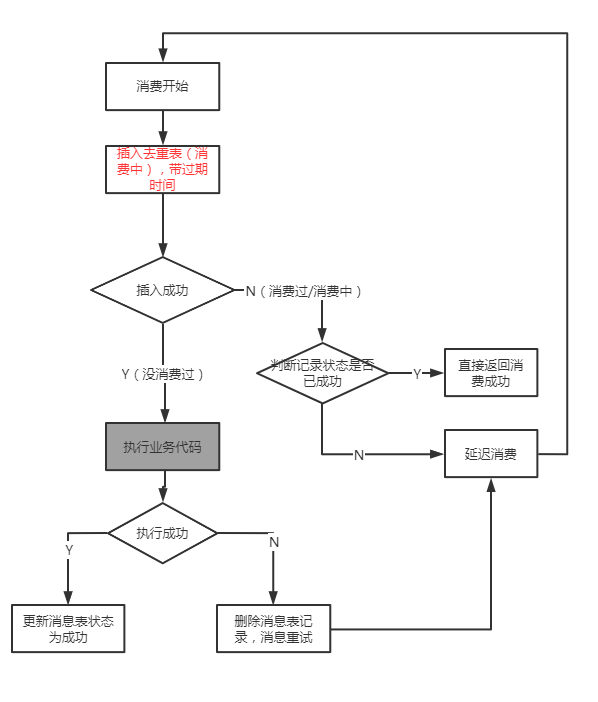
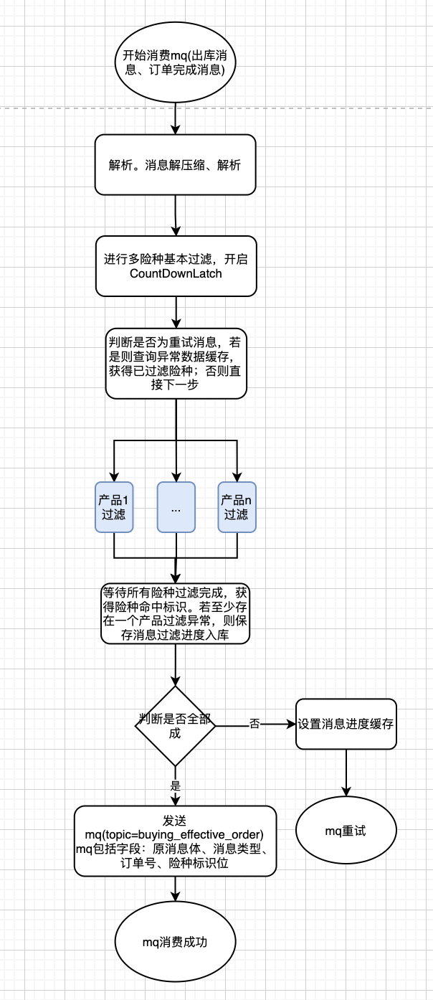
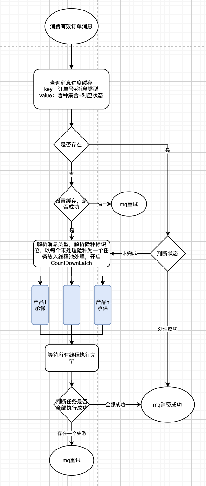
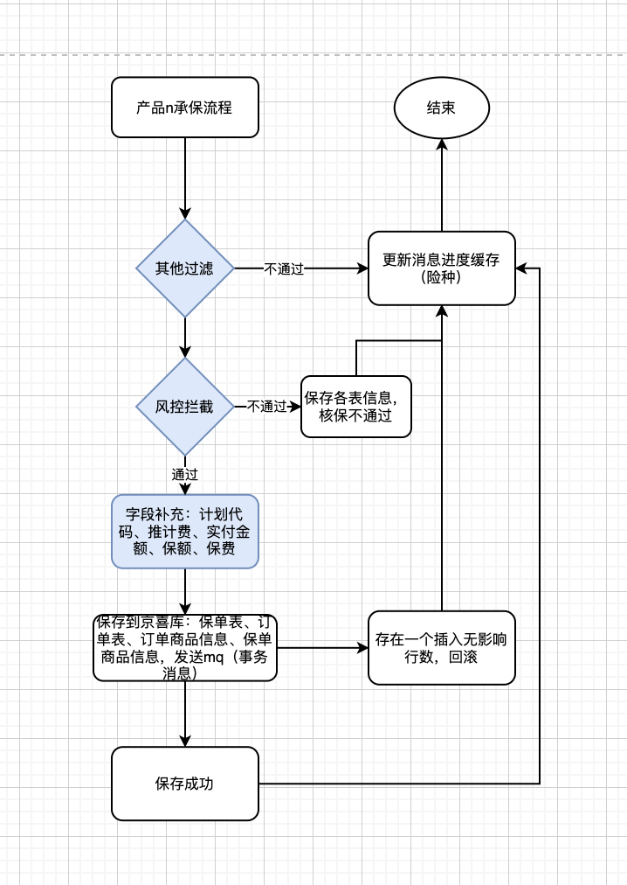
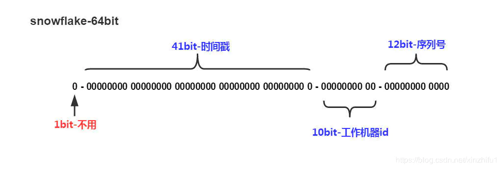
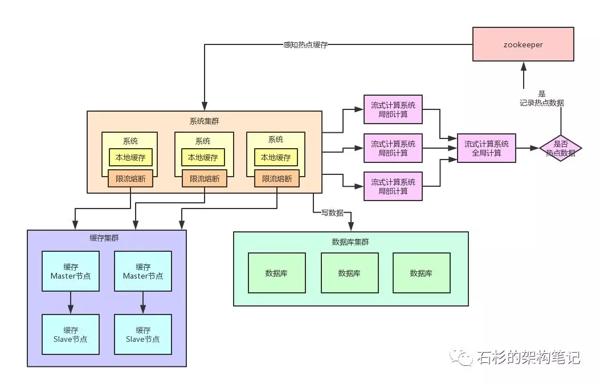

### 系统设计要点

- 系统是怎么设计的？为什么要这么设计？
- 解决了什么问题？
- 当前系统存在的问题？后续的优化点？

### 设计秒杀系统

同一数据高并发读问题

使用缓存，当缓存失效再去数据库拉取。允许产生的一定的脏读（未及时更新），在写时校验强一致性

同一数据高并发更新问题

对于Innodb来说，产生的是行级锁（索引），当遇到高并发更新时，吞吐量也会受到影响

- 对应用做排队，按照商品维度对设置队列顺序执行，较少对同一数据的并发修改，同时也能控制数据库连接数量
- 数据库层做排队


总结

- 业务隔离（提前报名），数据隔离，系统隔离
- 多机分流，限流，用户防刷
- 动静分离，静态数据（html、css、js、img）保存在CDN中
- 动态数据读取redis读写分离（读多写少集群），不通过直接返回
- 信息验证，确认订单，更新至redis主从版中，通过lua脚本保证多个操作的事务性
- 保存成功后，异步保存到mysql中（rocketmq或redis list）

```
local n = tonumber(ARGV[1])
if not n or n == 0 then
  return 0
end
local val = redis.call("hmget", KEYS[1], "total", "selled");
local total = tonumber(val[1]);
local selled = tonumber(val[2]);
if not total or not selled then
  return -1
end
if selled + n <= total then
  redis.call("hincrby", KEYS[1], "selled", n);
  return n;
end
return -2;
```

#### 秒杀系统设计

https://www.zhihu.com/question/54895548

https://www.infoq.cn/article/ypqschsrdsk8bv5nhny4

1. 秒杀场景
   1. 定时开始，秒杀时流量激增，大量用户抢购同一商品
   2. 下单量远远大于库存量，但只有少量用户能成功
   3. 操作可靠，库存资源有限，不能出现超卖情况
2. 隔离
   1. 业务隔离。需要通过某种方式才有秒杀资格，比如提前预约，领取秒杀名额等
   2. 服务隔离，机房隔离
   3. 数据库隔离。
3. 客户端层
   1. HTML静态
      1. 商品详情页面，静态生成
      2. 生成动态链接。防止知道抢购链接的人（内部人员）卡时间通过程序访问，可以通过md5加密随机字符串生成url，只有系统知道，然后在秒杀前开发给用户访问
      3. 设计问题或滑动模块
   2. JS动态
      1. 控制开始秒杀按钮
         1. 前端定时请求后台服务器获取时间，根据时间判断是否开始秒杀，未开始按钮置灰
         2. 秒杀按钮点击后不能置灰不能重复点击
      2. 下单后后不能重复下单
   3. 数据动静分离，静态数据保存到浏览器>CDN缓存>服务端缓存中。将html、js、css、img等静态数据保存到CDN服务器上，让用户从离自己最近的服务器上获取这些信息
4. 代理层
   1. 缓存，可以缓存用户信息，可以用来保存一些不经常变更的信息，不用访问应用层
   2. 过滤器，可以过滤掉一些不满足条件的用户
   3. 限流。限制后台服务器的请求量，且阈值可以动态调整，当部分后台服务器挂掉后，应动态减少阈值，以保护后台服务器
5. 应用层
   1. 限流&降级&熔断
   2. 库存预检。查询库存，若未售完，则返回成功进入订单信息确认页面；若已售完，则返回秒杀失败
      1. redis读写分离（主要用来查询库存）
         1. 缓存预热：提前按照商品维度设计库存量和已售卖量，保存在redis中
         2. 预检查询
         3. 更新：通过监听库存的binlog日志，更新库存
   3. 秒杀下单。redis+lua+数据库。主从redis（主要用来做二次查询检验和扣减库存）
      1. 通过redis+lua扣减缓存，若当前售卖量信息为空（目前仅当redis宕机才可能出现为空的情况），则读取数据库获得最新数据（此时数据库数据量肯定大于最新redis量，因为可能还有部分请求仍在队列中，未更新到数据库）
      2. 查询数据库时，添加分布式互斥锁，再次查询缓存，不存在再查询数据库（不加锁，此时查的可能是从库），获得数据后放入缓存中
      3. 若当前售卖量信息不为空但扣减失败，直接返回秒杀失败
      4. 若redis扣减库存成功，进行幂等校验，判断该用户是否已经秒杀过该商品（redis缓存+数据库唯一键约束），若秒杀过则直接返回秒杀失败，且库存还原，回调通知秒杀结果
      5. 发送mq消息，异步实现数据库库存扣减及订单生成
      6. MQ的幂等校验，MQ已消费完成则幂等结束
      7. 业务层幂等校验，判断该用户是否已经秒杀过该商品（redis缓存+数据库唯一键约束），若存在则以幂等处理（此处重复时mq消费重复，不必回滚redis缓存），更新写缓存；若未秒杀，则插入数据库，插入成功进入下一步，否则返回秒杀失败，更新缓存
      8. 数据库扣减数据，创建订单数据（幂等专用），若数据库无可扣减库存，则返回秒杀失败，不回滚写缓存（此时数据库库存为0，不必回滚redis，都视为秒杀失败）；若数据库出现网络、数据库等异常，消息延迟重试处理；若扣减成功，则回调通知秒杀成功
6. 数据库
   1. 数据估算
   2. 分库分表
   3. 数据隔离
   4. 数据合并，，方便查询
7. 压测
   1. 测试方式
      1. 正压力测试。不断地对系统施加压力，增大请求量，直至系统崩溃，得到压力阈值
      2. 负压力测试。设置好一定压力，不断的减少系统资源，直至系统崩溃，得到压力阈值
   2. 测试步骤
      1. 确定目标，比如需要支持500W并发访问量
      2. 确定关键功能，2/8原则，20%的服务是占总访问量的80%
      3. 确定负载服务
      4. 选择环境，尽量选择和生产环境一样的环境
      5. 确认监视点指标，比如cpu负载、内存使用率、系统吞吐量等
      6. 产生负载，即模拟请求，模拟数据
      7. 执行测试
      8. 分析数据
8. 下单后异步操作：监听binlog日志，完善订单信息，物流信息，增值服务信息等
9. （可选）设计抢购前填写验证码，实现流量削峰
10. （可选）库存分块存储，比如一种商品库存分成多部分，保存在不同的系统和数据库中，分区域秒杀

#### 扣减库存的问题

目前存在下单减库存和付款减库存两种方式

##### 下单减库存

优势：用户体验最好，下单成功即抢购成功

劣势：可能存在下单后却一直不付款，导致这些商品无法卖出。很可能出现在恶意刷单不付款的情况，导致秒杀商品无法被卖出

##### 付款减库存

优势：不会存在恶意刷单行为，保证所有商品都能被正常秒杀完成

劣势：客户体验不好，用户下单完成后，再付款也可能出现秒杀失败，相当于在付款时才触发秒杀的动作

总结：根据客户端体验和商业诉求来选择哪种秒杀扣减库存的方式，推荐第二种

### 幂等设计

#### 本地消息表



### 如何保证数据库与缓存的一致性

参考：https://juejin.cn/post/6844903941646319623

数据数据库和缓存，就只能保证最终一致性，强一致性几乎不可能

#### 1. 缓存的读取和更新

读取：首先查询缓存，存在直接返回；若不存在则查询数据库获取最新数据，保存到缓存中，然后返回

更新：当数据库发生变更时，缓存如何更新

- 先更新缓存，再更新数据库：不可行。很可能存在缓存更新成功数据库更新失败
- 先删除缓存，再更新数据库：不可行。1.A删除缓存；2.B查询缓存，不存在则设置缓存；3.A更新数据库。可能造成导致缓存与数据库不一致
- 先更新数据库，再更新缓存：不可行。1.A更新数据库；2.B更新数据库；3.B更新缓存；4.A更新缓存。可能造成缓存与数据库不一致
- 先更新数据库，再更新缓存：基本可行。1. 无缓存，A查询数据库；2.B更新数据库；3.B删除缓存；4.A更新缓存。可能存在不一致性，但这种情况可能性很低，数据库查询一般较快（不过快照读会增加这种情况的概率）。然而在主从分离的情况下，发生这种情况的概率更高

问题分析：先更新后删除策略，可能删除缓存会失败，而这样直接回滚数据库也不合理。这里可以通过重试多次的方式保证缓存更新成功，然后可能引入消息队列的方式，注意同一个缓存应保证顺序（可以配置kafka或rocketmq相同的sharding key），尽量减少失败的概率，但因重试会导致更长时间的缓存与数据不一致

#### 2. binlog同步

因缓存更新引入消息队列这些过于麻烦，直接通过订阅binlog日志来实现缓存删除策略，异步解耦。binlog订阅的master节点，也没办法解决上述主从同步的数据库不一致问题

#### 3. 强一致性思路

要达到强一致性，就需要解决数据库更新至缓存更新这段数据不一致的时间问题。时间差必然存在，可以通过控制这段时间不允许缓存读取，即阻塞读请求。引入分布式读写锁，写入时添加写锁，阻塞读请求或者只能读数据库，保证不会读到脏数据，但是分布式读写锁的实现和问题也不少，而且阻塞的读请求直接数据库可能导致数据库压力过大...

#### 4. 缓存击穿

缓存更新时可能存在某时刻缓存删除，大量请求打入，直击数据库导致数据库宕机。此时可以通过加锁的方式，当缓存不存在，添加锁，只允许一个请求访问数据库获得最新结果，放入缓存中。单机直接使用互斥锁，机器量大需要使用分布式锁，高并发下分布式锁实现也比较有考验

**总结**：分布式系统下，往往只能保证数据的最终一致性，若无法容忍短暂的不一致性，就需要通过其他更复杂的方式实现，系统复杂度飙升

### 接口加解密

sign：签名。对明文数据字符串A进行base64得到字符串B，在B后添加MD5-KEY得到字符串C，再进行md5得到sign

Data：数据。对明文数据字符串A进行base64得到字符串B，再使用秘钥AES-KEY进行AES加密得到密文data

### 优化点

1. hibernate遇到第一个错误即返回失败，不必校验全部错误
2. 分库分表，库表数量为2的整数次幂，在分表时直接使用&位运算

## 项目相关

### 订单过滤系统设计

#### 设计方案

**1. 基础过滤层**



**2. 承保处理层**



**3. 险种详细承保流程**



#### 背景

以订单维度开始承保，所以承接商城全量订单消息（多种类型），进行订单过滤和承保

#### 原设计的问题

1. 不方便扩展。因产品的过滤、承保逻辑都不相同，每次新增一个产品都需要新订阅一套消息，造成同一套消息被重复订阅，拉取，传输，解析，造成mq broker和系统内部压力线性增长，并未每套消息都是千万级别，大促期间更是翻几倍
2. 过滤、承保一体化流程，线路较长，若中间失败又需要重头开始
3. （可略过）幂等的设计，仅通过的最后的落库，数据库唯一索引保证幂等性，导致重复消息执行了多余的逻辑处理
4. 过滤及承保流程放在一起，可能因承保逻辑处理时间长而造成mq消费速度慢，消息积压

#### 设计的优点

1. 高扩展性。当增加险种及消息订阅关系时，仅改动基础过滤层和承保处理层，甚至可复用消息的基础逻辑
2. 解耦。过滤和承保流程解耦，基础过滤层压力大可适当增加资源。
3. 中断恢复。系统中按照一个消息多任务执行，若存在部分任务执行失败，下次重复仅重试失败任务
4. 幂等设计，通过缓存+数据库，保存幂等性
5. 分布式事务。通过rocketmq事务消息保证分布式事务

#### 设计的不足？优化点？

1. 承保逻辑层中断恢复状态拆分。险种的承保流程可能比较长，若失败重试全部重头开始，会浪费更多的资源，可以考虑划分步骤及记录，每跑完一个步骤则记录下来，若发生中断后续重试时直接从上一中断步骤开始重试。可通过责任链模式实现
2. binlog日志监听实现承保系统的数据同步。因不必保证实时同步，可通过监听binlog日志，发送mq来实现数据的同步

#### 压测报告

暂无

### 状态管理

通过自定义状态机维护订单和保单状态，每次更新订单状态需给定原状态，通过cas对比再更新，保证更新的原子性

**流程设计**：根据原状态和动作码，获得新状态，通过乐观锁更新订单和报单表状态，若影响函数不为1则表示更新失败，若更新成则返回新状态码

**状态机预加载**：在项目启动时就将状态数据从数据库中加载到本地内存中，加快后续查询

**状态机表设计**：原状态、原动作码、新状态、新动作码、状态机类型、其他描述字段

## 分布式id生成

https://juejin.cn/post/6844904065747402759#heading-10

**分布式id需满足的条件**

- 唯一性：生成的id具有唯一性
- 高可用
- 高性能：id生成快，并发性能高
- 趋势递增：最好满足该条件，保证id自增，保证数据库操作的效率
- 方便接入

### UUID

16字节，32位十六进制数表示

- 1-8字节：表示系统时间
- 9-16字节：表示当前机器ip
- 17-24字节：表示对象的hashCode
- 25-32字节：自增id，唯一

### 基于数据库自增id

### 基于数据库集群模式

使用多个数据库集群作为自增id生成，配置自增初始值和自增步长

```
# mysql-1
set @@auto_increment_offset = 1;     -- 起始值
set @@auto_increment_increment = 2;  -- 步长

# mysql-2
set @@auto_increment_offset = 2;     -- 起始值
set @@auto_increment_increment = 2;  -- 步长
```

缺点：数据库仍是瓶颈；不好扩容

### 基于数据库的号段模式

每次申请一批自增id，放入内存中使用，比如1000。

通过数据库表记录维护自增id

- biz_type：业务类型
- max_id：当前最大可用id
- step：号段长度
- version：版本号，用于乐观锁并发控制

```sql
update id_generator set max_id = max_id + step, version = version + 1 where biz_type = type and version = v
```

### 基于Redis

通过设置redis key，然后用自增的方式维护自增id

缺点：持久化丢失问题，需采用rdb+aof持久化

### Snowflake算法

**组成**

- 第一位bit：表示正负符号，一般都是0表示整数
- 时间戳部分（41bit）：可表示69年的时间戳，指定起始时间
- 工作机器id（10bit）：workId，表示当前机器id，可以灵活配置
- 序列号部分（12bit）：自增值，同一秒最多生成4096个id



## hashcode设计

参考String的hashcode实现

```java
public int hashCode() {
  			// hash默认为0，计算后不必再次计算
        int h = hash;
        if (h == 0 && value.length > 0) {
            char val[] = value;

            for (int i = 0; i < value.length; i++) {
                h = 31 * h + val[i];
            }
            hash = h;
        }
        return h;
    }
```

通过一个素数进行散列，获得更加均匀的散列。素数可以选择2的整数幂减一，这个jvm可以转换成移位优化。比如3，7，31，127...估计3，7不太理想，所以经常使用31

- 不能使用偶数，乘以偶数相当于乘以2的整数倍，造成移位部分有效数字丢失
- 选择一个素数，最好是2的整数次幂-1，虚拟机有优化。31正好

## 热点key设计

https://mp.weixin.qq.com/s/RqBla4rg8ut3zEBKhyBo1w

1. Redis集群读写分离。
2. 可通过监听数据库binlog方式同步到redis中
3. 使用流式计算技术（strom，spark streaming，flink）来统计实时数据的访问数据，将热点数据保存到zk中。流式计算系统的性能瓶颈？不会，流式计算先将请求分发到个机器进行计算，最后汇总结果
4. 系统对zookeeper指定的热点缓存znode进行监听，将热点数据同步到系统本地缓存中，通过guava，ehcache保存
5. 最后对redis集群做限流熔断，保存集群。失败后直接返回错误信息



