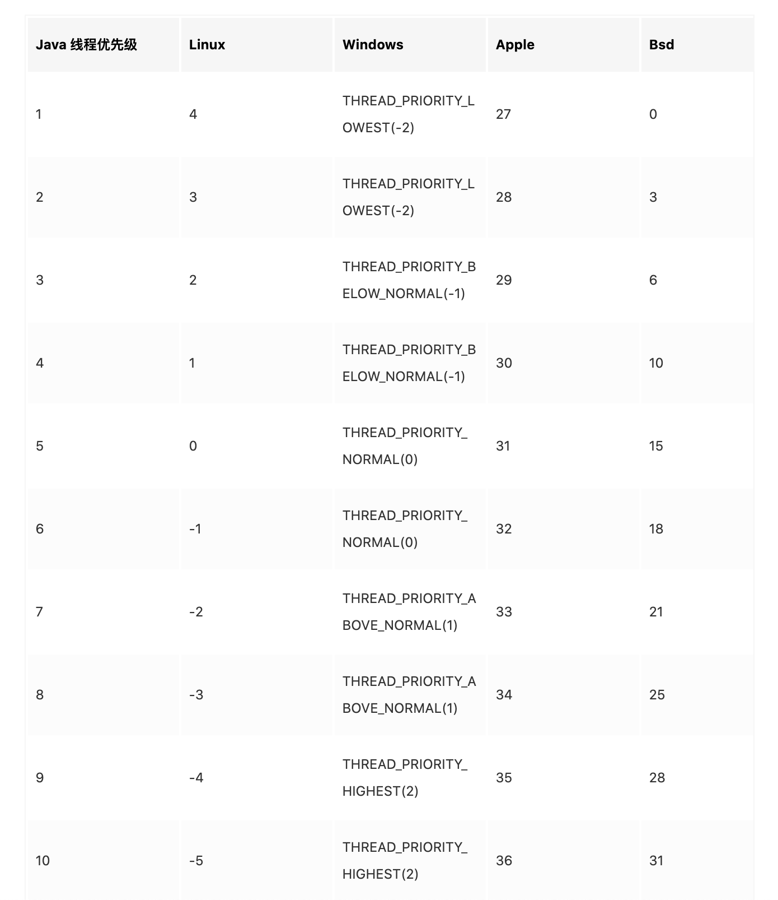

##  第2章 线程安全性

**线程安全定义：当多个线程访问某个类时，这个类始终都能表现出正确行为，则称这个类是线程安全的**

重入：可对锁定对象多次加锁，以计数器的方式标记锁的数量

> 一般servlet是单例的，且不是线程安全的
>
> Synchronized(this) 是锁定当前对象，当前对象锁定了，那么获取当前对象同步方法也会阻塞
>
> synchronized 加在方法上，锁定的调用方法的对象

## 第3章 对象的共享

### 3.1 可见性

### 3.2 发布与逸出

发布指对象能在作用域之外使用。如方法返回对象引用、传递引用至其他方法

当某个不该被发布的对象发布时，成为逸出。如在对象构造完成之前就发布此对象，破坏线程安全性

### 3.3 线程封闭

仅在单线程内访问数据，就不需要同步

> 线程封闭技术常见的一种应用就是JDBC的Connection对象。JDBC并不要求Connection是线程安全，使用时直接去连接池中取，使用完成返回，保重一个Connection只能同时被一个线程使用

ThreadLocal类，为每个线程都保存了一份独立的副本

### 3.4 不变性

不可变对象一定是线程安全的

## 第4章 对象的组合

当下一个状态依赖当前状态时，这个变化到下一个状态的操作就属于复合操作

如果一个类由多个线程安全的状态变量组成，并且所有的操作中都不包含无效状态转换，那么该类的线程安全性可以委托给底层状态变量

## 第5章 基础构建模块

委托是创建线程安全类最有效的策略，用线程安全类管理所有状态即可

Fail-fast 及时失败，当发现容器在迭代过程中被修改，则抛出一个ConcurrentModificationException

> 使用迭代器查询迭代查询list时，调用next()时会判断当前集合在迭代过程中是否被修改，若modCount发生变更就抛ConcurrentModificationException
>
> modCount表示修改的次数，在增加和删除元素时会加一
>
> foreach的底层实现就是迭代器迭代。
>
> 那为何使用迭代器remove函数可以正常移除元素？remove函数对内置期望modCount做了修改，使得remove可以在迭代时使用不抛出异常
>
> list但凡设计到遍历元素的（toString, containAll, removeAll等），只要遍历过程中容器被修改了，就会抛出异常

## 第6章 任务执行

线程的生命周期的开销非常高

### 线程池

FixedThreadPool：长度固定的线程池。如果某个线程发生异常退出，线程池中的可用数量将增加一。超过核心线程数的线程(放在队列中的线程不算在线程池中)闲置超过一定时间释放。使用LinkedBolkingQueue作为队列，默认大小正无穷

CachedThreadPool：可缓存的线程池。核心线程为0，最大线程为正无穷（int的最大值），提供一个同步阻塞队列，缓存近期活跃的线程，默认超时60s闲置释放。

SingleThreadExecutor：单线程的线程池

SchedulerThreadPool：固定长度的线程池，可以定时或延迟执行任务

Timer在执行的过程中只会创建一个线程。若某个定时任务超过了执行的间隔时间，接下来可能是连续多次的调用或者丢失这段期间的定时调用（取决于是固定速率还是固定延迟实现的）

BlockingQueue

阻塞队列

- 入队：offer（不阻塞），put（阻塞）
- 出队：poll（不阻塞），take（阻塞）	

### 带执行结果的Callable和Future

Future：get方法，如果任务没有完成则阻塞当前方法，直到任务完成；如果任务完成则返回结果或抛出异常ExecutionException；如果任务被取消则抛出CanaellationException

## 第7章 取消和关闭

对于持有线程的服务，只要其生命周期大于创建线程的存活时间，就应该提供生命周期方法

> 如果是execute提交的任务，如果发生异常会直接抛出，有异常处理器处理
>
> 而submit提交的任务，如果发生异常会将异常封装到返回结果中

### JVM关闭

关闭的方法：系统无运行中的非守护线程；调用System.exit；干掉jvm进程

## 第8章 线程池的使用

### 8.3 ThreadPoolExecutor

```java
new ThreadPoolExecutor(int corePoolSize,
                      int maxmiumPoolSize,
                      long keepAliveTime,
                      TimeUnit unit,
                      BlokingQueue<Runnable> workQueue,
                      ThreadFactory threadFactory,
                      RejectExecutionHandler handler);
```

当线程池中线程超过和基本大小（corePoolSize），且线程的闲置时间超过存活时间则释放线程资源

创建线程池初期，线程并不会启动，只要提交任务才会启动。除非调用prestartAllCoreThreads

**饱和策略**

当不能创建更多的线程时，接受到新请求

- 中止（Abort）：默认饱和策略，抛出未检查的异常
- 调用者运行（Caller-Runs）：任务交给调用者线程执行
- 丢弃
- 丢弃最老线程

## 第9章 图形用户界面应用程序

GUI（图形用户界面）是单线程的。多线程程序难以编写实现

## 第10章 避免活跃性危险

### 死锁

死锁的四个必要条件：资源独占、保持申请、循环等待、不可剥夺

**如果调用某个方法不需要持有锁，那么称这个调用为开放调用**

### 10.3.1 饥饿

Thread Api的线程优先级只作为线程优先级的参考，根据线程优先级映射到系统的优先级，与操作系统有关。**尽量不设置线程优先级。**

高优先级的线程抢占的cpu概率高于低优先级的线程，但不是必定在低优先级线程之前运行。根据操作系统的不同而不同

网上样例：linux、apple、bse，线程

以下为java线程对应各操作系统线程优先级（摘自网上https://juejin.im/post/6844903951339372557）（Solaris 操作系统5-10线程优先级都映射到了一个优先级）



## 第11章 性能与可伸缩性

系统资源瓶颈：CPU时钟周期、内存、磁盘、数据库资源、网络带宽、I/O带宽

**Amdahl定律**

加锁比 speedup <= 1 / (F + (1 - F) / N) 

> F为任务中可串行的部分 1>= F >= 0
>
> N为处理器数量

> 日志统一问题，方案一：日志各自输入；方案二：日志采用同一个线程管理输出
>
> 方案二优点：可提高性能
>
> 缺点：编码性更复杂
>
> 产生的问题：中断，当日志线程中断怎么处理；服务担保，如何保证日志队列的日志都能输出到日志文件；饱和策略，但产生消息的速度大于消费的速度，消息不断积压如何处理；生命周期，如何关闭日志，以及将服务状态通知生产者

## 第12章 并发程序的测试

### 并发测试的陷阱

垃圾回收、动态编译、对代码路径的不真实采样、不真实的竞争代码、无用的代码消除

## 第13章 显式锁

**Lock**：可尝试获取锁，设置超时时间

### ReentrantLock

可重入锁，每次只能一个线程能获取锁。可重入性，获取锁的线程可多次获取，通过计数标记，完全释放锁时也必须要释放与加锁同样的次数

当且仅当内置锁（synchronized）不能满足当前需求时，可以使用ReentrantLock

默认新建非公平性锁，若传入参数true可选择公平性锁。

**tryLock()**: 非公平性方式直接CAS获取锁，不关心等待顺序

**lock()-非公平锁 **：直接CAS获取锁（若无锁状态直接获取锁），失败再非公平性尝试获取锁，再失败将自己加入到等待队列中，并将当前线程中断等待

**lock()-公平锁 **：若当前锁处于未被获取状态且等待队列内有等待中的信息CAS获取锁，否则不获取。代码如下

```java
protected final boolean tryAcquire(int acquires) {
  final Thread current = Thread.currentThread();
  int c = getState();
  if (c == 0) {
    if (!hasQueuedPredecessors() &&
        compareAndSetState(0, acquires)) {
      setExclusiveOwnerThread(current);
      return true;
    }
  }
  else if (current == getExclusiveOwnerThread()) {
    int nextc = c + acquires;
    if (nextc < 0)
      throw new Error("Maximum lock count exceeded");
    setState(nextc);
    return true;
  }
  return false;
}
```

公平锁为了保证获取锁的顺序，阻塞几率高，唤醒的消耗的性能高。而非公平锁可能不阻塞就可获取锁，阻塞几率较低，唤醒消耗的性能就低。非公平锁虽然降低了性能开销，但可能有线程处于一直等待获取锁的状态，造成“饥饿”现象

当完全释放锁时，会唤醒等待队列中的第一个等待者，通知其获取锁

synchronized也隐式支持重入，比如一个线程对一个变量同时加锁对此，不会阻塞

### ReadWriteLock

读写锁，允许多个读操作同时进行，但仅允许一个写操作同时进行。常见实现类ReentrantReadWriteLock，性能要高于ReentrantLock

ReentrantReadWriteLock只有ReadLock和WriteLock两个实例，但这两个实例持有的锁都是ReentrantReadWriteLock本身

WriteLock与类似于独占锁，但不同的是，写锁还需要判断读锁是否被占有

### StampedLock

特点

- 所有获取锁的方法，都返回一个邮戳（stamp），为0表示获取失败，否则获取成功
- 所有释放锁的方法，都需要一个邮戳，且必须和获取锁时得到的stamp一致
- 不可重入，写锁不可重复获取
- 支持读写锁之间的互相转换

### Condition

condition提供了类似于Object的监听器接口，与Lock接口配合实现等待、通知模式。等待之后需要被唤醒

await()等待：调用时线程处于阻塞状态，等待唤醒

signal()：唤醒一个线程，将条件队列（Condition类中）头节点移动到同步队列中（AQS类中），状态设置为signal；若设置失败，直接调用唤醒的线程

```java
Condition condition = new ReentrantLock().newCondition();
```

### Semaphore

信号量，一个控制多个共享资源的计数器，类似CountDownLatch。state表示剩余可获取的许可数

```java
public Semaphore(int permits) {
    sync = new NonfairSync(permits);
}

public Semaphore(int permits, boolean fair) {
    sync = fair ? new FairSync(permits) : new NonfairSync(permits);
}
```

当信号量为1时，可被当作互斥锁使用。

当信号量为0时，仍然可以release变成1，然后再获取

acquire(): 获取锁，若获取不到则阻塞，直到取得锁为止

release(): 释放锁，信号量加1。释放成功后唤醒等待队列中的线程，使得线程继续运行，尝试获得锁

### AbstractQueuedSynchronizer

并发编程实现同步器的一个框架，基于FIFO双向队列实现。（ReentrantLock中的锁类Sync集成自它）

AQS（简称）中存在一个FIFO队列，存放阻塞的节点，节点状态如下

- CANCELLD：因超时或中断被放入队列
- CONDITION：表示该线程因不满足某个条件而被放入队列，条件一满足才会出队
- SIGNAL：该线程需要被唤醒
- PROPAGATE：传播，在共享模式下，当前节点release后，需要通知传播通知给后续节点

模式：独占模式：只能一个线程独占资源，如ReentrantLock；共享模式，资源可被多个线程同时持有，如CountDownLatch

### CyclicBarrier

可循环使用的屏障，主要功能是拦截一组线程，直到最后一个线程到达屏障才放行。就像最后一位乘客上车了才会发车

await(): 一个线程到达屏障，屏障计数器减一。当屏障计数器不为0时，线程自旋调用wait；当屏障计数器为0时，唤醒所有等待的线程，并重置屏障

await(long timeout, TimeUnit unit): 超时等待，超过指定时间便放行

reset: 重置屏障状态。具体实现为先破坏屏障，使得唤醒所有线程并抛出异常，再重新初始化屏障

## 第15章 原子变量与非阻塞同步机制

锁和CAS性能比较，在线程量比较小时，CAS性能偏好；在线程量较大时，可能锁的性能更好，因为锁的过程会挂起，而CAS时无限的重试，消耗cpu资源

## 第16章 Java内存模型

在共享内存的多处理器体系架构中，每个处理器都拥有自己的缓存，并且定期与主内存进行协调

## JUC（java.util.concurrent）并发工具

### ConcurrentHashMap

并发map集合，采用分段锁。jdk8变化较大

**JDK7**


concurrentHashMap分为多个segment，每个segment就继承自ReentrantLock，也相当于一个hashMap

扩容是针对每个segment来说的

每个segment都维护一个该段元素数量的变量，计算整个concurrentHashMap的size时，需要对所有段加锁，并对各段元素数量加和

**JDK8**

concurrentHashMap采用数组链表或数组红黑树（类似HashMap）方式实现，数组变量用table[]表示，默认大小16

采用延迟初始化，在第一次put时初始化table

初始化表: 成员变量sizeCtl类似于HashMap的threshold，当表中元素容量大于sizeCtl时触发扩容。当表初始化时为sizeCtl赋值-1，表示初始化中。扩容时赋值为 -(1 + {正在进行resize的线程数量})

扩容：扩容时，大小变为原来的两倍。将原表所有节点引用赋给新表，在赋值过程中，采用遍历原table，遍历时对table[i]加锁。表头存放数据，每次扩容都锁定表头节点

```java
// 以下是扩容时前移其中一条链表数据，f为链表头指针节点
for (Node<K,V> p = f; p != lastRun; p = p.next) {
  int ph = p.hash; K pk = p.key; V pv = p.val;
  if ((ph & n) == 0)
    ln = new Node<K,V>(ph, pk, pv, ln);
  else
    hn = new Node<K,V>(ph, pk, pv, hn);
}
setTabAt(nextTab, i, ln);
setTabAt(nextTab, i + n, hn);
setTabAt(tab, i, fwd);
advance = true;

// 节点分为高位hn和低位ln，lastRun为链表f的最后一个节点。链表采用顺序逆转的方式将数据填充至新表中（最后一个节点仍在表末尾）。将老表的重点复制一份，rehash复制到新表中。红黑树结构则不然，先顺序复制节点列表（树节点保持了前后节点的两个指针），最后为链表设置父、左子树、右子树节点关系
```

读不加锁，写对表头指针加锁

### CopyOnWriteArrayList/CopyOnWriteArraySet

线程安全list，读取迭代期间不需要对容器进行加锁或复制。

对list修改时，先加锁，复制一个全新的不可变数组，加入新元素，list底层数组引用不变，因此该集合类适用于遍历远多于修改场景

> jps -v 查看当前java程序
>
> jstack -l pid 查看程序死锁

### transient

只用于修饰变量，变量被transient修饰时，该变量就只能存在调用者内存中，不能被序列化到文件或json	

静态变量不能被序列化

## 疑问

- 2.3.2 示例2-7什么场景会发生死锁
- 8-1为什么会死锁？应该只会饥饿
- synchronized等待获取锁时消耗cpu资源吗？个人感觉应该消耗，因为加锁等待时，没有其他线程通知它唤醒获取锁，就不存在休眠让出cpu资源一说


