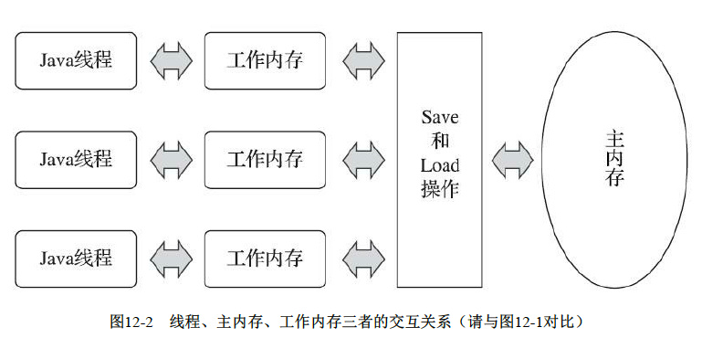

[TOC]

## jvm学习笔记

### 1 jvm简介
* java技术体系提供了完整的用于软件开发和跨平台的支持环境，并广泛应用于嵌入式系统、移动终端、企业服务器、大型机等场合。java实现了“一次编写，到处运行”的理想
* java代码是运行于java虚拟机上的，通过java虚拟机实现了跨平台，并且java虚拟机帮助程序员做一系列易出错的事务，比如内存管理

## 2 Java内存区域与内存溢出异常
### 2.1 运行时数据区域
* Java虚拟机在执行Java程序的过程中会把所管理的内存划分为若干个不同的数据区域，这些区域称为运行时数据区域。Java虚拟机所管理的内存包含以下几个运行时数据区域，如图2-1

图2-1 Java虚拟机运行时数据区

#### 2.1.1 程序计数器
程序计数器可看作当前线程所执行的字节码的行号指示器，是一块较小的内存空间，线程私有。
#### 2.1.2 Java虚拟机栈
Java虚拟机栈也是线程私有的，生命周期与线程相同。虚拟机指的是Java方法执行模型：每个方法在执行的同时都会创建一个栈帧用于存储局部变量表、操作数栈、动态链接、方法出口等信息。

```
Java虚拟机规范中定义了两种异常
1. StackOverflowError:若线程请求的栈深度大于虚拟机所允许的深度，将抛出StackOverflowError异常
2. OutOfMemoryError:若虚拟机栈可以动态扩展，但扩展时无法申请到足够的内存，就会抛出OutOfMemoryError异常
```
#### 2.1.3 本地方法栈
与Java虚拟机栈的作用相似，但本地方法栈为虚拟机使用到的Native方法服务，虚拟机栈为虚拟机执行的Java方法服务
#### 2.1.4 Java堆
Java堆是jvm管理内存中最大的一块，是所有线程共享的一块内存区域，在虚拟机启动时创建。几乎所有的对象实例和数组都在这里分配。
#### 2.1.5 方法区
方法区是线程共享的内存区域，用于存储已被虚拟机加载的类信息（常量池，字段描述，方法描述等）、常量、静态变量、即时编译器编译后的代码等数据

方法区常称为永久代，但二者并不等价。只是在hotspot中把分代设计扩展到了方法区，或者说使用永久代来实现方法区。java8已经完全移除了永久代，通过元空间代替，采用本地内存实现

> -XX:Permsize 表示元空间初始大小
>
> -XX:MaxPermSize 表示元空间最大大小，默认long的最大值，即不限制大小，完全依赖于本地内存
>
> -XX:MinMetaspaceFreeRatio 控制垃圾回收之后元空间最小剩余容量百分比，默认40，保留最少40%
>
> -XX:MaxMetaspaceFreeRatio 控制垃圾回收之后元空间最大剩余容量百分比，默认70

https://gu_chun_bo.gitee.io/java-construct/#/jvm%E5%AD%A6%E4%B9%A0/jvm-%E5%86%85%E5%AD%98%E7%BB%93%E6%9E%84

#### 2.1.6 运行时常量池
运行时常量池是方法区的一部分，用于存放编译器生成的各种字面量和符号引用。

### 2.3 对象探索

#### 2.3.2 对象的内存布局

对象在内存分为三部分：对象头，实例数据，对齐填充

**对象头**

运行时数据，在32位虚拟机下占32bit =哈希码（25bit）+对象分代年龄（4bit）+锁标志位（2bit）+固定0（1bit），这部分信息称为'Mark Word'。


在64位虚拟机下占64bit


类型指针：指向对象元数据的类型指针，在32位虚拟机为4字节，在64位虚拟机为8字节（未开启指针压缩），开启指针压缩为4字节（默认开启）

> -XX:-UseCompressedOops 不开启指针压缩
>
> -XX:+UseCompressedOops 开启指针压缩

**实例数据**

**对齐填充**：非必然存在，当对象的总内容不足八字节的补齐，因hosSop虚拟机的对象内存管理系统要求对象起始地址必须是8字节的整倍数

> 对象指针，数组指针大小默认4字节
>
> 可通过Unsafe对象的unsafe.objectFieldOffset() 方法查询域起始位置，单位字节，从而推断对象大小

#### 2.3.3 对象的访问定位
Java程序通过栈上的reference数据来操作堆上的具体对象。reference在Java虚拟机规范中只规定了一个指向对象的引用，没有定义如何去定位寻找对象的具体位置。目前主流方式通过句柄和直接指针两种。

```
1.句柄访问：Java堆中划分出一块内存作为句柄池，reference存储的就是对象句柄地址，句柄中包含了对象实例数据地址与对象类型地址（方法取），句柄位于堆内存
好处是reference存储的是稳定的句柄地址，在对象被移动时只会改变句柄池中的实例数据指针，而reference本身不需要改变
2.直接指针访问：reference存储的是对象地址。hotspot主要使用直接指针访问，访问更快
好处是速度更快，节省了一次指针定位的时间开销。但当对象移动时，引用也需要改变
```
> 不管是哪种方式，对象的实例数据都是保存在堆内存中，通过堆内存中对象的一个指针指向 保存在方法区的对象类型数据

### 2.4 内存溢出

#### 2.4.1 Java堆溢出
当出现OutOfMemeryError时，先分析内存泄露还是内存溢出。若是内存泄露，就通过GC Root的引用链找出GC为什么无法自动回收它们；若内存溢出可以考虑为虚拟机申请更多的内存

```
java.lang.OutOfMemoryError: Java heap space
```

#### 2.4.2 虚拟机栈和本地方法栈溢出
```
StackOverflowError：线程请求的栈深度大于虚拟机所允许的最大深度时抛出。使用-Xss参数减少栈内存，异常出现时输出到栈深度相应缩小
OutOfMemeoryError：虚拟机在扩展栈时无法申请到足够的内存时抛出
```
#### 2.4.3 方法区或运行时常量池溢出

java8完全移除永久代，通过元空间代替

```java
// -XX:MaxMetaspaceSize=10M
// 通过enhancer不断创建新类
static void metaspaceOutOfMemory2() {
        while (true) {
            Enhancer enhancer = new Enhancer();
            enhancer.setSuperclass(Main.class);
            enhancer.setUseCache(false);
            enhancer.setCallback(new MethodInterceptor() {
                @Override
                public Object intercept(Object o, Method method, Object[] objects, MethodProxy methodProxy) throws Throwable {
                    return methodProxy.invokeSuper(o, objects);
                }
            });
            enhancer.create();
        }
    }

// 产生错误
Caused by: java.lang.OutOfMemoryError: Metaspace
```

#### 2.4.4 本机内存溢出

直接内存可以通过参数-XX:MaxDirectMemorySize指定，默认0不指定，不指定时直接内存与jvm最大内存一致

暂未复现

## 3 垃圾收集器与内存分配策略
### 3.1 垃圾收集器（Garbage Collection，GC）
* 哪些内存需要回收
* 什么时候回收
* 如何回收

### 3.2 对象已死吗
#### 3.2.1 引用计数法
给对象添加引用计数器，当指向对象的引用数为0时，对象可被回收

**循环引用**：两个对象相互引用是产生循环引用，若只回收对象的对外引用则不能通过引用计数法回收。

> 对于A，B两个对象，AB分别持有各自的引用。当仅在对外部的A，B索引置空，不把对象中持有的引用置空，通过引用计数法无法回收。但通过可达性分析可以回收

#### 3.2.2 可达性分析
以GC Roots为起点，GC Roots不可达的对象，将被判定为可回收的对象。

GC Roots的对象
1. 虚拟机栈（栈帧中的本地变量表）中引用的对象
2. 方法区中类静态属性引用的对象
3. 方法区中常量引用的对象
4. 本地方法栈中JNI（即一般说的Native方法）引用的对象
5. java虚拟机内部的引用
6. 所有被同步锁持有的对象
7. 反映java虚拟机内部情况JMXBean、JVMTI中注册的回调、本地代码缓存等

#### 3.2.3 引用
* 强引用：只要存在强引用，对象就不会被GC回收
* 软引用：描述有用但非必需的对象。软引用的关联的对象，在系统发生内存溢出异常之前，内存空间不足时，将会把这些对象列进回收范围之中进行第二次回收。通过SoftReference实现
* 弱引用：描述非必需对象，比软引用更弱，关联的对象只能存活到下次垃圾回收之前。通过WeakReference实现
* 虚引用：虚引用的存在不会影响对象的生存时间，也无法通过一个虚引用获取一个对象实例，虚引用关联的唯一目的是能在该对象回收时收到一个系统通知。通过PhantomReference实现

> 回收的单位是对象，当判定对象可以回收时则回收对象，并把引用回收。比如当对象同时存在一个强引用和弱引用时，在进行gc时弱引用不会被回收，如ThreadLocal

#### 3.2.4 finalize函数
一个对象真正要被回收至少需要经历两次标记过程。若对象覆盖了finalize()方法且该方法没有被执行过，finalize()会被放入虚拟机的一个队列中执行，虚拟机不会等待它运行结束，对象可以在此函数里自救，但此函数每个对象只能触发一次。

### 3.3 垃圾回收算法
* 标记-清除算法。适用于老年代，清除的少
* 复制算法。适合新生代，复制的少
* 标记-整理算法
* 分代收集算法

### 3.4 HotSpot算法细节实现

#### 3.4.1 根结点枚举

- 从GC Root节点寻找所有可达节点。需要“Stop the world”，即保证在根结点枚举时所有节点引用关系不可发生变化。

#### 3.4.2 安全点

- 根结点枚举时并不需要检查所有执行上下文和全局变量引用的索引，其中hopspot中OopMap结构存储所有引用。但是并非每条指令都生成对应的OopMap，只是在特点位置-安全点生成OopMap，安全点由虚拟机选定，不能太少以至于让虚拟机等待时间过长，不能太多导致过分增大运行时的内存负荷。
- 如何让线程在最近的安全点停顿
  - 抢先式中断，系统把所有的用户线程全部中断，若发现有现成不在安全点上，则让其恢复，运行到安全点上再中断。现在几乎没有虚拟机采用这种做法
  - 主动式中断，当需要现成中断时设计一个标志，所有线程在运行中都会轮询这个标志，一旦发现为真就在最近的安全点主动中断挂起。轮询标志和安全点是重合的。轮询操作非常频繁，现已用一条汇编实现。轮询标志和安全点是重合的

#### 3.4.3 安全区域

- 一些不执行（处于sleep或block状态）的线程无法响应系统的中断请求，走到安全点。而这通过安全区域来完成，安全区域确保引用关系不会发生变化的区域，是拉伸的安全点，当用户线程进入安全区域，做标记。当离开安全区域时，若虚拟机还未完成根节点枚举，则中断运行一直等待，收到可以离开的消息为止。

  > 个人疑惑：当线程不执行时，线程内引用关系无变化，此时应该是处于安全点。当线程中断结束再次运行，则可能发生变化，此时只要设置成不让中断线程再运行不就行了吗？应该不能无限制地控制线程休眠或block

#### 3.4.4 记忆集 和卡表

> 跨代引用问题：https://www.jianshu.com/p/671495682e46
>
> 跨代引用指那些存活的且只有老年代引用的年轻代。若垃圾回收仅扫描年轻代，那那些存活的跨代引用也将被回收，这是不合理的。而垃圾回收时若扫描全量年轻代和老年代非常浪费性能，通过记忆集记录这些跨代引用，避免扫描全量老年代。若老年代对象不可达又未发生回收时，垃圾回收也无法回收该老年代引用的跨代引用。即记忆集提供了性能，但降低了空间利用率。且垃圾回收不能保证回收所有的不可达对象。
>
> 通过卡表记录对象的跨代引用，若对象存在跨代引用，则卡变变脏，后续垃圾回收时需要回收变脏的元素

- 垃圾回收未解决跨代引用的问题，垃圾收集器在新生代中新建了记忆集的数据结构，用于避免把整个老年代加进GC Roots扫描范围。
- 记忆集是一种非收集区域指向收集区域的指针集合的抽象数据结构，用来存储跨代引用，垃圾回收时只要扫描记忆集就可以回收跨代引用
- 记忆集具体实现

  - 字节精度：精确到机器字长
  - 对象精度：精确到对象
  - 卡表：精确到一块内存区域。卡表中只要一个或多个对象（一个卡表通常存在多个对象）的一个字段存在跨代引用，卡表对应的数组元素就为1，即变脏。没有则为0

> 卡表是记忆集的一种实现，保存对象的跨代引用

#### 3.4.5 写屏障

- 写屏障用来维护卡表，解决卡表怎么变脏的问题
- 通过写屏障来维护卡表，写屏障指的是在引用发生变化时的一个切面操作，包括写前屏障和写后屏障。即在引用发生变化时更新卡表，判断跨代引用
- 直到G1出现之前，其他收集器只用到了写后屏障。写后屏障为在进行赋值操作后，更新卡表。写屏障需要对每一次写操作进行额外的卡表写入。
- 卡表在高并发场景下存在伪共享问题，在高并发下，中央处理器的缓存系统以缓存行为单位存储，当多线程修改独立变量时，可能存在修改同一缓存行问题，导致写入性能降低。java7开始支持写卡表校验，即先检查卡表标记，仅当卡表未被标记过才将其变脏，但需要增加一次额外判断，通过-XX:+UseCondCardMark控制是否开启校验，默认false

#### 3.4.6 并发的可达性分析

- 可达性分析与用户线程共同运行（用在查找较长的 引用链关系查找）
- 通过节点颜色标记
  - 白色：未被垃圾收集器访问过
  - 黑色：已被垃圾收集器访问过
  - 灰色：已被垃圾收集器访问过，但对象上至少存在一个引用还没扫描过
- 并发扫描过程中，引用关系可能发生变化。
  - 白色变成黑色，本该被回收对象却没有被回收，称为浮动垃圾，可以忍受
  - 黑色变为白色，回收了存活的对象，无法忍受。如何解决
    - 该情况发生下的两个必要条件
      - 赋值器插入多条从黑色到白色的引用
      - 赋值器删除了全部从灰色到白色的直接或间接引用
        - 疑问1：如果原本就不存在灰色到白色对象的引用，然后又新增一跳黑色到白色对象的影响，这样似乎就不存在第二个必要条件
          - 若不存在灰色到白色的直接或间接引用，那么白色对象是不可达的，怎么新增一个从黑色到白色对象的引用呢
          - 这种情况可能是新建对象，新建对象应该要根据引用的节点来判断新节点是颜色的节点，比如直接引用节点是黑色，那新节点也是黑色的；若是白色，新节点也是白色，若是灰色，需要更新灰色节点未扫描引用
        - 疑问2：如果新增一个对象，然后黑色节点引用至新增节点，也不存在第二个必要条件
          - 答：首先这个两个必要条件前提是发生了黑色节点误标记成白色节点的情况，新增对象并不满足原本为黑色的清空
    - 解决方法。都是通过写屏障实现
      - 增量更新：破坏第一条件，保存全部新增引用的黑色节点。待并发扫描结束后以这些黑色节点为根再扫描一次
      - 原始快照：破坏第二条件，记录删除的（从灰色到白色）引用关系，待并发扫描结束后重新扫描一次，即按照删除前的引用关系扫描，也称之为扫描当时的快照图。可能存在真正没删除且没有新增引用的节点，重新扫描后仍未被回收，但影响不大


### 3.5 垃圾收集器
#### 3.5.1 Serial收集器

单线程收集器，进行垃圾回收时，必须暂停其他线程。年轻代采用复制算法，老年代采用标记-整理算法

#### 3.5.2 ParNew收集器

Serial的多线程版本，年轻代多线程并行处理，老年代依旧单线程

#### 3.5.3 Parallel Scavenge收集器

新生代收集器，采用复制算法，并行。该收集器的关注点是尽可能达到可控制的吞吐量（吞吐量=运行用户代码时间/（运行用户代码时间+垃圾收集时间））。-XX:MaxGCPauseMillis控制最大垃圾收集停顿时间）（尽可能控制在此时间之内）；-XX:GCTimeRatio设置吞吐量大小

#### 3.5.4 Serial Old收集器

老年代单线程收集器，使用标记-整理算法

#### 3.5.5 Parallel Old收集器

Parallel Scavenge收集器的老年代版本

#### 3.5.6 CMS收集器

采用标记-清除&标记-整理算法。老年代收集器，以获取最短停顿时间为目标的收集器，收集针对的是老年代。收集过程分四个步骤

1. 初始标记，单线程，需要STW，标记出GC Root能直接关联的对象。jdk8之后可以并发执行，通过-XX:+CMSParallelInitialMarkEnabled开启
2. 并发标记，并发标记所有对象。标记线程和用户线程一起执行
3. 重新标记，多线程，需要STW，只有标记线程执行。重新标记在并发标记时导致标记产生变化的对象（以避免黑色节点被回收的情况）
4. 并发清除，并发清理死亡对象，清理线程和用户线程一起执行

时间：并发标记 > 重新标记 > 初始标记

CMS被称为并发低停顿收集器，但也存在明显缺点：

1. 对CPU资源非常敏感。CMS默认启动的垃圾回收的线程数是（CPU数量+3）/4。垃圾回收的线程在CPU数量大于4时约占25%，CPU数越少占比越高。但是当核数少于四个时，此时垃圾回收的线程就会占用很大比例的cpu资源，导致用户线程能占用的cpu资源更少。虚拟机提供了一种i-CMS的CMS收集器变种，清理的时候让收集器线程和用户线程交替运行，使得停顿的时间变短，但垃圾回收的时间会变长。
2. 无法处理浮动垃圾，cms在并发标记和并发清理阶段还会出现其他垃圾，这些垃圾是在标记过后产生的（重新标记无法识别本该回收的黑色节点），无法清除，这些被称为浮动垃圾。在并发标记和清理时都有用户线程在运行，还没开始回收就可能产生新的浮动垃圾，因此需要预留一部分空间进行收集，当老年代空间占用量达到阙值时进行回收，-XX:CMSInitiatingOccupancyFraction用来设置这个启动阙值，百分比表示。JDK1.6中默认92%。当预留的内存不足或老年代空间无大于新进入老年代的大对象连续空间时会出现“Concurrent Mode Failure”失败，此时临时启动Serial Old收集器重新收集，此时停顿时间更长
3. CMS是基于标记-清除算法实现的收集器，可能产生过多的空间碎片，会给大对象分配造成麻烦。CMS中提供了-XX:+UseCMSCompactAtFullCollection开关（默认开启），开启表示FullGC时进行内存碎片的合并整理。-XX：CMSFullGCsBeforeCompaction（默认0，每次触发full gc时都会进行碎片整理）用来设置执行多次不压缩的FullGC后，再执行一次压缩的FullGC。

收集配合

- CMS收集器只收集老年代对象，进行major GC
- ParNew配合CMS收集年轻代对象，进行minor  GC。为什么不选择 Parallel Scavenge，因为ParNew和CMS都是在分代收集框架下开发的。年轻代和老年代GC互不关联，可并发进行
- 当发生Concurrent mode failure时，CMS采用Serial Old进行full gc

##### 扩展延申

https://juejin.cn/post/6844903782107578382#comment

CMS其实分为七个步骤

1. 初始标记，stw。标记所有的GC root对象；标记年轻代中存活的对象直接引用的老年代对象
2. 并发标记，和用户线程并发执行。根据初始标记找到的对象，去标记其他老年代对象，
3. 预清理，和用户线程并发执行。标记前一阶段因为引用关系变化而没有标记到的存活对象，减少remark的工作
4. 可被终止的预清理。此阶段的最大持续时间为5s，为分摊下一阶段final mark的工作，期待5s内进行一次young gc，减少下一阶段扫描的引用
5. 重新标记，stw。为了完成标记老年代所有存活的对象，但重新标记扫描的范围是整个堆，因为仅仅扫描老年代时，当年轻代引用被回收，其指向的老年代对象也不能被回收。可以设置再重新标记前进行一次young gc，将无用的年轻代对象先回收，通过参数-XX:+CMSScavengeBeforeRemark控制。因为前面并发标记伴随着用户线程的执行，引用关系发生的变化比较大，因此这一标记会导致很长的stw，可以开启并行标记收集，参数-XX:+CMSParallelRemarkEnabled
6. 并发清除。清理无用的对象
7. 并发重置状态等待下次CMS的触发

**使用CMS的注意点**

1. 减少remark阶段停顿：CMS的GC一般80%都消耗在remark中，可以在remark之前进行一次yong gc回收年轻代，减少年轻代对老年代的无效引用。通过设置参数开启 -XX:+CMSScavengeBeforeRemark，默认false

2. 内存碎片问题：CMS是基于标记-清除算法的，其中会产生空间碎片，通过设置参数 -XX:CMSFullGCsBeforeCompaction=n 表示每进行n次full gc时，进行一次碎片整理。该值默认为0，每次进行full gc后都进行碎片整理

3. Concurrent mode failure：并发担保失败。在进行cms正在回收的同时，用户线程也在执行，可能产生young gc将存活对象放入老年代，当老年代对象无法放入年轻代存活对象时则会发生"Concurrent mode failure"，cms就改为触发一次full gc，通过serial收集器收集。

   > - -XX:+UseCMSInitiatingOccupancyOnly 默认-1
   >
   > - -XX:CMSInitiatingOccupancyFraction=70
   >
   > CMSInitiatingOccupancyFraction 参数控制在老年代空间大于总空间多大比例时进行cms收集。
   >
   > UseCMSInitiatingOccupancyOnly 未开启时，CMSInitiatingOccupancyFraction仅在第一次有效，后续通过CMS自动调整比例；当开启时，则回收阙值固定为CMSInitiatingOccupancyFraction

4. promotion failed：空间分配担保失败，当进行Minor gc时，无法将存活对象放入老年代，而引发full gc

   > 过早提升和过早失败
   >
   > 在minor gc时，当eden空间存活的对象无法放入survivor中时，则对象直接进入老年代，称为过早提升；当老年代较满，在进行Minor gc时，无法将存活对象放入老年代，这会导致full gc，称为过早失败
   >
   > 过早提升的原因：survivor的空间过小容不下全部的运行时短生命周期的对象，此时需要扩大survivor空间；对象过大
   >
   > 过早失败的原因：1. 老年代空闲空间不够用；2. 老年代碎片空间太多
   >
   > 过早失败解决方案：1. 若是老年代碎片空间过多，可以开启full gc后进行一次空间整理，调高频率；2. 若是提升过快导致，说明survivor空间过小，需适当调大；3. 若是老年代空间不够，需要适当降低触发cms回收的阙值

##### CMS相关参数

| 参数                                 | 类型    | 默认值                                       | 描述                                           |
| ------------------------------------ | ------- | -------------------------------------------- | ---------------------------------------------- |
| -XX:+UseConcMarkSweepGC              | boolean | false                                        | 老年代采用cms收集器                            |
| -XX:+CMSScavengeBeforeRemark         |         | false                                        | 在remark之前进行一次young gc                   |
| -XX:+UseCMSCompactAtFullCollection   |         | true                                         | 控制是否在full gc之后对老年代进行空间碎片整理  |
| -XX:CMSFullGCsBeforeCompaction=n     |         | 0                                            | 表示在每进行n次full gc之后进行一次空间碎片整理 |
| –XX:+CMSIncrementalMode              |         | false                                        | 并发收集递增进行，周期性把cpu资源让给用户线程  |
| –XX:+CMSIncrementalPacing            |         | true                                         | 根据应用程序的行为自动调整垃圾回收任务的数量   |
| -XX:ParallelGCThreads                |         | (ncpus <= 8) ? ncpus : 3 + ((ncpus * 5) / 8) | 并发回收线程数量                               |
| -XX:CMSIncrementalDutyCycleMin=n     |         | 0                                            | 每次增量垃圾回收时占总垃圾回收任务的比例       |
| -XX:CMSInitiatingOccupancyFraction=n |         | jdk5时68%，jdk6时92%                         | 触发cms收集的最小老年代内存占比阙值            |
| -XX:CMSMaxAbortablePrecleanTime=n    |         | 5000                                         | 在cms的preclean之前，等待minor gc的最大时间    |

cms只收集老年代，以牺牲吞吐量的方式，换取收集速度

#### 3.5.7 G1收集器

Jdk9+的默认收集器，可预测停顿时间，能实现在为M毫秒时间片内GC的时间大概率不超过N毫秒。（不能太低，通常设置100～300毫秒之间）

> G1收集器整体上看是采用标记整理算法的，但从局部上看（两个region）又是基于标记复制算法实现的，这两种都不会产生空间碎片

G1收集器将Java堆划分为多个大小相等的独立区域（Region），Region大小：1M-32M，且因为2的N次幂。大对象（超过Region容量的一半的认定为大对象）放在特定humongous区域，超过一个region容量，这放在多个连续的Region中。

每个region可以成为Eden、Survivor或者老年代（一个同时只会是其中一种）。G1收集器建立可预测的停顿模型，去跟踪每个Region里垃圾堆积的“价值”大小，即回收所获得的空间大小和所消耗时间的经验值（比值），在后台维护一个优先级列表，指定停顿时间（-XX:MaxGCPauseMills指定，默认200ms）。每次都回收都以region为单位


问题：

- 为解决跨代引用问题，每个region都存在记忆集，G1需要耗费Java堆10%-20%的内存来维持工作。记忆集中存放指向本region中对象的引用。每个region都会维护自己的记忆集，记录别的region指向自己指针。记忆集实现本质是哈希表，key是别的region的起始地址，value为一个记录卡表的索引号集合
- 为保证用户线程正常运行不影响并发收集，CMS通过增量更新解决，G1通过原始快照（SATB）实现。使用原始快照解决新增对象的问题，G1设计了两个TAMS指针，把region的一部分空间划分出用来存放并发回收过程中的新对象。并发回收时新增对象必须在这个指针之上，表示新增对象默认都是存活的。若内存回收赶不上内存分配，仍会导致Full GC。

young gc：年轻代gc，回收年轻代

mixed gc：混合gc，回收年轻代和部分老年代

四大步骤

- 初始标记，单线程，需要STW，标记GC Root能直接关联的对象，修改TAMS指针，使在并发运行能在region分配新对象
- 并发标记，并发标记对象
- 最终标记，多线程，需要STW，处理并发标记遗留下来的 STAB记录
- 筛选回收，多线程操作，涉及存活对象的移动，需要STW，更新Region的统计数据，对region的回收价值和成本排序，根据期望的停顿时间来选择任意多个Region构成的回收集。将回收的Region中存活的对象复制到新的空白Region中，再清理老Region全部空间

停顿时间指定太小，会导致每次选择都回收集都很小，收集速度缓慢，Region区域满了触发Full GC

G1相比CMS内存消耗很大，卡表实现更为复杂，目前CMS更优于使用小内存应用，G1更优于使用大内存应用。内存平衡点6G-8G

> 在执行负载的角度上，CMS使用写后屏障来更新维护卡表；G1不仅使用写后屏障来维护卡表，还通过写前屏障来跟踪并发时的指针变化。相比增量更新算法，原始快照在并发标记和最终标记能产生更少的消耗。但是需要承担在运行过程中跟踪引用变化带来的额外负担，需要消耗更多的运算资源。所以CMS是采用同步更新，而G1是将写前屏障和写后屏障要做的事放在队列中，异步处理

##### 扩展

**STAB**

原始快照，全称Snapshot-at-the-begining，G1收集器是使用原始快照破坏第二个条件，即记录删除从灰色对象到白色对象的引用。但是若是新增对象，仅通过原始快照的方式是无法标记新存活对象，所以g1为每个Region新增了两个TAMS指针（preTAMS和nextTAMS），用来保存新增对象，默认新增对象都是存活的不能被回收

**RSet**

Remembered Set，用来辅助gc的数据结构，每个region中一个。用来记录别的region指向本region的记录，Rset是一个hastable结构，key是别的region的起始地址，value是card table的index

Card table是一种记录了本region指向其他region对象的信息

##### 相关参数

- -XX:G1HeapRegionSize：控制region大小，默认0不设定。若不设定则jvm根据heap大小自动决定
- -XX:MaxGCPauseMillis：设置G1收集过程中的停顿时间，默认200ms，非硬性条件

##### 参考资料

1. https://tech.meituan.com/2016/09/23/g1.html

### 3.6 低延迟垃圾收集器

> 垃圾收集器的三大指标：低延迟、低内存占用、高吞吐量

#### 3.6.1 Shenandoah

只有在初始标记和重新标记需要停顿，其他时间都能做到和用户线程并发执行。希望停顿时间在十毫秒以内。采用Region布局。复制存活对象，与用户线程并发执行，通过读屏障和转发指针实现。OpenJDK12及以上可使用

摒弃了region中维护记忆集，改用名为连接矩阵的全局结构来维护跨region的引用关系，降低了记忆集的维护消耗

可以运行在windows机器上

#### 3.6.2 ZGC

实现在任意堆内存下都能把停顿时间控制在十毫秒以内，吞吐量优于Shenandoah。在OpenJDK 11中授权

分为大中小region

延迟固定在10ms以下，但不能运行在windows机器上，且应该仍处于实验阶段

### 3.7 选择合适的垃圾收集器

#### 3.7.3 虚拟机及垃圾收集日志

在jdk9开始，虚拟机提供了统一的日志处理框架，hotspot所有功能的日志都集中到-Xlog参数上

- 打印gc日志：jdk9之前使用-XX:+PrintGC，jdk9之后使用-Xlog:gc 

- 打印GC明细：jdk9之前使用 -XX:+PrintGCDetails，jdk9之后使用-Xlog:gc*:

- 打印GC前后堆、方法区前后可用容量变化，jdk9之前使用-XX:PrintHeapAtGC，jdk9之后使用-Xlog:gc+heap=debug

- 查看gc时并发时间及停顿的时间，jdk9之前使用-XX:PrintGCApplicationConcurrentTime，jdk9之后使用-Xlog:safepoint

- 查看收集器Ergonomics机制（自动设置堆空间各分代区域大小、收集目标等内容，从Parallel收

  集器开始支持）自动调节的相关信息。在JDK 9之前使用-XX：+PrintAdaptive-SizePolicy，JDK 9之后

  使用-Xlog：gc+ergo*=trace

- 查看熬过收集后剩余对象的年龄分布信息，在JDK 9前使用-XX：+PrintTenuringDistribution，

  JDK 9之后使用-Xlog：gc+age=trace

```log
-XX:+PrintGC
[GC (Allocation Failure)  12800K->9669K(49152K), 0.0076715 secs]
[Full GC (Ergonomics)  43108K->1034K(37376K), 0.0089494 secs]
[Full GC (Ergonomics)  42250K->1034K(37376K), 0.0055486 secs]

---------
-XX:+PrintGCDetails
[GC (Allocation Failure) [PSYoungGen: 12800K->1437K(14848K)] 45568K->34213K(49152K), 0.0030813 secs] [Times: user=0.02 sys=0.00, real=0.00 secs] 
[GC (Allocation Failure) [PSYoungGen: 10260K->1258K(14848K)] 43036K->34042K(49152K), 0.0011604 secs] [Times: user=0.00 sys=0.00, real=0.00 secs] 
[GC (Allocation Failure) [PSYoungGen: 9706K->1210K(14848K)] 42490K->33994K(49152K), 0.0009321 secs] [Times: user=0.01 sys=0.00, real=0.01 secs] 
Heap
 PSYoungGen      total 14848K, used 9658K [0x00000007bef80000, 0x00000007c0000000, 0x00000007c0000000)
  eden space 12800K, 66% used [0x00000007bef80000,0x00000007bf7c0040,0x00000007bfc00000)
  from space 2048K, 59% used [0x00000007bfc00000,0x00000007bfd2e9f8,0x00000007bfe00000)
  to   space 2048K, 0% used [0x00000007bfe00000,0x00000007bfe00000,0x00000007c0000000)
 ParOldGen       total 34304K, used 32784K [0x00000007bce00000, 0x00000007bef80000, 0x00000007bef80000)
  object space 34304K, 95% used [0x00000007bce00000,0x00000007bee04040,0x00000007bef80000)
 Metaspace       used 3681K, capacity 4540K, committed 4864K, reserved 1056768K
  class space    used 406K, capacity 428K, committed 512K, reserved 1048576K
  
-----
-XX:+PrintHeapAtGC
{Heap before GC invocations=1 (full 0):
 PSYoungGen      total 14848K, used 12800K [0x00000007bef80000, 0x00000007c0000000, 0x00000007c0000000)
  eden space 12800K, 100% used [0x00000007bef80000,0x00000007bfc00000,0x00000007bfc00000)
  from space 2048K, 0% used [0x00000007bfe00000,0x00000007bfe00000,0x00000007c0000000)
  to   space 2048K, 0% used [0x00000007bfc00000,0x00000007bfc00000,0x00000007bfe00000)
 ParOldGen       total 34304K, used 32768K [0x00000007bce00000, 0x00000007bef80000, 0x00000007bef80000)
  object space 34304K, 95% used [0x00000007bce00000,0x00000007bee00040,0x00000007bef80000)
 Metaspace       used 3660K, capacity 4540K, committed 4864K, reserved 1056768K
  class space    used 404K, capacity 428K, committed 512K, reserved 1048576K
Heap after GC invocations=1 (full 0):
 PSYoungGen      total 14848K, used 1453K [0x00000007bef80000, 0x00000007c0000000, 0x00000007c0000000)
  eden space 12800K, 0% used [0x00000007bef80000,0x00000007bef80000,0x00000007bfc00000)
  from space 2048K, 70% used [0x00000007bfc00000,0x00000007bfd6b650,0x00000007bfe00000)
  to   space 2048K, 0% used [0x00000007bfe00000,0x00000007bfe00000,0x00000007c0000000)
 ParOldGen       total 34304K, used 32776K [0x00000007bce00000, 0x00000007bef80000, 0x00000007bef80000)
  object space 34304K, 95% used [0x00000007bce00000,0x00000007bee02040,0x00000007bef80000)
 Metaspace       used 3660K, capacity 4540K, committed 4864K, reserved 1056768K
  class space    used 404K, capacity 428K, committed 512K, reserved 1048576K
}
----
-XX:PrintGCApplicationConcurrentTime
Application time: 0.8764631 seconds
Application time: 0.0968030 seconds

----
-XX：+PrintTenuringDistribution
Desired survivor size 2097152 bytes, new threshold 7 (max 15)
```

#### 3.7.4 垃圾收集器参数总结

| 参数                           | 描述                                                         |
| ------------------------------ | ------------------------------------------------------------ |
| UseConcMarkSweepGC             | 使用ParNew+CMS+Serial Old收集器组合，ParNew收集年轻代<br />CMS收集老年代数据，Serial Old当出现内存分配失败时触发full gc使用 |
| UseG1GC                        | 使用G1收集器，jdk9默认                                       |
| SurvivorRation                 | 新生代Eden区域和Survivor区域的比值，默认8，代表Eden : Survivor = 8 : 1 |
| CMSInitiatingOccupancyFraction | 当老年代空间超过多大比例时触发CMS收集器，jdk1.6默认值为92%   |
| UseSerialGC                    | 使用Serial + Serial Old组合                                  |
| UseParwNew                     | 使用ParNew + Serial Old组合                                  |
| UseParallelGC                  | 使用Parallel Scavenge + Serial Old组合，java9之前的默认垃圾收集器组合 |
| UseParallelOldGC               | 使用Paralle Scavenge + Parallel Old组合                      |
|                                |                                                              |

### 3.8 内存分配与回收策略

- 对象优先分配到Eden区
- 大对象直接进入老年代。-XX:PretenureSizeThreshold设置阙值，大于此值的对象直接进入老年代
- 长期存活的对象进入老年代。-XX:MaxTenuringThreshold设置阙值，表示经过的Minor GC的次数。大于此值的对象进入老年代
- 动态年龄判断，若survivor区对象相同年龄的大小总和大于survivor区的一半，则大于该年龄的对象直接进入老年代

#### 3.8.5 空间分配担保

- 在发生Minor GC前， 虚拟机先判断老年代最大空用的连续空间是否大于新生代总和大小，若成立，此次Minor GC就是安全的
- 若不成立，虚拟机查看-XX:HandlePromotionFailure设置是否允许担保失败，若允许，检查老年代的最大可用的连续空间是否大于历次晋升到老年代对象的平均大小，如果大于则尝试进行Minor GC；若小于或是-XX:HandlePromotionFailure设置不允许，直接进行Full GC
- JDK 6 update24之后，无视虚拟机参数-XX:HandlePromotionFailure，只要老年代最大可用连续空间大于新生代总大小或历代晋升老年代的平均大小，就进行Minor GC，否则Full GC

### 4.工具
#### 4.1 jps：虚拟机进程状况工具
```
参数
1.-q 输出LVMID(本地虚拟机唯一ID)，省略主类的名称
2.-m 输出传递到主类main()函数的参数
3.-l 输出主类的全名，若进程执行的是jar的，输出jar路径
4.-v 输出jvm启动时的参数
```
#### 4.2 jstat 虚拟机统计信息监视工具
jstat -gcutil 369 1000 3
> 查看进程369的gc情况3次，每个1000ms查看一次

#### 4.3 jinfo：Java配置信息工具
实时查看和调整虚拟机各项参数，VM flags表示jvm参数部分

jinfo -flag [虚拟机参数名] [LVMID]

#### 4.4 jmap:Java内存映像工具

#### jhat：虚拟机堆转快照分析工具

#### jstack: java堆栈跟踪工具

Java堆栈分析工具，通常用来定位线程长时间停顿原因，如线程死锁、死循环、请求外部资源导致的长时间等待等

javap -c Main.class 反编译

#### Jconsole:可视化进程监控工具

### 5.类文件结构

代码编译是将本地机器码转变成字节码

#### 5.1 概述
编译器将代码编译成存储字节码的class文件，虚拟机载入和执行，实现了程序的”一次编写，到处运行“。这些字节码是平台无关性的，可以由各种语言编译而来，比如Scala、Groovy、Jython等，都可以在jvm运行
#### 5.2 class类文件结构
根据Java虚拟机规范的规定，Class文件格式采用一种类似于C语言结构体来存储数据，这种伪数据只有两种数据类型：无符号数和表
> 无符号数：以u1、u2、u4、u8来分别代表1、2、4、8个字节的无符号数，无符号数可以用来描述数字、索引引用、数量值或者按照UTF-8编码构成字符串值
> 
> 表是由多个无符号数或者其他表作为数据项构成的复合数据类型

#### 5.2.1 魔数
每个Class文件的头4个字节成为魔数，它的唯一作用是确定这个文件是否为一个能被虚拟机接受的Class文件

紧接着的4个字节存储的是Class文件的版本号，第5和第6个字节是次版本号，第7和第8个是主版本号
#### 5.2.2 常量池
紧接着版本号之后的常量池入口。常量池是占用Class文件空间最大的数据项目之一，也是Class第一个出现的表数据类型项目

常量池中主要存放两大类常量：字面量和符号引用。
> 字面量是比较接近Java语言层的常量，如文本字符串、声明为final的常量值等
> 
> 符号引用：1.类和接口的全限定名；2.字段的名称和描述符；3.方法的名称和描述符；4.方法句柄和方法类型；5.动态调用点和动态常量

常量池中每一项常量都是一个表，JDK1.7中共有14种表，代表着当前常量属于哪种类型，如下图5-1所示

图5-1 常量池的项目类型

#### 5.2.3 访问标志
常量池结束后，紧接着的两个字节代表访问标志

图5-2 访问标志

#### 5.2.4 字段表集合

图5-3 字段访问标志


图5-4 描述符标识字符含义

对于数组类型，每一维度都会使用一个前置的"["字符来描述，比如定义一个java.lang.Stirng[][]类型的二维数组，会被记录为"[[Ljava/lang/String;"，用'/'替代'.',并在结尾添加';'

用描述符来描述方法时，按照先参数列表，后返回值的顺序描述，参数列表按严格顺序放在一组小括号里面，如
> 方法void inc()的描述符为"()V"
>
> 方法int indexOf(char[] source, int index)的描述符为'([CI)I'

### 5.3 字节码
字节码详细可见《Java虚拟机规范（Java SE7版）》的第6章
#### 5.3.1 加载和存储
1.将一个局部变量加载到操作栈：iload,fload
2.将数值从操作数栈存储到局部变量表：istore
3.将常量加载到操作数栈：bipush,ldc,iconst_<i>
4.扩充局部变量表的访问索引指令：wide

#### 5.3.2 运算指令
1. 加法：iadd
2. 减法：isub
3. 乘法：imul
4. 除法：idiv
5. 求余：irem
6. 取反：ineg
7. 位移：ishl、ishr
8. 按位或：ior、lor
9. 按位与：iand
10. 按位异或：ixor
11. 局部变量自增：iinc
12. 比较：dcmpg、dcmpl
#### 5.3.3 类型转换
可以直接支持小范围类型向大范围类型的安全转换：int->long

窄话类型转换必须使用显示转换：i2l;窄化转换仅仅丢弃除最低位N个字节以外的内容
#### 5.3.4 对象创建与访问指令
1. 创建实例：new
2. 创建数组：newarray、anewarray、multianewarray
3. 访问类字段和实例字段：getfield、getstatic
4. 将数组元素加载到操作数栈：baload、caload
5. 取数组长度：arraylength
6. 检查实例类型：instanceof

#### 5.3.5 控制转移指令
1. 条件分支：ifeq、iflt、ifle、igt、ige、ifnull、icomeq
2. 符合条件分支：tableswitch
3. 无条件分支：goto

#### 5.3.6 方法调用和返回指令
1. invokevirtual：用于调用对象的实例方法
2. invokeinterface：用于调用接口方法
3. invokestatic：调用类方法（static方法）

### 6.虚拟机类加载机制
#### 6.1 类加载的时机
生命周期：加载、验证、准备、解析、初始化、使用、卸载。其中验证、准备、解析统称为连接。

>虚拟机严格规定有且只有6种情况必须对类进行初始化
>1. 遇到new、getstatic、putstatic换货invokestatis这4条字节码指令时。
>2. 使用java.lang.reflect包的方法对类进行反射调用时
>3. 当子类初始化时必先初始化父类（若父类还未初始化）
>4. 虚拟机启动时主类（包含main()方法的类），虚拟机会先初始化这个主类
>5. 当使用JDK1.7动态语言支持时，如果一个java.lang.invoke.MethodHandle实例最后的解析结果REF_getStatic、REF_putStatic、REF_invokeStatic的方法句柄，并且句柄对应的类没有初始化时会先触发其初始化
>6. 当一个接口定义了jdk8新加入的默认方法（被default修饰的接口方法），如果有这个接口的实现类发生了初始化，这个接口也必须初始化

> jdk8中接口可以有多个default方法实现，可以有多个static方法实现

当一个类初始化的时候，要求父类全部初始化完成；但接口初始化时并不要求父类接口全部初始化，用到的父类的接口才会初始化

接口中的变量默认添加了 public static final；接口中的方法默认添加了public abstract

对于应用类的static final变量，该类型变量编译时已经通过常量传播优化，放入到调用累到常量池中，所以仅因此不会触发类（拥有静态final的类）的到初始化

#### 6.2 类加载的过程
##### 6.2.1 加载
加载阶段，虚拟机需完成三件事：

1. 通过一个类的全限定名来获取此类的二进制字节流
2. 将这个字节流所代表的静态存储结构转化为方法区的运行时数据结构
3. 在内存中生成一个代表这个类的java.lang.Class对象，作为方法区这个类的各种数据的访问入口

> 数组类本身不通过类加载器创建，由Java虚拟机直接创建

加载阶段完成，虚拟机外部的二进制字节流就按照虚拟机所需的格式存储在方法区之中。然后在内存中创建一个java.lang.Class类的对象
>加载阶段与连接阶段时交叉进行的

##### 6.2.2 验证
1. 文件格式验证，验证字节流是否符合Class文件格式的规范。如常量池中是否有不被支持的常量类型、是否以魔数0xCAFEBABE开头等
2. 元数据验证，对字节码的描述信息进行语意分析，主要进行语义校验。验证点如：这个类是否有父类、其父类是否继承了不被继承的类（被final修饰的类）
3. 字节码验证，最复杂的阶段，主要通过数据流和控制流分析，确定程序语义是合法的、符合逻辑的。
4. 符号引用验证，最后一个校验，发生在虚拟机将符号引用转化为直接引用的时候，在解析阶段中发生

验证阶段是一个非常重要但非必要的阶段，若所运行的代码已经被反复使用和验证过，那么可以通过使用-Xverify:none来关闭大部分类验证措施，以缩短虚拟机类加载时间

##### 6.2.3 准备
准备阶段是正式为类分配内存并设置类变量初始值的阶段，这些变量所使用的内存在方法区中进行分配。

>通常情况下变量都是零值（int类型为0，long类型为0L等），但存在特殊情况：如果类字段属性存在ConstantValue属性，准备阶段value就会被初始化ConstantValue属性所指定的值。如：public static final int value = 123.编译时Javac将会为value生成ConstantValue属性，准备阶段将value赋值成123。

##### 6.2.4 解析
解析阶段是虚拟机将常量池内的符号引用替换成直接引用的过程。
>符号引用：用一组符号来描述所引用的目标，符号可以是任何形式的字面量，只要使用时能无歧义地定位到目标即可。与内存布局无关
>
>直接引用：是指向目标的指针、相对偏移量或是能间接定位到目标的句柄。与内存布局相关

###### 6.2.4.1 类或接口的解析
...在解析完成前还要进行符号引用验证，确认D是否具备对C的访问权限，无权限则抛出java.lang.IllegalAccessError异常
###### 6.2.4.2 字段解析
1. C本身存在该字段，返回直接引用
2. 否则，C中实现了接口，按照继承关系搜索各个接口和父接口，找到则返回直接引用
3. 否则，C不是java.lang.Object的话，搜索父类是否有该字段，找到则返回直接引用
4. 否则，查找失败抛出java.lang.NoSuchFieldError异常

###### 6.2.4.3 类方法解析
1. 接口和类方法是分开的，若发现C是个接口，抛出java.lang.IncompatiableClassChangeError异常
2. 在类C中查找是否有简单名单和描述符都与目标相匹配的方法，有则返回
3. 在类C及其父类中递归寻找，有则返回方法的直接引用
4. ...

##### 6.2.5 初始化

类加载的最后一个步骤，开始执行类中编写的程序代码，将主导权交给应用程序

<client>()方法是编译器自动收集类中所有变量的赋值动作和静态语句块（static{}块）的语句合并产生的，编译器收集器的顺序是语句在源文件出现的顺序决定的，在前面的先执行，不管是变量赋值还是静态语句块赋值。静态语句块只能放问到定义在它之前的变量，但是能对静态语句块之前的变量赋值。

#### 6.3 类加载器
类加载器通过类全限定名去获取描述该类的二进制字节流，同一个class文件由不同的加载器加载出来的类也不同

双亲委派模型，所有的类加载都会交由自己的父加载器去加载，若加载失败才会尝试自己加载。启动类加载器是顶层类，是所有加载器的最终父类加载器。

启动类加载器（bootstrap class loader）：虚拟机的一部分，C++实现。负责加载<JAVA_HOME>\lib目录的类，系统类。是扩展类加载器的父类加载器

扩展类加载器（Extension class loader）：java实现，独立于虚拟机。负责加载<JAVA_HOME>\lib\ext目录的类，系统类。是应用类加载器的父类加载器

应用类加载器（Application class loader）：java实现，独立于虚拟机。加载用户路径上（classPath）的类库。是其他自定义类法父类加载器

各类加载器之间的层次关系称为类加载器的“双亲委派模型”。加载器之间的父子关系一般不是以继承关系实现，通常使用组合关系来复用父加载器的代码

破坏双亲委派模型样例

- 例如JDCI、JDBC服务，一种父类加载器请求子类加载器完成加载
- 对程序动态性的追求，热部署，通过自定义加载器加载，树形结构查找，破坏双亲委派模型

### 7 虚拟机字节码与执行引擎
执行引擎是java虚拟机最核心的组成部分之一，执行java代码，解释执行和编译执行

> Java方法在执行时都会创建一个栈帧，程序在编译的时候就确定了栈帧需要多大局部变量表、多深的操作数栈，分配的内存大小确定，不会在运行时改变

#### 7.1 运行时栈帧结构

1. 局部变量表，存放方法参数和方法内定义的局部变量。以变量槽（slot）为最小单位，单位大小随处理器、操作系统或虚拟机有关。

2. 操作数栈，方法执行过程存放变量。大多数虚拟机优化处理中，会使得两个栈帧的局部变量表和操作数栈共享部分内存

3. 动态链接，每个栈帧都包含一个运行时常量池中该栈帧所属方法的引用，持有这个引用是为了支持方法调用过程中的动态链接。

   > 常量池中保存了符号引用，当进行方法调用时，通过符号引用作为参数代表方法来进行调用。这些符号引用，有些在类加载时就被转化为直接引用，这种转化称为静态解析；有些在运行时被转化为直接引用，这部分称为动态链接

4. 方法返回地址，以正常返回语句或抛出异常结束方法。正常退出通过PC计数器的地址作为返回地址，异常退出通过异常处理器确定返回地址

5. 附加信息，如调试相关的信息，具体取决于具体的虚拟机实现

#### 7.2 方法调用

方法调用主要目的是为了确定方法的版本，即确定调用哪个方法

##### 7.2.1 解析

所有调用方法都是常量池中的一个符号引用，在类加载阶段，有一部分符号引用就会解析成直接引用，该过程称为解析

在类加载时直接解析的符号引用，主要由静态方法和私有方法，因为这些方法都无法通过继承或其他方式生成新的版本

```
java虚拟机提供5条方法调用字节码指令
1. invokestatic:调用静态方法
2. invokespecial:调用实例构造器<init>方法、私有方法和父类方法
3. invokevirtual:调用虚方法
4. invokeinterface:调用接口方法，在运行时确定实现该接口的对象
5. invokedynamic:先解析所调用的方法（多态），再执行方法
前两个指令都可以在解析时唯一确定调用版本
```
##### 7.2.2 分派

**静态分派**：通过静态类型来决定方法分派的动作，称为静态分派。典型应用为在**重载**时通过参数的静态类型而不是实际类型判断

类型自动转换顺序，'a', 按照char>int>long>float>double>Character>Serializable>Object>变长参数的顺序转型

自动装箱，转换为父类。

**动态分派**：在运行期间根据实际类型确定运行的版本称为动态分配。与重写有密切关联，动态只涉及到方法，通过指令invokevirtual实现，字段不参与多态，只通过静态类型确定，方法（重写）参与多态

```
动态类型语言：类型检查的主体过程是在运行期而不是编译期

methodHandle，一种类似于反射的方法调用，但不同的是反射基于java代码层次的方法调用，methodHandle模拟字节码层次的方法调用，其存在3个方法--findStatic(),findVirtual(),findSpecial();methodHandle更加轻量，用的不多
```
**单分派和多分派**：java静态分派属于多分派，动态分派属于单分派

**动态分派实现**：动态分派执行是很频繁的，运行期间并不会去查询元数据，而是通过在方法区中建立一个虚方法表，使用虚方法表索引来加快查询速度

#### 7.3 基于栈的字节码解释执行引擎

不同虚拟机都有解析执行（通过解释器执行）和编译执行（通过即时编译器执行）

##### 7.3.1 解释执行
词法分析、语法分析、语义分析、抽象语法树
#### 7.3.2 基于栈的指令集与基于寄存器的指令集比较
基于栈的指令集：
优点：1.可移植性，相比于寄存器，寄存器由硬件直接提供，程序不可避免的会受到硬件的约束，如不同的处理器提供不同的寄存器；2.代码相对紧凑，每个字节一条指令，编译器实更加简单
缺点：执行速度相对慢。指令操作更多，频繁的内存访问，耗时多

计算'1+1'的结果，栈的指令集如下

```
iconst_1
iconst_1
iadd
istroe_0
```

- 语法糖：减少代码量，增加代码可读性。如自动拆箱装箱、泛型、变长参数
- 自动拆箱，只有遇到算术运算符才会自动拆箱

### 8. 类加载及执行子系统实战案例

#### 8.2 案例分析

##### 8.2.1 Tomcat：正统的类加载器架构

java web服务器：tomcat、jetty、weblogic、websphere，部署在同一个服务器上的web应用程序所使用的java类库要实现相互隔离


其中白色对象是tomcat自定义的类加载器

### 9 java内存模型与线程

#### 9.2 硬件效率和一致性

处理速度：处理器 约等于 高速缓存>内存>磁盘

内存用来缓存磁盘的部分内容，内存运算虽然比磁盘快得多，但与处理器的速度相比还是慢得多

为弥补内存与处理器之前的处理速度差，通过增加一层或多层接近处理器速度的高速缓存来作为内存与处理器之间的缓冲

高速缓存能弥补内存与处理器之间速度差的问题，但同时引入了新问题：缓存一致性。每个处理器都有一个高速缓存，而它们又共享同一主内存，这种系统称为共享内存多核系统。当多个处理器都涉及到同一内存区域需要写入时，可能导致各自写入的数据不一致，为解决这个问题，在读写时需要遵循一些协议来进行操作：MSE、MESI、MOSI、Synapse等

除了增加高速缓存外，为了使处理器内部的运算单元能尽量充分利用，处理器可能会对代码进行乱序执行优化，处理器将乱序执行的结果重组，保证和顺序执行的结果一致

#### 9.3 java内存模型

直到jdk5（实现了JSR-133），内存模型才成熟起来

##### 9.3.1 主内存与工作内存

工作内存相当于处理器的高速缓存，线程的工作内存中保存了该线程使用的变量的主内存副本，对变量的所有操作都必须在工作内存中进行。程序运行时主要访问的是工作内存



##### 9.3.2 内存间交互工作

变量如何在工作内存和主内存中交换，java内存模型定义了8种操作来完成

- lock：作用于主内存中的变量，把变量标记为一个线程独占的状态
- unlock：类似lock，将变量解放
- read：作用于主内存中的变量，将主内存中的变量加载到工作内存中，以便load使用
- load：作用于工作内存中的变量，把read操作从主内存获得的变量放到工作内存的变量副本中
- use（使用）：作用于工作内存中的变量，将工作内存中的变量传递给执行引擎
- assign（赋值）：作用于工作内存中的变量，将执行引擎得到的值赋值给工作内存中的变量
- store：和load对应，将工作内存中的值传送给主内存中，以便write使用
- write：和write对应，作用于主内存中的变量，将从工作内存获得的变量写入到主内存中

将变量从主内存传递到工作内存，要求read和load要顺序执行，但中间可以插入其他指令

执行以上八种基本操作必须满足一下规则

- 不允许只出现read和load、store和write的操作之一单独出现，即不运行主内存传递给工作内存而工作内存不接受，工作内存传递给主内存同理
- 不允许一个线程丢弃最近的assign操作，即变量在工作内存改变之后必须回写到主内存中
- 不允许一个线程无原因（即没有assign）将工作内存同步到主内存中
- 一个新变量必须在主内存中诞生，即不允许在工作内存中使用一个未初始化的变量
- 只允许变量对一个线程成功lock。lock具有可重入性，当一个线程对一个变量加锁N次后，必须解锁N次才能将该变量释放
- 当对一个变量进行lock操作，将会清空工作内存中此变量的值，在执行引擎使用该变量前，需要重新进行load或assign操作以初始化变量的值
- 一个变量在未被lock前，不允许进行unlock操作。
- 对一个变量进行unlock操作之前，必须先将变量同步到内存中

##### 9.3.3 对volatile型变量的特殊规则

volatile变量读操作和普通变量读操作性能消耗差不多，但是写操作性能消耗volatile变量要多一些

volatile的作用：第一保证volatile变量对所有线程的可见性，第二是禁止指令重排序优化

##### 9.3.4 正对long和double型变量的特殊规则

long和double都是8字节变量

java内存模型有一条规范：运行虚拟机将没有volatile修饰的64位数据读写操作划分为两次32位的操作

那么是否可能存在对long和double变量在多线程操作时，出现多个线程同时操作一半一半的情况，导致数据出错？实际测试并不会出现这种非原子性问题

除非有明确的线程竞争，否则无需将long和double变量声明为volatile

##### 9.3.5 原子性、有序性和可见性

**可见性**：final修饰的变量在未初始化完成之前，对象本身无法被其他地方使用

#### 9.4 java与线程

##### 9.4.1 线程的实现

**内核线程实现（1：1）**：内核实现的方式，轻量级线程（通常的线程）与内核线程1：1，每个轻量级线程都需要一个内核线程支持

**用户线程实现（1：N）**：不需要系统内核线程支援，所有的线程操作都必须由用户程序自己处理。操作系统只会把资源分配给进程。进程：用户线程=1：N

**用户线程加轻量级线程混合实现（N：M）**：将内核线程和用户线程一起使用，称为N：M实现

##### 9.4.2 Java线程调度

分为协同式调度和抢占式调度

**协同式调度**：线程本身控制，线程把自己执行的工作执行完之后通过操作系统，切换到另一个线程。好处是实现简单，坏处是执行时间不可控，完全由线程本身控制，若出现问题则一直占用资源

**抢占式调度**：由系统分配执行时间，执行时间系统可控。java使用的线程调度方式就是抢占式调度

##### 9.4.3 状态转换

线程的状态

- 新建：线程创建之后的状态哦

- 运行：包括操作系统线程状态的Running和Ready

- 无限期等待

  > 未设置时间的Object::wait()
  >
  > 未设置时间的Thread::join()
  >
  > LockSupport::part()

- 有限期等待：无需等待被其他线程唤醒，在一定时间后自动唤醒

- 阻塞：线程被阻塞了，等待获取一个其他事件释放的排他锁

- 结束


#### 9.5 Java与协程

##### 9.5.1 内核线程的局限

当前通过少量的cpu来同时处理很多的线程，其中线程切换需要比较多的性能消耗

##### 9.5.2 协程的复苏

内核调度的成本来自于用户态到核心态之间的切换，两种状态切换的成本主要来自响应中断、保护和恢复执行线程成本（其中保护和恢复执行线程成本最高）

协程（协同式调度）会完整的做栈的保护和恢复工作，也称为有栈协程

协程的主要优势是轻量，一个协程栈大小在几百字节到几KB之间

### 10. 线程安全与锁优化

#### 10.2 线程安全

线程安全：对于一个对象来说，在多个线程的同时操作，无论怎么改变操作的顺序性或并发量，它始终都能得到正确的结果，称它为线程安全的

##### 10.2.1 java语言中的线程安全

将java语言操作共享的数据分为五类：不可变、绝对线程安全、相对线程安全、线程兼容和线程对立

###### 10.2.1.1 不可变

不可变对象一定是线程安全，因为不可变在初始化完成之前是不会发生this引用逃逸，即无法被引用到，而且final修饰的变量不可变

例：String，Integer，Long等

###### 10.2.1.2 绝对线程安全

不管运行环境如何，调用者都不需要进行任何额外的同步步骤，要求很高

Vector（所有方法都被synchronized修饰），它仍然不是绝对线程的，当两个线程一个对其进行遍历打印，一个对其进行remove可能出现indexOutofBoundsException

###### 10.2.1.3 相对线程安全

相对线程安全指的是通常的线程安全，只需要保证对这个对象单次操作时线程安全的。对于连续的调用，可能需要额外的同步操作

大部分的线程安全的类都是相对线程安全的

###### 10.2.1.4 线程兼容

指只要调用端正确使用了同步手段就能保证在并发环境下线程安全地使用

如ArrayList，HashMap

###### 10.2.1.5 线程对立

线程对立指不管调用端是否采用了同步手段，都无法在多线程环境下安全的使用

如Thread的suspend()和resume()方法。还有System.setIn(), System.setOut()等

##### 10.2.2 线程安全的实现方法

###### 10.2.2.1 互斥同步

synchronized关键字经过javac编译后，会在同步块前后形成monitorenter和monitorexit两个字节码指令，在进入同步块前，monitorenter会尝试获得同步对象的锁，在退出同步块后，monitorexit会释放对象锁。锁时可重入的，统一对象重复获取锁，锁对象计算+1，释放锁减一，当计数为0时才释放锁。synchronized是一个重量级锁，对象若获取不到锁则会一致等待

Reentrant 重入锁，可实现公平和非公平性（默认是非公平的），等待可中断（等待一定时间后放弃获取锁），绑定多个对象（可同时绑定多个condition对象）。

###### 10.2.2.2 非阻塞同步

通过非阻塞的方式实现同步，比如乐观锁的概念，先进行操作，待操作结束后再判断操作期间原值是否发生改变，若未发生改变则操作成功，否则循环操作

比如CAS，比较并交换，其中主要由三个值：V（修改的对象），A（原值），B（新值），当操作执行完成后对V进行修改前，判断原值是否保持不变，若不变则直接赋值，若发生变化则轮询对V进行操作

CAS对于ABA问题，juc为了解决这个问题提供类AtomicStampedReference，通过控制变量的版本来保证CAS的正确性

###### 10.2.2.3 无同步方案

无需进行互斥同步和非阻塞同步实现同步

该方案存在两种类型：无重入代码（CopyOnWriteArrayList）和线程本地存储（ThreadLocal）

#### 10.3 锁优化

##### 10.3.1 自旋锁和自适应自旋

通常锁持续的时间都很短，有时为了让等待获取锁的线程多等待一会儿，而通过挂起和恢复线程产生的性能消耗可能更大，可以通过忙循环（空循环，自旋）来实现短时间的等待，这就是自旋锁，jdk6默认开始，参数-XX:+UseSpinning控制开启

自旋锁适合等待占用时间锁比较短的线程操作，否则一直自旋空转长时间，很浪费cpu资源。如果自旋超过一定次数仍未获得锁，就应当挂起线程，参数-XX:PreBlockSpin控制自旋次数，默认十次

jdk6之后虚拟机对自旋进行了优化，使得自旋次数有虚拟机动态控制，通过上一次同一个锁的自旋时间和状态决定的，这就是自适应自旋锁

##### 10.3.2 锁消除

> 对于多个字符串相加，jdk5之前字符串加法会优化为StringBuffer对象的多个append操作，jdk5之后会优化为StringBuilder对象的多个append操作

锁消除指虚拟机及时编译器在运行时，对一些代码要求同步，但时检测到不可能存在共享数据竞争时会进行锁消除。即如果代码中所有数据都不会被其他线程访问到，即认为它们是线程私有的，无需加锁

如jdk5之前的字符串相加，转化为StringBuffer之后，虚拟机即时编译器自动消除锁

##### 10.3.3 锁粗化

当虚拟机探测到一连串的加速操作都是对同一个对象加锁时，虚拟机会把加锁范围扩展到整个操作序列的外部，减少加锁的次数，优化性能

##### 10.3.4 轻量级锁


jdk6引入，在没有多线程的竞争下，减少重量级锁使用操作系统互斥量的性能消耗

每个对象存在锁标记位：00-轻量级锁定，10-重量级锁定。

当虚拟机使用CAS获取锁时，若获取成功则将标记位记为 00；若获取失败，表示至少存在一个线程与当前线程竞争该锁，则采用自旋获取锁，若失败一定次数则发生锁膨胀，升级为重量级锁，将锁标记位改为 10

##### 10.3.5 偏向锁

jdk6引入的锁优化措施，目的是为了消除在无竞争情况下的同步原语，提高程序的运行性能。偏向锁会偏向第一个获得它的线程，当发生锁竞争时偏向锁才会撤销。通过参数-XX:UseBiasedLocking控制偏向锁开关，默认开启

若果说轻量级锁时为了使用CAS操作消除同步使用的互斥量，那么偏向锁就是为了消除整个同步流程，都不需要CAS

当对象第一次被线程获取时，其偏向标记改为1，锁标记为01，表示进入偏向模式。持有偏向锁的线程在进入同步块时不需要进行任何同步操作；若出现另一线程尝试获取该锁时，偏向模式退出，则偏向标记改为0，锁标记改为01或00（锁定为01）

对象头Mark Word前一部分记录对象哈希码，线程ID或锁的指正。当对象锁定时，Mark Word前一部分保存锁指正，对象哈希码如何存储？java中对象在计算过哈希码之后，该值就是不变的，一般都是通过Object::hashCode()获取，返回的是对象的一致性哈希码。当对象计算过一致性哈希码后，则表示无法再进度偏向锁状态

### 调优

#### 1. 堆大小设置

-Xms 初始堆大小，-Xmx 最大堆大小，-Xmn 年轻代大小，-Xss线程堆栈大小

建议初始堆大小和最大堆大小设置相同值，减少堆扩容的时间

#### 2. 永久代设置

jdk1.7及之前，永久代满了会产生full gc，建议将MaxPermSize和MinPermSize设置成相同值，减少内存扩容带来的消耗

Jdk1.8开始溢出了永久代，用元空间代替，元空间直接保存在内存而非jvm中，通过-XX:MaxMetaspaceSize设置元空间最大值，最大值默认无上限

#### 3. gc场景

young/minor gc：年轻代gc

Minor gc: 老年代gc

mixed gc：混合gc

full gc：全堆gc

引发full gc的场景

1. Perm空间不足
2. CMS触发的promotion fail 和concurrent mode fail
3. 主动调用System.gc()

#### 4. 年轻代配置

分为Eden区和两个survivor区。-Xmn表示年轻代大小，-XX:SurvivorRatio表示Eden与survivor区比例，默认8

若young gc频繁可以尝试调大Eden区，调大Eden区之后会增大扫描时间，但其中复制时间是更多的，只要对象存活率比较低，增大Eden也不会增加很多gc时间。当短生命周期对象比较多时，可以尝试增加Eden区

2. 过早提升，survivor区无法放下gc之后存活的大对象，导致对象直接进入老年代，对象过早提升，以致于老年代gc压力大。该情况可以尝试扩大survivor区
3. 若对象多为长生命周期对象，可以减少进入老年代的gc年龄，让对象尽早进入老年代，且老年代应适量加大

### 实战

#### 1. jvm内存分析

##### 1.1 查看jvm进程内存信息

jmap -heap [pid]

```sh
sh-4.2# jmap -heap 6
Attaching to process ID 6, please wait...
Debugger attached successfully.
Server compiler detected.
JVM version is 25.181-b13

using thread-local object allocation.
Parallel GC with 13 thread(s)

Heap Configuration:
   MinHeapFreeRatio         = 0
   MaxHeapFreeRatio         = 100
   MaxHeapSize              = 4294967296 (4096.0MB)
   NewSize                  = 351272960 (335.0MB)
   MaxNewSize               = 1431306240 (1365.0MB)
   OldSize                  = 703594496 (671.0MB)
   NewRatio                 = 2
   SurvivorRatio            = 8
   MetaspaceSize            = 21807104 (20.796875MB)
   CompressedClassSpaceSize = 1073741824 (1024.0MB)
   MaxMetaspaceSize         = 17592186044415 MB
   G1HeapRegionSize         = 0 (0.0MB)

Heap Usage:
PS Young Generation
Eden Space:
   capacity = 162004992 (154.5MB)
   used     = 74189200 (70.75233459472656MB)
   free     = 87815792 (83.74766540527344MB)
   45.79439132344761% used
From Space:
   capacity = 2097152 (2.0MB)
   used     = 1720336 (1.6406402587890625MB)
   free     = 376816 (0.3593597412109375MB)
   82.03201293945312% used
To Space:
   capacity = 1572864 (1.5MB)
   used     = 0 (0.0MB)
   free     = 1572864 (1.5MB)
   0.0% used
PS Old Generation
   capacity = 630194176 (601.0MB)
   used     = 75033160 (71.55719757080078MB)
   free     = 555161016 (529.4428024291992MB)
   11.906355669018433% used

37244 interned Strings occupying 4983456 bytes.
```

##### 1.2 查看对象详细内存信息

 jmap -histo [pid]

```sh
sh-4.2# jmap -histo 6 | head -20

 num     #instances         #bytes  class name
----------------------------------------------
   1:        224713       26246336  [C
   2:         20595       16939016  [I
   3:        202822       16236320  [Lorg.apache.skywalking.apm.dependencies.io.netty.util.Recycler$DefaultHandle;
   4:         66543       12349152  [B
   5:        202811        6489952  org.apache.skywalking.apm.dependencies.io.netty.util.Recycler$WeakOrderQueue$Link
   6:        139423        5868616  [Ljava.lang.Object;
   7:        174542        4189008  java.lang.String
   8:         48385        2322480  java.util.HashMap
   9:         53843        2153720  java.util.LinkedHashMap$Entry
  10:         40170        2143064  [Ljava.util.HashMap$Node;
  11:         63187        2021984  java.util.concurrent.ConcurrentHashMap$Node
  12:         15937        1808600  java.lang.Class
  13:         53636        1716352  java.util.HashMap$Node
  14:         18954        1667952  java.lang.reflect.Method
  15:         29564        1655584  java.util.LinkedHashMap
  16:         60512        1452288  java.util.ArrayList
  17:         61490        1202976  [Ljava.lang.Class;
```

##### 1.3 获取dump文件

1. jmap -dump:format=b,file=[文件名] [pid]，获取在线进程dump快照信息
2. jvm参数中添加-XX:+HeapDumpOnOutOfMemoryError(默认不开启)，当应用OOM时生成dump自动生成OOM文件。配合参数-XX:HeapDumpPath=${目录}指定dump文件地址路径。也可指定文件名称${目录}/java_heapdump.hprof，如果不指定文件名，默认为：java\_pid\<pid>.hprof，默认目录为tomcat所在目录下。

##### 1.4 分析dump文件

jmap -dump:format=b,file=[文件名] [pid] # 生成dump文件

Jhat -port 8081 [pid] [文件名] # 分析dump文件，以web页面形式展示。地址：http://localhost:8081

```
Show heap histogram  查看对象占用内存信息，instance count：实例数量，Total size：占用内存，单位字节
```

> 每增加一维数组以[开通，比如[[B表示byte的二维数组
>
> [B=byte，[D=double。
>
> [[B表示二维byte数组，实际占用内存只有指向一维数组的引用大小，byte数组实际内存分配在一维数组中
>
> [Ljava.lang.Double; 表示一维Double数组

### 附录

#### 相关指令

- java 虚拟机标准参数，所有虚拟机必须实现这些参数的功能，且向后兼容

-  非stable参数

  - java -XX:+PrintFlagsInitial 查看虚拟机所有非stable参数默认值
  - java -XX:+PrintFlagsFinal 查看虚拟机所有非stable参数最终默认值，初始值可能被修改，部分多的参数是动态创建的
    - = 表示参数的默认值
    - := 表示参数被系统或用户赋值了
  - java -XX:+PrintCommandLineFlags 显示jvm初始化完毕的所有和初始默认值不同的参数，即:= 的参数

  

### 参考
1. 深入理解java虚拟机 第三版
2. https://www.jianshu.com/p/c69f9f7c273b

