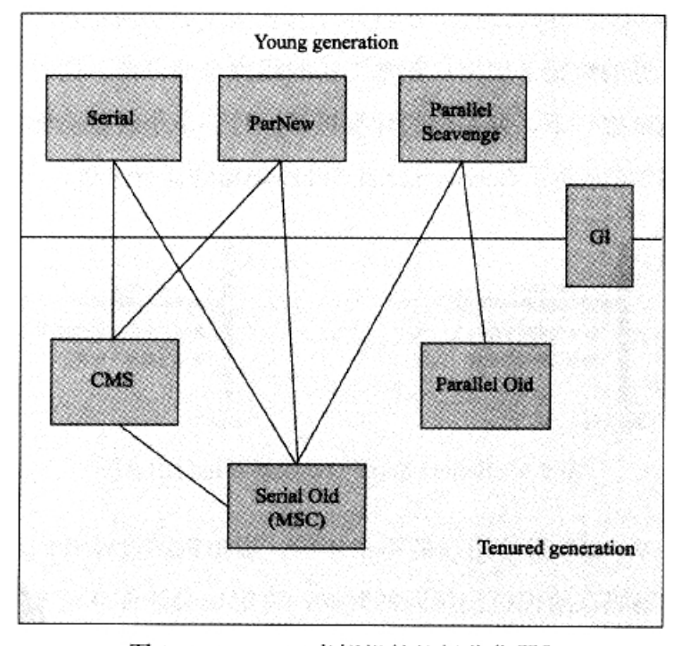

## jvm学习笔记
### 1 jvm简介
* java技术体系提供了完整的用于软件开发和跨平台的支持环境，并广泛应用于嵌入式系统、移动终端、企业服务器、大型机等场合。java实现了“一次编写，导出运行”的理想
* java代码是运行于java虚拟机上的，通过java虚拟机实现了跨平台，并且java虚拟机帮助程序员做一系列易出错的事务，比如内存管理

### 2 Java内存区域与内存溢出异常
#### 2.1 运行时数据区域
* Java虚拟机在执行Java程序的过程中会把她锁管理的内存划分为若干个不同的数据区域，这些区域称为运行时数据区域。Java虚拟机所管理的内存包含以下几个运行时数据区域，如图2-1

图2-1 Java虚拟机运行时数据区

##### 2.1.1 程序计数器
程序计数器可看作当前线程所执行的字节码的行号指示器，是一块较小的内存空间，线程私有。
##### 2.1.2 Java虚拟机栈
Java虚拟机栈也是线程私有的，生命周期与线程相同。虚拟机指的是Java方法执行模型：每个方法在执行的同时都会创建一个栈帧用于存储局部变量表、操作数栈、动态链接、方法出口等信息。

```
Java虚拟机规范中定义了两种异常
1. StackOverflowError:若线程请求的栈深度大于虚拟机所允许的深度，将抛出StackOverflowError异常
2. OutOfMemoryError:若虚拟机栈可以动态扩展，但扩展时无法申请到足够的内存，就会抛出OutOfMemoryError异常
```
##### 2.1.3 本地方法栈
与Java虚拟机栈的作用相似，但本地方法栈为虚拟机使用到的Native方法服务，虚拟机栈为虚拟机执行的Java方法服务
##### 2.1.4 Java堆
Java堆是jvm管理内存中最大的一块，是所有线程共享的一块内存区域，在虚拟机启动时创建。几乎所有的对象实例和数组都在这里分配。
##### 2.1.5 方法区
方法区试线程共享的内存区域，用于存储一杯虚拟机加载的类信息、常量、静态变量、即时编译器编译后的代码等数据
##### 2.1.6 运行时常量池
运行时常量池是方法区的一部分，用于存放编译器生成的各种字面量和符号引用。
#### 对象的访问定位
Java程序通过栈上的reference数据来操作堆上的具体对象。reference在Java虚拟机规范中只规定了一个指向对象的引用，没有定义如何去定位寻找对象的具体位置。目前主流方式通过句柄和直接指针两种。

```
1.句柄访问：Java堆中划分出一块内存作为句柄池，reference存储的就是对象句柄地址，句柄中包含了对象实例数据与类型数据各自的具体地址信息。
好处是reference存储的是稳定的句柄地址，在对象被移动时只会改变句柄池中的实例数据指针，而reference本身不需要改变
2.直接指针访问：reference存储的是对象地址。
好处是速度更快，节省了一次指针定位的时间开销
```
#### 内存溢出
##### Java堆溢出
当出现OutOfMemeryError时，先分析内存泄露还是内存溢出。若是内存泄露，就通过GC Root的引用链找出GC为什么无法自动回收它们；若内存溢出可以考虑为虚拟机申请更多的内存
##### 虚拟机栈和本地方法栈溢出
```
StackOverflowError：线程请求的栈深度大于虚拟机所允许的最大深度时抛出。使用-Xss参数减少栈内存，异常出现时输出到栈深度相应缩小
OutOfMemeoryError：虚拟机在扩展栈时无法申请到足够的内存时抛出
```
##### 方法区和运行时常量池溢出
不断地生成常量，抛出OOM
### 3 垃圾收集器与内存分配策略
#### 垃圾收集器（Garbage Collection，GC）
* 那些内存需要回收
* 什么时候回收
* 如何回收

#### 对象已死吗
##### 引用计数法
给对象添加引用计数器，当指向对象的引用数为0时，对象可被回收
##### 可达性分析
以GC Roots为起点，GC Roots不可达的对象，将被判定为可回收的对象。

GC Roots的对象
1. 虚拟机栈（栈帧中的本地变量表）中引用的对象
2. 方法取中类静态属性引用的对象
3. 方法区中常量引用的对象
4. 本地方法栈中JNI（即一般说的Native方法）引用的对象
5. java虚拟机内部的引用
6. 所有被同步锁持有的对象
7. 反映java虚拟机内部情况JMXBean、JVMTI中注册的回调、本地代码缓存等

##### 引用
* 强引用：只要存在，对象就不会被GC回收
* 软引用：描述有用但非必需的对象。软引用的关联的对象，在系统发生内存溢出异常之前，将会把这些对象列进回收范围之中进行第二次回收
* 弱引用：描述非必需对象，关联的对象只能存活到下次垃圾回收之前
* 虚引用：虚引用的存在不会影响对象的生存时间，虚引用关联的唯一目的时能在该对象回收时收到一个系统通知
##### finalize函数
一个对象真正要被回收至少需要经历两次标记过程。若对象覆盖了finalize()方法且该方法没有被执行过，finalize()会被放入虚拟机的一个队列中执行，虚拟机不会等待它运行结束，对象可以在此函数里自救，但此函数每个对象只能触发一次。

#### 垃圾回收算法
* 标记-清除算法
* 复制算法
* 标记-整理算法
* 分代收集算法

#### HotSpot算法细节实现

- 根结点枚举

  - 从GC Root节点寻找所有可达节点。需要“Stop the world”，即保证在根结点枚举时所有节点引用关系不可发生变化。

- 安全点

  - 根结点枚举时并不需要检查所有执行上下文和全局变量引用的索引，其中hopspot中OopMap结构存储引用的位置。但是并非每条指令都生成对应的OopMap，只是在特点位置-安全点生成OopMap，安全点由虚拟机选定，不能太多或太少。
  - 如何让线程在最近的安全点停顿
    - 抢先式中断，系统把所有的用户线程全部中断，若发现有现成不在安全点上，则让其恢复，运行到安全点上再中断。现在几乎没有虚拟机采用这种做法
    - 主动式中断，当需要现成中断时设计一个标志，所有线程在运行中都会轮询这个标志，一旦发现为真就在最近的安全点主动中断挂起。轮询标志和安全点是重合的。轮询操作非常频繁，现已用一条汇编实现

- 安全区域

  - 一些不执行（处于sleep或block状态）的线程无法响应系统的中断请求，走到安全点。而这通过安全区域来完成，安全区域确保引用关系不会发生变化的区域，是拉伸的安全点，当用户线程进入安全区域，坐标记。当离开安全区域时，若虚拟机还未完成根节点枚举，则中断运行一直等待，收到可以离开的消息为止。

    > 个人疑惑：当线程不执行时，线程内引用关系无变化，此时应该是处于安全点。当线程中断结束再次运行，则可能发生变化，此时只要设置成不让中断线程再运行不就行了吗？

- 记忆集 和卡表

  - 未解决跨代引用的问题，垃圾收集器在新生代中新建了记忆集的数据结构，用于避免把整个老年代加紧GC Roots扫描范围。

    > 跨代引用问题：https://www.jianshu.com/p/671495682e46
    >
    > 跨代引用指那些存活的且只有老年代引用的年轻代。若垃圾回收仅扫描年轻代，那那些存货的跨代引用也将被回收，这是不合理的。而垃圾回收时若扫描全量年轻代和老年代非常浪费性能，通过记忆集记录这些跨代引用，避免扫描全量老年代。若老年代对象不可达又未发生回收时，垃圾回收也无法回收该老年代引用的跨代引用。即记忆集提供了性能，但降低了空间利用率。且垃圾回收不能保证回收所有的不可达对象。

  - 记忆集具体实现

    - 字节精度：精确到机器字长
    - 对象精度：精确到对象
    - 卡表：精确到一块内存区域。卡表中只要对象的一个字段存在跨代引用，卡表对应的数组元素就为1，即变脏。没有则为0

  - 写屏障

    - 卡表维护，解决卡表怎么变脏的问题
    - 通过写屏障来维护卡表，写屏障指的是在引用发生变化时的一个切面操作，包括写前屏障和 写后屏障。即在引用发生变化时更新卡表，判断跨代引用
    - 伪共享问题:当多线程更新引用时，可能导致相互影响（写回、无效化或同步）导致性能降低。解决方法是更新卡表前先判断卡表状态，已脏的不再变脏，但会增加一次判断的性能消耗。jdk7之后通过参数-XX: +UseCondCardMark参数来决定卡表更新的条件判断，默认不开启，仅hotspot支持该选项 

- 并发的可达性分析

  - 可达性分析与用户线程共同运行（用在查找较长的 引用链关系查找）
  - 通过节点颜色标记
    - 白色：未被垃圾收集器访问过
    - 黑色：已被垃圾收集器访问过
    - 灰色：已被垃圾收集器访问过，但对象上至少存在一个引用还没扫描过
  - 并发扫描过程中，引用关系可能发生变化。
    - 白色变成黑色，本该被回收对象却没有被回收，称为浮动垃圾，可以忍受
    - 黑色变为白色，回收了存货的对象，无法忍受。如何解决
      - 发生的必要条件
        - 赋值器插入多条从黑色到白色的引用
        - 赋值器删除了全部从灰色到白色的直接或间接引用
      - 解决方法。都是通过写屏障实现
        - 增量更新：破坏第一条件，保存全部新增引用的黑色节点。待并发扫描结束后以这些黑色节点为根再扫描一次
        - 原始快照：破坏第二条件，记录这样的灰色节点，扫描结束后，待并发扫描结束后以这些节点为根再扫描一次

##### 垃圾收集器
1. Serial收集器。单线程收集器，进行垃圾回收时，必须暂停其他线程。年轻代采用复制算法，老年代采用标记-整理算法
2. ParNew收集器。Serial的多线程版本，年轻代多线程并行处理，老年代依旧单线程
3. Parallel Scavenge收集器。新声代收集器，采用复制算法，并行。该收集器的关注点是尽可能达到可控制的吞吐量（吞吐量=运行用户代码时间/（运行用户代码时间+垃圾收集时间））。-XX:MaxGCPauseMillis控制最大垃圾收集停顿时间）（尽可能控制在此时间之内）；-XX:GCTimeRatio设置吞吐量大小
4. Serial Old收集器。老年代单线程收集器，使用标记-整理算法
5. Parallel Old收集器。Parallel Scavenge收集器的老年代版本
6. CMS收集器。以获取最短停顿时间为目标的收集器。收集过程分四个步骤：初始标记、并发标记、重新标记、并发清除。

```
CMS被称为并发低停顿收集器，但也存在明显缺点：
 1.对CPU资源非常敏感。CMS默认启动的垃圾回收的线程数是（CPU数量+3）/4。垃圾回收的线程在CPU数量大于4时约占25%，CPU数越少占比越高。
 2.无法处理浮动垃圾，cms在并发清理阶段还会出现其他垃圾，这些垃圾在标记过后，是无法清除的，这些被称为浮动垃圾。因此需要预留一部分空间进行收集，当空间占用量达到阙值时进行回收，-XX:CMSInitatingOccupancyFraction用来设置这个启动阙值，百分比表示。JDK1.6中默认92%。当预留的内存不足时会出现“Concurrent Mode Failure”失败，此时临时启动Serial Old收集器重新收集。
 3.CMS是基于标记-清楚算法实现的收集器，可能产生过多的空间碎片，会给大对象分配造成麻烦。CMS中提供了-XX:+UseCMSCompactAtFullCollection开关（默认开启），开启表示FullGC时进行内存碎片的合并整理。-XX：CMSFullGCsBeforeCompaction（默认0）用来设置执行多次不压缩的FullGC后，再执行一次压缩的FullGC。
```

7.G1收集器
```
特点
1.并行与并发，G1收集器可以通过并发的方式让java程序在GC时继续执行
2.分代收集，能独自管理整个GC堆
3.空间整合，基于标记-整理算法实现
4.可预测的停顿，能使在指定为M毫秒时间片内GC的时间不超过N毫秒
G1收集器将Java堆划分为多个大小相等的独立区域（Region），老年代和新生代都放在里面
```



图3-1 HotSpot虚拟机的垃圾收集器

### 4.工具
#### 4.1 jps：虚拟机进程状况工具
```
参数
1.-q 输出LVMID(本地虚拟机唯一ID)，省略主类的名称
2.-m 输出传递到主类main()函数的参数
3.输出主类的全名，若进程执行的是jar的，输出jar路径
4.-v输出jvm启动时的参数
```
#### 4.2 jstat 虚拟机统计信息监视工具
jstat -gcutil 369 1000 3
> 查看进程369的gc情况3次，每个1000ms查看一次

#### 4.3 jinfo：Java配置信息工具
实时查看和调整虚拟机各项参数
#### 4.4 jmap:Java内存映像工具

### 5.类文件结构
#### 5.1 概述
编译器将代码编译成存储字节码的class文件，虚拟机载入和执行，实现了程序的”一次编写，到处运行“。这些字节码是平台无关性的，可以由各种语言编译而来，比如Scala、Groovy、Jython等，都可以在jvm运行
#### 5.2 class类文件结构
根据Java虚拟机规范的规定，Class文件格式采用一种类似于C语言结构体来存储数据，这种伪数据只有两种数据类型：无符号数和表
> 无符号数：以u1、u2、u4、u8来分别代表1、2、4、8个字节的无符号数，无符号数可以用来描述数字、索引引用、数量值或者按照UTF-8编码构成字符串值
> 
> 表是由多个无符号数或者其他表作为数据项构成的复合数据类型

#### 5.2.1 魔数
每个Class文件的头4个字节成为魔数，它的唯一作用是确定这个文件是否为一个能被虚拟机接受的Class文件

紧接着的4个字节存储的是Class文件的版本号，第5和第6个字节是此版本号，第7和第8个是主版本号
#### 5.2.2 常量池
紧接着版本号之后的常量池入口。常量池是占用Class文件空间最大的数据项目之一，也是Class第一个出现的表数据类型项目

常量池中主要存放两大类常量：字面量和符号引用。
> 字面量是比较接近云Java语言层的常量，如文本字符串、声明为final的常量值等
> 
> 符号引用：1.类和接口的全限定名；2.字段的名称和描述符；3.方法的名称和描述符

常量池中每一项常量都是一个表，JDK1.7中共有14种表,如下图5-1所示

图5-1 常量池的项目类型

#### 5.2.3 访问标志
常量池结束后，紧接着的两个字节代表访问标志

图5-2 访问标志
#### 5.2.4 字段表集合

图5-3 字段访问标志


图5-4 描述符标识字符含义

对于数组类型，每一维度都会使用一个前置的"["字符来描述，比如定义一个java.lang.Stirng[][]类型的二维数组，会被记录为"[[Ljava/lang/String;"，用'/'替代'.',并在结尾添加';'

用描述符来描述方法时，按照先参数列表，后返回值的顺序描述，参数列表按严格顺序放在一组小括号里面，如
> 方法void inc()的描述符为"()V"
> 
> 方法int indexOf(char[] source, int index)的描述符为'([CI)I'

### 5.3 字节码
字节码详细可见《Java虚拟机规范（Java SE7版）》的第6章
#### 5.3.1 加载和存储
1.将一个局部变量加载到操作栈：iload,fload
2.将数值从操作数站存储到局部变量表：istore
3.将常量加载到操作数栈：bipush,ldc,iconst_<i>
4.扩充局部变量表的访问索引指令：wide
#### 5.3.2 运算指令
1. 加法：iadd
2. 减法：isub
3. 乘法：imul
4. 除法：idiv
5. 求余：irem
6. 取反：ineg
7. 位移：ishl、ishr
8. 按位或：ior、lor
9. 按位与：iand
10. 按位异或：ixor
11. 局部变量自增：iinc
12. 比较：dcmpg、dcmpl
#### 5.3.3 类型转换
可以直接支持小范围类型向大范围类型的安全转换：int->long

窄话类型转换必须使用显示转换：i2l;窄化转换仅仅丢弃除最低位N个字节以外的内容
#### 5.3.4 对象创建与访问指令
1. 创建实例：new
2. 创建数组：newarray、anewarray、multianewarray
3. 访问类字段和实例字段：getfield、getstatic
4. 将数组元素加载到操作数栈：baload、caload
5. 取数组长度：arraylength
6. 检查实例类型：instanceof

#### 5.3.5 控制转移指令
1. 条件分支：ifeq、iflt、ifle、igt、ige、ifnull、icomeq
2. 符合条件分支：tableswitch
3. 无条件分支：goto

#### 5.3.6 方法调用和返回指令
1. invokevirtual：用于调用对象的实例方法
2. invokeinterface：用于调用接口方法
3. invokestatic：调用类方法（static方法）

### 6.虚拟机类加载机制
#### 6.1 类加载的时机
生命周期：加载、验证、准备、解析、初始化、使用、卸载。其中验证、准备、解析统称为连接。

>虚拟机严格规定有且只有5中情况必须对类进行初始化

>1. 遇到new、getstatic、putstatic换货invokestatis这4条字节码指令时。
>2. 使用java.lang.reflect包的方法对类进行反射调用时
>3. 当子类初始化时必先初始化父类（若父类还未初始化）
>4. 虚拟机启动时主类（包含main()方法的类），虚拟机会先初始化这个主类
>5. 当使用JDK1.7动态语言支持时，如果一个java.lang.invoke.MethodHandle实例最后的解析结果REF_getStatic、REF_putStatic、REF_invokeStatic的方法句柄，并且句柄对应的类没有初始化时会先触发其初始化

#### 6.2 类加载的过程
##### 6.2.1 加载
加载阶段，虚拟机需完成三件事：

1. 通过一个类的全限定名来获取此类的二进制字节流
2. 将这个字节流所代表的静态存储结构转化为方法区的运行时数据结构
3. 在内存中生成一个代表这个类的java.lang.Class对象，作为方法区这个类的各种数据的访问入口

> 数组类本身不通过类加载器创建，由Java虚拟机直接创建

加载阶段完成，虚拟机外部的二进制字节流就按照虚拟机所需的格式存储在方法区之中。然后在内存中创建一个java.lang.Class类的对象
>加载阶段与连接阶段时交叉进行的

##### 6.2.2 验证
1. 文件格式验证，验证字节流是否符合Class文件格式的规范。如常量池中是否有不被支持的常量类型、是否以魔术0xCAFEBABE开头等
2. 元数据验证，对字节码的描述信息进行语意分析，主要进行语义校验。验证点如：这个类是否有父类、其父类是否继承了不被继承的类（被final修饰的类）
3. 字节码验证，最复杂的阶段，主要通过数据流和控制流分析，确定程序语义是合法的、符合逻辑的。
4. 符号引用验证，最后一个校验，发生在虚拟机将符号引用转化为直接引用的时候，在解析阶段中发生

验证阶段是一个非常重要但非必要的阶段，若所运行的代码已经被反复使用和验证过，那么可以通过使用-Xverify:none来关闭大部分类验证措施，以缩短虚拟机类加载时间

##### 6.2.3 准备
准备阶段是正式为类分配内存并设置类变量初始值的阶段，这些变量所使用的内存在方法区中进行分配。

>通常情况下变量都是零值（int类型为0，long类型为0L等），但存在特殊情况：如果类字段属性存在ConstantValue属性，准备阶段value就会被初始化ConstantValue属性所指定的值。如：public static final int value = 123.编译时Javac将会为value生成ConstantValue属性，准备阶段将value赋值成123。

##### 6.2.4 解析
解析阶段是虚拟机将常量池内的符号引用替换成直接引用的过程。
>符号引用：用一组符号来描述所引用的目标，符号可以是任何形式的字面亮，只要使用时能无歧义地定位到目标即可
>
>直接引用：是指向目标的指针、相对偏移量或是能间接定位到目标的句柄

##### 6.2.4.1 类或接口的解析
...在解析完成前还要进行符号引用验证，确认D是否具备对C的访问权限，无权限则抛出java.lang.IllegalAccessError异常
##### 6.2.4.2 字段解析
1. C本身存在该字段，返回直接引用
2. 否则，C中实现了接口，按照继承关系搜索各个接口和父接口，找到则返回直接引用
3. 否则，C不是java.lang.Object的话，搜索父类是否有改字段，找到则返回直接引用
4. 否则，查找失败抛出java.lang.NoSuchFieldError异常

##### 6.2.4.3 类方法解析
1. 接口和类方法是分开的，若发现C是个接口，抛出java.lang.IncompatiableClassChangeError异常
2. 在类C及其父类中寻找，有则返回方法的直接引用
3. ...

#### 6.3 类加载器
> 同一个class文件由不同的加载器加载出来的类也不同
> 
> 双亲委派模型，所有的类加载都会交由自己的父加载器去加载，若加载失败才会尝试自己加载。启动类加载器是顶层类，是所有了加载器的最终父类加载器

### 7 虚拟机字节码与执行引擎
执行引擎是java虚拟机最核心的组成部分之一，执行java代码，解释执行和编译执行
> Java方法在执行时都会创建一个栈帧，程序在编译的时候就确定了栈帧需要多大局部变量表、多深的操作数栈，分配的内存大小确定，不会在运行时改变

#### 7.1 运行时栈帧结构
1. 局部变量表，存放方法参数和方法内定义的局部变量。以变量槽（slot）为最小单位，单位大小随处理器、操作系统或虚拟机有关。
2. 操作数栈，方法执行过程存放变量
3. 动态链接，每个栈帧都包含一个运行时常量池中该栈帧所属方法的引用，为了支持方法调用过程中的动态链接
4. 方法返回地址，以正常返回语句或抛出异常结束方法
5. 附加信息，如调试相关的信息，具体取决于具体的虚拟机实现

#### 7.2 方法调用
```
java虚拟机提供5条方法调用字节码指令
1. invokestatic:
2. invokespecial:调用实力构造器<init>方法、私有方法和父类方法
3. invokevirtual:
4. invokeinterface:
5. invokedynamic:先解析所调用的方法（多态），再执行方法
前两个指令都可以在解析时唯一确定调用版本
```
类型自动转换顺序，'a', 按照char>int>long>float>double的顺序转型

```
动态类型语言：类型检查的主体过程是在运行期而不是编译期

methodHandle，一种类似于反射的方法调用，但不同的是反射基于java代码层次的方法调用，methodHandle模拟字节码层次的方法调用，其存在3个方法--findStatic(),findVirtual(),findSpecial();methodHandle更加轻量，用的不多
```
#### 7.3 基于栈的字节码解释执行引擎
##### 7.3.1 解释执行
词法分析、语法分析、语义分析、抽象语法树
#### 7.3.2 基于栈的指令集于基于寄存器的指令集比较
基于栈的指令集：
优点：1.可移植性，相比于寄存器，寄存器由硬件直接提供，程序不可避免的会收到硬件的约束，如不同的处理器提供不同的寄存器；2.代码相对尽愁，每个字节一条指令，编译器实现更贱简单
缺点：执行速度相对慢。指令操作更多，频繁的内存访问，耗时多

计算'1+1'的结果，栈的指令集如下

```
iconst_1
iconst_1
iadd
istroe_0
```


### 附录

#### 相关指令

- java 虚拟机标准参数，所有虚拟机必须实现这些参数的功能，且向后兼容
- java -X 虚拟机标准参数
- 非stable参数
  - java -XX:+PrintFlagsInitial 查看虚拟机所有非stable参数默认值
  - java -XX:+PrintFlagsFinal 查看虚拟机所有非stable参数最终默认值，初始值可能被修改，部分多的参数是动态创建的
    - = 表示参数的默认值
    - := 表示参数被系统或用户赋值了
  - java -XX:+PrintCommandLineFlags 显示jvm初始化完毕的所有和初始默认值不同的参数，即:= 的参数


### 参考
1. 深入理解java虚拟机 第二版
2. https://www.jianshu.com/p/c69f9f7c273b

