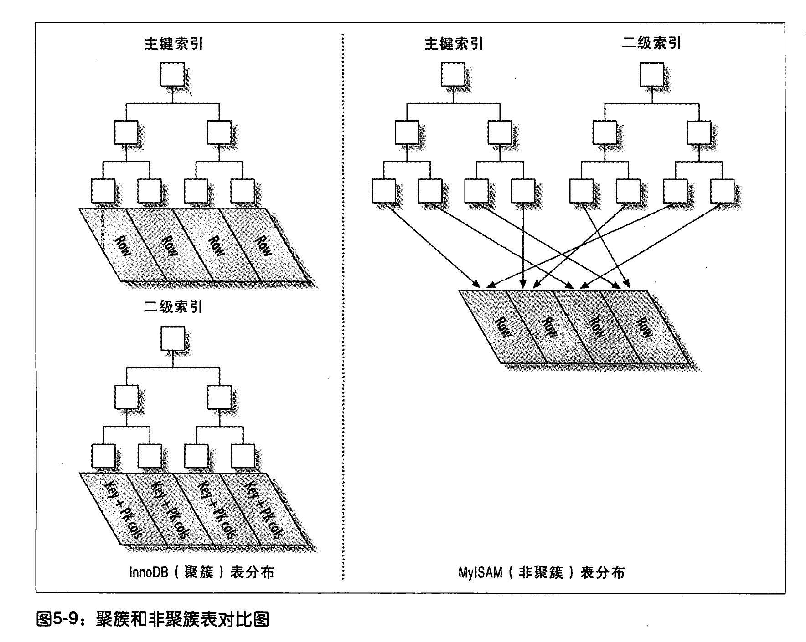

## 第一章 架构与历史

隔离级别-SERIALIZABLE（可串行化）：通过强制控制事务串行执行，指的是数据库只能同时执行一个事务吗？不是，至少对每个操作都加锁，不管读还是写

### MVCC（多版本并发控制）

各引擎实现并不是通过加行级锁实现事务，为提升并发性能，一般都实现了MVCC。MVCC避免了**读操作时**添加行级锁，减少阻塞

mvcc实现：为每条数据新增两个字段，创建版本和过期版本。版本值事务的版本号，每个事务的创建都会使得版本号加一

在 repeatable read隔离级别下，各语句实现

- select：查找出满足以下两条件的数据
  - 查找创建版本小于等于当前版本的数据（数据已创建或本事务创建的）
  - 查找删除版本为空或删除版本晚于当前版本的数据（数据未被删除）
- insert：插入数据的创建版本为当前版本
- delete：设置删除事务的删除版本为当前版本
- update：新增一条数据，创建版本为当前版本；老数据设置删除版本为当前版本

**目前只有read committed和repeatable read隔离级别支持mvcc。因为read uncommitted总数读到最新数据，serializable对所有读取的行都加锁**

mysql5.5开始采用innodb为默认存储引擎

### MYISAM

不支持事务；不支持行级锁，只支持表锁（共享锁和排它锁）；数据存在两个文件中：数据文件(.MYD)和索引文件(.MYI)

**myisam压缩表**：对表进行压缩，不能修改（除非解压缩，修改再压缩 ）。压缩表可以极大地减少磁盘空间占用，减少磁盘I/O，提升查询性能，也支持索引

## 第三章 服务器性能剖析

#### show profiles

show profile可以插叙执行语句中各个步骤所消耗的时间。默认关闭，通过 set profiling = 1开启

## 第四章 schema与数据类型优化

### 4.1 数据类型优化

**尽量避免null**：可为null的列是的索引、索引统计和值比较更为复杂，且null的列存储需要更多的空间。可为null的类为索引时，每个索引记录需要一个额外的字节。一般情况非null值优化比较小，**但索引列强烈建议非null**

TIMESAMP只使用DATETIME一半的存储空间，但范围较小，精确到秒

#### 4.1.3 字符串类型

**varchar**，存储可变长字符串

- 采用1到2字节记录字符串最大长度。列最大长度小于或等于255使用1字节记录，大于使用2字节记录。
- 最大占用字节65535，数据实际空间65533，这是字节长度，utf-8中一个字符3字节，innodb中实际最大varchar(21844)，21844指的是该表所有varchar和char字段的字符数总和
- 数据是变长的，若当前页放不下字符串，myisam将行拆成不同段存储。innodb则分裂页来存储

> Varchar(10)和varchar(200)空间开销是一样的，但更长的列会消耗更多的内存，尤其是使用内存临时表进行排序和操作时消耗更大

**char**，定长字符串，不需要记录字符串长度

- 自动删除字符串末尾不可见字符

**BOLG**：存储大的二进制数据。

**TEXT**：TINYTEXT，SMALLTEXT(TEXT)，MEDIUMTEXT，LONGTEXT

**ENUM**：枚举，采用不同的字符串，实际内部已整数存储，根据定义的顺序排序，从1开始

**DATETIME**：表示时间，使用8个字节，与时区无关，直接保存至数据库，但比较时当前时间和时区有关

**TIMESTAMP**：存储从1970年1月1日至今的秒数，范围1970-2038年，使用四个字节。与时区有关

### 4.3 范式

范式为了使结构更合理，消除存储异常，减少数据冗余

**第一范式**：所有域（即表的每列）都是不可再分的，不能是数组，集合。

**第二范式**：满足第一范式的基础上，非码属性必须完全依赖于候选码（消除非码属性对主码的部分依赖）

**第三范式**：满足第二范式的基础上，任何非主属性不依赖于其他非主属性（消除传递依赖）

**BCNF**：在满足第三范式的基础上，任何非主属性不能对主键子集依赖（消除对主码子集的依赖）

> 部分依赖：通过AB得出C，通过A可以得出C，通过B可以得出C，称C部分依赖于AB

### 4.5 加快AlTER TABLE

mysql执行Alter table大部分实现是锁旧表，再新建一个表，然后将旧表数据插入到新表数据中，然后删除旧表

#### 4.5.1 只修改.frm文件

以下操作不需要重建表

- 移除（不再增加）一个列的auto_increment属性
- 增加、删除或更改enum或set常量。若移除的是已有数据的值，则改值变为空字符串

#### 4.5.2 快速创建MyISAM索引

为高效地将数据载入到MyISAM表中，先禁用索引，载入数据完成在启动索引。这样构建索引在数据完全载入后再构建，可以通过排序来构建，效率更高。该方法仅对非唯一索引有效，唯一索引无法禁用

innodb引擎表中，可以先删除非唯一索引，待数据载入完成再创建非唯一索引

## 第五章 创建高性能的索引

### 5.2 索引的优点

优点

- 索引大大减少服务器需要扫描的数据量
- 索引可以帮助服务器避免排序和临时表
- 索引可以将随机I/O变成顺序I/O

### 5.3 高性能的索引策略

#### 5.3.1 独立的列

独立的列才会使用索引，不能是表达式。

> 例： select * from tmp where id + 1 = 3。不能使用索引

#### 5.3.2 前缀索引与索引选择性

优势字符串当索引字段太长，便取字符前几个字符作为索引。不重复的索引值/总数据量，值越大，索引的效率越高

> 例： alter table tmp add key name(3)。取name前三个字符为前缀索引

#### 5.3.3 多列索引

采用最左匹配原则。复合索引(a,b,c)实际可分成(a) (a,b) (a,b,c)三种索引。where可以和order by一起组合使用索引

#### 5.3.4 聚簇索引

索引和数据都保存在B+tree中

> mysql索引使用B+树
>
> - B+树非叶子节点指存储关键字不存储数据，磁盘i/o消耗更小
> - B+树支持范围查询，遍历查询，叶节点是有序链表并且叶节点间有指针关联

innodb默认使用聚簇索引。默认以主键为主键索引；若没有主键， 用一个非空唯一索引代替；若再没有，则隐式定义一个主键为聚簇索引

优点
- 把相关的数据都保存到一起，适合范围查询
- 数据访问更快，不需要像非聚簇索引一样二次定位

缺点

- 插入顺序严重依赖于插入顺序。
- 二级索引需要两次查询，先查询到主键值，再查数据行
- 更新聚簇索引主键消耗大，还需修改索引的二级索引




**innodb主键的插入**：当主键不是顺序的，插入存在几个问题

- 写入的目标页不是顺序的，可能不在缓存中需要重新读取，产生大量随机I/O
- 因为写入是乱序的，不得不频繁做页操作分裂，以便为新的行分配空间。页分裂会导致大量数据的移动，一次插入最少修改三四个页
- 由于频繁 的页分裂，产生更多的空间碎片

随机主键的插入，可以通过 optimize table来重建表和优化

#### 5.3.5 覆盖索引

覆盖索引覆盖了部分字段，因此数据的查询不需要再去查询数据行，通过覆盖索引就能得到需要的列

mysql只能使用b-tree索引做覆盖索引

### 5.5 维护索引和表

#### 5.5.1 寻找损坏的表

若出现一些奇怪的错误（查找到不存在的属性、主键异常冲突、数据库崩溃），可能是表损坏了，可以通过check table ${tableName}来检查表

## 第六章 查询的优化

### 6.3 重构查询的方式

1. 用一个复杂查询代替多个简单查询，数据库内部的优化极高
2. 切分查询。比如将一个删除多条数据的sql分成多条，可降低死锁的概率，减小服务器的压力
3. 分解关联查询

### 6.4 查询执行的基础

执行一条查询sql具体操作：

1. 客户端发送一条查询sql给服务端
2. 查询缓存，若命中则返回结果给客户端；否则进入下一步
3. 对sql进行解析、预处理，再由优化器生成对应执行计划
4. mysql根据生成的执行计划，调用存储引擎的API来执行
5. 将结果返回给客户端

#### 6.4.1 mysql客户端/服务端通信协议

半双工通信，同一时刻只能由一方发送数据给另一方

#### 6.4.2 查询缓存

在解析一个sql前 ，若查询缓存是打开的，先从缓存中查询是否存在一个一样的sql，命中缓存直接返回结果。

> mysql5.7默认禁用禁用查询缓存。疑问：若查询表数据做了变更，那缓存怎么办？开启的查询 缓存会实时跟踪表，若表发生变成则使缓存失效

#### 6.4.3 查询优化处理

**语法解析器和预处理**

**查询优化器**

mysql能处理优化的类型

1. 重新定义关联表的顺序。数据表的关联并不总是按照查询中指定的顺序进行
2. 将外连接转换为内连接
3. 使用等价变换规则。自动优化，比如（5 = 5 and a > 5）优化成 （a > 5）
4. 优化count(), MIN, MAX()。例如，MyISAM存储了一个所有数据总数的变量，没有where语句的COUNT()可以直接返回
5. 预估并转化为常数 表达式
6. 覆盖索引扫描
7. 子查询优化
8. 提前终止查询 
9. 列表 IN()的比较。mysql会 先对in()内的元素进行排序，然后通过二分法进行查询，由O(n)变成log(n)。可理解成一个元素对in()内n个元素对比，现在只要用二分法对比
10. 关联查询优化。优先选择数据量少的表，忽略关联顺序。可以通过start_join强制控制关联顺序为定义的 顺序
11. 排序优化。数据量小可在内存中完成，数据量大需要借助磁盘。当数据量大时，先对数据进行分块排序，再块之间合并

#### 6.4.4 查询执行引擎

仅根据执行计划逐步执行

#### 6.4.5 返回查询结果

若开启缓存，则将结果添加到缓存中。

mysql将结果返回是一个增量、逐步返回的过程。好处 是服务端无需存储太多的结果，内存消耗小；客户端也能第一时间获得结果

> select count(列名)，不包括null值列
>
> select count(*) 和count(1) 获取所有行，innodb至少存在一个主键（显示或隐式）

limit 10000, 1。偏移量大的性能消耗也大

## 第七章 mysql高级特性

### 7.1 分区表

一个逻辑概念，对sql来说是黑盒子。但是每个表可分为多个分区表，然后操作是的分区表进行操作的，将锁的粒度变得更小

更粗粒度、简易的索引策略，适用于大数据的过滤场景

### 7.2 视图

视图是一个虚拟表，不存放数据。可以理解将视图解析成sql来使用

视图无论执行何种查询，都会生成一个临时表

### 7.3 外键约束

目前只有Innodb引擎支持外键约束

### 7.4 mysql内存储存代码

指内部的一些代码，如存储过程、函数、触发器、游标

优点

1. 性能更高，离数据源最近，消耗小
2. 安全性更高，可提供更细粒度的控制

缺点

1. 实际编写更为复杂，mysql内置的函数较少，编码效率较大
2. 可能存在安全隐患，若数据库被攻击，内置逻辑、加密函数可能背泄露
3. 调试困难，很难定位错误

### 7.5 绑定变量

**sql绑定变量**

```sql
set @sql = select * from test where id = ?;
prepare stmt from @sql;
set @id = 1;
execute stmt using @id;
# 释放资源
deallocate prepare stmt;	
```

### 7.11 查询缓存

查询缓存命中能跳过sql解析、优化、计划生产阶段，查询效率更高

若查询中包含不确定函数，如NOW(), CURRENT_DATE()，则不会缓存

若开启查询缓存，查询缓存带来的额外消耗

- 每次查询前，先查看是否命中缓存
- 如这个读查询可以被缓存，先查看缓存中是否有该查询，不存在则放入缓存中
- 当对表进行写操作，需要使得查询缓存失效。缓存非常大或碎片很大，会消耗很大

一般当查询率：修改率 大于3：1时，可以使用读缓存

mysql参数 

- query_cache_type（on/off/demand），判断查询缓存是否开启。选择demand，可以由客户端自由控制sql是否使用查询缓存，使用的话需要在sql末尾添加 SQL_CACHE，不使用SQL_NO_CACHE
- query_cache_size，查询缓存大小

innodb查询缓存，由于innodb中存在mvcc，所以查询的事务只能查到大于等于本身事务id的数据；也不能查询到加互斥锁的数据

若开启查询，不要将查询缓存开的太大，否则容易导致系统性能下降

**通用缓存优化**

- 用多个小表代替一个大表对查询缓存有好处。
- 批量插入时只要做一次缓存失效，效率高于单条写入
- 缓存空间太大容易导致服务器僵死，设置更小的查询缓存大小，或不开启查询缓存

## 第十二章 高可用性

### 12.2导致宕机的原因

原因

- 约占35%，运行环境问题，普遍的是磁盘空间耗尽
- 约占35%，性能问题，运行操作的sql，耗时长，死锁；schema和索引设计
- 约占10%，复制问题导致主从不一致
- 约占10%，数据丢失问题


## 其他

### explain

参考：https://www.cnblogs.com/xuanzhi201111/p/4175635.html

查询sql的执行计划，使用索引的详情

### 手动添加锁

共享锁：在sql末尾添加 lock in share mode

排它锁：在sql末尾添加 for update

### 查看字节长度&字符长度

Char_length() // 字符长度

length() //字节长度

### 字符集编码utf8和utf8mb4

Utf8mb4（utf8 most  byte 4）可表示4字节的中文。数字、英文字符、英文标点1字节,中文汉字、中文标点3字节，特殊符号(如表情emjor)4字节。utf8mb4下字符集，定义最大字符串长度（65535-2）/4

utf8最长字符3字节

### count(*)和count(1)

最终结论：编译器对两句的优化的一样的，没有区别。

解释：为了减少io次数，count(*)和count(1)都会优先选择统计最小索引的列的所有行数。innodb优先选择较小的二级索引，不存在二级索引再选择主键列（innodb主键索引与数据行存在同一个棵树上）；myisam没有where语句时，直接返回保存的所有行数值

以上针对没有where的情况，若存在where，则选择实际使用索引列。

innodb中where使用多个条件，最终索引优先级选择：二级索引(int) > 主键(int) > 二级索引(varchar)

### 覆盖索引

当在索引中就能查到而不需要查询表的数据，称为使用了覆盖索引，使用覆盖索引io次数更少，性能更高。

通过Explain 中Extra中是否有Using index查看是否使用覆盖索引

### innodb和myisam都是用B+树作为索引

相比红黑树，更改，查询次数更少，且查询次数更稳定

相比b-树，索引节点不存放数据，io次数更少

### 索引的选择

最左匹配法

支持范围查询，like开头为确定的字符的匹配

null查询不支持索引

表达式不支持索引

